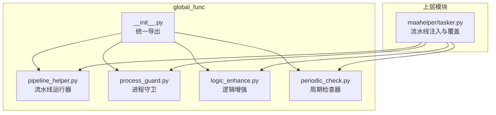
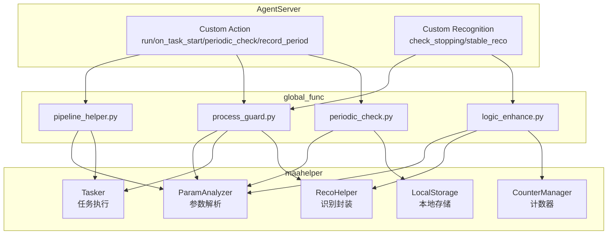
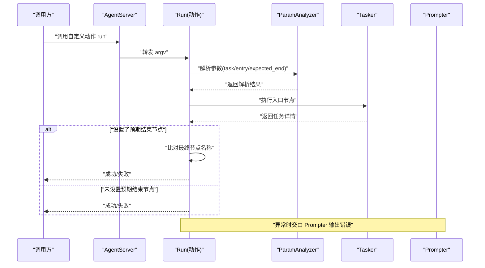
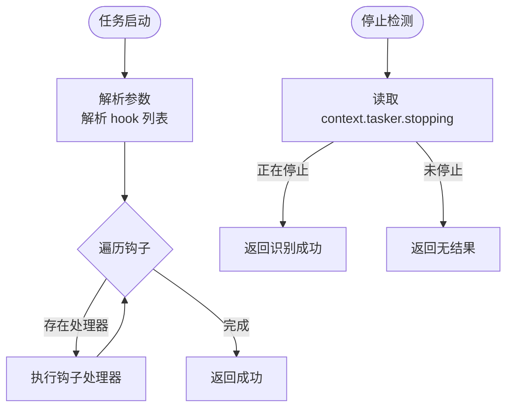
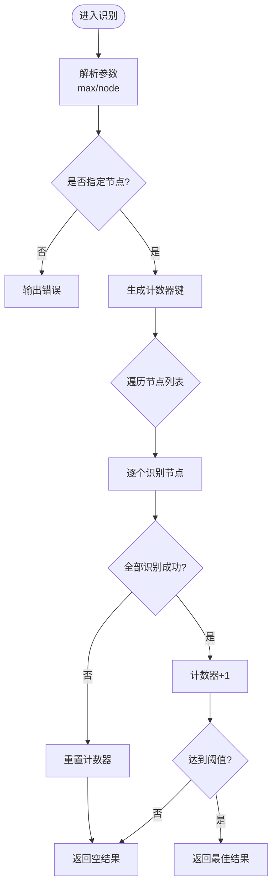
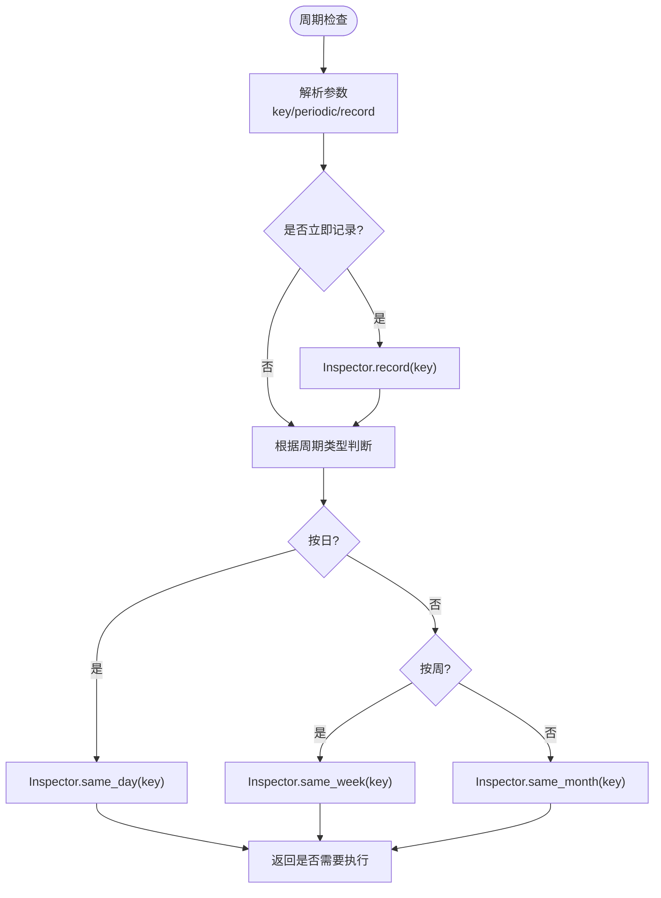
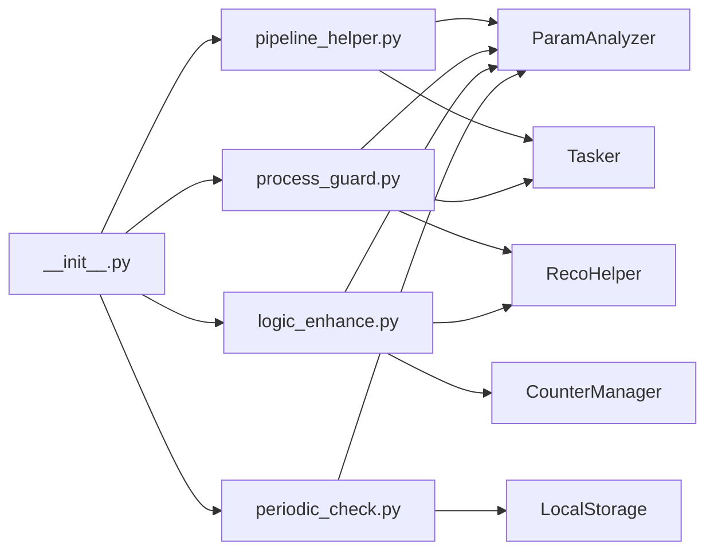

# 通用功能组件详解

<cite>
**本文档引用的文件**
- [agent/customs/global_func/__init__.py](file://agent/customs/global_func/__init__.py)
- [agent/customs/global_func/pipeline_helper.py](file://agent/customs/global_func/pipeline_helper.py)
- [agent/customs/global_func/process_guard.py](file://agent/customs/global_func/process_guard.py)
- [agent/customs/global_func/logic_enhance.py](file://agent/customs/global_func/logic_enhance.py)
- [agent/customs/global_func/periodic_check.py](file://agent/customs/global_func/periodic_check.py)
- [agent/customs/maahelper/tasker.py](file://agent/customs/maahelper/tasker.py)
</cite>

## 目录
1. [简介](#简介)
2. [项目结构](#项目结构)
3. [核心组件](#核心组件)
4. [架构总览](#架构总览)
5. [详细组件分析](#详细组件分析)
6. [依赖关系分析](#依赖关系分析)
7. [性能考量](#性能考量)
8. [故障排查指南](#故障排查指南)
9. [结论](#结论)
10. [附录](#附录)

## 简介
本文件面向 MaaFramework 生态下的通用功能组件，系统性解析 global_func 目录的设计意图与技术实现，重点涵盖：
- pipeline_helper.py：流水线构建、节点注入与动态覆盖机制
- process_guard.py：进程锁与异常监控，保障服务稳定性
- logic_enhance.py：逻辑增强函数（条件组合、延迟执行等）
- periodic_check.py：周期性任务检查器的调度算法与资源占用优化策略

并说明这些组件如何被其他模块复用，以及扩展接口的使用范例。

## 项目结构
global_func 位于 agent/customs/global_func，是通用能力的聚合层，通过统一导出接口供上层任务与流水线使用。其内部各模块职责清晰、边界明确，便于独立维护与扩展。

图表来源
- [agent/customs/global_func/__init__.py](file://agent/customs/global_func/__init__.py#L1-L7)
- [agent/customs/maahelper/tasker.py](file://agent/customs/maahelper/tasker.py#L79-L106)

章节来源
- [agent/customs/global_func/__init__.py](file://agent/customs/global_func/__init__.py#L1-L7)

## 核心组件
- 流水线运行器：提供统一的“运行”入口，支持通过参数选择任务节点、预期结束节点校验与异常提示。
- 进程守卫：提供任务启动钩子与停止检测，保障流程可控与资源回收。
- 逻辑增强：提供稳定识别器，通过多次连续识别提升鲁棒性。
- 周期检查：提供按日/周/月的周期性任务判断与记录，支持刷新时间修正与本地存储。

章节来源
- [agent/customs/global_func/pipeline_helper.py](file://agent/customs/global_func/pipeline_helper.py#L1-L25)
- [agent/customs/global_func/process_guard.py](file://agent/customs/global_func/process_guard.py#L1-L99)
- [agent/customs/global_func/logic_enhance.py](file://agent/customs/global_func/logic_enhance.py#L1-L96)
- [agent/customs/global_func/periodic_check.py](file://agent/customs/global_func/periodic_check.py#L1-L286)

## 架构总览
global_func 通过 MaaFramework 的 AgentServer 注册自定义动作与识别器，形成“自定义识别器/动作 + 参数解析 + 业务辅助工具”的协作体系。上层通过 tasker.py 的动态覆盖与节点注入，将这些通用能力无缝融入具体任务流水线。

图表来源
- [agent/customs/global_func/pipeline_helper.py](file://agent/customs/global_func/pipeline_helper.py#L9-L25)
- [agent/customs/global_func/process_guard.py](file://agent/customs/global_func/process_guard.py#L33-L99)
- [agent/customs/global_func/logic_enhance.py](file://agent/customs/global_func/logic_enhance.py#L18-L96)
- [agent/customs/global_func/periodic_check.py](file://agent/customs/global_func/periodic_check.py#L183-L286)
- [agent/customs/maahelper/tasker.py](file://agent/customs/maahelper/tasker.py#L79-L106)

## 详细组件分析

### 流水线运行器（pipeline_helper.py）
- 设计意图
  - 提供统一的“运行”入口，屏蔽底层参数解析与任务执行细节，便于在流水线中以“动作”形式调用。
  - 支持预期结束节点校验，避免流程漂移导致的异常。
- 关键实现
  - 自定义动作注册：通过 AgentServer 注册名为“run”的自定义动作。
  - 参数解析：使用 ParamAnalyzer 解析任务入口与预期结束节点。
  - 任务执行：委托 Tasker 执行指定节点。
  - 结果校验：若设置了预期结束节点，比对最终节点名称与预期一致才视为成功。
  - 异常处理：捕获异常并交由 Prompter 输出错误信息。
- 复杂度与性能
  - 时间复杂度近似 O(N)，N 为任务执行链路长度；空间复杂度 O(1)。
  - 通过异常捕获与早返回，降低异常传播成本。
- 扩展建议
  - 可增加“超时控制”“重试策略”等参数，进一步增强健壮性。

图表来源
- [agent/customs/global_func/pipeline_helper.py](file://agent/customs/global_func/pipeline_helper.py#L9-L25)

章节来源
- [agent/customs/global_func/pipeline_helper.py](file://agent/customs/global_func/pipeline_helper.py#L1-L25)

### 进程守卫（process_guard.py）
- 设计意图
  - 提供任务生命周期监控：任务启动时的钩子执行与停止状态检测，确保流程可控与资源回收。
- 关键实现
  - 启动钩子：定义“返回主界面”钩子，通过 Tasker 触发指定节点。
  - 任务启动监听：自定义动作“on_task_start”，解析参数并按钩子类型执行相应处理。
  - 停止检测：自定义识别器“check_stopping”，基于 context.tasker.stopping 判断是否处于即将停止状态。
- 复杂度与性能
  - 启动监听为 O(H)，H 为钩子数量；停止检测为 O(1)。
  - 通过异常捕获与早返回，避免阻塞主流程。
- 扩展建议
  - 可扩展更多钩子类型，如“任务失败钩子”“任务完成钩子”。

图表来源
- [agent/customs/global_func/process_guard.py](file://agent/customs/global_func/process_guard.py#L33-L99)

章节来源
- [agent/customs/global_func/process_guard.py](file://agent/customs/global_func/process_guard.py#L1-L99)

### 逻辑增强（logic_enhance.py）
- 设计意图
  - 通过多次连续识别提升识别稳定性，避免偶发误判。
- 关键实现
  - 自定义识别器“stable_reco”：支持单节点或多节点列表识别。
  - 计数器管理：为每个节点组合生成唯一计数器键，累计连续识别成功的次数。
  - 阈值判定：仅当连续识别次数达到阈值时返回识别结果，否则返回空结果。
  - 异常处理：捕获异常并交由 Prompter 输出错误信息。
- 复杂度与性能
  - 时间复杂度 O(K)，K 为节点数量；空间复杂度 O(1)。
  - 通过计数器与阈值控制，显著降低误判概率。
- 扩展建议
  - 可增加“权重评分”“多节点并行识别”等策略。

图表来源
- [agent/customs/global_func/logic_enhance.py](file://agent/customs/global_func/logic_enhance.py#L18-L96)

章节来源
- [agent/customs/global_func/logic_enhance.py](file://agent/customs/global_func/logic_enhance.py#L1-L96)

### 周期检查（periodic_check.py）
- 设计意图
  - 提供按日/周/月的周期性任务判断与记录，支持凌晨刷新时间修正，确保与游戏逻辑一致。
- 关键实现
  - Inspector 类：提供记录与判断方法，均以静态方法实现，便于直接调用。
  - 日期调整：凌晨4点前视为前一天，保证周期判断符合游戏刷新逻辑。
  - 本地存储：使用 LocalStorage 记录上次完成日期，键名格式为“last_{key}_date”。
  - 自定义动作：periodic_check 与 record_period，前者用于判断是否需要执行，后者用于显式记录完成时间。
- 复杂度与性能
  - 记录与判断均为 O(1)；本地存储访问为 O(1)。
  - 通过静态方法与本地存储，降低耦合与内存占用。
- 扩展建议
  - 可增加“节假日特殊处理”“跨时区支持”等策略。

图表来源
- [agent/customs/global_func/periodic_check.py](file://agent/customs/global_func/periodic_check.py#L183-L286)

章节来源
- [agent/customs/global_func/periodic_check.py](file://agent/customs/global_func/periodic_check.py#L1-L286)

## 依赖关系分析
- 统一导出
  - __init__.py 将 process_guard、logic_enhance、periodic_check、counter、pipeline_helper、pinch_face 等模块统一导出，便于上层按需导入。
- 动态覆盖与节点注入
  - tasker.py 在注入监测器节点时，会对 next 与 on_error 字段进行标准化与前置注入，确保进程守卫与逻辑增强能被正确挂载。
- 组件间协作
  - pipeline_helper 依赖 ParamAnalyzer 与 Tasker；process_guard 依赖 ParamAnalyzer、Tasker、RecoHelper；logic_enhance 依赖 ParamAnalyzer、RecoHelper、CounterManager；periodic_check 依赖 ParamAnalyzer、LocalStorage。

图表来源
- [agent/customs/global_func/__init__.py](file://agent/customs/global_func/__init__.py#L1-L7)
- [agent/customs/maahelper/tasker.py](file://agent/customs/maahelper/tasker.py#L79-L106)

章节来源
- [agent/customs/global_func/__init__.py](file://agent/customs/global_func/__init__.py#L1-L7)
- [agent/customs/maahelper/tasker.py](file://agent/customs/maahelper/tasker.py#L79-L106)

## 性能考量
- 流水线运行器
  - 通过异常捕获与早返回，避免异常在流水线中扩散；参数解析与任务执行为线性复杂度。
- 进程守卫
  - 停止检测为 O(1)，钩子遍历为 O(H)，整体开销极小。
- 逻辑增强
  - 多次识别与计数器累加带来一定 CPU 与内存开销，但阈值控制有效降低误判率。
- 周期检查
  - 本地存储访问为 O(1)，日期计算与 ISO 周计算为 O(1)，资源占用极低。

## 故障排查指南
- 流水线运行器
  - 症状：任务执行失败或未到达预期结束节点。
  - 排查：确认 argv 中的入口节点与预期结束节点配置；查看 Prompter 输出的错误信息。
- 进程守卫
  - 症状：任务启动后未执行钩子或停止检测无效。
  - 排查：确认钩子类型与处理器映射；检查 context.tasker.stopping 状态；查看 Prompter 输出。
- 逻辑增强
  - 症状：稳定识别长时间无结果或频繁重置。
  - 排查：检查节点名称与阈值配置；确认计数器键唯一性；查看 Prompter 输出。
- 周期检查
  - 症状：周期判断不符合预期或记录失败。
  - 排查：确认 key 唯一性与存储键格式；检查刷新时间修正逻辑；查看 Prompter 输出。

章节来源
- [agent/customs/global_func/pipeline_helper.py](file://agent/customs/global_func/pipeline_helper.py#L11-L24)
- [agent/customs/global_func/process_guard.py](file://agent/customs/global_func/process_guard.py#L50-L66)
- [agent/customs/global_func/logic_enhance.py](file://agent/customs/global_func/logic_enhance.py#L52-L95)
- [agent/customs/global_func/periodic_check.py](file://agent/customs/global_func/periodic_check.py#L217-L252)

## 结论
global_func 目录通过统一的注册机制与清晰的职责划分，将流水线运行、进程监控、逻辑增强与周期检查等通用能力抽象为可复用的自定义动作与识别器。配合 tasker 的动态覆盖与节点注入，这些组件能够高效、稳定地支撑各类自动化任务，具备良好的扩展性与维护性。

## 附录
- 扩展接口使用范例（路径指引）
  - 流水线运行器
    - 动作注册与参数解析：参见 [agent/customs/global_func/pipeline_helper.py](file://agent/customs/global_func/pipeline_helper.py#L9-L25)
  - 进程守卫
    - 启动钩子与停止检测：参见 [agent/customs/global_func/process_guard.py](file://agent/customs/global_func/process_guard.py#L18-L99)
  - 逻辑增强
    - 稳定识别器实现：参见 [agent/customs/global_func/logic_enhance.py](file://agent/customs/global_func/logic_enhance.py#L18-L96)
  - 周期检查
    - 周期判断与记录：参见 [agent/customs/global_func/periodic_check.py](file://agent/customs/global_func/periodic_check.py#L29-L286)
  - 动态覆盖与节点注入
    - next/on_error 注入逻辑：参见 [agent/customs/maahelper/tasker.py](file://agent/customs/maahelper/tasker.py#L79-L106)