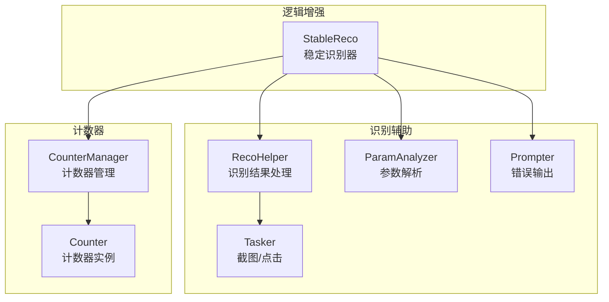
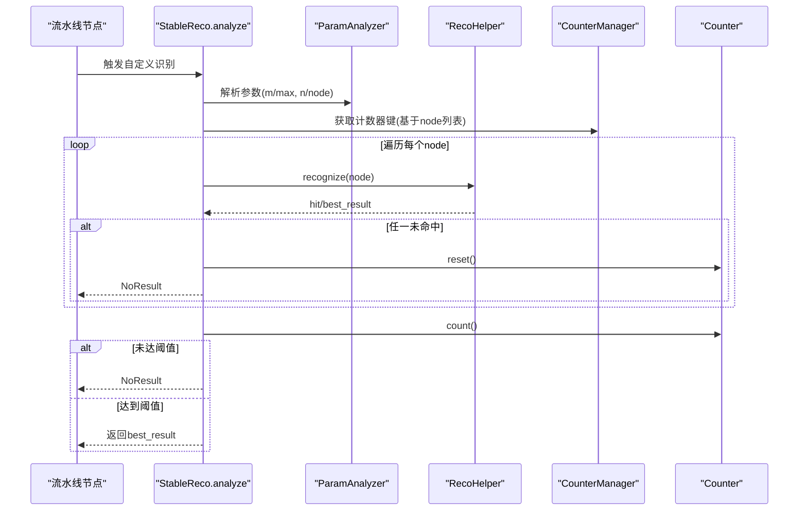
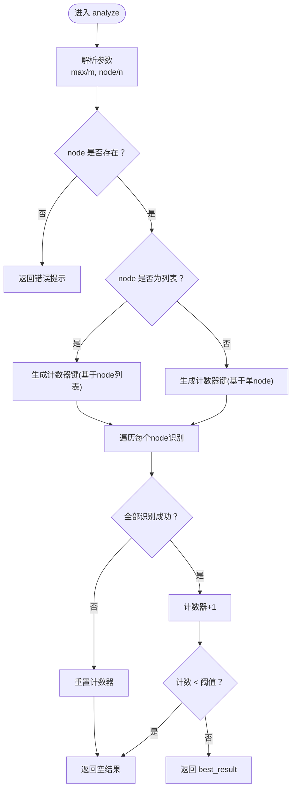
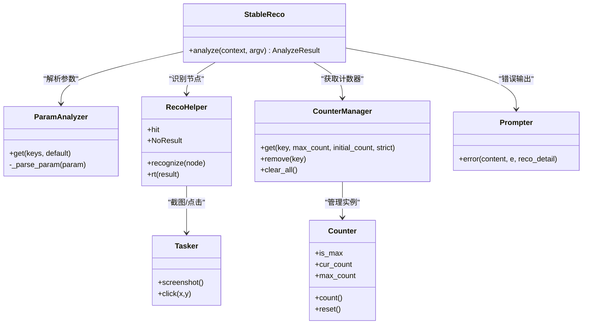

# 逻辑增强组件

<cite>
**本文引用的文件**
- [logic_enhance.py](file://agent/customs/global_func/logic_enhance.py)
- [reco_helper.py](file://agent/customs/maahelper/reco_helper.py)
- [argv_analyzer.py](file://agent/customs/maahelper/argv_analyzer.py)
- [counter.py](file://agent/customs/utils/counter.py)
- [counter.py](file://agent/customs/global_func/counter.py)
- [prompter.py](file://agent/customs/utils/prompter.py)
- [tasker.py](file://agent/customs/maahelper/tasker.py)
- [启动游戏.json](file://assets/resource/base/pipeline/日常任务/启动游戏.json)
- [回到主界面.json](file://assets/resource/base/pipeline/通用/回到主界面.json)
</cite>

## 目录
1. [简介](#简介)
2. [项目结构](#项目结构)
3. [核心组件](#核心组件)
4. [架构总览](#架构总览)
5. [详细组件分析](#详细组件分析)
6. [依赖关系分析](#依赖关系分析)
7. [性能考量](#性能考量)
8. [故障排查指南](#故障排查指南)
9. [结论](#结论)
10. [附录](#附录)

## 简介
本文围绕“稳定识别器”（StableReco）展开，系统解析其工作原理与稳定性保障机制，重点说明其如何通过计数器管理器（CounterManager）实现多次连续识别以提升准确性。文档还深入剖析 analyze 方法的参数解析流程（max 计数阈值与 node 节点列表处理）、识别稳定性保障策略（累计计数器、阈值判定、失败重置）、单节点与多节点列表（JSON 或 URL 参数格式）的差异与适用场景，并结合 RecoHelper 的识别结果处理解释 best_result 的传递机制。最后给出在易受干扰场景下使用 'stable_reco' 提升鲁棒性的配置示例。

## 项目结构
StableReco 位于全局逻辑增强模块中，依赖参数解析器（ParamAnalyzer）、识别辅助器（RecoHelper）、计数器管理器（CounterManager）以及提示器（Prompter）。其在流水线配置中以自定义识别节点的形式被调用，典型场景包括“启动游戏”和“回到主界面”。

图表来源
- [logic_enhance.py](file://agent/customs/global_func/logic_enhance.py#L18-L96)
- [reco_helper.py](file://agent/customs/maahelper/reco_helper.py#L17-L256)
- [argv_analyzer.py](file://agent/customs/maahelper/argv_analyzer.py#L17-L159)
- [counter.py](file://agent/customs/utils/counter.py#L75-L141)
- [prompter.py](file://agent/customs/utils/prompter.py#L16-L54)
- [tasker.py](file://agent/customs/maahelper/tasker.py#L16-L177)

章节来源
- [logic_enhance.py](file://agent/customs/global_func/logic_enhance.py#L1-L96)
- [reco_helper.py](file://agent/customs/maahelper/reco_helper.py#L1-L256)
- [argv_analyzer.py](file://agent/customs/maahelper/argv_analyzer.py#L1-L159)
- [counter.py](file://agent/customs/utils/counter.py#L1-L141)
- [prompter.py](file://agent/customs/utils/prompter.py#L1-L54)
- [tasker.py](file://agent/customs/maahelper/tasker.py#L1-L177)

## 核心组件
- StableReco：自定义识别器，负责多次连续识别、计数器累计、阈值判定与结果返回。
- ParamAnalyzer：统一解析自定义识别参数，支持 JSON 与 URL 查询字符串，自动识别列表参数。
- RecoHelper：封装识别结果处理、最佳结果提取、结果构造与点击等辅助能力。
- CounterManager：集中管理多个命名计数器，提供获取、计数、重置与状态检查。
- Prompter：统一错误输出与异常处理，保证识别失败时的反馈一致性。
- Tasker：封装截图与点击等底层操作，供 RecoHelper 使用。

章节来源
- [logic_enhance.py](file://agent/customs/global_func/logic_enhance.py#L18-L96)
- [argv_analyzer.py](file://agent/customs/maahelper/argv_analyzer.py#L17-L159)
- [reco_helper.py](file://agent/customs/maahelper/reco_helper.py#L17-L256)
- [counter.py](file://agent/customs/utils/counter.py#L75-L141)
- [prompter.py](file://agent/customs/utils/prompter.py#L16-L54)
- [tasker.py](file://agent/customs/maahelper/tasker.py#L16-L177)

## 架构总览
StableReco 通过自定义识别节点接入 MaaFramework 流水线，接收参数后交由 ParamAnalyzer 解析，随后对每个目标节点调用 RecoHelper 进行识别。识别成功则累计计数器，达到阈值后返回最佳结果；任一节点失败则重置计数器并返回空结果。计数器键名由目标节点列表组合而成，确保不同识别场景相互独立。

图表来源
- [logic_enhance.py](file://agent/customs/global_func/logic_enhance.py#L38-L96)
- [argv_analyzer.py](file://agent/customs/maahelper/argv_analyzer.py#L30-L101)
- [reco_helper.py](file://agent/customs/maahelper/reco_helper.py#L62-L94)
- [counter.py](file://agent/customs/utils/counter.py#L87-L112)

## 详细组件分析

### StableReco 稳定识别器
- 角色定位：在 MaaFramework 中作为自定义识别器，通过多次连续识别同一目标，确保识别稳定性。
- 关键参数：
  - max/m：最大连续识别次数（阈值），默认为 3。
  - node/n：目标节点名称或节点名称列表（必需）。列表中每个节点均需识别成功才视为整体成功。
- 参数解析流程：
  - 使用 ParamAnalyzer(argv) 统一解析参数字符串，支持 JSON 与 URL 查询字符串。
  - 读取 max/m 与 node/n，若未提供 node 则返回错误提示。
  - 判断 node 是否为列表，若是则按列表逐个识别，否则转为单元素列表。
  - 生成计数器键：以 "stable_reco_" 前缀 + 节点名（或节点名拼接）组成唯一键，避免跨场景干扰。
- 识别稳定性保障机制：
  - 对列表中每个节点逐一识别，任一未命中则标记失败，重置计数器并返回空结果。
  - 若全部节点识别成功，检查计数器当前值是否小于阈值，未达阈值则返回空结果，继续等待；达到阈值则返回最佳识别结果。
- best_result 传递机制：
  - 第一次识别成功的节点结果作为 best_result 缓存，后续节点识别成功不会覆盖该值，保证返回稳定的最佳结果。

图表来源
- [logic_enhance.py](file://agent/customs/global_func/logic_enhance.py#L52-L96)

章节来源
- [logic_enhance.py](file://agent/customs/global_func/logic_enhance.py#L18-L96)

### 参数解析器 ParamAnalyzer
- 支持的输入格式：
  - JSON 对象或数组：如 {"node": ["a","b"]} 或 node=a&node=b。
  - URL 查询字符串：重复键会被解析为数组，单键为字符串。
- 关键能力：
  - 自动去除外层引号，尝试 JSON 解析，失败则尝试查询字符串解析。
  - get(key, default) 支持多键别名（如 ["max","m"]），并自动将数字字符串转换为 int/float。
- 在 StableReco 中的应用：
  - 读取 max/m 与 node/n，node 支持单值与多值（列表）两种形态，满足单节点与多节点列表场景。

章节来源
- [argv_analyzer.py](file://agent/customs/maahelper/argv_analyzer.py#L17-L159)

### 识别辅助器 RecoHelper
- 核心职责：
  - recognize(node, override_key_value, refresh_image)：根据参数选择截图来源并执行识别，命中后缓存 filtered_results 与 best_result。
  - hit 属性：判断识别是否命中。
  - rt(result, box, text)：构造识别结果对象，优先使用已有 RecognitionResult 的 box/text。
  - click/click_all：基于最佳结果或过滤结果进行点击操作。
- 在 StableReco 中的应用：
  - 逐节点识别并缓存第一个命中节点的 best_result，作为最终返回结果。
  - 使用 NoResult 作为未命中或未达阈值时的返回值。

章节来源
- [reco_helper.py](file://agent/customs/maahelper/reco_helper.py#L17-L256)

### 计数器管理器 CounterManager
- Counter：维护当前计数与最大计数限制，支持 count()、reset()、is_max 等。
- CounterManager：
  - get(key, max_count, initial_count, strict)：按键名获取或创建计数器实例，支持严格模式。
  - remove/clear_all：管理计数器生命周期。
- 在 StableReco 中的应用：
  - 以节点列表组合生成唯一计数器键，避免不同识别场景互相影响。
  - 识别成功累计计数，未达阈值返回空结果，达到阈值返回结果；任一节点失败则重置计数器。

章节来源
- [counter.py](file://agent/customs/utils/counter.py#L1-L141)

### 错误处理与提示 Prompter
- 统一错误输出：log/error 方法提供带分隔线的打印与异常详情输出。
- 在 StableReco 中的应用：参数缺失或识别异常时返回错误提示或空结果，保持流程可控。

章节来源
- [prompter.py](file://agent/customs/utils/prompter.py#L16-L54)

### 底层任务执行器 Tasker
- 封装截图、点击、滑动、等待等基础操作，供 RecoHelper 使用。
- 在 StableReco 中间接应用：RecoHelper 通过 Tasker.screenshot() 获取图像，再调用 context.run_recognition(...) 完成识别。

章节来源
- [tasker.py](file://agent/customs/maahelper/tasker.py#L16-L177)

### 单节点 vs 多节点列表识别
- 单节点：
  - 参数形式：m=3&n=节点名
  - 适用于单一目标识别，如“启动游戏_识别主界面”
- 多节点列表：
  - 参数形式：n=节点1&n=节点2&n=节点3
  - 适用于需要多个条件同时满足的复合场景，如“回到主界面”中同时检测多个弹窗节点
- 两者差异：
  - 单节点：计数器键简单，识别逻辑单一
  - 多节点：任一未命中即失败，计数器键由节点列表组合，避免跨场景干扰

章节来源
- [启动游戏.json](file://assets/resource/base/pipeline/日常任务/启动游戏.json#L288-L318)
- [回到主界面.json](file://assets/resource/base/pipeline/通用/回到主界面.json#L129-L134)

## 依赖关系分析
StableReco 的内部依赖关系如下：

图表来源
- [logic_enhance.py](file://agent/customs/global_func/logic_enhance.py#L18-L96)
- [argv_analyzer.py](file://agent/customs/maahelper/argv_analyzer.py#L17-L159)
- [reco_helper.py](file://agent/customs/maahelper/reco_helper.py#L17-L256)
- [counter.py](file://agent/customs/utils/counter.py#L75-L141)
- [prompter.py](file://agent/customs/utils/prompter.py#L16-L54)
- [tasker.py](file://agent/customs/maahelper/tasker.py#L16-L177)

## 性能考量
- 识别频率与阈值权衡：阈值越大越稳定但响应越慢；在易受干扰场景可适当提高阈值（如 5~7）。
- 多节点列表识别成本：列表越长，循环识别次数越多，建议仅包含必要节点，避免过度识别。
- 计数器键命名：使用节点列表组合生成唯一键，避免跨场景共享计数器导致误判。
- 图像缓存：RecoHelper 会复用截图缓存，减少重复截图开销；必要时可强制刷新图像以应对动态变化。

## 故障排查指南
- 未指定 node：
  - 现象：返回错误提示并终止识别。
  - 排查：确认 custom_recognition_param 是否包含 node/n。
- 识别不稳定：
  - 现象：反复返回空结果或频繁重置计数器。
  - 排查：降低阈值观察是否能稳定触发；检查节点 ROI/模板是否合适；确认是否存在遮挡或闪烁。
- 多节点列表任一失败：
  - 现象：只要有一个节点未识别成功就失败。
  - 排查：确认各节点的识别条件是否过于严格；必要时拆分为多个独立节点。
- 计数器键冲突：
  - 现象：不同场景共享计数器导致误判。
  - 排查：确保每个识别场景使用不同的 node 列表，键名自然区分。

章节来源
- [logic_enhance.py](file://agent/customs/global_func/logic_enhance.py#L52-L96)
- [prompter.py](file://agent/customs/utils/prompter.py#L34-L54)

## 结论
StableReco 通过“多次连续识别 + 计数器阈值”的双重保障机制，在易受干扰场景下显著提升识别鲁棒性。其参数解析灵活（支持 JSON 与 URL），计数器键按节点列表组合生成，避免跨场景干扰；best_result 的稳定传递确保返回一致的高质量结果。结合合理的阈值与节点选择，可在复杂界面中取得更可靠的自动化效果。

## 附录

### 在易受干扰场景下的配置示例
- 启动游戏（主界面识别）：提高阈值以应对界面闪烁
  - 参数：m=5&n=启动游戏_识别主界面
  - 适用场景：主界面图标/文字在不同分辨率或亮度下波动较大
- 回到主界面（多弹窗节点）：多节点同时识别
  - 参数：n=返回主界面_活动弹窗&n=返回主界面_使徒&n=返回主界面_冒险通行证
  - 适用场景：同时存在多个可关闭弹窗，需全部识别成功才视为回到主界面

章节来源
- [启动游戏.json](file://assets/resource/base/pipeline/日常任务/启动游戏.json#L288-L318)
- [回到主界面.json](file://assets/resource/base/pipeline/通用/回到主界面.json#L129-L134)