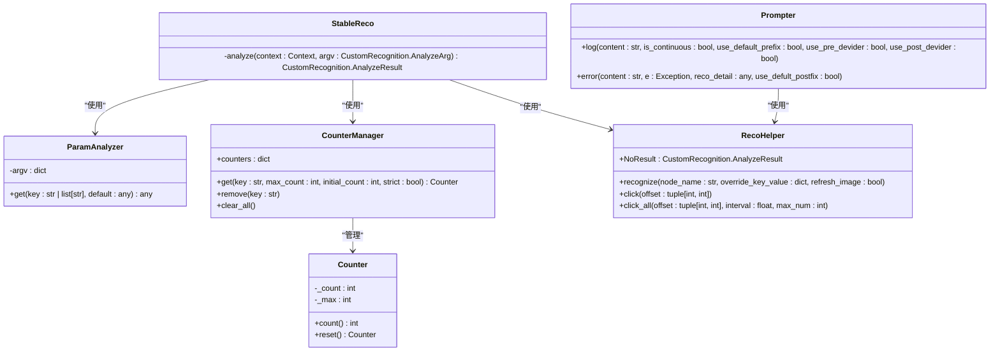
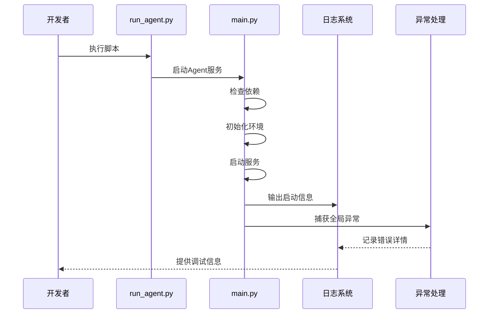

# 调试与日志

<cite>
**本文档引用文件**   
- [run_agent.py](file://dev/run_agent.py)
- [main.py](file://agent/main.py)
- [prompter.py](file://agent/customs/utils/prompter.py)
- [logic_enhance.py](file://agent/customs/global_func/logic_enhance.py)
- [setup.py](file://agent/preprocess/setup.py)
- [maa.log](file://debug/maa.log)
- [counter.py](file://agent/customs/utils/counter.py)
- [reco_helper.py](file://agent/customs/maahelper/reco_helper.py)
- [tasker.py](file://agent/customs/maahelper/tasker.py)
- [argv_analyzer.py](file://agent/customs/maahelper/argv_analyzer.py)
- [clear.py](file://agent/preprocess/clear.py)
- [maa_option.json](file://ci/config/maa_option.json)
</cite>

## 目录
1. [调试会话启动](#调试会话启动)
2. [日志系统详解](#日志系统详解)
3. [提示工具与逻辑增强](#提示工具与逻辑增强)
4. [开发模式调试](#开发模式调试)
5. [常见运行时错误分析](#常见运行时错误分析)
6. [总结](#总结)

## 调试会话启动

开发者可通过 `dev/run_agent.py` 脚本在开发模式下快速启动调试会话。该脚本会自动配置环境变量，切换到项目根目录，并以调试模式启动 Agent 服务。启动时会设置 `MDDL_DEV_MODE=1` 环境变量，标识当前为开发模式。

脚本支持通过 `MDDL_SOCKET_ID` 环境变量自定义 socket ID，若未设置则使用默认值 "debug"。启动过程中，脚本会在控制台输出关键信息，包括启动状态、socket ID、工作目录和开发模式标识，便于开发者确认启动环境。

**Section sources**
- [run_agent.py](file://dev/run_agent.py#L1-L51)
- [main.py](file://agent/main.py#L1-L48)

## 日志系统详解

### 日志级别与配置

日志系统通过 `ci/config/maa_option.json` 文件进行配置，主要包含以下参数：
- `"logging"`: 是否启用日志记录
- `"save_draw"`: 是否保存识别过程中的绘制图像
- `"save_on_error"`: 是否在出错时保存调试图像
- `"stdout_level"`: 控制台输出级别

日志文件默认存储在 `debug/maa.log` 路径下，记录了从进程启动到任务执行的完整过程，包括调试、信息、警告和错误等多个级别。

### 关键日志点分布

系统在关键执行节点插入了详细的日志记录点：
- **进程启动**: 记录版本信息、构建时间、操作系统和工作目录
- **任务执行**: 记录任务开始、节点识别、操作执行等过程
- **资源加载**: 记录资源包加载、配置文件解析等初始化过程
- **异常捕获**: 记录识别失败、操作超时等异常情况

日志采用结构化格式，包含时间戳、日志级别、进程ID、线程ID、源文件和行号等信息，便于定位问题。

### 异常捕获机制

系统实现了多层次的异常捕获机制。在 `agent/main.py` 中，主函数通过 try-catch 块捕获全局异常，确保程序不会因未处理的异常而崩溃。同时，在自定义识别器和操作中，也实现了细粒度的异常处理，如 `logic_enhance.py` 中的 `StableReco` 类在 `analyze` 方法中捕获异常并返回适当的错误结果。

**Section sources**
- [maa_option.json](file://ci/config/maa_option.json#L1-L6)
- [maa.log](file://debug/maa.log#L1-L100)
- [main.py](file://agent/main.py#L39-L41)
- [logic_enhance.py](file://agent/customs/global_func/logic_enhance.py#L94-L95)

## 提示工具与逻辑增强

### 提示工具 (Prompter)

`agent/customs/utils/prompter.py` 模块提供了 `Prompter` 类，用于生成格式化的控制台输出。该类包含 `log` 和 `error` 两个主要方法：

- `log` 方法用于输出普通日志信息，支持前缀、分隔符等格式化选项
- `error` 方法专门用于输出错误信息，会自动添加失败后缀，并输出异常详情

`cprint` 函数在输出前后添加短暂延迟，避免日志输出过于密集，提高可读性。

### 逻辑增强功能

`agent/customs/global_func/logic_enhance.py` 模块提供了 `StableReco` 类，实现了稳定识别功能。该功能通过多次连续识别同一目标，确保识别结果的稳定性。只有当连续识别次数达到阈值时，才返回识别结果，避免因偶然因素导致的误识别。

`StableReco` 类使用 `CounterManager` 管理计数器，通过 `ParamAnalyzer` 解析参数，结合 `RecoHelper` 进行实际识别操作，体现了良好的模块化设计。

**Diagram sources **
- [prompter.py](file://agent/customs/utils/prompter.py#L1-L55)
- [logic_enhance.py](file://agent/customs/global_func/logic_enhance.py#L1-L96)
- [argv_analyzer.py](file://agent/customs/maahelper/argv_analyzer.py#L1-L159)
- [counter.py](file://agent/customs/utils/counter.py#L1-L141)
- [reco_helper.py](file://agent/customs/maahelper/reco_helper.py#L1-L256)

**Section sources**
- [prompter.py](file://agent/customs/utils/prompter.py#L1-L55)
- [logic_enhance.py](file://agent/customs/global_func/logic_enhance.py#L1-L96)

## 开发模式调试

### 预处理清理

在每次启动 Agent 服务前，系统会执行预处理清理操作。`agent/preprocess/clear.py` 模块的 `clear()` 函数负责清理 `debug/on_error` 目录下的调试图片，避免历史图片占用空间。清理过程即使出错也不会中断主流程，仅输出提示信息。

### 依赖环境检查

`agent/preprocess/setup.py` 模块负责检查和自动安装项目依赖。该模块会读取 `interface.json` 中的版本号，与本地配置进行比对，决定是否需要执行 pip install 操作。系统支持多个镜像源，按顺序尝试，最后使用 PyPI 官方源兜底，确保依赖安装的可靠性。

### 流程追踪

开发者可利用 `prompter.py` 中的提示工具和 `logic_enhance.py` 中的逻辑增强功能进行流程追踪。通过在关键节点插入 `Prompter.log()` 调用，可以观察程序执行流程。`StableReco` 类的稳定识别功能也提供了详细的日志输出，便于分析识别过程。

**Section sources**
- [clear.py](file://agent/preprocess/clear.py#L1-L41)
- [setup.py](file://agent/preprocess/setup.py#L1-L230)
- [prompter.py](file://agent/customs/utils/prompter.py#L1-L55)
- [logic_enhance.py](file://agent/customs/global_func/logic_enhance.py#L1-L96)

## 常见运行时错误分析

### 图像识别失败

从日志文件 `debug/maa.log` 的分析可以看出，图像识别失败是常见问题。日志显示，系统在识别 "圣团巡礼_检测宠物礼物" 节点时，多次尝试均未能达到阈值（0.700000），识别得分在 0.45-0.49 之间波动。

**解决方案**：
1. 检查模板图片 `holy/love.png` 的质量，确保与实际游戏画面匹配
2. 调整识别阈值，适当降低以适应画面变化
3. 使用 `StableReco` 的稳定识别功能，通过多次识别提高成功率
4. 检查游戏画面分辨率和缩放设置，确保与模板图片一致

### 操作超时

日志中未直接显示操作超时错误，但可以通过分析任务执行时间来预防。系统在 `Tasker` 类中提供了 `wait()` 方法，可用于在任务流程中插入适当的延迟，避免因操作过快导致的状态不同步。

**解决方案**：
1. 在关键操作后添加适当的等待时间
2. 使用循环识别直到成功，而非单次尝试
3. 实现超时重试机制，设置最大重试次数
4. 利用 `RecoHelper` 的 `refresh_screencap()` 方法确保使用最新画面进行识别

**Diagram sources **
- [run_agent.py](file://dev/run_agent.py#L1-L51)
- [main.py](file://agent/main.py#L1-L48)
- [maa.log](file://debug/maa.log#L1-L100)

**Section sources**
- [maa.log](file://debug/maa.log#L1-L100)
- [reco_helper.py](file://agent/customs/maahelper/reco_helper.py#L1-L256)
- [tasker.py](file://agent/customs/maahelper/tasker.py#L1-L177)

## 总结

本指南详细介绍了 MaaDuDuL 项目的调试策略和日志分析方法。通过 `run_agent.py` 启动调试会话，开发者可以方便地观察控制台输出信息。系统的日志机制提供了详细的执行记录，结合 `prompter.py` 的提示工具和 `logic_enhance.py` 的逻辑增强功能，可以有效追踪程序流程。

对于常见的运行时错误，如图像识别失败和操作超时，本指南提供了具体的日志特征分析和解决方案。开发者应充分利用开发模式下的调试功能，通过打印调试信息、断点调试等方式验证自定义模块的行为，从而快速定位和解决问题。

**Section sources**
- [run_agent.py](file://dev/run_agent.py#L1-L51)
- [main.py](file://agent/main.py#L1-L48)
- [prompter.py](file://agent/customs/utils/prompter.py#L1-L55)
- [logic_enhance.py](file://agent/customs/global_func/logic_enhance.py#L1-L96)
- [maa.log](file://debug/maa.log#L1-L100)