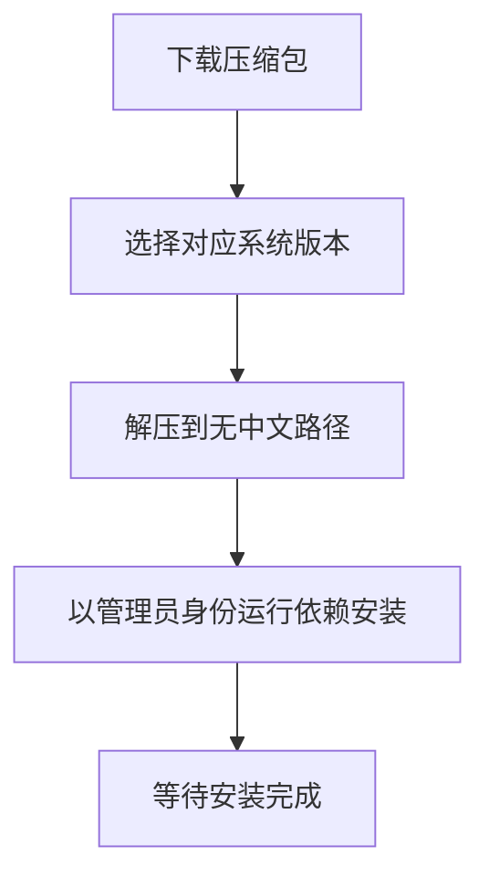
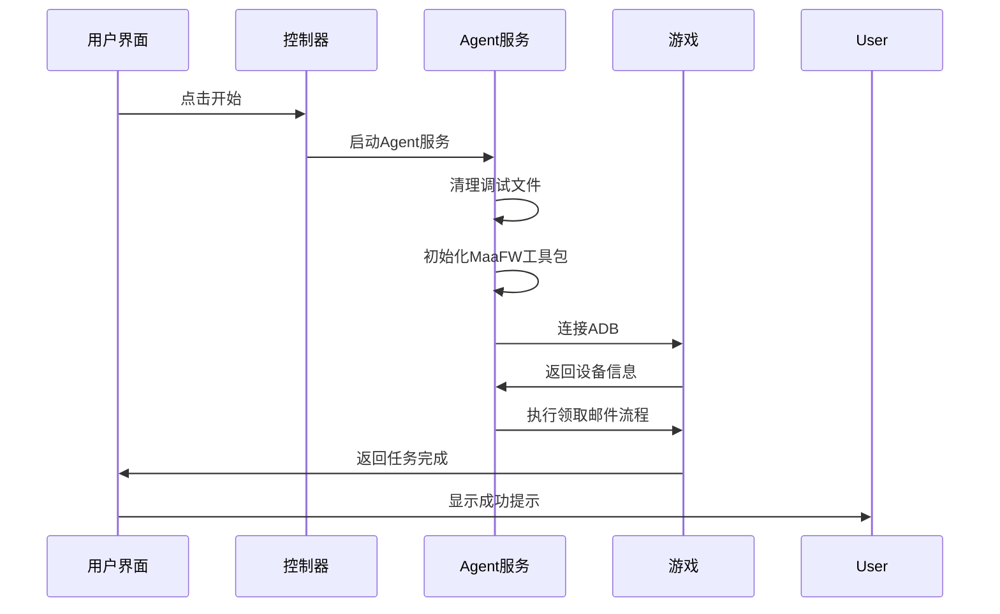
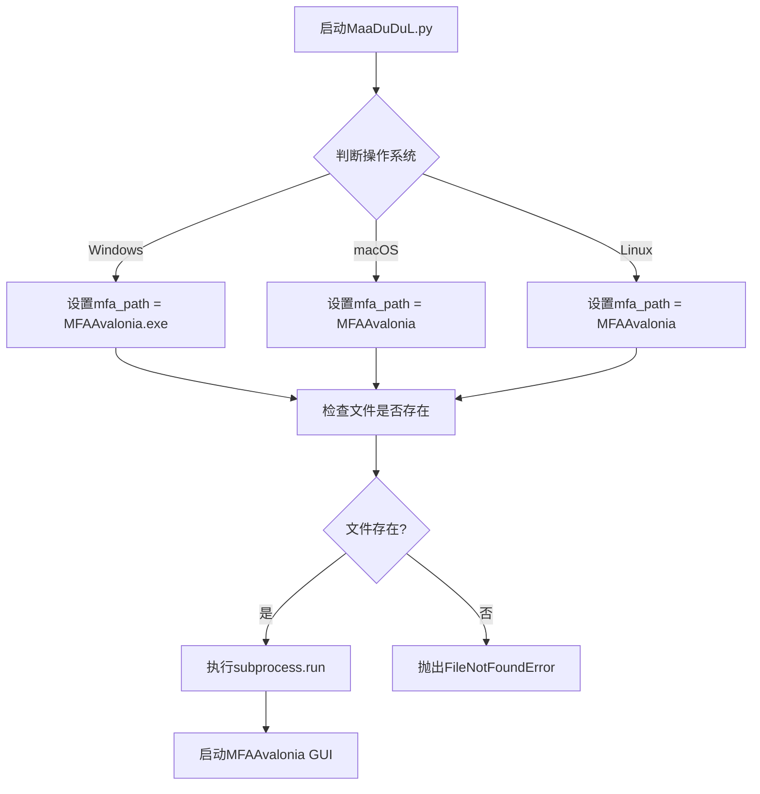
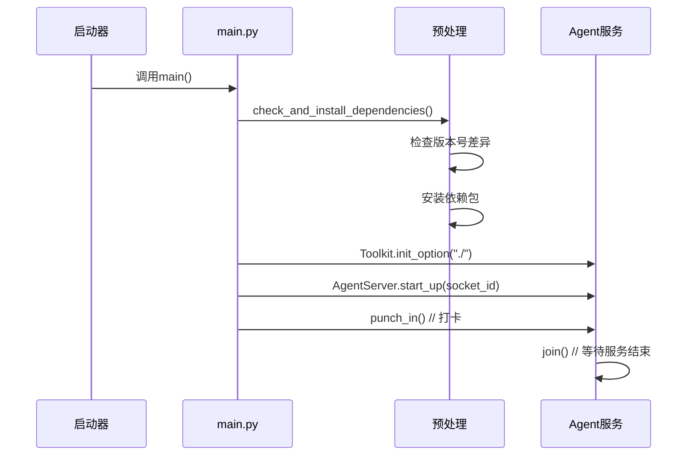

# 快速入门

<cite>
**本文档中引用的文件**  
- [MaaDuDuL.py](file://launcher/MaaDuDuL.py)
- [README.md](file://README.md)
- [requirements.txt](file://requirements.txt)
- [main.py](file://agent/main.py)
- [setup.py](file://agent/preprocess/setup.py)
- [clear.py](file://agent/preprocess/clear.py)
- [maa_pi_config.json](file://assets/config/maa_pi_config.json)
- [default_pipeline.json](file://assets/resource/base/default_pipeline.json)
- [claim_mail.md](file://descs/daily/claim_mail.md)
- [interface.json](file://assets/interface.json)
- [install.py](file://tools/install.py)
- [下载与安装.md](file://docsite/docs/10.用户手册/10.旅程的开始/10.下载与安装.md)
- [启动与初始化.md](file://docsite/docs/10.用户手册/10.旅程的开始/20.启动与初始化.md)
- [开始.md](file://docsite/docs/10.用户手册/10.旅程的开始/01.开始.md)
</cite>

## 目录
1. [简介](#简介)
2. [环境准备](#环境准备)
3. [软件下载与安装](#软件下载与安装)
4. [应用启动与控制器配置](#应用启动与控制器配置)
5. [资源包选择与加载](#资源包选择与加载)
6. [首次运行初始化设置](#首次运行初始化设置)
7. [完整使用示例：领取邮件任务](#完整使用示例领取邮件任务)
8. [常见问题排查](#常见问题排查)
9. [后台工作原理解析](#后台工作原理解析)

## 简介

MaaDuDuL（简称MDDL）是一款基于图像识别技术的自动化助手，专为《嘟嘟脸恶作剧》游戏设计，旨在帮助玩家自动完成日常重复性任务。本指南将带领新手用户从零开始，在10分钟内完成首次自动化运行。

本软件基于MaaFramework与MFAAvalonia技术栈构建，通过模拟操作与图像识别实现自动化。使用前请务必阅读用户协议并理解相关风险。

**Section sources**
- [README.md](file://README.md#L1-L118)
- [开始.md](file://docsite/docs/10.用户手册/10.旅程的开始/01.开始.md#L1-L36)

## 环境准备

在使用MaaDuDuL之前，需要确保系统环境满足基本要求：

### 系统要求
- **操作系统**：Windows 10/11、macOS、Linux
- **不支持**：Windows 7及更早版本、HarmonyOS、移动设备、国际服
- **推荐模拟器**：MuMu模拟器12（官方版），分辨率比例16:9，最低帧率30Hz

### 依赖组件
- **Python环境**：项目自带嵌入式Python环境，无需单独安装
- **ADB驱动**：通过模拟器自动提供，确保模拟器ADB调试功能正常
- **网络连接**：稳定的互联网连接用于下载资源和更新

安装过程中，系统会自动检测并安装所需依赖包，包括maafw和requests等核心库。

**Section sources**
- [requirements.txt](file://requirements.txt#L1-L3)
- [下载与安装.md](file://docsite/docs/10.用户手册/10.旅程的开始/10.下载与安装.md#L1-L146)

## 软件下载与安装

### 下载步骤
1. 访问[GitHub Release页面](https://github.com/kqcoxn/MaaDuDuL/releases)或使用QQ群文件
2. 根据系统选择对应版本：
   - Windows用户下载`MaaDuDuL-win-x86_64-*.zip`
   - macOS用户下载`MaaDuDuL-macos-aarch64-*.zip`
   - Linux用户下载`MaaDuDuL-linux-x86_64-*.zip`
3. 推荐使用Mirror酱国内加速服务下载

### 安装流程
1. 将下载的压缩包**完整解压**到一个**不含中文字符的独立文件夹**
2. **不要**将软件解压到`C:\Program Files\`等需要管理员权限的目录
3. 运行文件夹内的`DependencySetup_依赖库安装_x.x`文件，**右键以管理员身份运行**
4. 等待脚本自动完成环境依赖安装，窗口自动关闭即表示安装完成



**Diagram sources**
- [install.py](file://tools/install.py#L1-L131)
- [setup.py](file://agent/preprocess/setup.py#L1-L230)

**Section sources**
- [下载与安装.md](file://docsite/docs/10.用户手册/10.旅程的开始/10.下载与安装.md#L1-L146)

## 应用启动与控制器配置

### 启动前准备
1. **先启动模拟器**，推荐使用MuMu模拟器12
2. 在模拟器设置中配置：
   - 分辨率比例：16:9（平板预设）
   - 帧率：≥30Hz
3. 确保游戏已正常运行

### 启动MaaDuDuL
1. 进入解压目录，找到`MaaDuDuL.exe`
2. **右键选择"以管理员身份运行"**
3. 首次运行会自动创建桌面快捷方式（可选）

### 控制器配置
在`interface.json`配置文件中，控制器设置如下：
```json
"controller": [
  {
    "name": "模拟器",
    "type": "Adb",
    "display_short_side": 720
  }
]
```
系统会自动识别模拟器ADB连接，无需手动配置IP和端口。

**Section sources**
- [启动与初始化.md](file://docsite/docs/10.用户手册/10.旅程的开始/20.启动与初始化.md#L1-L70)
- [interface.json](file://assets/interface.json#L14-L28)

## 资源包选择与加载

### 资源包结构
MaaDuDuL的资源包位于`assets/resource/`目录下，主要包含：
- **基础资源**：`base/`目录下的通用任务流程
- **配置文件**：`interface.json`定义了所有可用任务
- **OCR模型**：用于图像识别的文本识别模型

### 资源选择
在`maa_pi_config.json`文件中配置资源包：
```json
{
    "resource": "B服"
}
```
当前仅支持B服资源包，系统会自动加载`./resource/base`路径下的资源。

### 加载机制
启动时，`install.py`脚本会自动复制资源文件到安装目录：
```python
shutil.copytree(
    working_dir / "assets" / "resource",
    install_path / "resource",
    dirs_exist_ok=True,
)
```

**Section sources**
- [maa_pi_config.json](file://assets/config/maa_pi_config.json#L1-L3)
- [interface.json](file://assets/interface.json#L29-L34)
- [install.py](file://tools/install.py#L51-L64)

## 首次运行初始化设置

### 设备连接测试
1. 启动MaaDuDuL后，系统会自动尝试连接模拟器
2. 首次连接时会自动下载动态依赖（约需5分钟）
3. 观察右侧日志面板，等待"任务已全部完成"提示

### 界面适配
- 系统会根据`display_short_side: 720`自动适配界面
- 确保模拟器分辨率符合16:9比例
- 若界面错位，重启模拟器并检查分辨率设置

### 权限授予
1. 首次运行时，Windows会弹出安全警告，点击"更多信息"→"仍要运行"
2. 以管理员身份运行确保对系统资源的完全访问权限
3. 允许程序访问网络以下载必要资源

**Section sources**
- [启动与初始化.md](file://docsite/docs/10.用户手册/10.旅程的开始/20.启动与初始化.md#L55-L65)
- [interface.json](file://assets/interface.json#L18-L19)

## 完整使用示例：领取邮件任务

### 任务配置
1. 在主界面勾选"领取邮件"任务
2. 保持默认选项"每日仅检查一次邮箱"
3. 点击"开始"按钮

### 执行流程


### 预期结果
- 从任意界面开始，自动导航至邮件界面
- 领取所有可领取的邮件奖励
- 返回主界面完成任务
- 整个过程约1-2分钟

**Diagram sources**
- [claim_mail.md](file://descs/daily/claim_mail.md#L1-L13)
- [interface.json](file://assets/interface.json#L66-L72)

**Section sources**
- [claim_mail.md](file://descs/daily/claim_mail.md#L1-L13)

## 常见问题排查

### 设备未识别
**现象**：连接失败，提示"找不到设备"
**解决方案**：
1. 检查模拟器是否已启动且正常运行
2. 确认模拟器ADB调试功能已开启
3. 重启模拟器和MaaDuDuL
4. 检查`interface.json`中控制器配置是否正确

### 分辨率不匹配
**现象**：界面元素点击错位
**解决方案**：
1. 确保模拟器分辨率为16:9比例
2. 检查`display_short_side`设置是否为720
3. 重启程序让系统重新适配

### 依赖安装失败
**现象**：提示"环境加载失败"
**解决方案**：
1. 检查网络连接是否正常
2. 尝试更换pip镜像源
3. 手动运行`pip install -r requirements.txt`

**Section sources**
- [启动与初始化.md](file://docsite/docs/10.用户手册/10.旅程的开始/20.启动与初始化.md#L55-L65)
- [setup.py](file://agent/preprocess/setup.py#L135-L197)

## 后台工作原理解析

### 启动流程
`MaaDuDuL.py`作为启动入口，其工作流程如下：



### Agent服务初始化
`agent/main.py`负责核心服务启动：



### 核心工作流
1. **预处理**：`clear.py`清理调试文件
2. **依赖检查**：`setup.py`确保环境完整
3. **服务启动**：初始化MaaFW工具包
4. **任务执行**：通过ADB控制模拟器
5. **结果返回**：完成任务并退出

**Diagram sources**
- [MaaDuDuL.py](file://launcher/MaaDuDuL.py#L1-L22)
- [main.py](file://agent/main.py#L1-L48)
- [clear.py](file://agent/preprocess/clear.py#L1-L41)

**Section sources**
- [MaaDuDuL.py](file://launcher/MaaDuDuL.py#L1-L22)
- [main.py](file://agent/main.py#L1-L48)