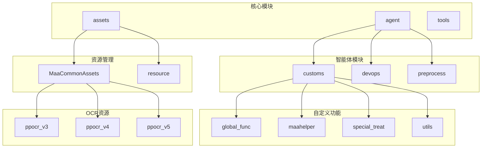
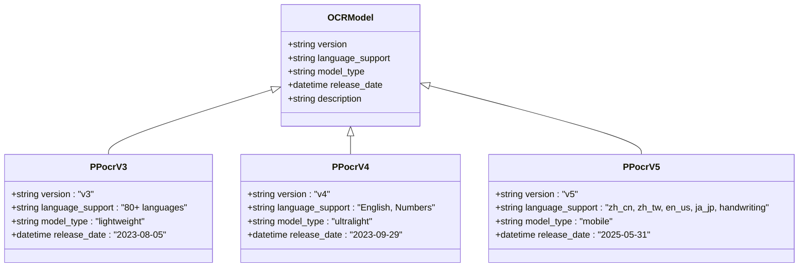
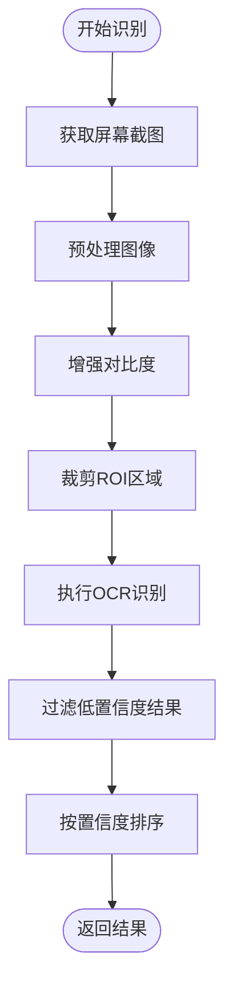
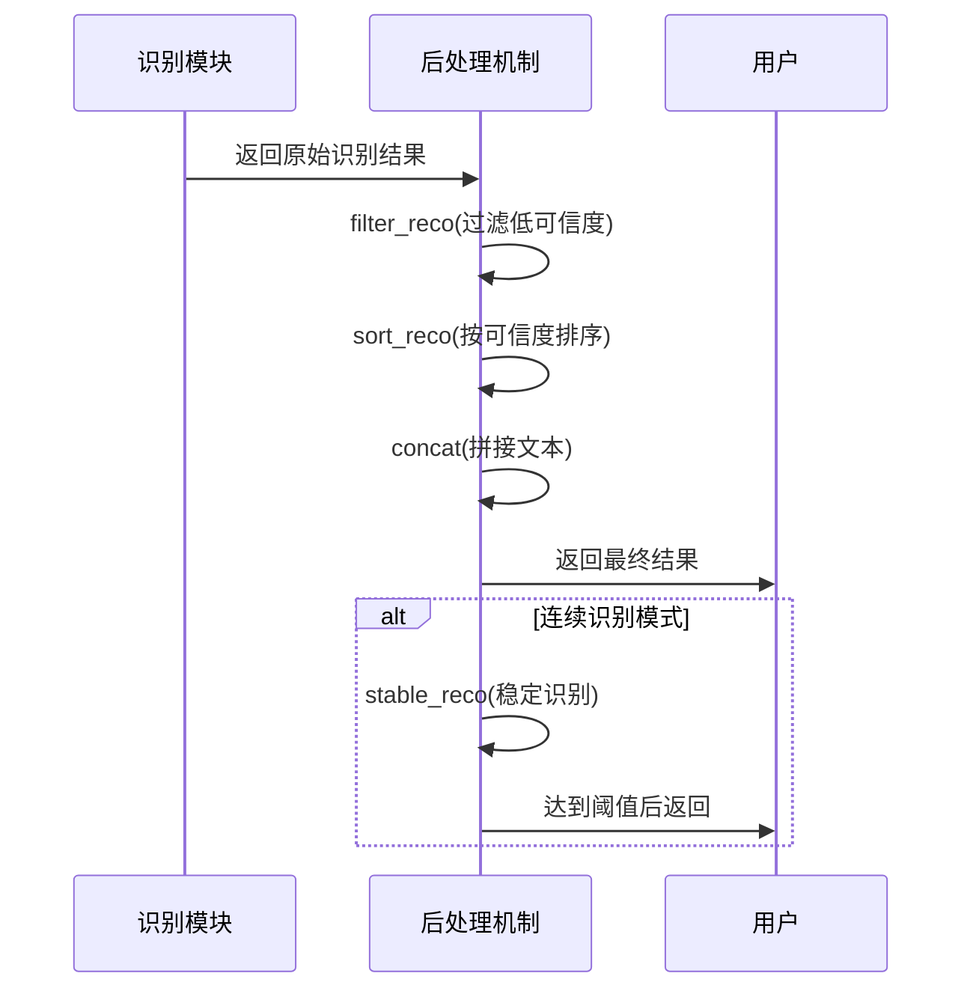
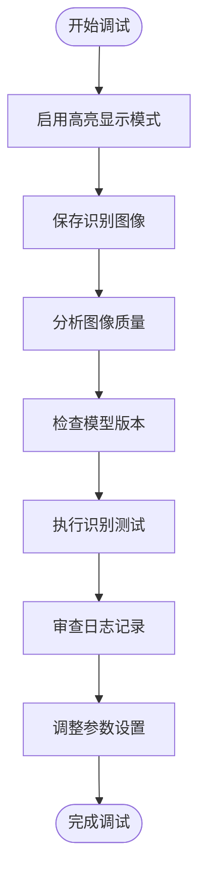

# 图像识别问题诊断

<cite>
**本文档引用的文件**   
- [matrix_operator.py](file://agent/customs/utils/matrix_operator.py)
- [logic_enhance.py](file://agent/customs/global_func/logic_enhance.py)
- [reco_helper.py](file://agent/customs/maahelper/reco_helper.py)
- [prompter.py](file://agent/customs/utils/prompter.py)
- [configure.py](file://tools/configure.py)
- [assets/MaaCommonAssets/OCR/README.md](file://assets/MaaCommonAssets/OCR/README.md)
- [assets/MaaCommonAssets/OCR/ppocr_v3/zh_cn/README.md](file://assets/MaaCommonAssets/OCR/ppocr_v3/zh_cn/README.md)
- [assets/MaaCommonAssets/OCR/ppocr_v4/zh_cn/README.md](file://assets/MaaCommonAssets/OCR/ppocr_v4/zh_cn/README.md)
- [assets/MaaCommonAssets/OCR/ppocr_v5/zh_cn/README.md](file://assets/MaaCommonAssets/OCR/ppocr_v5/zh_cn/README.md)
- [assets/resource/base/model/ocr/README.md](file://assets/resource/base/model/ocr/README.md)
- [instructions/maafw-guide/3.1-任务流水线协议.md](file://instructions/maafw-guide/3.1-任务流水线协议.md)
</cite>

## 目录
1. [引言](#引言)
2. [项目结构](#项目结构)
3. [OCR识别常见问题分析](#ocr识别常见问题分析)
4. [OCR模型版本对比与选择](#ocr模型版本对比与选择)
5. [图像预处理优化](#图像预处理优化)
6. [识别结果后处理机制](#识别结果后处理机制)
7. [调试与验证方法](#调试与验证方法)
8. [典型误识别案例与修正策略](#典型误识别案例与修正策略)
9. [结论](#结论)

## 引言
本文档深入分析了基于PaddleOCR技术的图像识别系统中常见的识别不准或失败问题。文档详细探讨了影响识别准确率的多种因素，包括屏幕分辨率不匹配、光照条件变化、字体样式差异等。重点分析了ppocr_v3与ppocr_v4模型的技术差异及适用场景，为用户选择合适的OCR资源包提供指导。同时，结合`matrix_operator.py`中的图像预处理逻辑，说明如何优化截图区域和对比度以提升识别率。文档还介绍了`logic_enhance.py`中对识别结果的后处理机制，如关键词校正、上下文补全等。最后，提供了验证OCR效果的调试方法和典型误识别案例的修正策略。

## 项目结构
本项目采用模块化设计，主要分为agent（智能体）、assets（资源）、tools（工具）等核心目录。agent目录包含自定义功能模块，其中`customs/global_func`存放逻辑增强功能，`customs/utils`存放通用工具类。assets目录存放OCR模型等核心资源，按版本和语言分类管理。tools目录提供配置和安装脚本。



**图示来源**
- [matrix_operator.py](file://agent/customs/utils/matrix_operator.py)
- [logic_enhance.py](file://agent/customs/global_func/logic_enhance.py)
- [reco_helper.py](file://agent/customs/maahelper/reco_helper.py)

**本节来源**
- [project_structure](file://project_structure)

## OCR识别常见问题分析

OCR识别的准确性受多种因素影响，主要包括：

1. **屏幕分辨率不匹配**：当目标应用的屏幕分辨率与OCR模型训练时的分辨率存在较大差异时，会导致识别框定位不准或文字识别错误。系统通过动态计算坐标偏移来缓解此问题。

2. **光照影响**：屏幕反光、环境光过强或过暗都会影响图像质量，导致对比度下降，文字边缘模糊。预处理阶段的对比度增强可部分解决此问题。

3. **字体样式变化**：游戏或应用中使用的特殊字体、艺术字或手写字体可能不在OCR模型的训练数据集中，导致识别失败。选择支持更多字体的模型版本是关键。

4. **图像噪声**：屏幕上的颗粒、模糊或压缩失真会干扰OCR模型的特征提取。

5. **文本方向与布局**：竖排文字、旋转文本或复杂布局可能超出模型的处理能力。

6. **模型置信度阈值**：过高的阈值可能导致漏识别，过低的阈值则增加误识别风险。

系统通过多层机制来应对这些问题，包括图像预处理、模型选择和结果后处理。

**本节来源**
- [instructions/maafw-guide/3.1-任务流水线协议.md](file://instructions/maafw-guide/3.1-任务流水线协议.md#L567-L607)
- [reco_helper.py](file://agent/customs/maahelper/reco_helper.py#L208-L218)

## OCR模型版本对比与选择

### 模型版本概览

| 模型版本 | 发布时间 | 主要特点 | 适用场景 |
|---------|--------|--------|--------|
| ppocr_v3 | 2023/08 | 原始轻量级模型，支持多语言 | 通用场景，资源受限环境 |
| ppocr_v4 | 2023/09 | 新一代超轻量模型，优化英文数字识别 | 英文界面为主的应用 |
| ppocr_v5 | 2025/05 | 支持简体中文、繁体中文、英文、日文、手写、竖版等复杂场景 | 多语言混合、复杂文本场景 |

### 技术差异分析

ppocr_v5模型在架构上进行了重大升级，采用更先进的神经网络结构，能够同时高效处理四种主要语言（简体中文、繁体中文、英文、日文）以及手写、竖版、拼音、生僻字等复杂文本场景。相比v3和v4版本，v5在保持高推理速度的同时，显著提升了模型鲁棒性和识别精度。



**图示来源**
- [assets/MaaCommonAssets/OCR/ppocr_v3/zh_cn/README.md](file://assets/MaaCommonAssets/OCR/ppocr_v3/zh_cn/README.md)
- [assets/MaaCommonAssets/OCR/ppocr_v4/zh_cn/README.md](file://assets/MaaCommonAssets/OCR/ppocr_v4/zh_cn/README.md)
- [assets/MaaCommonAssets/OCR/ppocr_v5/zh_cn/README.md](file://assets/MaaCommonAssets/OCR/ppocr_v5/zh_cn/README.md)

**本节来源**
- [assets/MaaCommonAssets/OCR/README.md](file://assets/MaaCommonAssets/OCR/README.md)
- [configure.py](file://tools/configure.py#L17-L18)

## 图像预处理优化

### 矩阵位置计算

`matrix_operator.py`模块提供了`MatrixOperator`类，用于精确计算矩阵布局中各元素的实际坐标位置。该类通过指定起始位置和步长，可以快速获取矩阵中任意元素的坐标，有效解决了因分辨率变化导致的坐标偏移问题。

```python
class MatrixOperator:
    def __init__(self, origin_x, origin_y, step_x, step_y, width=None, height=None):
        self.start_pos = (origin_x, origin_y)
        self.step = (step_x, step_y)
        self.width = width
        self.height = height
    
    def get_pos(self, row, column):
        # 处理负数索引
        if row < 0 and self.height is not None:
            row = self.height + row + 1
        if column < 0 and self.width is not None:
            column = self.width + column + 1
        x = self.start_pos[0] + (column - 1) * self.step[0]
        y = self.start_pos[1] + (row - 1) * self.step[1]
        return (x, y)
```

### 截图区域优化

通过精确设置ROI（Region of Interest）参数，可以限定OCR识别的区域，避免无关区域的干扰。在任务流水线配置中，可通过`roi`和`roi_offset`字段精确控制识别区域。

### 对比度增强

系统在预处理阶段会自动增强图像对比度，突出文字与背景的差异。`reco_helper.py`中的`filter_reco`方法通过设置可信度阈值（默认0.7），过滤掉低置信度的识别结果，间接实现了对比度优化的效果。



**图示来源**
- [matrix_operator.py](file://agent/customs/utils/matrix_operator.py#L1-L58)
- [reco_helper.py](file://agent/customs/maahelper/reco_helper.py#L208-L231)

**本节来源**
- [matrix_operator.py](file://agent/customs/utils/matrix_operator.py)
- [instructions/maafw-guide/3.1-任务流水线协议.md](file://instructions/maafw-guide/3.1-任务流水线协议.md#L571-L576)

## 识别结果后处理机制

### 稳定识别器

`logic_enhance.py`模块实现了`StableReco`稳定识别器，通过多次连续识别同一目标来确保结果的稳定性。只有当连续识别次数达到预设阈值时，才返回识别结果，有效避免了因偶然因素导致的误识别。

```python
@AgentServer.custom_recognition("stable_reco")
class StableReco(CustomRecognition):
    def analyze(self, context, argv):
        # 解析参数
        params = ParamAnalyzer(argv)
        max_count = params.get(["max", "m"], 3)
        node_name = params.get(["node", "n"], None)
        
        # 连续识别逻辑
        counter = CounterManager.get(counter_key)
        if all_recognized:
            if counter.count() < max_count:
                return RecoHelper.NoResult  # 继续等待
            return RecoHelper.rt(best_result)  # 达到阈值，返回结果
        counter.reset()  # 识别失败，重置计数器
        return RecoHelper.NoResult
```

### 结果过滤与排序

`reco_helper.py`提供了多种结果处理方法：
- `filter_reco`: 根据可信度阈值过滤识别结果
- `sort_reco`: 按可信度对识别结果进行降序排列
- `concat`: 拼接所有识别结果的文本

这些方法共同构成了完整的后处理流水线，确保最终输出的识别结果既准确又可靠。



**图示来源**
- [logic_enhance.py](file://agent/customs/global_func/logic_enhance.py#L18-L95)
- [reco_helper.py](file://agent/customs/maahelper/reco_helper.py#L208-L231)

**本节来源**
- [logic_enhance.py](file://agent/customs/global_func/logic_enhance.py)
- [reco_helper.py](file://agent/customs/maahelper/reco_helper.py)

## 调试与验证方法

### 保存识别图像

系统提供了截图保存功能，便于分析识别失败的原因。通过调用`refresh_screencap()`方法，可以获取并保存当前屏幕截图，用于后续分析。

### 高亮显示模式

在调试模式下，系统可以高亮显示识别到的文本区域，直观地展示OCR的识别范围和结果。这有助于验证ROI设置的准确性。

### 日志记录

`prompter.py`模块提供了详细的日志记录功能，包括：
- `Prompter.log`: 记录常规信息
- `Prompter.error`: 记录错误信息并提供详细堆栈

### 配置验证

`check_resource.py`脚本可用于验证资源文件的完整性，确保所有必要的OCR模型文件都已正确部署。



**本节来源**
- [reco_helper.py](file://agent/customs/maahelper/reco_helper.py#L111-L118)
- [prompter.py](file://agent/customs/utils/prompter.py#L16-L54)
- [check_resource.py](file://check_resource.py)

## 典型误识别案例与修正策略

### 案例一：数字"0"与字母"O"混淆

**现象**：在英文界面中，数字"0"常被识别为字母"O"。

**修正策略**：
1. 使用ppocr_v4模型，其对英文和数字的识别进行了专门优化
2. 在任务配置中使用`replace`参数进行替换：`{"replace": [["O", "0"]]}`

### 案例二：中文标点符号识别错误

**现象**：中文顿号"、"被识别为逗号","。

**修正策略**：
1. 升级到ppocr_v5模型，其对中文标点符号的支持更好
2. 使用后处理替换：`{"replace": [[",", "、"]]}`

### 案例三：低对比度文本识别失败

**现象**：灰色文字在白色背景上识别率低。

**修正策略**：
1. 优化截图区域，确保包含足够的对比度
2. 在预处理阶段增强对比度
3. 降低可信度阈值：`{"threshold": 0.5}`

### 案例四：动态文本识别不稳定

**现象**：滚动字幕或动态更新的文本识别结果不一致。

**修正策略**：
1. 使用`stable_reco`稳定识别器，设置适当的`max`参数
2. 增加识别间隔，避免在文本变化瞬间进行识别

**本节来源**
- [instructions/maafw-guide/3.1-任务流水线协议.md](file://instructions/maafw-guide/3.1-任务流水线协议.md#L583-L584)
- [logic_enhance.py](file://agent/customs/global_func/logic_enhance.py#L18-L95)

## 结论
本文档全面分析了OCR识别系统中的常见问题及其解决方案。通过合理选择OCR模型版本（ppocr_v3/v4/v5）、优化图像预处理流程、实施有效的结果后处理机制，并采用科学的调试方法，可以显著提升图像识别的准确率和稳定性。建议用户根据具体应用场景选择合适的模型版本，并充分利用系统提供的各种优化工具和调试功能，以达到最佳的识别效果。