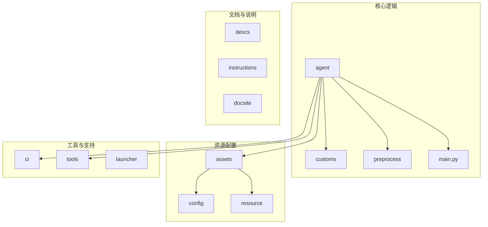
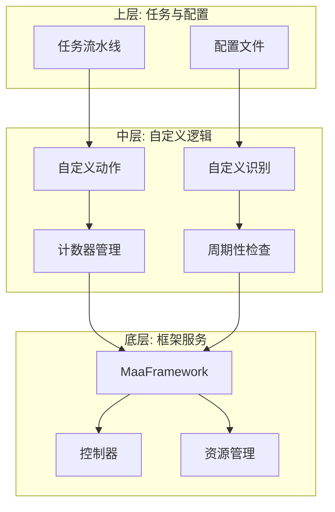
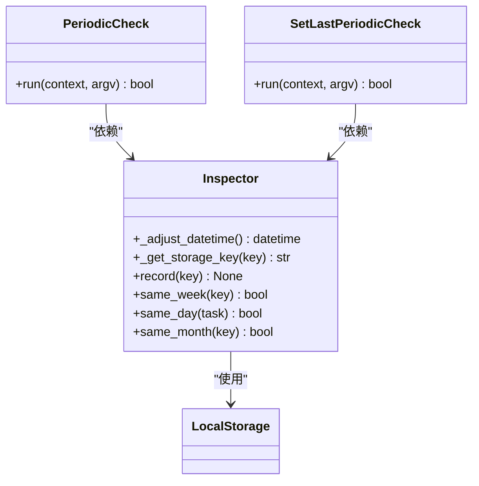
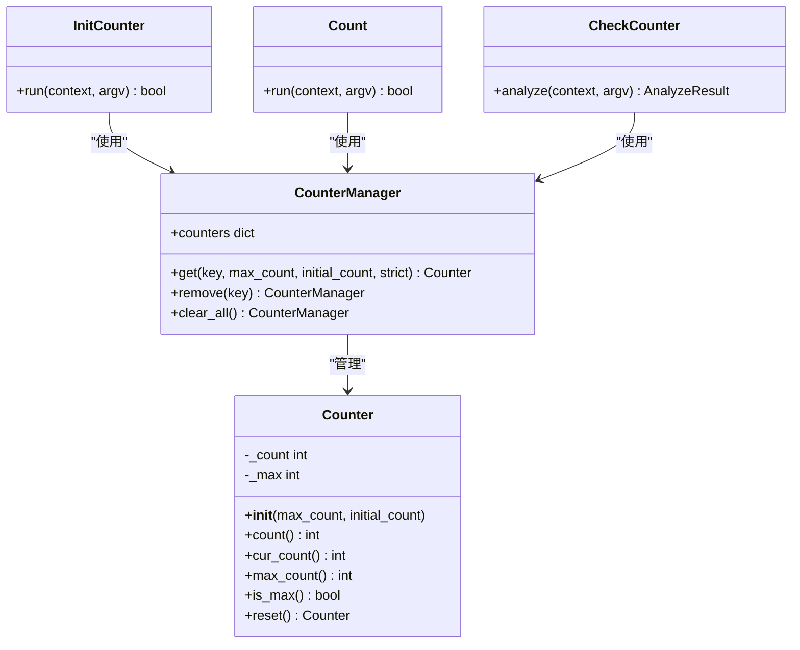
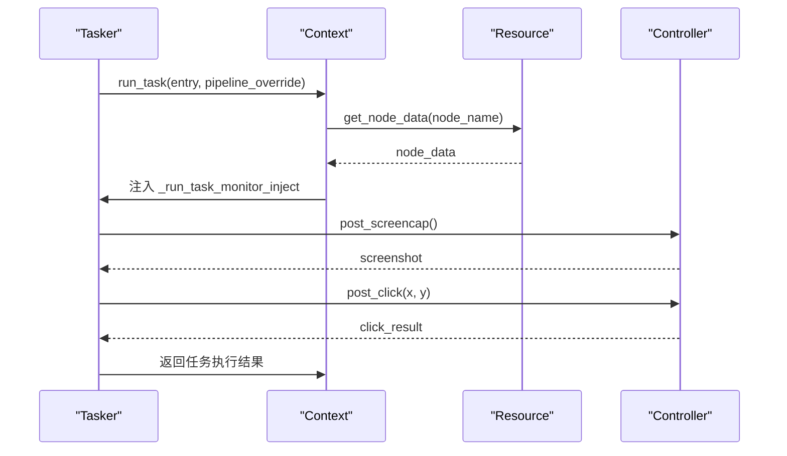
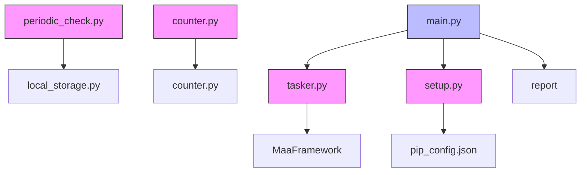

# 性能卡顿与执行效率优化

<cite>
**本文档引用文件**  
- [periodic_check.py](file://agent/customs/global_func/periodic_check.py)
- [counter.py](file://agent/customs/global_func/counter.py)
- [report.py](file://agent/devops/report.py)
- [maa_pi_config.json](file://assets/config/maa_pi_config.json)
- [main.py](file://agent/main.py)
- [tasker.py](file://agent/customs/maahelper/tasker.py)
- [default_pipeline.json](file://assets/resource/base/default_pipeline.json)
- [懒加载返回主界面.json](file://assets/resource/base/pipeline/通用/懒加载返回主界面.json)
- [setup.py](file://agent/preprocess/setup.py)
- [local_storage.py](file://agent/customs/utils/local_storage.py)
</cite>

## 目录
1. [引言](#引言)
2. [项目结构](#项目结构)
3. [核心组件](#核心组件)
4. [架构概述](#架构概述)
5. [详细组件分析](#详细组件分析)
6. [依赖分析](#依赖分析)
7. [性能考量](#性能考量)
8. [故障排除指南](#故障排除指南)
9. [结论](#结论)

## 引言
本文档全面解析自动化任务执行过程中出现的卡顿、延迟或超时问题，涵盖设备响应慢、截图频率过高、重试机制不合理、流水线阻塞等情况。通过分析 `periodic_check.py` 中的周期性检测机制，说明如何调整轮询间隔以平衡效率与资源消耗。利用 `counter.py` 统计执行耗时，结合 `report.py` 生成的运行报告分析瓶颈环节。指导用户通过 `maa_pi_config.json` 配置优化参数，如设置合理的 timeout、retry、screenshot_interval 等。提供性能调优最佳实践，例如启用懒加载、减少无效识别调用、合理安排任务顺序，以提升整体自动化流畅度。

## 项目结构
本项目采用模块化设计，主要分为 agent（代理）、assets（资源）、ci（持续集成）、descs（文档）、dev（开发）、docsite（文档站点）、instructions（使用说明）、launcher（启动器）和 tools（工具）等目录。其中，agent 目录包含核心逻辑实现，assets 目录存放配置和资源文件。

**Diagram sources**
- [main.py](file://agent/main.py#L1-L48)
- [maa_pi_config.json](file://assets/config/maa_pi_config.json#L1-L3)

**Section sources**
- [main.py](file://agent/main.py#L1-L48)
- [maa_pi_config.json](file://assets/config/maa_pi_config.json#L1-L3)

## 核心组件
系统核心组件包括周期性检查器（periodic_check）、计数器管理（counter）、运行报告（report）和任务执行器（tasker）。这些组件协同工作，确保自动化任务的高效执行和状态跟踪。

**Section sources**
- [periodic_check.py](file://agent/customs/global_func/periodic_check.py#L1-L286)
- [counter.py](file://agent/customs/global_func/counter.py#L1-L118)
- [report.py](file://agent/devops/report.py#L1-L34)
- [tasker.py](file://agent/customs/maahelper/tasker.py#L1-L177)

## 架构概述
系统采用分层架构，上层为任务流水线和配置管理，中层为自定义动作和识别逻辑，底层为 MaaFramework 提供的控制器和资源管理。通过 `tasker.py` 封装 MaaFramework 的 Context 对象，提供便捷的任务执行接口。

**Diagram sources**
- [tasker.py](file://agent/customs/maahelper/tasker.py#L1-L177)
- [periodic_check.py](file://agent/customs/global_func/periodic_check.py#L1-L286)

## 详细组件分析

### 周期性检查组件分析
`periodic_check.py` 模块提供了周期性任务检查功能，支持按天、周、月判断任务是否已完成。通过 `Inspector` 类实现日期调整（考虑凌晨4点刷新特性）、记录和比较任务完成状态。

**Diagram sources**
- [periodic_check.py](file://agent/customs/global_func/periodic_check.py#L29-L286)

**Section sources**
- [periodic_check.py](file://agent/customs/global_func/periodic_check.py#L1-L286)

### 计数器组件分析
`counter.py` 模块提供了计数器相关的自定义动作和识别类，包括初始化计数器、执行计数操作和检查计数器状态。通过 `CounterManager` 集中管理多个计数器实例。

**Diagram sources**
- [counter.py](file://agent/customs/global_func/counter.py#L1-L118)
- [utils/counter.py](file://agent/customs/utils/counter.py#L1-L141)

**Section sources**
- [counter.py](file://agent/customs/global_func/counter.py#L1-L118)
- [utils/counter.py](file://agent/customs/utils/counter.py#L1-L141)

### 任务执行器组件分析
`tasker.py` 模块封装了 MaaFramework 的任务执行相关操作，提供便捷的节点运行、截图、点击等接口。通过 `run` 方法自动为所有节点注入运行监测器，确保任务执行过程可被监控。

**Diagram sources**
- [tasker.py](file://agent/customs/maahelper/tasker.py#L1-L177)

**Section sources**
- [tasker.py](file://agent/customs/maahelper/tasker.py#L1-L177)

## 依赖分析
系统依赖关系清晰，核心模块通过明确的接口进行交互。`periodic_check` 和 `counter` 模块依赖 `utils` 中的 `LocalStorage` 和 `CounterManager` 进行状态持久化和计数管理。

**Diagram sources**
- [main.py](file://agent/main.py#L1-L48)
- [setup.py](file://agent/preprocess/setup.py#L1-L230)

**Section sources**
- [main.py](file://agent/main.py#L1-L48)
- [setup.py](file://agent/preprocess/setup.py#L1-L230)

## 性能考量
### 轮询间隔优化
在 `default_pipeline.json` 中，全局默认超时时间为 30000 毫秒（30秒），预延迟为 600 毫秒。对于高频识别场景，可通过 `rate_limit` 参数控制识别速率，默认为 1000 毫秒。建议根据实际需求调整此值，避免过高的截图频率导致设备负载过大。

### 懒加载策略
通过 `懒加载返回主界面.json` 中的配置，系统实现了懒加载返回主界面的功能。该策略通过直接命中识别（DirectHit）和 OCR 识别相结合的方式，快速判断当前界面状态，避免不必要的操作，显著提升返回主界面的效率。

### 资源消耗平衡
`periodic_check.py` 中的 `_adjust_datetime` 方法考虑了游戏凌晨4点刷新的特性，确保周期判断符合游戏逻辑，避免了因时间判断错误导致的重复执行。同时，通过本地存储持久化任务完成状态，减少了重复的网络请求和计算开销。

## 故障排除指南
### 卡顿与延迟处理
当出现设备响应慢或截图延迟时，首先检查 `maa_pi_config.json` 中的配置是否正确。确认设备连接稳定，控制器类型设置恰当。对于 ADB 控制器，建议使用 `EmulatorExtras` 或 `RawWithGzip` 等高效截图方式。

### 重试机制优化
在任务流水线配置中，合理设置 `timeout` 和 `retry` 参数。过短的超时时间可能导致任务频繁失败，而过长的超时时间会延长整体执行周期。建议根据任务复杂度和设备性能进行调优。

### 流水线阻塞解决
通过 `tasker.py` 中的 `run` 方法，系统自动为所有节点注入 `_run_task_monitor_inject` 监测器，确保任务执行过程可被监控。若出现流水线阻塞，可检查 `on_error` 处理逻辑是否完善，确保错误能够被正确捕获和处理。

**Section sources**
- [lazy_load.json](file://assets/resource/base/pipeline/通用/懒加载返回主界面.json#L1-L132)
- [default_pipeline.json](file://assets/resource/base/default_pipeline.json#L1-L7)

## 结论
通过对 `periodic_check.py`、`counter.py` 和 `tasker.py` 等核心组件的深入分析，我们全面理解了自动化任务执行过程中的性能瓶颈和优化策略。通过合理配置 `maa_pi_config.json` 中的参数，结合懒加载、计数器管理和周期性检查等机制，可以显著提升系统的执行效率和稳定性。建议用户根据实际使用场景，持续监控和调优系统性能，以达到最佳的自动化效果。