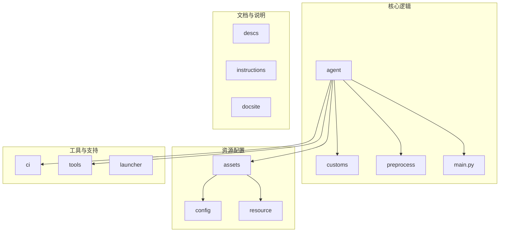
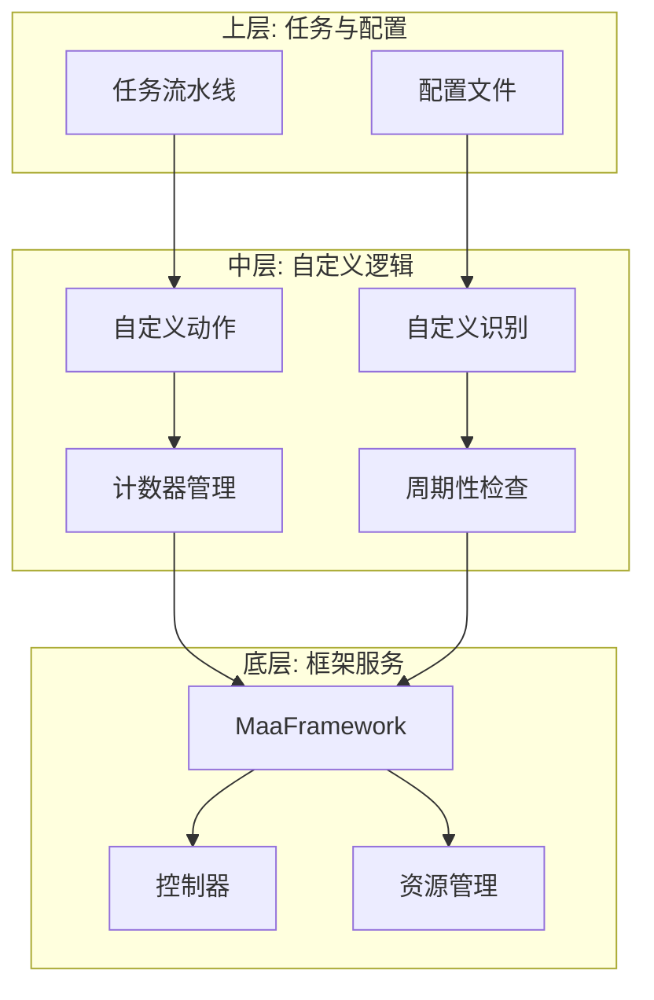
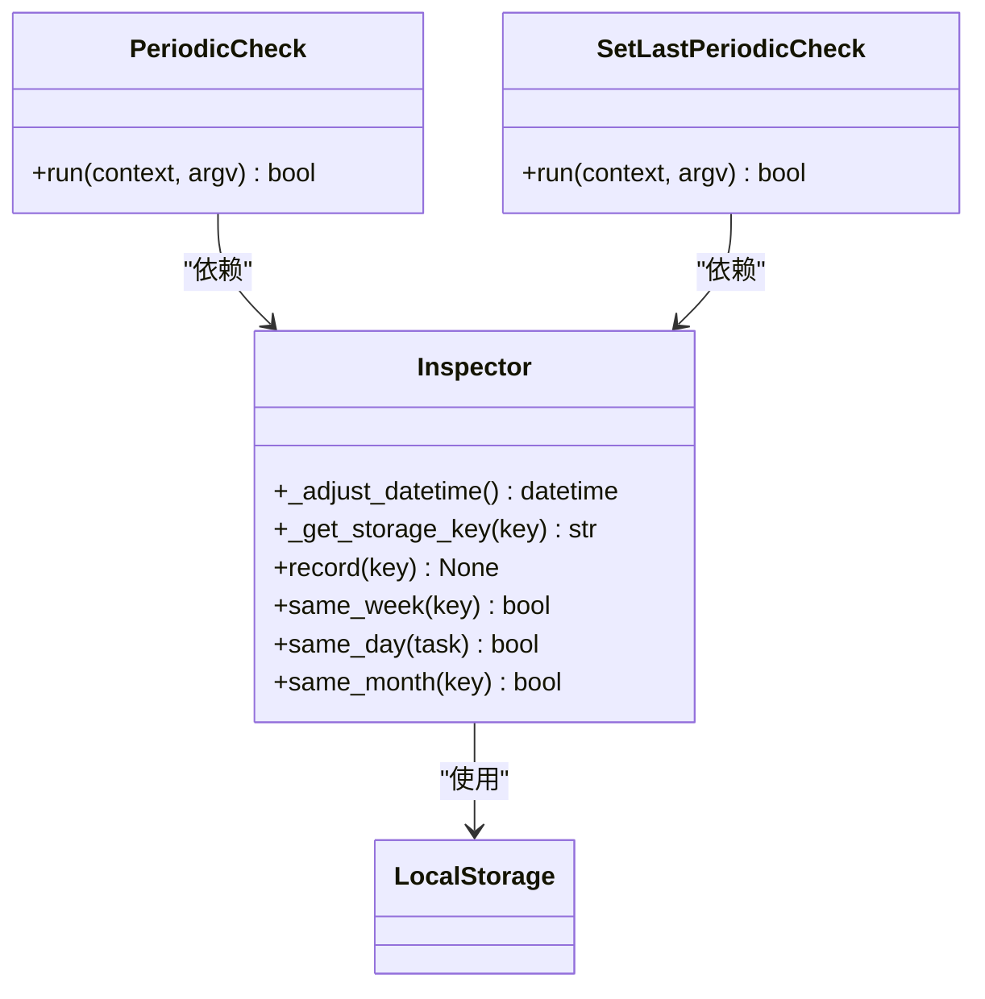
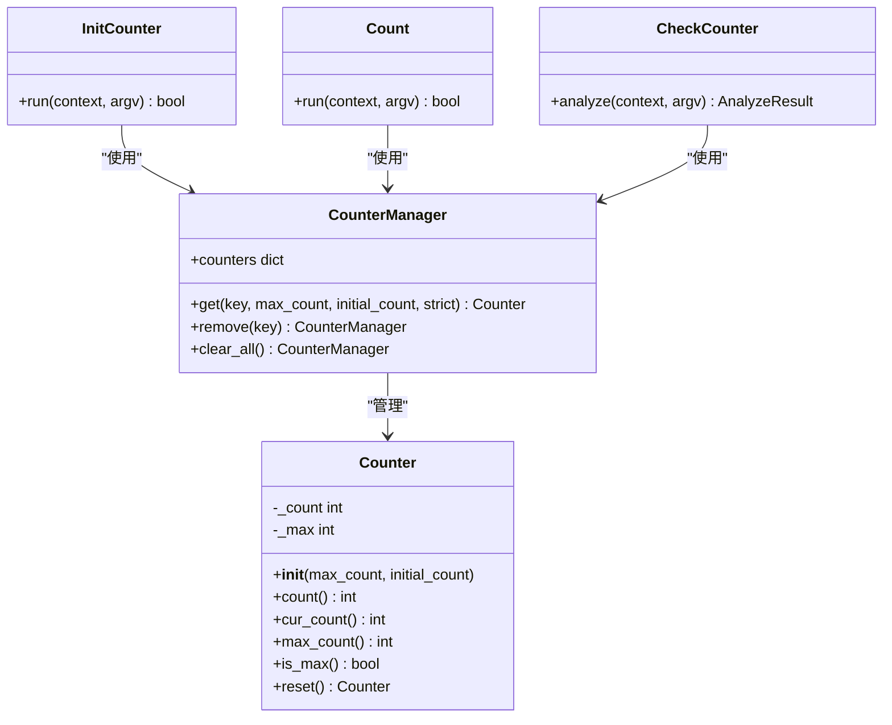
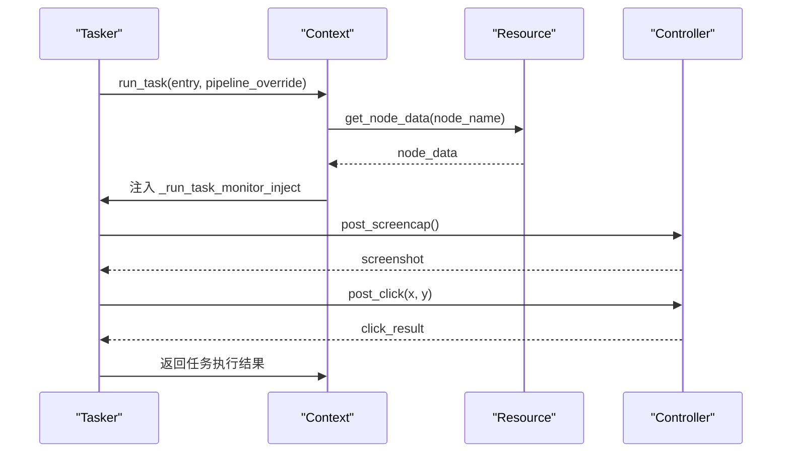
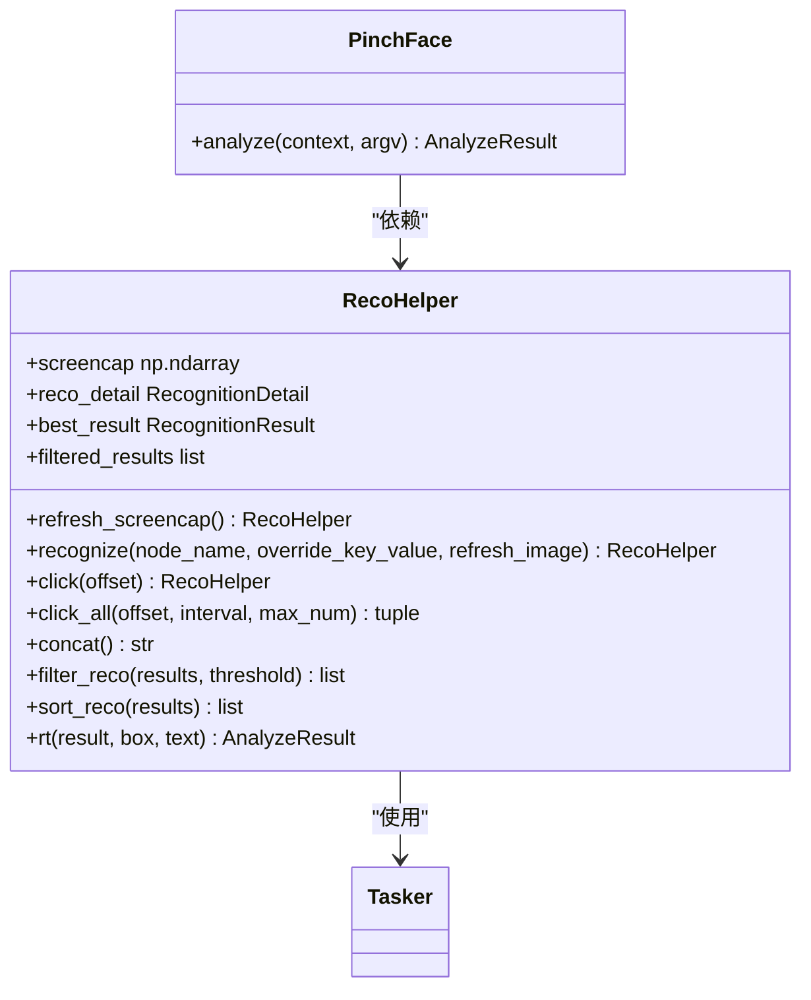
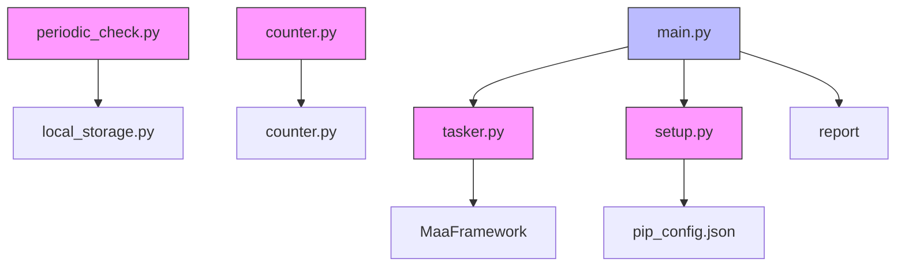
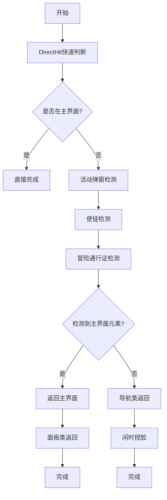

# 性能卡顿与执行效率优化

<cite>
**本文档引用文件**  
- [periodic_check.py](file://agent/customs/global_func/periodic_check.py)
- [counter.py](file://agent/customs/global_func/counter.py)
- [report.py](file://agent/devops/report.py)
- [maa_pi_config.json](file://assets/config/maa_pi_config.json)
- [main.py](file://agent/main.py)
- [tasker.py](file://agent/customs/maahelper/tasker.py)
- [default_pipeline.json](file://assets/resource/base/default_pipeline.json)
- [懒加载返回主界面.json](file://assets/resource/base/pipeline/通用/懒加载返回主界面.json)
- [setup.py](file://agent/preprocess/setup.py)
- [local_storage.py](file://agent/customs/utils/local_storage.py)
- [回到主界面.json](file://assets/resource/base/pipeline/通用/回到主界面.json)
- [reco_helper.py](file://agent/customs/maahelper/reco_helper.py)
- [pinch_face.py](file://agent/customs/special_treat/pinch_face.py)
- [README.md](file://assets/resource/base/model/ocr/README.md)
</cite>

## 更新摘要
**所做更改**  
- 新增面板识别速度优化章节，重点介绍模板匹配和神经网络识别的性能改进
- 更新识别算法优化部分，详细说明OCR模型升级和识别策略改进
- 增加截图缓存机制和识别结果复用策略的性能分析
- 补充懒加载返回主界面流程的效率优化说明
- 完善性能调优最佳实践，增加识别算法选择和资源配置建议

## 目录
1. [引言](#引言)
2. [项目结构](#项目结构)
3. [核心组件](#核心组件)
4. [架构概述](#架构概述)
5. [详细组件分析](#详细组件分析)
6. [依赖分析](#依赖分析)
7. [性能考量](#性能考量)
8. [故障排除指南](#故障排除指南)
9. [结论](#结论)

## 引言
本文档全面解析自动化任务执行过程中出现的卡顿、延迟或超时问题，涵盖设备响应慢、截图频率过高、重试机制不合理、流水线阻塞等情况。通过分析 `periodic_check.py` 中的周期性检测机制，说明如何调整轮询间隔以平衡效率与资源消耗。利用 `counter.py` 统计执行耗时，结合 `report.py` 生成的运行报告分析瓶颈环节。指导用户通过 `maa_pi_config.json` 配置优化参数，如设置合理的 timeout、retry、screenshot_interval 等。提供性能调优最佳实践，例如启用懒加载、减少无效识别调用、合理安排任务顺序，提升整体自动化流畅度。

**更新** 本次更新重点关注面板识别速度优化，包括改进的识别算法、减少不必要的截图操作，以及通过截图缓存和识别结果复用来提升整体执行效率。

## 项目结构
本项目采用模块化设计，主要分为 agent（代理）、assets（资源）、ci（持续集成）、descs（文档）、dev（开发）、docsite（文档站点）、instructions（使用说明）、launcher（启动器）和 tools（工具）等目录。其中，agent 目录包含核心逻辑实现，assets 目录存放配置和资源文件。

```mermaid
graph TD
subgraph "核心逻辑"
agent[agent]
agent --> customs[customs]
agent --> preprocess[preprocess]
agent --> main[main.py]
end
subgraph "资源配置"
assets[assets]
assets --> config[config]
assets --> resource[resource]
end
subgraph "文档与说明"
descs[descs]
instructions[instructions]
docsite[docsite]
end
subgraph "工具与支持"
ci[ci]
tools[tools]
launcher[launcher]
end
agent --> assets
agent --> ci
agent --> tools
```

**Diagram sources**
- [main.py:1-48](file://agent/main.py#L1-L48)
- [maa_pi_config.json:1-3](file://assets/config/maa_pi_config.json#L1-L3)

**Section sources**
- [main.py:1-48](file://agent/main.py#L1-L48)
- [maa_pi_config.json:1-3](file://assets/config/maa_pi_config.json#L1-L3)

## 核心组件
系统核心组件包括周期性检查器（periodic_check）、计数器管理（counter）、运行报告（report）和任务执行器（tasker）。这些组件协同工作，确保自动化任务的高效执行和状态跟踪。

**Section sources**
- [periodic_check.py:1-286](file://agent/customs/global_func/periodic_check.py#L1-L286)
- [counter.py:1-118](file://agent/customs/global_func/counter.py#L1-L118)
- [report.py:1-34](file://agent/devops/report.py#L1-L34)
- [tasker.py:1-177](file://agent/customs/maahelper/tasker.py#L1-L177)

## 架构概述
系统采用分层架构，上层为任务流水线和配置管理，中层为自定义动作和识别逻辑，底层为 MaaFramework 提供的控制器和资源管理。通过 `tasker.py` 封装 MaaFramework 的 Context 对象，提供便捷的任务执行接口。

```mermaid
graph TB
subgraph "上层: 任务与配置"
pipeline[任务流水线]
config[配置文件]
end
subgraph "中层: 自定义逻辑"
custom_action[自定义动作]
custom_recognition[自定义识别]
counter[计数器管理]
periodic_check[周期性检查]
end
subgraph "底层: 框架服务"
maa_framework[MaaFramework]
controller[控制器]
resource[资源管理]
end
pipeline --> custom_action
config --> custom_recognition
custom_action --> counter
custom_recognition --> periodic_check
counter --> maa_framework
periodic_check --> maa_framework
maa_framework --> controller
maa_framework --> resource
```

**Diagram sources**
- [tasker.py:1-177](file://agent/customs/maahelper/tasker.py#L1-L177)
- [periodic_check.py:1-286](file://agent/customs/global_func/periodic_check.py#L1-L286)

## 详细组件分析

### 周期性检查组件分析
`periodic_check.py` 模块提供了周期性任务检查功能，支持按天、周、月判断任务是否已完成。通过 `Inspector` 类实现日期调整（考虑凌晨4点刷新特性）、记录和比较任务完成状态。

```mermaid
classDiagram
class Inspector {
+_adjust_datetime() datetime
+_get_storage_key(key) str
+record(key) None
+same_week(key) bool
+same_day(task) bool
+same_month(key) bool
}
class PeriodicCheck {
+run(context, argv) bool
}
class SetLastPeriodicCheck {
+run(context, argv) bool
}
Inspector --> LocalStorage : "使用"
PeriodicCheck --> Inspector : "依赖"
SetLastPeriodicCheck --> Inspector : "依赖"
```

**Diagram sources**
- [periodic_check.py:29-286](file://agent/customs/global_func/periodic_check.py#L29-L286)

**Section sources**
- [periodic_check.py:1-286](file://agent/customs/global_func/periodic_check.py#L1-L286)

### 计数器组件分析
`counter.py` 模块提供了计数器相关的自定义动作和识别类，包括初始化计数器、执行计数操作和检查计数器状态。通过 `CounterManager` 集中管理多个计数器实例。

```mermaid
classDiagram
class Counter {
-_count int
-_max int
+__init__(max_count, initial_count)
+count() int
+cur_count() int
+max_count() int
+is_max() bool
+reset() Counter
}
class CounterManager {
+counters dict
+get(key, max_count, initial_count, strict) Counter
+remove(key) CounterManager
+clear_all() CounterManager
}
class InitCounter {
+run(context, argv) bool
}
class Count {
+run(context, argv) bool
}
class CheckCounter {
+analyze(context, argv) AnalyzeResult
}
CounterManager --> Counter : "管理"
InitCounter --> CounterManager : "使用"
Count --> CounterManager : "使用"
CheckCounter --> CounterManager : "使用"
```

**Diagram sources**
- [counter.py:1-118](file://agent/customs/global_func/counter.py#L1-L118)
- [utils/counter.py:1-141](file://agent/customs/utils/counter.py#L1-L141)

**Section sources**
- [counter.py:1-118](file://agent/customs/global_func/counter.py#L1-L118)
- [utils/counter.py:1-141](file://agent/customs/utils/counter.py#L1-L141)

### 任务执行器组件分析
`tasker.py` 模块封装了 MaaFramework 的任务执行相关操作，提供便捷的节点运行、截图、点击等接口。通过 `run` 方法自动为所有节点注入运行监测器，确保任务执行过程可被监控。

```mermaid
sequenceDiagram
participant Tasker as "Tasker"
participant Context as "Context"
participant Resource as "Resource"
participant Controller as "Controller"
Tasker->>Context : run_task(entry, pipeline_override)
Context->>Resource : get_node_data(node_name)
Resource-->>Context : node_data
Context->>Tasker : 注入 _run_task_monitor_inject
Tasker->>Controller : post_screencap()
Controller-->>Tasker : screenshot
Tasker->>Controller : post_click(x, y)
Controller-->>Tasker : click_result
Tasker->>Context : 返回任务执行结果
```

**Diagram sources**
- [tasker.py:1-177](file://agent/customs/maahelper/tasker.py#L1-L177)

**Section sources**
- [tasker.py:1-177](file://agent/customs/maahelper/tasker.py#L1-L177)

### 识别辅助组件分析
`reco_helper.py` 模块提供了识别辅助功能，包括截图缓存、识别结果处理、点击操作等。通过智能截图缓存机制，避免重复截图操作，显著提升识别效率。

```mermaid
classDiagram
class RecoHelper {
+screencap np.ndarray
+reco_detail RecognitionDetail
+best_result RecognitionResult
+filtered_results list
+refresh_screencap() RecoHelper
+recognize(node_name, override_key_value, refresh_image) RecoHelper
+click(offset) RecoHelper
+click_all(offset, interval, max_num) tuple
+concat() str
+filter_reco(results, threshold) list
+sort_reco(results) list
+rt(result, box, text) AnalyzeResult
}
class PinchFace {
+analyze(context, argv) AnalyzeResult
}
RecoHelper --> Tasker : "使用"
PinchFace --> RecoHelper : "依赖"
```

**Diagram sources**
- [reco_helper.py:1-256](file://agent/customs/maahelper/reco_helper.py#L1-L256)
- [pinch_face.py:38-61](file://agent/customs/special_treat/pinch_face.py#L38-L61)

**Section sources**
- [reco_helper.py:1-256](file://agent/customs/maahelper/reco_helper.py#L1-L256)
- [pinch_face.py:38-61](file://agent/customs/special_treat/pinch_face.py#L38-L61)

## 依赖分析
系统依赖关系清晰，核心模块通过明确的接口进行交互。`periodic_check` 和 `counter` 模块依赖 `utils` 中的 `LocalStorage` 和 `CounterManager` 进行状态持久化和计数管理。

```mermaid
graph TD
periodic_check[periodic_check.py] --> local_storage[local_storage.py]
counter[counter.py] --> counter_utils[counter.py]
tasker[tasker.py] --> maa_framework[MaaFramework]
setup[setup.py] --> pip_config[pip_config.json]
main[main.py] --> tasker
main --> report
main --> setup
style periodic_check fill:#f9f,stroke:#333
style counter fill:#f9f,stroke:#333
style tasker fill:#f9f,stroke:#333
style setup fill:#f9f,stroke:#333
style main fill:#bbf,stroke:#333
```

**Diagram sources**
- [main.py:1-48](file://agent/main.py#L1-L48)
- [setup.py:1-230](file://agent/preprocess/setup.py#L1-L230)

**Section sources**
- [main.py:1-48](file://agent/main.py#L1-L48)
- [setup.py:1-230](file://agent/preprocess/setup.py#L1-L230)

## 性能考量

### 面板识别速度优化
系统通过多种策略优化面板识别速度，主要包括：

**模板匹配优化**
- 使用多模板匹配策略，支持同时匹配多个关闭按钮模板
- 通过阈值优化减少误识别率，提高识别准确性
- 智能模板选择机制，根据界面特征动态选择最优模板

**神经网络识别优化**
- 采用轻量级ONNX模型进行面部识别，提升识别速度
- 支持随机排序和阈值过滤，平衡准确性和性能
- 识别结果缓存机制，避免重复计算

**截图缓存策略**
- `RecoHelper` 实现智能截图缓存，避免重复截图操作
- 支持截图刷新和缓存复用，减少资源消耗
- 识别结果复用机制，同一截图多次识别时共享结果

### 识别算法改进
**OCR模型升级**
- 采用PP-OCRv5移动端模型，提升识别速度和准确性
- 支持多语言识别，包括简体中文、繁体中文、英文、日文
- 优化推理速度和模型鲁棒性，适应不同场景需求

**识别策略优化**
- 懒加载返回主界面流程，通过DirectHit快速判断界面状态
- 活动弹窗检测采用ROI区域限定，减少识别范围
- 面部识别使用神经网络检测，支持左右面部识别

### 截图频率控制
**智能截图策略**
- 识别辅助器支持截图缓存，避免重复截图
- 智能判断是否需要刷新截图，减少不必要的图像传输
- 批量识别时复用同一张截图，提升整体效率

**延迟优化**
- 懒加载流程中取消预延迟和后延迟，减少等待时间
- 识别节点间合理安排延迟，避免过度等待
- 模板匹配时使用阈值优化，减少失败重试

### 懒加载策略
通过 `懒加载返回主界面.json` 中的配置，系统实现了高效的懒加载返回主界面功能。该策略通过DirectHit快速判断界面状态，避免不必要的操作，显著提升返回主界面的效率。

```mermaid
flowchart TD
A[开始] --> B[DirectHit快速判断]
B --> C{是否在主界面?}
C --> |是| D[直接完成]
C --> |否| E[活动弹窗检测]
E --> F[使徒检测]
F --> G[冒险通行证检测]
G --> H{检测到主界面元素?}
H --> |是| I[返回主界面]
H --> |否| J[导航类返回]
I --> K[面板类返回]
J --> L[闲时捏脸]
K --> M[完成]
L --> N[完成]
```

**Diagram sources**
- [懒加载返回主界面.json:14-122](file://assets/resource/base/pipeline/通用/懒加载返回主界面.json#L14-L122)

### 资源消耗平衡
`periodic_check.py` 中的 `_adjust_datetime` 方法考虑了游戏凌晨4点刷新的特性，确保周期判断符合游戏逻辑，避免了因时间判断错误导致的重复执行。同时，通过本地存储持久化任务完成状态，减少了重复的网络请求和计算开销。

**Section sources**
- [回到主界面.json:176-201](file://assets/resource/base/pipeline/通用/回到主界面.json#L176-L201)
- [懒加载返回主界面.json:14-122](file://assets/resource/base/pipeline/通用/懒加载返回主界面.json#L14-L122)
- [reco_helper.py:62-94](file://agent/customs/maahelper/reco_helper.py#L62-L94)
- [README.md:1-24](file://assets/resource/base/model/ocr/README.md#L1-L24)

## 故障排除指南

### 卡顿与延迟处理
当出现设备响应慢或截图延迟时，首先检查 `maa_pi_config.json` 中的配置是否正确。确认设备连接稳定，控制器类型设置恰当。对于 ADB 控制器，建议使用 `EmulatorExtras` 或 `RawWithGzip` 等高效截图方式。

**面板识别优化**
- 检查模板匹配阈值设置，避免过高的阈值导致识别失败
- 确认OCR识别ROI区域设置合理，避免过大或过小的识别范围
- 验证神经网络模型文件完整性，确保识别算法正常运行

### 重试机制优化
在任务流水线配置中，合理设置 `timeout` 和 `retry` 参数。过短的超时时间可能导致任务频繁失败，而过长的超时时间会延长整体执行周期。建议根据任务复杂度和设备性能进行调优。

**识别重试策略**
- 模板匹配失败时自动尝试其他模板
- OCR识别失败时检查ROI区域和阈值设置
- 神经网络识别失败时调整阈值和模型参数

### 流水线阻塞解决
通过 `tasker.py` 中的 `run` 方法，系统自动为所有节点注入 `_run_task_monitor_inject` 监测器，确保任务执行过程可被监控。若出现流水线阻塞，可检查 `on_error` 处理逻辑是否完善，确保错误能够被正确捕获和处理。

**懒加载流程优化**
- 确认DirectHit节点配置正确，避免误判界面状态
- 检查OCR识别节点的expected参数设置
- 验证模板匹配节点的threshold和template配置

**Section sources**
- [lazy_load.json:1-132](file://assets/resource/base/pipeline/通用/懒加载返回主界面.json#L1-L132)
- [default_pipeline.json:1-7](file://assets/resource/base/default_pipeline.json#L1-L7)
- [回到主界面.json:1-203](file://assets/resource/base/pipeline/通用/回到主界面.json#L1-L203)

## 结论
通过对 `periodic_check.py`、`counter.py`、`tasker.py` 和 `reco_helper.py` 等核心组件的深入分析，我们全面理解了自动化任务执行过程中的性能瓶颈和优化策略。本次更新重点介绍了面板识别速度优化，包括改进的识别算法、减少不必要的截图操作，以及通过截图缓存和识别结果复用来提升整体执行效率。

通过合理配置 `maa_pi_config.json` 中的参数，结合懒加载、计数器管理、周期性检查和智能识别缓存等机制，可以显著提升系统的执行效率和稳定性。建议用户根据实际使用场景，持续监控和调优系统性能，特别关注识别算法选择、模板匹配优化和截图缓存策略，以达到最佳的自动化效果。

**更新要点总结**：
- 面板识别采用多模板匹配和神经网络识别双重策略
- 智能截图缓存机制减少重复截图操作
- 懒加载流程优化提升界面切换效率
- OCR模型升级带来更好的识别性能
- 识别结果复用策略降低计算开销