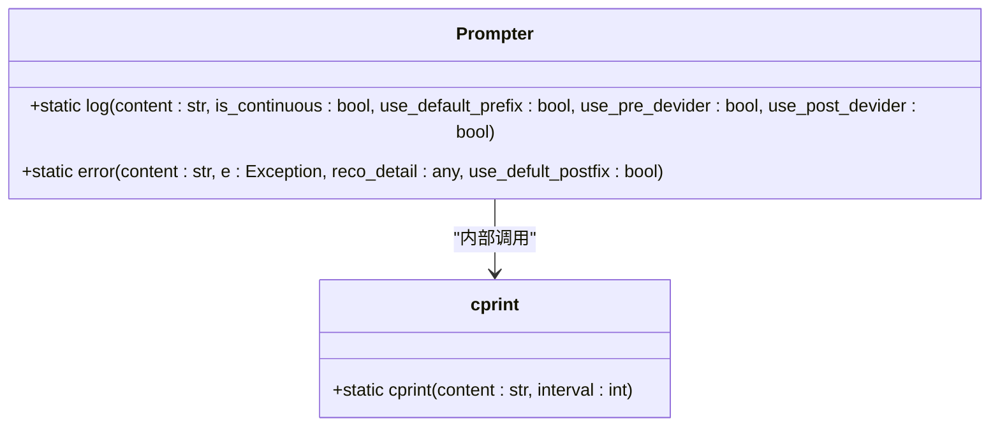
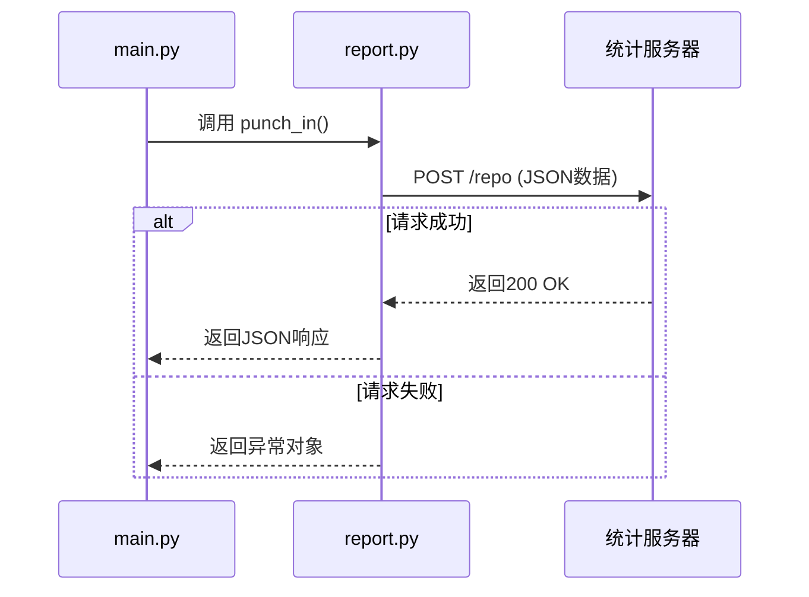
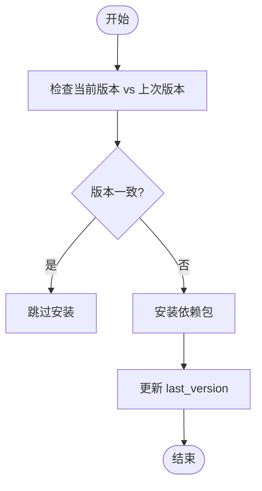

# 故障排除与优化

<cite>
**本文档引用的文件**  
- [prompter.py](file://agent/customs/utils/prompter.py)
- [report.py](file://agent/devops/report.py)
- [main.py](file://agent/main.py)
- [setup.py](file://agent/preprocess/setup.py)
- [clear.py](file://agent/preprocess/clear.py)
- [reco_helper.py](file://agent/customs/maahelper/reco_helper.py)
- [interface.json](file://assets/interface.json)
- [maa_option.json](file://ci/config/maa_option.json)
- [2.2-集成接口一览.md](file://instructions/maafw-guide/2.2-集成接口一览.md)
- [2.4-控制方式说明.md](file://instructions/maafw-guide/2.4-控制方式说明.md)
- [1.1-快速开始.md](file://instructions/maafw-guide/1.1-快速开始.md)
</cite>

## 目录
1. [简介](#简介)
2. [常见问题分类与排查](#常见问题分类与排查)
3. [日志与提示机制](#日志与提示机制)
4. [性能调优建议](#性能调优建议)
5. [高级调试技巧](#高级调试技巧)
6. [问题索引表](#问题索引表)
7. [结论](#结论)

## 简介

本指南旨在为 MaaDuDuL 用户提供全面的故障排除与性能优化方案。MaaDuDuL 是一个基于 MaaFramework 的自动化助手，通过图像识别与模拟控制技术，帮助用户自动完成《嘟嘟脸恶作剧》游戏中的日常任务。系统可能遇到设备连接、图像识别、任务执行等方面的问题，本指南将系统性地分析这些问题的根源并提供解决方案。

**本文档引用的文件**  
- [main.py](file://agent/main.py#L1-L48)
- [README.md](file://README.md#L1-L118)

## 常见问题分类与排查

### 设备连接失败（ADB异常）

当程序无法连接到模拟器或设备时，通常表现为启动失败或截图超时。根据 `interface.json` 文件中的配置，系统支持 ADB 和 PlayCover 两种控制器类型。

**排查步骤：**
1. **检查设备连接状态**：确保模拟器已正确启动并能正常显示游戏界面。
2. **验证ADB服务**：在命令行执行 `adb devices`，确认设备列表中显示了您的模拟器。
3. **检查端口占用**：ADB默认使用5555端口，若被其他程序占用会导致连接失败。
4. **重启ADB服务**：执行 `adb kill-server` 和 `adb start-server` 重启服务。
5. **检查控制器配置**：确认 `interface.json` 中的 ADB 配置（如 `display_short_side`）与实际设备分辨率匹配。

根据 `2.4-控制方式说明.md` 文档，Adb 控制器的输入方式有多种（AdbShell, MinitouchAndAdbKey, Maatouch），系统会按优先级自动选择。若连接不稳定，可尝试在配置中指定更稳定的输入方式。

**问题根源分析：**
- 网络或USB连接不稳定
- ADB驱动未正确安装
- 模拟器ADB服务未开启
- 防火墙或安全软件阻止了连接

**Section sources**
- [interface.json](file://assets/interface.json#L14-L28)
- [2.4-控制方式说明.md](file://instructions/maafw-guide/2.4-控制方式说明.md#L10-L27)

### 图像识别不准（OCR误识别）

OCR识别不准确是影响任务成功率的主要因素。系统使用 `ppocr_v5` 等模型进行文字识别，但可能因图像模糊、光照变化或字体样式导致误识别。

**排查步骤：**
1. **启用图像保存**：在 `maa_option.json` 中设置 `"save_draw": true`，保存识别过程的可视化结果。
2. **检查截图质量**：查看 `debug` 目录下的截图，确认图像是否清晰、无模糊或失真。
3. **调整识别区域**：通过修改 pipeline 配置，缩小或精确化识别区域，减少干扰。
4. **验证OCR模型**：确认 `assets/MaaCommonAssets/OCR/ppocr_v5/zh_cn` 目录下的模型文件完整。

在 `reco_helper.py` 中，`recognize` 方法负责执行识别操作。若 `hit` 属性为 `False`，表示未识别到有效结果，可能需要调整识别参数或重试。

**问题根源分析：**
- 游戏界面UI变化导致模板不匹配
- 屏幕分辨率或缩放比例不一致
- OCR模型对特定字体识别能力不足
- 截图时设备性能卡顿导致画面撕裂

**Section sources**
- [reco_helper.py](file://agent/customs/maahelper/reco_helper.py#L62-L203)
- [2.2-集成接口一览.md](file://instructions/maafw-guide/2.2-集成接口一览.md#L415-L418)

### 任务执行卡顿

任务执行过程中出现卡顿，表现为操作延迟、响应缓慢或长时间停留在某个步骤。

**排查步骤：**
1. **检查系统资源**：确认CPU、内存使用率，避免因资源不足导致卡顿。
2. **调整截图间隔**：在 pipeline 配置中增加 `pre_delay` 时间，避免过于频繁的截图请求。
3. **优化重试机制**：合理设置任务的 `timeout` 和重试次数，避免无限循环。
4. **清理临时文件**：`clear.py` 模块会在启动时清理 `debug/on_error` 目录，避免历史文件占用磁盘空间。

`main.py` 中的 `main` 函数在启动时会调用 `clear()` 清理调试文件，若清理失败会输出提示信息但不会中断程序。

**问题根源分析：**
- 设备性能不足，无法及时处理图像
- 网络延迟导致控制指令响应慢
- 脚本逻辑存在死循环或过度重试
- 外部程序占用大量系统资源

**Section sources**
- [main.py](file://agent/main.py#L27-L37)
- [clear.py](file://agent/preprocess/clear.py#L1-L41)

## 日志与提示机制

### prompter.py 用户提示信息生成

`prompter.py` 模块负责生成用户可见的提示信息。它通过 `Prompter` 类的静态方法 `log` 和 `error` 来输出不同级别的信息。

- `log` 方法用于输出普通日志，支持前缀、分隔线等格式化选项。
- `error` 方法用于输出错误信息，会自动添加“失败，请立即停止运行程序！”后缀，并打印异常详情。

该模块还包含 `cprint` 函数，通过添加时间延迟来控制信息输出节奏，避免日志刷屏。



**Diagram sources**  
- [prompter.py](file://agent/customs/utils/prompter.py#L16-L55)

### report.py 运行日志收集

`report.py` 模块负责向远程服务器发送使用统计信息。`punch_in` 函数在程序启动时被调用，发送项目来源和版本号。

该功能主要用于统计项目使用情况，不影响核心功能。请求超时设置为3秒，失败时会捕获异常并返回，不会中断主程序执行。



**Diagram sources**  
- [report.py](file://agent/devops/report.py#L9-L34)
- [main.py](file://agent/main.py#L33-L34)

## 性能调优建议

### 调整截图间隔

频繁的截图操作会消耗大量系统资源。建议根据设备性能调整 `pre_delay` 参数：

- 高性能设备：可设置为300-500ms
- 普通设备：建议600-800ms
- 低性能设备：需设置为1000ms以上

可在 `default_pipeline.json` 中全局设置，或在具体任务节点中单独配置。

### 优化识别区域

精确的识别区域能显著提高OCR准确率并降低处理时间。建议：

1. 使用调试模式获取实际截图
2. 分析目标元素的坐标范围
3. 在 pipeline 配置中设置 `roi`（Region of Interest）参数

避免使用过大的识别区域，这会增加计算负担并可能引入干扰。

### 合理设置重试次数

过度的重试会导致任务时间延长。建议：

- 关键操作：最多重试3次
- 非关键操作：最多重试2次
- 设置合理的 `timeout`（如30秒）

在 `interface.json` 中，任务的默认超时时间为30000毫秒。

### 依赖环境优化

`setup.py` 模块负责自动安装依赖。为避免每次启动都检查依赖，确保 `pip_config.json` 中的 `last_version` 与当前版本一致。



**Diagram sources**  
- [setup.py](file://agent/preprocess/setup.py#L204-L230)

## 高级调试技巧

### 启用详细日志模式

通过修改 `maa_option.json` 文件，可以启用详细的日志记录：

```json
{
    "logging": true,
    "save_draw": true,
    "save_on_error": true,
    "stdout_level": 7,
    "draw_quality": 95
}
```

- `stdout_level: 7` 启用所有级别的日志输出
- `save_draw: true` 保存所有识别过程的可视化图像
- `save_on_error: true` 在任务失败时保存当前截图

这些日志文件将生成在 `debug` 目录下，便于事后分析。

**Section sources**
- [maa_option.json](file://ci/config/maa_option.json#L1-L6)
- [1.1-快速开始.md](file://instructions/maafw-guide/1.1-快速开始.md#L193-L200)

### 使用图像调试工具验证识别结果

利用 `save_draw` 功能生成的可视化图像，可以直观地看到OCR识别的边界框和置信度。

1. 在 `debug` 目录查找以 `reco_` 开头的图片
2. 检查目标文字是否被正确框选
3. 若框选不准确，需调整识别区域或优化OCR模型

结合 `reco_helper.py` 中的 `concat` 方法，可以验证多个识别结果的拼接逻辑是否正确。

## 问题索引表

| 症状 | 可能原因 | 解决方法 |
|------|----------|----------|
| 设备连接失败 | ADB服务未启动 | 重启ADB服务，检查设备列表 |
| OCR识别错误 | 识别区域过大 | 缩小ROI，精确匹配目标区域 |
| 任务执行卡顿 | 截图间隔过短 | 增加 `pre_delay` 时间 |
| 依赖安装失败 | 网络问题或镜像源不可用 | 检查 `pip_config.json` 中的镜像源列表 |
| 错误信息不明确 | 日志级别过低 | 启用详细日志模式（`stdout_level: 7`） |
| 任务无限重试 | 超时设置过长 | 调整 `timeout` 参数至合理值 |
| 图像保存失败 | 磁盘空间不足 | 清理 `debug` 目录历史文件 |
| 版本检查频繁 | `last_version` 未更新 | 确保 `punch_in` 成功后更新版本记录 |

## 结论

本指南系统地分析了 MaaDuDuL 系统中常见的故障类型，并提供了详细的排查步骤与优化建议。通过理解 `prompter.py` 的提示机制和 `report.py` 的日志收集方式，用户可以更有效地监控程序运行状态。性能调优的关键在于平衡识别精度与系统负载，合理配置截图间隔、识别区域和重试策略。高级调试技巧如启用详细日志和使用图像验证工具，能帮助用户深入定位问题根源。建议用户在遇到问题时，首先查阅问题索引表进行快速定位，然后结合日志文件进行深入分析。