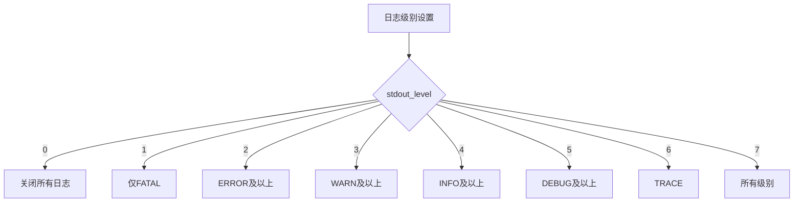
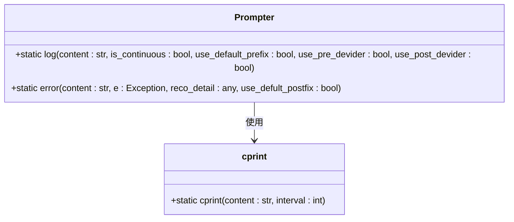
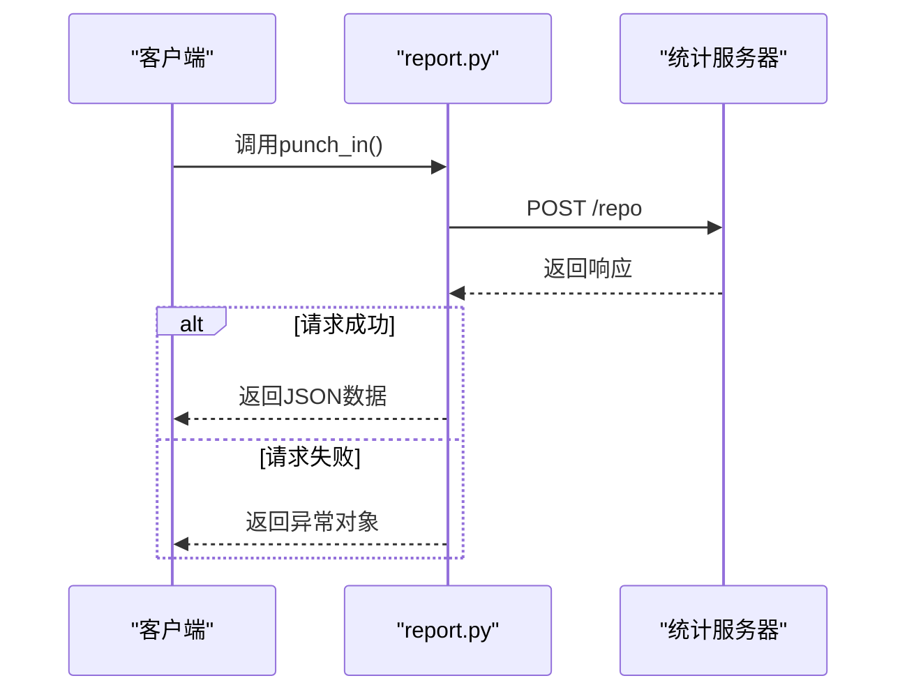
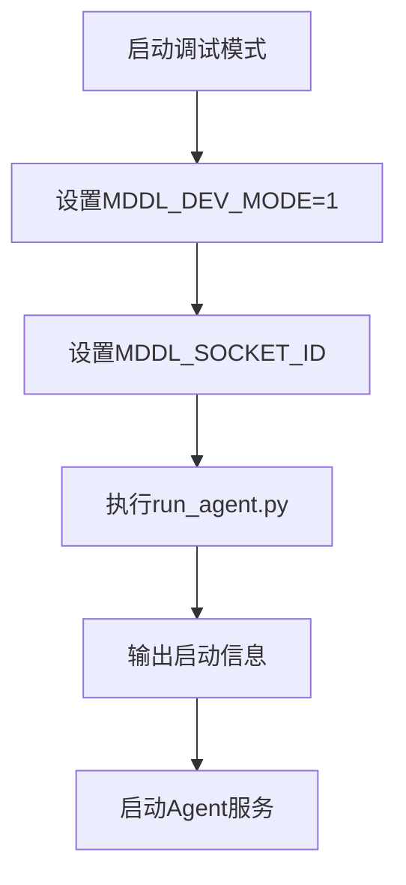
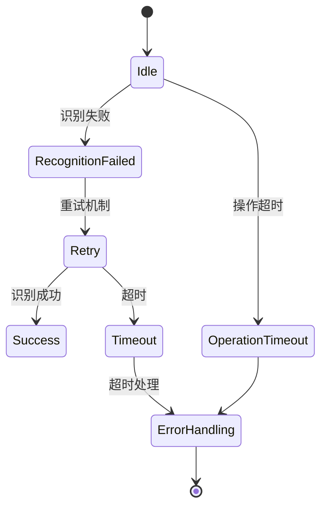
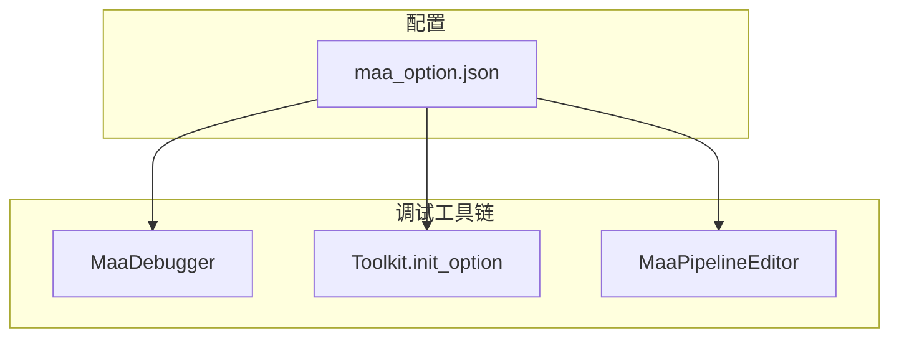

# 日志分析与调试技巧

<cite>
**本文档引用的文件**  
- [prompter.py](file://agent/customs/utils/prompter.py)
- [report.py](file://agent/devops/report.py)
- [run_agent.py](file://dev/run_agent.py)
- [main.py](file://agent/main.py)
- [maa_option.json](file://ci/config/maa_option.json)
- [check_resource.py](file://check_resource.py)
- [hooks.json](file://assets/resource/base/pipeline/其他/hooks.json)
- [process_guard.py](file://agent/customs/global_func/process_guard.py)
</cite>

## 目录
1. [日志系统概述](#日志系统概述)
2. [日志级别与输出配置](#日志级别与输出配置)
3. [日志输出路径与格式](#日志输出路径与格式)
4. [prompter.py：用户提示信息生成机制](#prompterpy用户提示信息生成机制)
5. [report.py：结构化运行报告联动](#reportpy结构化运行报告联动)
6. [启用详细日志模式](#启用详细日志模式)
7. [日志中常见模式解读](#日志中常见模式解读)
8. [高级调试手段](#高级调试手段)
9. [总结](#总结)

## 日志系统概述

本系统基于 MaaFramework 构建，采用分层日志机制实现运行状态追踪与问题诊断。日志系统由框架底层日志、应用层日志提示和结构化运行报告三部分组成，通过统一的配置文件进行管理，支持灵活的调试模式切换。

**Section sources**
- [main.py](file://agent/main.py#L1-L48)
- [run_agent.py](file://dev/run_agent.py#L1-L51)

## 日志级别与输出配置

系统日志级别由 `maa_option.json` 配置文件中的 `stdout_level` 字段控制，该字段定义了控制台输出的日志详细程度。日志级别遵循 MaaFramework 的标准枚举：

- `0`: 关闭所有控制台日志输出
- `1`: 仅输出 FATAL 级别日志
- `2`: 输出 ERROR 及以上级别日志（默认值）
- `3`: 输出 WARN 及以上级别日志
- `4`: 输出 INFO 及以上级别日志
- `5`: 输出 DEBUG 及以上级别日志
- `6`: 输出 TRACE 级别日志
- `7`: 输出所有级别日志（最详细）

通过将 `stdout_level` 设置为 7 可启用详细日志模式，捕获完整的执行轨迹。

**Diagram sources**
- [maa_option.json](file://ci/config/maa_option.json#L1-L6)
- [check_resource.py](file://check_resource.py#L31)

## 日志输出路径与格式

日志输出分为文件输出和控制台输出两种方式：

1. **文件输出**：当 `logging` 配置项为 `true` 时，系统会将完整日志记录到 `debug/maa.log` 文件中。该文件包含所有级别的日志信息，是问题追溯的主要依据。

2. **控制台输出**：根据 `stdout_level` 设置决定控制台显示的日志级别，格式为 `info:日志内容` 或 `error:错误内容`。

关键配置项说明：
- `logging`: 是否保存日志到文件（默认 true）
- `save_draw`: 是否保存图像识别可视化结果（默认 false）
- `save_on_error`: 任务失败时是否保存当前截图（默认 true）
- `draw_quality`: 图像识别可视化结果的 JPEG 质量（0-100，默认 85）

**Section sources**
- [maa_option.json](file://ci/config/maa_option.json#L1-L6)
- [instructions/maafw-guide/1.1-快速开始.md](file://instructions/maafw-guide/1.1-快速开始.md#L184-L201)

## prompter.py：用户提示信息生成机制

`prompter.py` 模块负责生成用户友好的提示信息，通过标准化的接口提供不同级别的日志输出功能。

核心功能包括：
- `Prompter.log()`: 输出普通日志信息，可选择是否添加前缀、分隔线等格式化元素
- `Prompter.error()`: 输出错误信息，自动附加"失败，请立即停止运行程序！"后缀，并打印异常详情
- `cprint()`: 带间隔延迟的打印函数，用于改善输出可读性

该模块通过统一的前缀"info:"标识日志条目，确保日志格式一致性，并通过分隔线增强信息区块的可读性。

**Diagram sources**
- [prompter.py](file://agent/customs/utils/prompter.py#L9-L55)

**Section sources**
- [prompter.py](file://agent/customs/utils/prompter.py#L9-L55)

## report.py：结构化运行报告联动

`report.py` 模块实现数据上报功能，与日志系统形成联动机制。该模块通过 `punch_in()` 函数向远程统计服务器发送使用统计信息，包括来源标识和版本号。

虽然该模块主要功能是数据上报，但其异常处理机制与日志系统紧密集成。当请求失败时，异常信息会被捕获并可通过日志系统进行记录，为网络连接问题的诊断提供依据。

**Diagram sources**
- [report.py](file://agent/devops/report.py#L9-L34)

**Section sources**
- [report.py](file://agent/devops/report.py#L9-L34)
- [main.py](file://agent/main.py#L23-L34)

## 启用详细日志模式

开发者可通过 `run_agent.py` 脚本启用详细日志模式，捕获完整的执行轨迹。

操作步骤：
1. 设置环境变量 `MDDL_DEV_MODE=1` 启用开发模式
2. 可选设置 `MDDL_SOCKET_ID` 指定模拟的 socket ID
3. 执行 `python dev/run_agent.py` 启动调试模式

开发模式下，系统会自动配置环境并启动 Agent 服务，同时输出详细的启动信息，包括工作目录、Socket ID 和环境变量状态。

**Section sources**
- [run_agent.py](file://dev/run_agent.py#L21-L50)

## 日志中常见模式解读

### 识别失败重试
当系统检测到图像识别失败时，会在日志中记录重试信息。通常表现为连续的识别操作日志，伴随短暂的延迟。可通过增加 `save_draw` 配置来保存识别过程的可视化结果，辅助分析识别失败原因。

### 操作超时
操作超时通常由 `default_pipeline.json` 中定义的 `timeout` 参数触发（默认 30000 毫秒）。超时日志会明确标注超时节点和耗时，帮助定位性能瓶颈。

### 状态跳转异常
状态跳转异常指系统未能按预期流程执行任务。这类问题通常由 `hooks.json` 中定义的 `_run_task_monitor_inject` 监控器捕获，通过 `check_stopping` 自定义识别器实时检测任务状态。

**Diagram sources**
- [default_pipeline.json](file://assets/resource/base/default_pipeline.json#L1-L6)
- [hooks.json](file://assets/resource/base/pipeline/其他/hooks.json#L1-L9)
- [process_guard.py](file://agent/customs/global_func/process_guard.py#L72-L87)

## 高级调试手段

### 注入调试钩子
系统通过 `hooks.json` 配置文件实现调试钩子注入机制。特殊任务节点（如 `_run_task_monitor_inject`）会被自动注入到任务流程中，用于监控任务状态变化。

### 导出中间图像
通过设置 `save_draw=true` 和调整 `draw_quality` 参数，可导出图像识别过程中的可视化结果。这些图像保存在运行目录中，包含识别区域、匹配结果等信息，是分析识别问题的重要依据。

### 使用MaaFramework内置调试工具
MaaFramework 提供了完整的调试工具链，包括：
- `MaaDebugger`: 实时调试工具，可监控任务执行流程
- `Toolkit.init_option`: 编程方式配置调试选项
- `MaaPipelineEditor`: 流水线编辑与调试工具

这些工具与 `maa_option.json` 配置文件协同工作，提供全方位的调试支持。

**Diagram sources**
- [maa_option.json](file://ci/config/maa_option.json#L1-L6)
- [instructions/maafw-guide/1.1-快速开始.md](file://instructions/maafw-guide/1.1-快速开始.md#L184-L201)
- [hooks.json](file://assets/resource/base/pipeline/其他/hooks.json#L1-L9)

## 总结

本系统提供了完善的日志分析与调试体系，通过多层次的日志记录、灵活的配置选项和丰富的调试工具，帮助开发者精准定位问题根源。建议在问题诊断时遵循以下流程：首先启用详细日志模式，然后分析日志中的关键模式，必要时导出中间图像进行可视化分析，最后结合MaaFramework内置工具进行深度调试。

**Section sources**
- [prompter.py](file://agent/customs/utils/prompter.py#L9-L55)
- [run_agent.py](file://dev/run_agent.py#L21-L50)
- [maa_option.json](file://ci/config/maa_option.json#L1-L6)