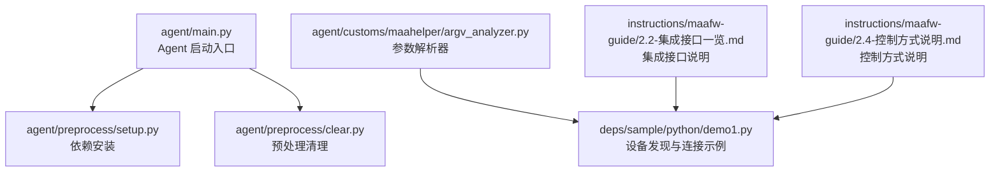
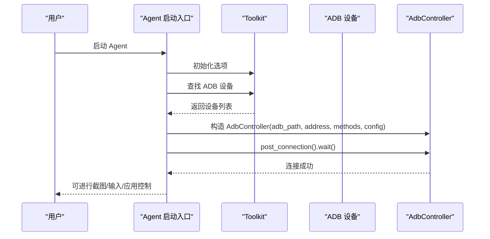
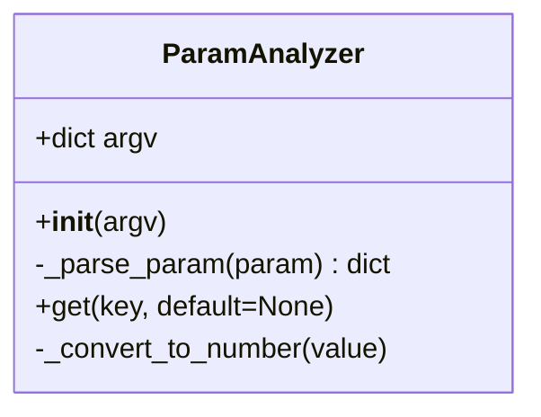
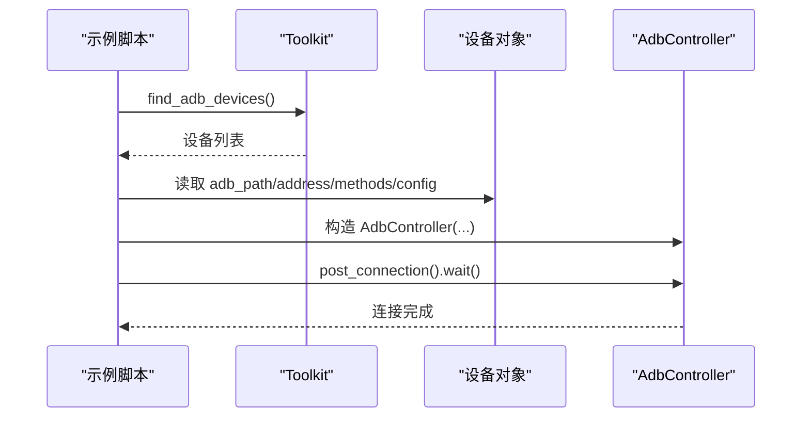
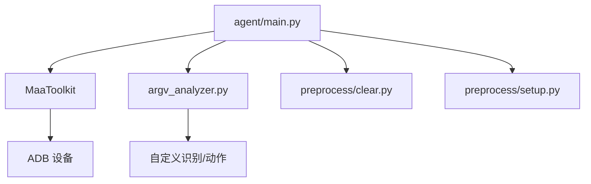

# 设备连接问题排查

<cite>
**本文引用的文件**
- [agent/main.py](file://agent/main.py)
- [agent/preprocess/setup.py](file://agent/preprocess/setup.py)
- [agent/preprocess/clear.py](file://agent/preprocess/clear.py)
- [agent/customs/maahelper/argv_analyzer.py](file://agent/customs/maahelper/argv_analyzer.py)
- [deps/sample/python/demo1.py](file://deps/sample/python/demo1.py)
- [instructions/maafw-guide/2.2-集成接口一览.md](file://instructions/maafw-guide/2.2-集成接口一览.md)
- [instructions/maafw-guide/2.4-控制方式说明.md](file://instructions/maafw-guide/2.4-控制方式说明.md)
</cite>

## 目录
1. [简介](#简介)
2. [项目结构](#项目结构)
3. [核心组件](#核心组件)
4. [架构总览](#架构总览)
5. [详细组件分析](#详细组件分析)
6. [依赖关系分析](#依赖关系分析)
7. [性能考量](#性能考量)
8. [故障排查指南](#故障排查指南)
9. [结论](#结论)
10. [附录](#附录)

## 简介
本文件面向使用 MaaFramework 的用户，聚焦“设备连接”环节的常见问题与解决方案，覆盖 ADB 驱动未安装、设备未授权、USB 调试未开启、多设备冲突、以及 Wi-Fi ADB 连接等场景。文档结合项目中参数解析模块与示例脚本，解释如何正确配置设备连接方式（ADB、Wi-Fi ADB），并通过界面操作与命令行验证设备连接状态。同时提供常见错误码与修复步骤，例如“adb devices”无响应、设备离线等问题的定位与处理方法，并给出命令行调试技巧与排障思路。

## 项目结构
本项目围绕 Agent 启动、依赖管理与设备连接能力展开，关键文件分布如下：
- Agent 启动入口：负责初始化环境、依赖检查、启动 Agent 服务与等待退出
- 依赖安装模块：根据 interface.json 版本与 pip 配置，自动安装/更新 Python 依赖
- 预处理清理模块：清理调试产生的临时文件，避免干扰后续任务
- 参数解析模块：解析自定义识别/动作参数，支持 JSON 与查询字符串格式
- 示例脚本：展示如何通过 Toolkit 发现 ADB 设备并建立控制器连接
- 指南文档：集成接口与控制方式说明，涵盖 ADB 截图与输入方式

图表来源
- [agent/main.py](file://agent/main.py#L17-L42)
- [agent/preprocess/setup.py](file://agent/preprocess/setup.py#L204-L230)
- [agent/preprocess/clear.py](file://agent/preprocess/clear.py#L31-L41)
- [agent/customs/maahelper/argv_analyzer.py](file://agent/customs/maahelper/argv_analyzer.py#L17-L159)
- [deps/sample/python/demo1.py](file://deps/sample/python/demo1.py#L21-L58)
- [instructions/maafw-guide/2.2-集成接口一览.md](file://instructions/maafw-guide/2.2-集成接口一览.md#L321-L824)
- [instructions/maafw-guide/2.4-控制方式说明.md](file://instructions/maafw-guide/2.4-控制方式说明.md#L10-L54)

章节来源
- [agent/main.py](file://agent/main.py#L17-L42)
- [agent/preprocess/setup.py](file://agent/preprocess/setup.py#L204-L230)
- [agent/preprocess/clear.py](file://agent/preprocess/clear.py#L31-L41)
- [agent/customs/maahelper/argv_analyzer.py](file://agent/customs/maahelper/argv_analyzer.py#L17-L159)
- [deps/sample/python/demo1.py](file://deps/sample/python/demo1.py#L21-L58)
- [instructions/maafw-guide/2.2-集成接口一览.md](file://instructions/maafw-guide/2.2-集成接口一览.md#L321-L824)
- [instructions/maafw-guide/2.4-控制方式说明.md](file://instructions/maafw-guide/2.4-控制方式说明.md#L10-L54)

## 核心组件
- Agent 启动流程：初始化 Toolkit、启动 Agent 服务、等待服务结束并关闭
- 依赖安装：读取 interface.json 版本，对比 pip 配置，按镜像源顺序尝试安装
- 预处理清理：清理 debug/on_error 目录，避免历史图片占用空间
- 参数解析：支持 JSON 与查询字符串格式，自动转换数字字符串，提供健壮的参数访问
- 设备发现与连接：通过 Toolkit.find_adb_devices 获取设备列表，构造 AdbController 并 post_connection 建立连接

章节来源
- [agent/main.py](file://agent/main.py#L17-L42)
- [agent/preprocess/setup.py](file://agent/preprocess/setup.py#L204-L230)
- [agent/preprocess/clear.py](file://agent/preprocess/clear.py#L31-L41)
- [agent/customs/maahelper/argv_analyzer.py](file://agent/customs/maahelper/argv_analyzer.py#L17-L159)
- [deps/sample/python/demo1.py](file://deps/sample/python/demo1.py#L21-L58)

## 架构总览
下图展示了设备连接相关的典型调用链：Agent 启动后，通过 Toolkit 发现设备，构造控制器并发起连接；随后可进行截图、输入、应用控制等操作。

图表来源
- [agent/main.py](file://agent/main.py#L25-L37)
- [deps/sample/python/demo1.py](file://deps/sample/python/demo1.py#L27-L58)
- [instructions/maafw-guide/2.2-集成接口一览.md](file://instructions/maafw-guide/2.2-集成接口一览.md#L415-L441)

## 详细组件分析

### 参数解析器（ParamAnalyzer）
- 功能：将自定义识别/动作参数解析为字典，支持 JSON 与查询字符串格式；自动去除外层引号；支持多值键合并为列表；自动将数字字符串转换为 int/float
- 典型用途：在自定义识别/动作中读取配置参数，避免手动解析带来的错误
- 注意事项：解析失败返回空字典；get 方法支持默认值与键列表回退

图表来源
- [agent/customs/maahelper/argv_analyzer.py](file://agent/customs/maahelper/argv_analyzer.py#L17-L159)

章节来源
- [agent/customs/maahelper/argv_analyzer.py](file://agent/customs/maahelper/argv_analyzer.py#L17-L159)

### 设备发现与连接（示例）
- 通过 Toolkit.find_adb_devices 获取设备列表
- 从设备对象中提取 adb_path、address、screencap_methods、input_methods、config
- 构造 AdbController 并 post_connection().wait() 建立连接
- 成功后可进行截图、点击、输入文本、应用控制等操作

图表来源
- [deps/sample/python/demo1.py](file://deps/sample/python/demo1.py#L27-L58)

章节来源
- [deps/sample/python/demo1.py](file://deps/sample/python/demo1.py#L21-L58)

### 截图与输入方式（ADB）
- 截图方式：支持多种编码与速度的截图方式，框架会尝试所有提供的方式并选择最快可用方式
- 输入方式：提供多种输入方式，按固定优先级尝试，选择首个可用方式
- 配置要点：Adb 控制器的截图/输入方式由设备能力决定，无需手动配置；Win32 控制器需显式配置

章节来源
- [instructions/maafw-guide/2.4-控制方式说明.md](file://instructions/maafw-guide/2.4-控制方式说明.md#L10-L54)
- [instructions/maafw-guide/2.2-集成接口一览.md](file://instructions/maafw-guide/2.2-集成接口一览.md#L321-L441)

## 依赖关系分析
- Agent 启动依赖 Toolkit 初始化与设备发现
- 设备发现依赖 ADB 工具链与设备授权状态
- 参数解析器被自定义识别/动作模块复用，提升参数访问一致性
- 截图与输入方式由设备能力决定，与控制器配置强相关

图表来源
- [agent/main.py](file://agent/main.py#L19-L37)
- [agent/preprocess/setup.py](file://agent/preprocess/setup.py#L204-L230)
- [agent/preprocess/clear.py](file://agent/preprocess/clear.py#L31-L41)
- [agent/customs/maahelper/argv_analyzer.py](file://agent/customs/maahelper/argv_analyzer.py#L17-L159)

章节来源
- [agent/main.py](file://agent/main.py#L19-L37)
- [agent/preprocess/setup.py](file://agent/preprocess/setup.py#L204-L230)
- [agent/preprocess/clear.py](file://agent/preprocess/clear.py#L31-L41)
- [agent/customs/maahelper/argv_analyzer.py](file://agent/customs/maahelper/argv_analyzer.py#L17-L159)

## 性能考量
- 截图方式选择：优先选择无损编码且速度快的方式，避免有损编码影响模板匹配精度
- 输入方式选择：按优先级尝试，选择首个可用方式，减少失败重试成本
- 依赖安装：镜像源按序尝试，失败后回退官方源，提高安装成功率与速度

章节来源
- [instructions/maafw-guide/2.4-控制方式说明.md](file://instructions/maafw-guide/2.4-控制方式说明.md#L29-L48)
- [agent/preprocess/setup.py](file://agent/preprocess/setup.py#L135-L198)

## 故障排查指南

### 常见问题与修复步骤
- ADB 驱动未安装
  - 现象：“adb devices”无响应或找不到设备
  - 修复：安装对应设备的 ADB 驱动（如手机厂商提供的驱动或通用驱动），重启 ADB 服务后重试
  - 验证：命令行执行 adb devices，确认设备出现在列表中
- 设备未授权
  - 现象：设备显示“unauthorized”或“offline”
  - 修复：在设备上确认授权弹窗并勾选“始终允许”，或在设置中重新打开 USB 调试
  - 验证：再次执行 adb devices，确认设备状态变为“device”
- USB 调试未开启
  - 现象：设备未出现在 adb devices 列表
  - 修复：在设备开发者选项中开启“USB 调试”，必要时关闭后再开启
  - 验证：adb devices 显示设备
- 多设备冲突
  - 现象：adb devices 显示多个设备，连接目标不明确
  - 修复：使用 -s 指定具体设备序列号；或断开其他设备连接
  - 验证：adb devices 仅显示目标设备
- 设备离线
  - 现象：设备显示“offline”
  - 修复：重启 ADB 服务（adb kill-server && adb start-server），重新插拔 USB 线，更换数据线或 USB 口
  - 验证：adb devices 显示设备状态为“device”
- Wi-Fi ADB 连接失败
  - 现象：通过无线方式连接设备失败
  - 修复：在设备上开启“无线调试”，获取 IP 与端口，使用 adb connect ip:port 连接；确保设备与主机在同一网段
  - 验证：adb devices 显示设备状态为“device”

### 命令行调试技巧
- 设备发现与连接
  - 使用 Toolkit.find_adb_devices 获取设备列表，确认设备信息（adb_path、address、methods、config）
  - 构造 AdbController 并 post_connection().wait()，观察连接状态
- 截图与输入
  - post_screencap().wait().get() 获取截图，post_click/post_input_text 等进行输入测试
- Shell 命令
  - 通过 post_shell 执行设备侧 shell 命令，验证设备可执行性与权限

章节来源
- [deps/sample/python/demo1.py](file://deps/sample/python/demo1.py#L27-L58)
- [instructions/maafw-guide/2.2-集成接口一览.md](file://instructions/maafw-guide/2.2-集成接口一览.md#L415-L441)
- [instructions/maafw-guide/2.2-集成接口一览.md](file://instructions/maafw-guide/2.2-集成接口一览.md#L419-L425)

### 参数解析与配置校验
- 参数格式
  - 支持 JSON 与查询字符串格式；自动去除外层引号；多值键合并为列表
  - 数字字符串自动转换为 int/float，便于在自定义识别/动作中直接使用
- 常见问题
  - 参数缺失：get 方法支持默认值；未提供默认值时抛出 KeyError
  - 参数类型：非数字字符串保持原值，避免隐式转换导致的错误

章节来源
- [agent/customs/maahelper/argv_analyzer.py](file://agent/customs/maahelper/argv_analyzer.py#L48-L131)

### Agent 启动与依赖
- 启动流程
  - 初始化 Toolkit、启动 Agent 服务、等待服务结束并关闭
- 依赖安装
  - 读取 interface.json 版本，对比 pip 配置，按镜像源顺序尝试安装
- 预处理清理
  - 清理 debug/on_error 目录，避免历史图片占用空间

章节来源
- [agent/main.py](file://agent/main.py#L17-L42)
- [agent/preprocess/setup.py](file://agent/preprocess/setup.py#L204-L230)
- [agent/preprocess/clear.py](file://agent/preprocess/clear.py#L31-L41)

## 结论
设备连接问题通常源于驱动、授权、调试开关与网络配置等基础条件。通过 Toolkit 自动发现设备、构造控制器并建立连接，配合截图与输入接口验证，可快速定位问题。参数解析器为自定义识别/动作提供了统一的参数访问方式，有助于减少配置错误。建议在排查过程中遵循“先基础后高级”的原则：先确保 ADB 驱动与授权正常，再逐步验证 Wi-Fi ADB 与控制器配置。

## 附录
- 截图与输入方式说明：参见控制方式说明文档
- 集成接口参考：参见集成接口一览文档

章节来源
- [instructions/maafw-guide/2.4-控制方式说明.md](file://instructions/maafw-guide/2.4-控制方式说明.md#L10-L54)
- [instructions/maafw-guide/2.2-集成接口一览.md](file://instructions/maafw-guide/2.2-集成接口一览.md#L321-L824)