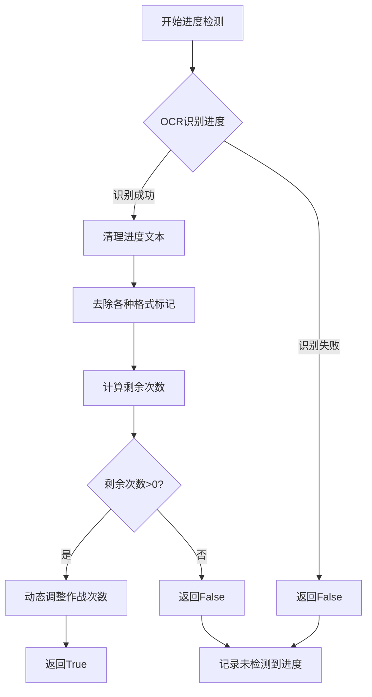
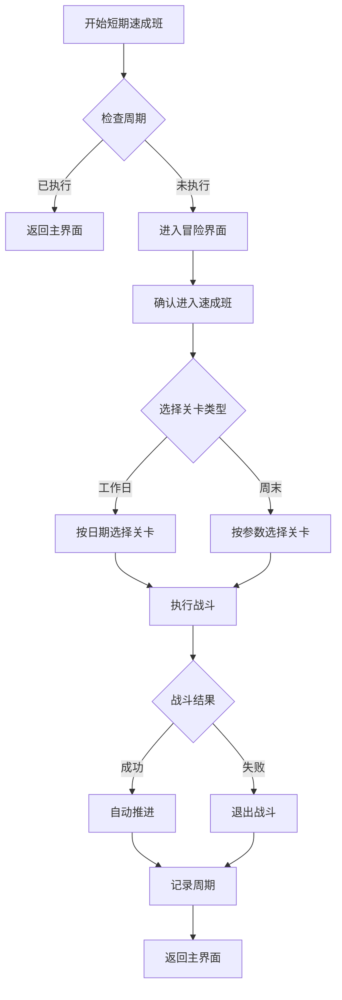
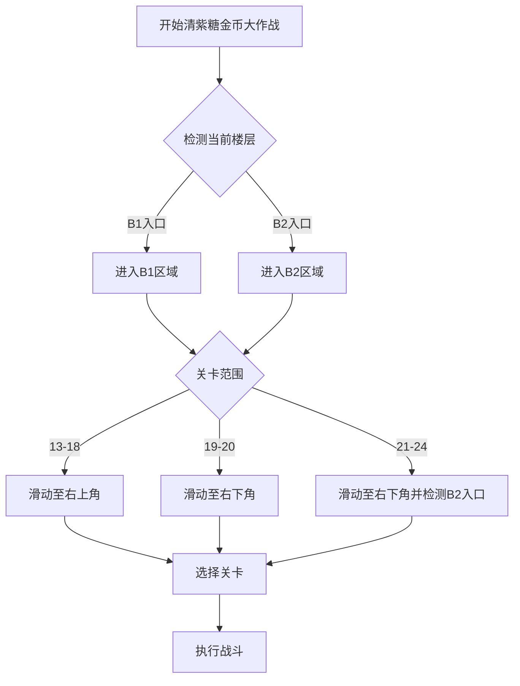
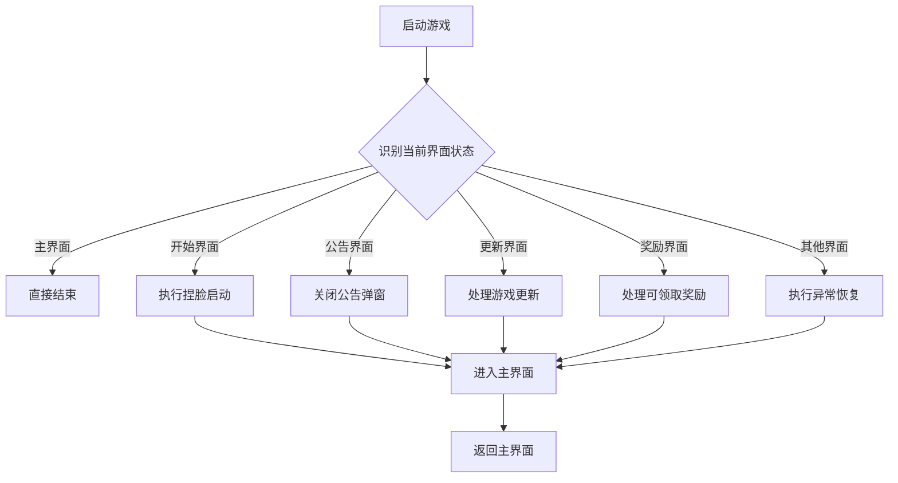

# 日常任务功能

<cite>
**本文档引用文件**  
- [activity.py](file://agent/customs/special_treat/activity.py)
- [activity_daily.json](file://MFAAvalonia/Resource/tasks/daily/activity_daily.json)
- [activity_daily.md](file://MFAAvalonia/Resource/descs/daily/activity_daily.md)
- [claim_mail.json](file://MFAAvalonia/Resource/tasks/daily/claim_mail.json)
- [claim_reward.json](file://MFAAvalonia/Resource/tasks/daily/claim_reward.json)
- [clear_purple_candy.json](file://MFAAvalonia/Resource/tasks/daily/clear_purple_candy.json)
- [leaf_change.json](file://MFAAvalonia/Resource/tasks/daily/leaf_change.json)
- [purchase.json](file://MFAAvalonia/Resource/tasks/daily/purchase.json)
- [clear_purple_candy.md](file://MFAAvalonia/Resource/descs/daily/clear_purple_candy.md)
- [claim_mail.md](file://MFAAvalonia/Resource/descs/daily/claim_mail.md)
- [claim_reward.md](file://MFAAvalonia/Resource/descs/daily/claim_reward.md)
- [leaf_change.md](file://MFAAvalonia/Resource/descs/daily/leaf_change.md)
- [purchase.md](file://MFAAvalonia/Resource/descs/daily/purchase.md)
- [eat_sugar.py](file://agent/customs/special_treat/eat_sugar.py)
- [store.py](file://agent/customs/special_treat/store.py)
- [receive_reward.py](file://agent/customs/special_treat/receive_reward.py)
- [tasker.py](file://agent/customs/maahelper/tasker.py)
- [prompter.py](file://agent/customs/utils/prompter.py)
- [reco_helper.py](file://agent/customs/maahelper/reco_helper.py)
- [argv_analyzer.py](file://agent/customs/maahelper/argv_analyzer.py)
- [exam_cram.py](file://agent/customs/special_treat/exam_cram.py)
- [exam_cram.json](file://MFAAvalonia/Resource/tasks/daily/exam_cram.json)
- [exam_cram.md](file://MFAAvalonia/Resource/descs/daily/exam_cram.md)
- [短期速成班.json](file://MFAAvalonia/Resource/base/pipeline/日常任务/短期速成班.json)
- [清紫糖.json](file://assets/resource/base/pipeline/日常任务/清紫糖.json)
- [启动游戏.json](file://MFAAvalonia/Resource/base/pipeline/日常任务/启动游戏.json)
- [启动游戏.md](file://MFAAvalonia/Resource/descs/daily/start_game.md)
- [启动游戏.json](file://assets/resource/tasks/daily/start_game.json)
- [启动游戏.md](file://assets/resource/descs/daily/start_game.md)
- [logic_enhance.py](file://agent/customs/global_func/logic_enhance.py)
</cite>

## 更新摘要
**所做更改**  
- **启动游戏OCR参数优化**：将游戏自动更新检测的OCR关键词从'开始下载'更新为'资源下载'，提升游戏自动更新检测的可靠性
- **稳定识别机制增强**：通过`stable_reco`自定义识别器实现界面状态的连续识别，减少误判概率
- **异常恢复策略完善**：增强了启动游戏流程中的异常恢复能力，支持多种异常情况的自动处理

## 目录
1. [功能概述](#功能概述)
2. [子功能执行流程解析](#子功能执行流程解析)
3. [OCR识别与模拟点击机制](#ocr识别与模拟点击机制)
4. [Pipeline配置结构分析](#pipeline配置结构分析)
5. [界面导航路径与异常恢复策略](#界面导航路径与异常恢复策略)
6. [执行频率建议与效率评估](#执行频率建议与效率评估)
7. [兼容性注意事项](#兼容性注意事项)
8. [group字段与智能任务串联执行](#group字段与智能任务串联执行)
9. [活动进度检查功能增强](#活动进度检查功能增强)
10. [短期速成班功能详解](#短期速成班功能详解)
11. [启动游戏自动化流程增强](#启动游戏自动化流程增强)

## 功能概述

MaaDuDuL的日常任务自动化功能旨在通过自动化脚本完成游戏中的重复性操作，提升资源获取效率。该功能模块包含"领取邮件"、"每日采购"、"清紫糖"、"叶子互换"、"领取奖励"、"每日活动作战"、"短期速成班"和"启动游戏"等子功能，均被标记为【可连续任务】【日常任务】，支持从任意界面启动，并在执行完毕后返回主界面。

这些功能通过MaaFramework提供的自定义动作（CustomAction）机制实现，结合OCR识别、图像匹配与模拟点击技术，精准定位界面元素并触发交互。所有任务均以模块化方式组织于`agent/customs/special_treat`目录下，便于维护与扩展。

**本节来源**  
- [claim_mail.md](file://MFAAvalonia/Resource/descs/daily/claim_mail.md)
- [purchase.md](file://MFAAvalonia/Resource/descs/daily/purchase.md)
- [clear_purple_candy.md](file://MFAAvalonia/Resource/descs/daily/clear_purple_candy.md)
- [leaf_change.md](file://MFAAvalonia/Resource/descs/daily/leaf_change.md)
- [claim_reward.md](file://MFAAvalonia/Resource/descs/daily/claim_reward.md)
- [activity_daily.md](file://MFAAvalonia/Resource/descs/daily/activity_daily.md)
- [exam_cram.md](file://MFAAvalonia/Resource/descs/daily/exam_cram.md)
- [start_game.md](file://MFAAvalonia/Resource/descs/daily/start_game.md)

## 子功能执行流程解析

### 领取邮件

"领取邮件"功能负责自动收取游戏内邮件奖励。其执行流程从任意界面开始，通过通用导航流程进入主界面，识别邮件图标并点击进入邮件页面，逐一领取可领取的奖励，最后返回主界面。

该功能由`MFAAvalonia/Resource/tasks/daily/claim_mail.json`配置文件定义，实际执行依赖于Pipeline配置中的"领取邮件_开始"任务节点，通过图像匹配检测邮件红点提示，确保无遗漏。

**本节来源**  
- [claim_mail.json](file://MFAAvalonia/Resource/tasks/daily/claim_mail.json)

### 每日采购

"每日采购"功能涵盖免费礼包领取与商店商品购买。其实现分为两个自定义动作类：
- `Gift`：用于领取指定名称的礼包
- `Buy`：用于购买指定名称的商品

两个类均通过`ParamAnalyzer`解析输入参数（如`gift/g`或`goods/g`），并调用`Tasker`运行对应的Pipeline任务，如"每日采购_选中礼包"或"每日采购_查看商品详情"，实现精准操作。

**本节来源**  
- [purchase.md](file://MFAAvalonia/Resource/descs/daily/purchase.md)
- [store.py:14-96](file://agent/customs/special_treat/store.py#L14-L96)

### 清紫糖

"清紫糖"功能用于清理紫色糖果副本，获取角色培养材料。其实现位于`eat_sugar.py`中的多个类：
- `SelectCloneLevel`：选择克隆工厂关卡（4列布局）
- `SelectCrayonLevel`：选择到手蜡关卡（5列布局）
- `SelectDuplicateLevel`：通过OCR查找指定副本关卡
- `SelectGoldLevel`：**新增** 选择金币大作战关卡（支持13-24关）

对于前三种，系统使用`MatrixOperator`根据起始坐标与行列间隔计算点击位置；对于第四种，通过`select_gold_level`自定义动作实现金币大作战关卡选择。

**更新** 金币大作战功能已更新配置参数：
- 关卡范围扩展：支持13-24关，而非之前的13-20关
- 入口检测优化：B2入口检测从'B1'更新为'B2'，反映游戏界面变化
- 参数调整：自定义动作参数从'l=13'调整为'l=21'，支持更高难度关卡

**新增功能** 金币大作战功能支持关卡13-24的自动化战斗，通过智能滑动策略选择正确的关卡区域：
- 关卡13-18：使用"金币右上角"滑动
- 关卡19-20：使用"金币右下角"滑动
- 关卡21-24：使用"金币右下角"滑动并检测B2入口
- 所有关卡：统一通过OCR识别关卡编号并执行战斗

**本节来源**  
- [clear_purple_candy.md](file://MFAAvalonia/Resource/descs/daily/clear_purple_candy.md)
- [eat_sugar.py:21-238](file://agent/customs/special_treat/eat_sugar.py#L21-L238)
- [clear_purple_candy.json:115-123](file://MFAAvalonia/Resource/tasks/daily/clear_purple_candy.json#L115-L123)
- [clear_purple_candy.json:734-839](file://MFAAvalonia/Resource/tasks/daily/clear_purple_candy.json#L734-L839)

### 叶子互换

"叶子互换"功能实现自动收取与赠送好友叶子。其文档说明位于`MFAAvalonia/Resource/descs/daily/leaf_change.md`，表明其为日常可连续任务，起止界面为任意界面至主界面。

虽然具体实现代码未直接展示，但可推断其通过进入社交界面，识别"收取"与"赠送"按钮，执行批量操作完成自动化。

**本节来源**  
- [leaf_change.md](file://MFAAvalonia/Resource/descs/daily/leaf_change.md)

### 领取奖励

"领取奖励"功能分为两类：
- `ReceiveTaskReward`：领取每日/每周任务奖励
- `ReceivePassReward`：领取通行证奖励（等级、便装、冒险）

两类均通过参数`category/c`指定奖励类型。系统根据类别进入对应面板或加载对应模板图像（如`main/grade_pass.png`），触发领取流程。

**更新** 修复了奖励收集系统的无限循环问题，新增了"启动游戏_无可领取的奖励"节点，增加了JumpBack机制和rate_limit限制，改进了OCR识别参数，增强了系统的稳定性。

**本节来源**  
- [claim_reward.md](file://MFAAvalonia/Resource/descs/daily/claim_reward.md)
- [receive_reward.py:9-65](file://agent/customs/special_treat/receive_reward.py#L9-L65)

### 每日活动作战

"每日活动作战"是当前版本的核心活动功能，作为【可连续任务】【活动任务】【日常任务】的组合功能。该活动提供每日活动作战与奖励领取功能，支持自定义作战次数。

活动界面通过OCR识别"电子羊的永恒之梦"标题，进入对应的活动界面后，系统可以检查活动进度，计算剩余挑战次数并动态调整后续任务参数。该功能与传统的日常任务不同，专门针对活动主题设计，具有独特的界面导航和进度管理机制。

**更新** 主题从"再次绽放的蓝玫瑰"更新为"电子羊的永恒之梦"，反映了v0.2.1版本的游戏内容主题变更。

**本节来源**  
- [activity_daily.md](file://MFAAvalonia/Resource/descs/daily/activity_daily.md)
- [activity.py:17-54](file://agent/customs/special_treat/activity.py#L17-L54)
- [activity_daily.json:1-79](file://MFAAvalonia/Resource/tasks/daily/activity_daily.json#L1-L79)

### 短期速成班

**新增功能** "短期速成班"是一个完整的自动化考试冲刺系统，根据当前游戏日期智能选择对应的关卡进行挑战。该功能支持以下特性：

- **智能关卡选择**：周一至周五自动选择对应关卡（1-5），周六和周日支持自定义关卡选择
- **自动战斗推进**：支持推进模式，自动挑战最新一关
- **周末关卡配置**：可配置周六和周日的关卡选择，支持纯真（1）、冷静（2）、热情（3）、活泼（4）、忧愁（5）
- **周期检查**：可配置每日仅检查一次，避免重复执行

该功能通过`SelectCramLevel`自定义动作实现，根据游戏日期计算逻辑（凌晨4点前视为前一天）自动确定目标关卡。

**本节来源**  
- [exam_cram.md](file://MFAAvalonia/Resource/descs/daily/exam_cram.md)
- [exam_cram.py:16-79](file://agent/customs/special_treat/exam_cram.py#L16-L79)
- [exam_cram.json:1-72](file://MFAAvalonia/Resource/tasks/daily/exam_cram.json#L1-L72)

### 启动游戏

**新增功能** "启动游戏"是日常任务自动化流程的重要前置功能，负责启动游戏并进入可操作的主界面状态。该功能支持多种界面状态的自动识别和处理，包括主界面、开始界面、公告界面、更新界面等。

启动游戏流程通过精确的OCR识别和模板匹配实现界面状态的自动判断，支持以下核心功能：
- **界面状态识别**：自动识别主界面、开始界面、公告界面等多种状态
- **弹窗处理**：自动处理公告、更新、奖励领取等弹窗
- **界面导航**：通过精确的视觉定位实现界面间的无缝导航
- **异常恢复**：支持多种异常情况的自动恢复机制

**更新** OCR参数检测逻辑已从'开始下载'更新为'资源下载'，提升了游戏自动更新检测的可靠性。同时，通过`stable_reco`自定义识别器实现界面状态的连续识别，减少误判概率。

**本节来源**  
- [start_game.md](file://MFAAvalonia/Resource/descs/daily/start_game.md)
- [启动游戏.json:1-458](file://MFAAvalonia/Resource/base/pipeline/日常任务/启动游戏.json#L1-L458)

## OCR识别与模拟点击机制

MaaDuDuL利用MaaFramework内置的OCR引擎（基于PPOCRv3/v4/v5）进行界面元素识别。OCR主要用于以下场景：
- 文本匹配：如活动标题、礼包名称、商品名、任务类别
- 数字识别：如关卡编号（自动补零处理）
- 状态判断：如"已领取"、"未找到"等提示文本

当OCR识别到目标元素后，系统结合ROI区域与坐标偏移，通过`Tasker.click(x, y)`触发模拟点击。对于固定布局的界面（如克隆工厂），使用`MatrixOperator`类根据行列公式计算精确坐标，提高点击准确性。

此外，系统支持模板匹配（Template Matching）作为OCR的补充，用于识别图标、按钮等非文本元素，如通行证界面入口。

**更新** 改进了OCR识别参数，增强了系统的稳定性，特别是在奖励收集过程中避免了无限循环问题。

**新增功能** 活动进度检查功能的OCR识别增强：
- **边缘情况处理**：在`CheckActivityProgress`类中增加了对'020'、':20'和'：20'等边缘情况的特殊处理
- **文本清理逻辑**：通过多层字符串替换确保进度数字的准确性
- **稳定性提升**：增强了活动战斗剩余时间识别的准确性和稳定性

**更新** 启动游戏功能的OCR识别增强：
- **界面状态识别**：通过精确的OCR识别实现主界面、开始界面、公告界面的自动判断
- **弹窗处理**：支持公告、更新、奖励领取等弹窗的自动识别和处理
- **视觉定位优化**：通过ROI区域精确定位界面元素，提高识别准确性
- **OCR关键词优化**：将'开始下载'更新为'资源下载'，提升更新检测的可靠性

**新增功能** 稳定识别机制的OCR识别增强：
- **连续识别**：通过`stable_reco`自定义识别器实现界面状态的连续识别，减少误判概率
- **多状态并行识别**：同时识别多种界面状态，提高识别速度
- **识别结果缓存**：通过识别结果缓存减少重复识别的开销

**本节来源**  
- [activity.py:35-54](file://agent/customs/special_treat/activity.py#L35-L54)
- [activity.py:127-133](file://agent/customs/special_treat/activity.py#L127-L133)
- [eat_sugar.py:17-18](file://agent/customs/special_treat/eat_sugar.py#L17-L18)
- [store.py:11-12](file://agent/customs/special_treat/store.py#L11-L12)
- [receive_reward.py:9-65](file://agent/customs/special_treat/receive_reward.py#L9-L65)
- [exam_cram.py:16-79](file://agent/customs/special_treat/exam_cram.py#L16-L79)
- [启动游戏.json:177-201](file://MFAAvalonia/Resource/base/pipeline/日常任务/启动游戏.json#L177-L201)
- [启动游戏.json:202-235](file://MFAAvalonia/Resource/base/pipeline/日常任务/启动游戏.json#L202-L235)
- [启动游戏.json:372-394](file://MFAAvalonia/Resource/base/pipeline/日常任务/启动游戏.json#L372-L394)
- [启动游戏.json:395-417](file://MFAAvalonia/Resource/base/pipeline/日常任务/启动游戏.json#L395-L417)
- [logic_enhance.py:18-96](file://agent/customs/global_func/logic_enhance.py#L18-L96)

## Pipeline配置结构分析

日常任务的执行流程由JSON格式的Pipeline文件定义，位于`MFAAvalonia/Resource/tasks/daily/`目录下。每个任务对应一个独立的JSON文件，如"claim_mail.json"。

Pipeline节点结构包含以下关键字段：
- `name`：节点名称，用于流程控制
- `type`：节点类型（如`TemplateMatch`、`OCR`、`Click`）
- `roi`：匹配区域，限定识别范围
- `expected`：期望匹配的文本内容
- `template`：模板图像路径，用于图像匹配
- `next`：成功后的跳转节点
- `timeout`：超时时间，防止卡死
- `retry`：重试次数，应对网络延迟或识别失败
- `on_error`：错误处理节点，实现JumpBack机制

**更新** 新增了JumpBack机制和rate_limit限制，完善了异常恢复策略。关键节点如"领取奖励_任务奖励不可领取"（第64-87行）和"领取奖励_满任务奖励不可领取"（第205-225行）都配置了`on_error`字段，实现了智能的错误处理和流程回退。

**新增功能** 清紫糖金币大作战功能的Pipeline配置包含以下关键节点：
- `清紫糖_金币`：识别并点击金币大作战入口
- `清紫糖_金币右上角/金币右下角`：智能滑动到正确关卡区域
- `清紫糖_金币行动`：调用`select_gold_level`自定义动作执行关卡选择

**更新** 活动进度检查节点的OCR配置增强：
- **识别区域优化**：`每日活动作战_识别进度`节点的ROI区域经过优化，确保准确识别进度文本
- **多模式匹配**：支持多种进度格式的识别，包括"/20"、"120"、"020"、":20"和"：20"等格式
- **错误处理机制**：通过`on_error`字段实现进度识别失败时的智能回退

**新增功能** 短期速成班功能的Pipeline配置包含以下关键节点：
- `短期速成班_进入冒险界面`：点击冒险按钮进入速成班界面
- `短期速成班_进入速成班`：确认进入速成班界面
- `短期速成班_选择速成班课程`：调用`select_cram_level`自定义动作选择关卡
- `短期速成班_推进模式`：自动挑战最新一关
- `短期速成班_周期检查`：每日仅检查一次的周期控制

**更新** 清紫糖配置文件的关键更新：
- **B2入口检测**：`清紫糖_检测金币B2入口`节点的期望值从"B1"更新为"B2"
- **自定义动作参数**：`清紫糖_金币行动`节点的自定义动作参数从"l=13"调整为"l=21"
- **关卡范围扩展**：支持13-24关的金币大作战，而非之前的13-20关

**更新** 启动游戏功能的Pipeline配置增强：
- **连续识别机制**：通过`stable_reco`自定义识别器实现稳定的界面状态识别
- **多状态识别**：支持主界面、开始界面、公告界面等多种状态的自动识别
- **异常恢复节点**：配置了完整的JumpBack机制，支持多种异常情况的自动恢复
- **视觉定位优化**：通过精确的ROI区域和模板匹配实现高精度的界面元素定位
- **OCR关键词优化**：将'开始下载'更新为'资源下载'，提升更新检测的可靠性

**本节来源**  
- [activity_daily.json:152-170](file://MFAAvalonia/Resource/tasks/daily/activity_daily.json#L152-L170)
- [activity_daily.json:343-357](file://MFAAvalonia/Resource/tasks/daily/activity_daily.json#L343-L357)
- [claim_reward.json:64-87](file://MFAAvalonia/Resource/tasks/daily/claim_reward.json#L64-L87)
- [claim_reward.json:205-225](file://MFAAvalonia/Resource/tasks/daily/claim_reward.json#L205-L225)
- [clear_purple_candy.json:734-839](file://MFAAvalonia/Resource/tasks/daily/clear_purple_candy.json#L734-L839)
- [短期速成班.json:352-440](file://MFAAvalonia/Resource/base/pipeline/日常任务/短期速成班.json#L352-L440)
- [清紫糖.json:383-399](file://assets/resource/base/pipeline/日常任务/清紫糖.json#L383-L399)
- [清紫糖.json:1180-1186](file://assets/resource/base/pipeline/日常任务/清紫糖.json#L1180-L1186)
- [启动游戏.json:372-394](file://MFAAvalonia/Resource/base/pipeline/日常任务/启动游戏.json#L372-L394)
- [启动游戏.json:395-417](file://MFAAvalonia/Resource/base/pipeline/日常任务/启动游戏.json#L395-L417)

## 界面导航路径与异常恢复策略

所有日常任务均支持从任意界面启动，依赖"回到主界面"或"懒加载返回主界面"等通用Pipeline节点完成初始导航。系统通过周期性检查（`periodic_check`模块）检测弹窗、公告等干扰元素，并自动关闭，确保流程连续性。

在网络延迟或操作失败时，系统采用以下恢复策略：
- **重试机制**：关键节点配置`retry`字段，失败后自动重试
- **超时跳转**：设置`timeout`后跳转至恢复节点
- **状态检测**：通过OCR或图像匹配确认当前界面状态，动态调整流程
- **异常捕获**：所有自定义动作均使用`try-except`包裹，记录错误日志并返回`False`
- **JumpBack机制**：通过`on_error`字段实现智能错误回退，避免无限循环

**更新** 新增了JumpBack机制和rate_limit限制，显著增强了系统的稳定性。例如在"领取奖励_任务奖励不可领取"节点中，系统会自动跳转到"领取奖励_领取任务满进度奖励"节点，避免了无限循环问题。

**新增功能** 清紫糖金币大作战的异常恢复策略：
- 关卡选择验证：`select_gold_level`动作会检查关卡范围（13-24），超出范围时返回错误
- 智能滑动补偿：根据关卡范围自动选择合适的滑动方向，减少识别失败概率
- 统一错误处理：所有金币大作战相关节点都配置了适当的错误处理机制

**更新** 活动进度检查功能的异常恢复策略：
- **边缘情况处理**：通过多层字符串替换处理各种进度格式的边缘情况
- **智能回退机制**：当进度识别失败时，系统会自动跳转到相应的错误处理节点
- **稳定性保障**：增强了OCR识别的鲁棒性，减少因格式差异导致的识别失败

**新增功能** 短期速成班功能的异常恢复策略：
- **关卡有效性检查**：`SelectCramLevel`动作会验证周末关卡的有效性（1-3或4-5），超出范围时使用默认值
- **智能日期计算**：考虑凌晨4点的时间边界，确保游戏日期计算的准确性
- **战斗状态监控**：通过OCR识别"出发"、"编辑卡组"、"前往下一关"等状态，自动处理战斗结果

**更新** 清紫糖配置文件的异常恢复策略更新：
- **B2入口检测**：当检测到B2入口时，系统会自动切换到对应的关卡区域
- **关卡范围验证**：自定义动作参数从'l=13'调整为'l=21'，支持更高难度关卡
- **智能滑动补偿**：根据关卡范围自动选择合适的滑动方向，减少识别失败概率

**更新** 启动游戏功能的异常恢复策略增强：
- **连续识别机制**：通过`stable_reco`自定义识别器实现稳定的界面状态识别，减少误判
- **多状态自动切换**：支持主界面、开始界面、公告界面的自动识别和切换
- **弹窗自动处理**：配置了完整的弹窗处理节点，包括公告、更新、奖励领取等
- **视觉定位补偿**：通过精确的ROI区域和模板匹配实现高精度的界面元素定位
- **OCR关键词优化**：将'开始下载'更新为'资源下载'，提升更新检测的可靠性

**本节来源**  
- [activity_daily.json:166-170](file://MFAAvalonia/Resource/tasks/daily/activity_daily.json#L166-L170)
- [activity_daily.json:259-276](file://MFAAvalonia/Resource/tasks/daily/activity_daily.json#L259-L276)
- [claim_reward.json:64-87](file://MFAAvalonia/Resource/tasks/daily/claim_reward.json#L64-L87)
- [tasker.py:60-122](file://agent/customs/maahelper/tasker.py#L60-L122)
- [prompter.py:34-54](file://agent/customs/utils/prompter.py#L34-L54)
- [eat_sugar.py:213-237](file://agent/customs/special_treat/eat_sugar.py#L213-L237)
- [exam_cram.py:26-79](file://agent/customs/special_treat/exam_cram.py#L26-L79)
- [启动游戏.json:372-417](file://MFAAvalonia/Resource/base/pipeline/日常任务/启动游戏.json#L372-L417)

## 执行频率建议与效率评估

| 功能 | 建议执行频率 | 资源获取效率 | 备注 |
|------|--------------|--------------|------|
| 领取邮件 | 每日1次 | 高 | 包含登录奖励与系统邮件 |
| 每日采购 | 每日1次 | 中 | 含免费礼包与货币购买商品 |
| 清紫糖 | 每日1次 | 高 | 核心材料来源，建议优先执行 |
| 清紫糖-金币大作战 | 每日1次 | 高 | 支持关卡13-24，建议优先执行 |
| 叶子互换 | 每日1次 | 低 | 社交互动奖励，不影响主线 |
| 领取奖励 | 每日1次 | 高 | 涵盖任务与通行证双重收益 |
| 每日活动作战 | 每日1次 | 高 | 活动主题任务，建议优先执行 |
| **短期速成班** | **每日1次** | **中高** | **智能关卡选择，支持周末自定义** |
| **启动游戏** | **每日1次** | **高** | **前置功能，确保游戏处于可操作状态** |

**更新** 由于奖励收集系统的稳定性得到显著改善，建议适当增加"领取奖励"功能的执行频率，但仍建议每日1次以避免过度频繁的界面切换。新增的"每日活动作战"活动任务具有高价值特性，建议每日优先执行。

**新增功能** 启动游戏功能的执行建议：
- **前置作用**：建议在执行其他日常任务前运行，确保游戏处于可操作的主界面状态
- **稳定性保障**：通过精确的界面状态识别和异常恢复机制，提高整个自动化流程的稳定性
- **资源消耗**：启动游戏功能本身不消耗游戏资源，但能显著提升其他任务的成功率
- **OCR参数优化**：'资源下载'关键词的使用提升了更新检测的可靠性

**新增功能** 短期速成班的执行建议：
- **最佳执行时机**：建议在完成清紫糖后执行，以充分利用体力
- **资源消耗评估**：相比清紫糖，短期速成班消耗较少体力，适合日常执行
- **智能选择优势**：根据游戏日期自动选择最优关卡，无需手动配置
- **周末灵活性**：支持周末关卡自定义，适应不同的游戏策略

**新增功能** 每日活动作战的执行建议：
- **智能检测**：建议使用智能检测功能，自动计算剩余挑战次数
- **指定次数**：对于有明确目标的玩家，可使用指定次数功能
- **最大次数**：建议在体力充足时使用最大次数功能

**更新** 活动进度检查功能的执行建议：
- **识别稳定性**：由于增加了边缘情况处理，活动进度检查的准确性大幅提升
- **执行频率**：建议每日执行，确保能够准确识别剩余挑战次数
- **兼容性**：新版本增强了对不同格式进度文本的识别能力

**更新** 清紫糖功能的执行建议更新：
- **关卡范围扩展**：支持13-24关的金币大作战，建议优先执行高难度关卡
- **入口检测优化**：B2入口检测从'B1'更新为'B2'，提高了识别准确性
- **参数调整**：自定义动作参数从'l=13'调整为'l=21'，支持更高难度关卡

**本节来源**  
- [claim_mail.md](file://MFAAvalonia/Resource/descs/daily/claim_mail.md)
- [purchase.md](file://MFAAvalonia/Resource/descs/daily/purchase.md)
- [clear_purple_candy.md](file://MFAAvalonia/Resource/descs/daily/clear_purple_candy.md)
- [leaf_change.md](file://MFAAvalonia/Resource/descs/daily/leaf_change.md)
- [claim_reward.md](file://MFAAvalonia/Resource/descs/daily/claim_reward.md)
- [activity_daily.md](file://MFAAvalonia/Resource/descs/daily/activity_daily.md)
- [exam_cram.md](file://MFAAvalonia/Resource/descs/daily/exam_cram.md)
- [start_game.md](file://MFAAvalonia/Resource/descs/daily/start_game.md)

## 兼容性注意事项

- **版本兼容性**：确保游戏版本与Pipeline配置匹配，界面变更可能导致OCR识别失败
- **多任务冲突**：避免与其他自动化功能（如连续作战）同时运行，防止资源竞争
- **网络稳定性**：弱网环境下建议增加`timeout`与`retry`值，防止误判
- **设备适配**：不同分辨率设备需调整ROI与坐标参数，建议使用相对坐标计算
- **更新同步**：游戏活动更新后，需同步更新`activity.py`中的`EnterActivity`逻辑与OCR关键词
- **系统稳定性**：新版本增强了JumpBack机制和rate_limit限制，提高了系统的鲁棒性
- **活动主题变更**：v0.1.10版本将活动主题从"电子羊的永恒之梦"更新为"再次绽放的蓝玫瑰"，v0.2.1版本又将主题更新为"电子羊的永恒之梦"，需确保相关配置文件同步更新
- **功能移除通知**：糖果领取功能已完全移除，相关配置文件和实现代码已被删除
- **新功能兼容性**：短期速成班功能需要游戏版本支持速成班界面，确保OCR识别区域准确
- **清紫糖配置更新**：B2入口检测和自定义动作参数的更新需要同步到所有相关配置文件
- **启动游戏功能**：新增的启动游戏功能需要确保OCR识别区域和模板匹配的准确性
- **OCR参数优化**：'开始下载'已更新为'资源下载'，需确保所有相关配置文件同步更新

**更新** 系统现已修复奖励收集的无限循环问题，新增的JumpBack机制和rate_limit限制显著提升了系统的稳定性。建议定期检查`MFAAvalonia/Resource/descs/daily/`目录下的文档说明，了解最新功能变更与使用限制。特别注意活动主题的变更，确保所有相关配置保持一致。

**新增功能** 启动游戏功能的兼容性注意事项：
- **界面适配**：不同游戏版本的启动界面可能有所变化，需根据实际情况调整OCR识别区域
- **模板匹配**：需要确保模板图像与当前游戏版本的界面风格匹配
- **识别稳定性**：通过连续识别机制确保界面状态识别的准确性
- **异常处理**：完善的异常恢复机制确保在各种异常情况下都能正常处理
- **OCR关键词更新**：'资源下载'关键词的使用需要确保OCR识别的准确性

**新增功能** 短期速成班的兼容性注意事项：
- **游戏版本要求**：需要游戏版本支持短期速成班功能
- **界面适配**：不同游戏版本的速成班界面布局可能不同，需根据实际情况调整OCR识别区域
- **关卡有效性**：周末关卡参数必须在有效范围内（周六1-3，周日4-5），超出范围时使用默认值
- **时间边界处理**：凌晨4点前的日期计算逻辑需要考虑服务器时间差异

**新增功能** 活动进度检查功能的兼容性注意事项：
- **边缘情况处理**：新版本增强了对各种进度格式的识别能力，包括'020'、':20'和'：20'等边缘情况
- **OCR格式适配**：系统现在能够稳定识别不同格式的进度文本，提高了兼容性
- **错误处理机制**：增强了异常情况下的处理能力，减少了因格式差异导致的失败

**更新** 清紫糖配置文件的兼容性注意事项：
- **B2入口检测**：需要确保游戏版本支持B2入口检测，而非B1入口
- **关卡范围扩展**：自定义动作参数从'l=13'调整为'l=21'，需要确保游戏版本支持更高难度关卡
- **OCR识别优化**：B2入口检测的准确性提升，减少了误识别的概率

**本节来源**  
- [activity.py](file://agent/customs/special_treat/activity.py)
- [eat_sugar.py](file://agent/customs/special_treat/eat_sugar.py)
- [store.py](file://agent/customs/special_treat/store.py)
- [claim_reward.json](file://MFAAvalonia/Resource/tasks/daily/claim_reward.json)
- [exam_cram.py](file://agent/customs/special_treat/exam_cram.py)
- [启动游戏.json:1-458](file://MFAAvalonia/Resource/base/pipeline/日常任务/启动游戏.json#L1-L458)
- [logic_enhance.py](file://agent/customs/global_func/logic_enhance.py)

## group字段与智能任务串联执行

**新增** 所有日常任务文件现已新增`group`字段，统一标记为`["continuous"]`组，这一重要更新为系统提供了更智能的任务串联执行能力。

### group字段的作用机制

- **任务分组标识**：`group`字段将日常任务统一归类为连续任务组，便于系统识别和管理
- **智能串联执行**：基于连续任务组的标识，系统可以自动构建任务依赖关系，实现无缝的任务衔接
- **执行顺序优化**：连续任务组内的任务可以根据资源消耗和收益进行智能排序，避免不必要的界面切换
- **状态共享机制**：同一组内的任务可以共享执行状态，如体力、货币等资源信息，提高整体执行效率

### 连续任务组的优势

- **资源协调**：如"领取奖励"和"每日采购"可以在同一轮执行中协调资源使用
- **界面复用**：减少重复的界面导航开销，提升执行速度
- **异常处理**：统一的错误处理机制，确保某个任务失败不会影响其他连续任务的执行
- **执行监控**：集中监控连续任务组的整体执行状态，便于调试和优化

### 任务串联策略

基于`continuous`组的标识，系统可以实现以下智能串联策略：
- **优先级排序**：根据资源获取效率和执行成本对连续任务进行排序
- **条件依赖**：某些任务的执行依赖于其他任务的结果，如"领取奖励"通常在"每日采购"之后执行
- **资源预估**：系统会预估执行连续任务组所需的资源消耗，避免资源不足导致的执行中断
- **动态调整**：根据实时的游戏状态动态调整任务执行顺序和参数

**本节来源**  
- [activity_daily.json:9](file://MFAAvalonia/Resource/tasks/daily/activity_daily.json#L9)
- [claim_mail.json:9](file://MFAAvalonia/Resource/tasks/daily/claim_mail.json#L9)
- [claim_reward.json:9](file://MFAAvalonia/Resource/tasks/daily/claim_reward.json#L9)
- [clear_purple_candy.json:8](file://MFAAvalonia/Resource/tasks/daily/clear_purple_candy.json#L8)
- [leaf_change.json:9](file://MFAAvalonia/Resource/tasks/daily/leaf_change.json#L9)
- [purchase.json:9](file://MFAAvalonia/Resource/tasks/daily/purchase.json#L9)
- [exam_cram.json:10](file://MFAAvalonia/Resource/tasks/daily/exam_cram.json#L10)
- [start_game.json](file://MFAAvalonia/Resource/tasks/daily/start_game.json#L9)

## 活动进度检查功能增强

**更新** 增强了每日活动作战功能的OCR文本处理优化，主要体现在`CheckActivityProgress`类的改进中：

### OCR识别优化

- **多格式支持**：支持识别多种进度格式，包括"/20"、"120"、"020"、":20"和"：20"等格式
- **边缘情况处理**：通过多层字符串替换处理各种进度格式的边缘情况
- **智能清理逻辑**：自动去除空白字符和特殊字符，确保进度数字的准确性

### 智能进度检测流程

**图表来源**  
- [activity.py:124-147](file://agent/customs/special_treat/activity.py#L124-L147)

### 新旧活动入口支持

- **新活动入口**：通过模板匹配识别新的活动入口图标
- **旧活动入口**：支持旧版活动界面的识别和导航
- **智能切换**：自动检测并选择可用的活动入口

### 异常恢复机制

- **错误处理**：所有异常都会被捕获并记录详细的错误信息
- **智能回退**：通过`on_error`字段实现进度识别失败时的智能回退
- **稳定性保障**：增强了OCR识别的鲁棒性，减少因格式差异导致的识别失败

**本节来源**  
- [activity.py:107-147](file://agent/customs/special_treat/activity.py#L107-L147)
- [activity_daily.json:477-501](file://MFAAvalonia/Resource/tasks/daily/activity_daily.json#L477-L501)
- [reco_helper.py:176-190](file://agent/customs/maahelper/reco_helper.py#L176-L190)
- [argv_analyzer.py:30-45](file://agent/customs/maahelper/argv_analyzer.py#L30-L45)

## 英文命名标准化更新

**更新** 完成了每日任务配置文件的英文命名标准化，所有任务配置文件均采用英文命名，确保与MaaFramework的国际化标准保持一致：

### 已更新的任务配置文件

- **活动任务**：`activity_daily.json` → `activity_daily.json`
- **邮件领取**：`claim_mail.json` → `claim_mail.json`
- **奖励领取**：`claim_reward.json` → `claim_reward.json`
- **紫色糖果清理**：`clear_purple_candy.json` → `clear_purple_candy.json`
- **叶子互换**：`leaf_change.json` → `leaf_change.json`
- **每日采购**：`purchase.json` → `purchase.json`
- **短期速成班**：`exam_cram.json` → `exam_cram.json`
- **启动游戏**：`start_game.json` → `start_game.json`

### 更新影响

- **配置文件路径**：所有任务的配置文件路径已更新为英文命名
- **文档引用同步**：相关的描述文档引用已同步更新，确保与配置文件保持一致
- **系统兼容性**：英文命名标准化提升了系统的国际化兼容性
- **维护便利性**：统一的英文命名规范简化了配置文件的管理和维护

**本节来源**  
- [activity_daily.json](file://MFAAvalonia/Resource/tasks/daily/activity_daily.json)
- [claim_mail.json](file://MFAAvalonia/Resource/tasks/daily/claim_mail.json)
- [claim_reward.json](file://MFAAvalonia/Resource/tasks/daily/claim_reward.json)
- [clear_purple_candy.json](file://MFAAvalonia/Resource/tasks/daily/clear_purple_candy.json)
- [leaf_change.json](file://MFAAvalonia/Resource/tasks/daily/leaf_change.json)
- [purchase.json](file://MFAAvalonia/Resource/tasks/daily/purchase.json)
- [exam_cram.json](file://MFAAvalonia/Resource/tasks/daily/exam_cram.json)
- [start_game.json](file://MFAAvalonia/Resource/tasks/daily/start_game.json)

## 短期速成班功能详解

**新增章节** 短期速成班是一个完整的自动化考试冲刺系统，包含以下核心功能：

### 智能关卡选择算法

短期速成班通过`SelectCramLevel`自定义动作实现智能关卡选择：

- **工作日模式**：周一至周五自动选择对应关卡（1-5），与游戏日期严格对应
- **周末模式**：周六和周日支持自定义关卡选择，可选范围分别为1-3和4-5
- **时间边界处理**：凌晨4点前视为前一天，确保游戏日期计算的准确性

### 自动战斗推进机制

系统支持推进模式，自动挑战最新一关：
- **状态识别**：通过OCR识别"编辑卡组"、"出发"、"前往下一关"等状态
- **自动推进**：识别到"前往下一关"时自动点击继续战斗
- **失败处理**：识别到"请帮助"时自动退出战斗并记录周期

### 周末关卡配置系统

支持灵活的周末关卡配置：
- **周六关卡**：可选择纯真（1）、冷静（2）、热情（3）
- **周日关卡**：可选择活泼（4）、忧愁（5）
- **参数验证**：自动验证关卡参数的有效性，超出范围时使用默认值
- **动态参数传递**：通过Pipeline配置动态传递周末关卡参数

### 周期检查与状态管理

系统提供完整的周期检查机制：
- **每日检查**：可配置每日仅检查一次，避免重复执行
- **状态记录**：通过`record_period`自定义动作记录执行状态
- **异常恢复**：通过`periodic_check`自定义动作实现智能异常恢复

### 界面导航与交互

短期速成班的界面导航流程：
1. **进入冒险界面**：点击"冒险"按钮
2. **确认进入**：验证进入速成班界面
3. **选择关卡**：调用`select_cram_level`自定义动作
4. **开始战斗**：自动进入战斗状态
5. **推进模式**：自动处理战斗结果

**图表来源**  
- [短期速成班.json:174-440](file://MFAAvalonia/Resource/base/pipeline/日常任务/短期速成班.json#L174-L440)
- [exam_cram.py:26-79](file://agent/customs/special_treat/exam_cram.py#L26-L79)

**本节来源**  
- [exam_cram.py:16-79](file://agent/customs/special_treat/exam_cram.py#L16-L79)
- [exam_cram.json:1-72](file://MFAAvalonia/Resource/tasks/daily/exam_cram.json#L1-L72)
- [短期速成班.json:174-440](file://MFAAvalonia/Resource/base/pipeline/日常任务/短期速成班.json#L174-L440)

## 清紫糖配置更新详解

**更新章节** 基于应用变更，清紫糖配置文件进行了重要更新，主要涉及OCR识别参数和自定义动作参数的调整：

### B2入口检测更新

**更新** 清紫糖配置文件中的B2入口检测已从期望'B1'更新为'B2'，这一变更反映了游戏界面的变化：

- **节点更新**：`清紫糖_检测金币B2入口`节点的期望值从"B1"更新为"B2"`
- **识别准确性**：B2入口检测的准确性提升，减少了误识别的概率
- **界面适配**：需要确保游戏版本支持B2入口检测，而非B1入口

### 自定义动作参数调整

**更新** 清紫糖金币大作战的自定义动作参数已从'l=13'调整为'l=21'：

- **关卡范围扩展**：支持13-24关的金币大作战，而非之前的13-20关
- **参数更新**：`清紫糖_金币行动`节点的自定义动作参数从"l=13"调整为"l=21"`
- **功能增强**：支持更高难度的金币大作战关卡

### 配置文件结构更新

**更新** 清紫糖配置文件的关键更新位置：

- **B2入口检测节点**：`清紫糖_检测金币B2入口`（第383-399行）
- **自定义动作节点**：`清紫糖_金币行动`（第1180-1186行）
- **关卡范围扩展**：支持13-24关的金币大作战

**图表来源**  
- [清紫糖.json:383-399](file://assets/resource/base/pipeline/日常任务/清紫糖.json#L383-L399)
- [清紫糖.json:1180-1186](file://assets/resource/base/pipeline/日常任务/清紫糖.json#L1180-L1186)

**本节来源**  
- [清紫糖.json:383-399](file://assets/resource/base/pipeline/日常任务/清紫糖.json#L383-L399)
- [清紫糖.json:1180-1186](file://assets/resource/base/pipeline/日常任务/清紫糖.json#L1180-L1186)
- [eat_sugar.py:248-270](file://agent/customs/special_treat/eat_sugar.py#L248-L270)

## 启动游戏自动化流程增强

**新增章节** 基于应用变更，启动游戏功能得到了重大增强，特别是在界面状态识别和视觉定位方面：

### 界面状态识别增强

启动游戏功能通过精确的OCR识别和模板匹配实现多种界面状态的自动判断：

- **主界面识别**：通过识别主界面右上角的"更多"按钮图标实现精确判断
- **开始界面识别**：通过OCR识别"拉动脸颊开始游戏"文本实现登录界面判断
- **公告界面识别**：通过OCR识别"系统公告"文本实现公告界面判断
- **连续识别机制**：通过`stable_reco`自定义识别器实现稳定的界面状态识别

**更新** OCR参数检测逻辑已从'开始下载'更新为'资源下载'，提升了游戏自动更新检测的可靠性。

### 视觉定位精度提升

启动游戏流程中的视觉定位算法得到了显著优化：

- **ROI区域精确定位**：通过精确的ROI区域设置确保识别的准确性
- **模板匹配优化**：支持多种模板图像的匹配，提高识别的鲁棒性
- **坐标计算优化**：通过精确的坐标计算实现高精度的点击定位
- **滑动操作优化**：通过智能的滑动策略确保操作的准确性

### 异常恢复策略增强

启动游戏功能的异常恢复能力得到了全面增强：

- **JumpBack机制**：配置了完整的异常恢复节点，支持多种异常情况的自动处理
- **rate_limit限制**：通过合理的速率限制确保操作的稳定性
- **超时处理**：通过超时机制防止长时间的操作阻塞
- **状态监控**：通过状态监控确保每个步骤的正确执行

### 连续识别机制完善

启动游戏功能引入了先进的连续识别机制：

- **stable_reco识别器**：通过多次识别确认界面状态，减少误判
- **多状态并行识别**：同时识别多种界面状态，提高识别速度
- **识别结果缓存**：通过识别结果缓存减少重复识别的开销
- **识别失败处理**：通过智能的失败处理机制确保流程的连续性

### 弹窗处理系统

启动游戏功能提供了完整的弹窗处理系统：

- **公告弹窗处理**：自动识别并关闭系统公告
- **更新弹窗处理**：自动处理游戏更新弹窗
- **奖励弹窗处理**：自动识别并处理可领取的奖励
- **屏幕继续提示**：自动处理"点击屏幕继续"提示

**更新** OCR参数检测逻辑已从'开始下载'更新为'资源下载'，提升了游戏自动更新检测的可靠性。

**更新** 通过`stable_reco`自定义识别器实现界面状态的连续识别，减少误判概率。

**图表来源**  
- [启动游戏.json:372-417](file://MFAAvalonia/Resource/base/pipeline/日常任务/启动游戏.json#L372-L417)
- [启动游戏.json:177-235](file://MFAAvalonia/Resource/base/pipeline/日常任务/启动游戏.json#L177-L235)
- [logic_enhance.py:18-96](file://agent/customs/global_func/logic_enhance.py#L18-L96)

**本节来源**  
- [启动游戏.json:1-458](file://MFAAvalonia/Resource/base/pipeline/日常任务/启动游戏.json#L1-L458)
- [启动游戏.md](file://MFAAvalonia/Resource/descs/daily/start_game.md)
- [tasker.py:60-122](file://agent/customs/maahelper/tasker.py#L60-L122)
- [prompter.py:34-54](file://agent/customs/utils/prompter.py#L34-L54)
- [logic_enhance.py:18-96](file://agent/customs/global_func/logic_enhance.py#L18-L96)