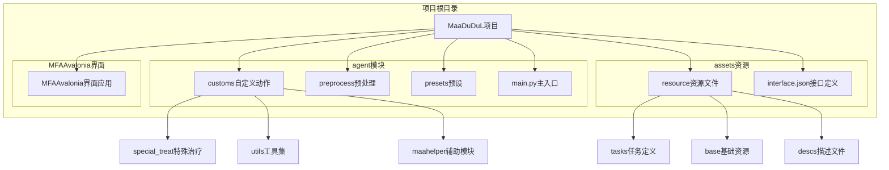
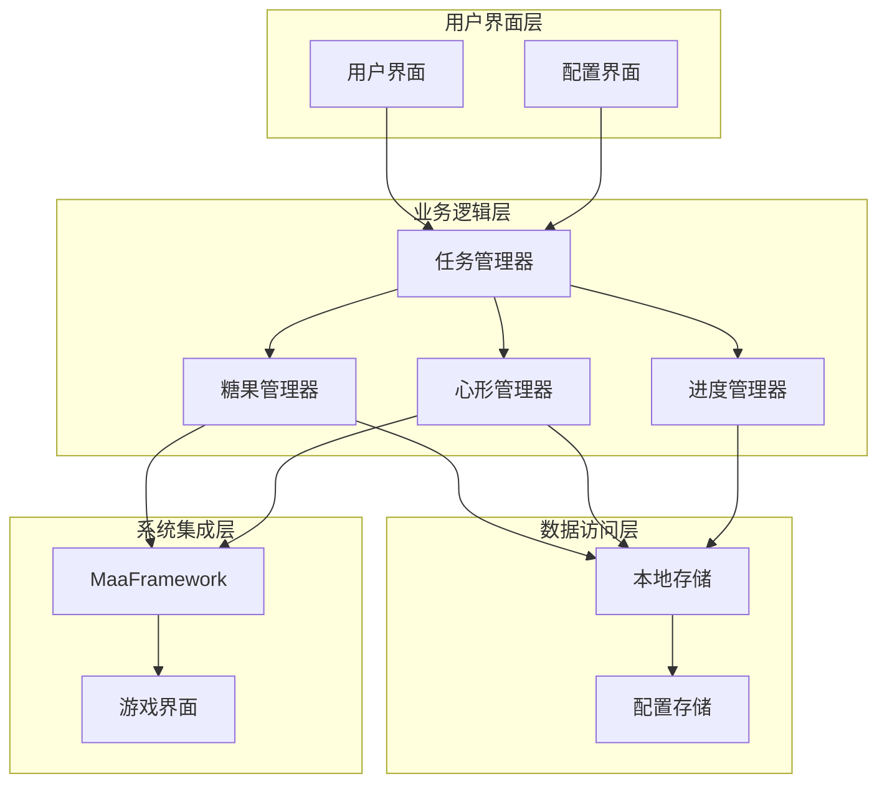
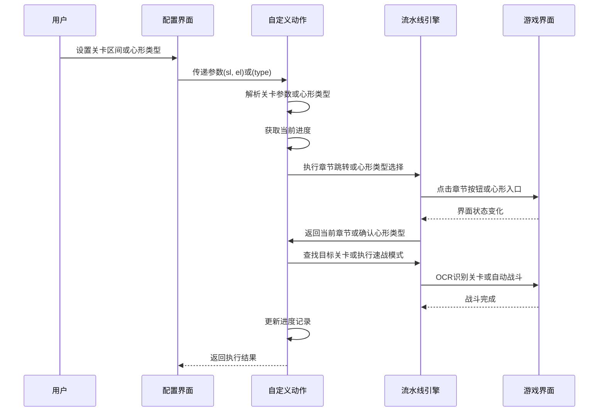
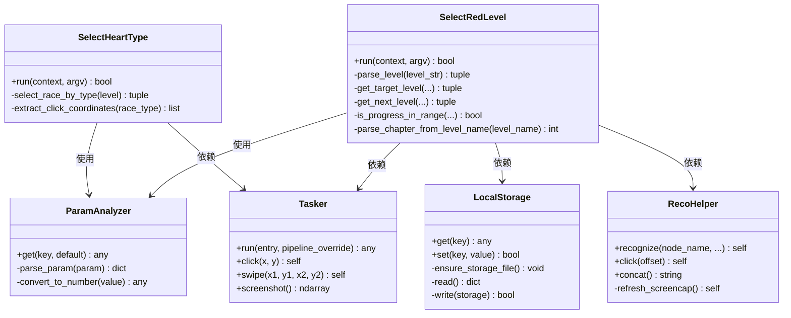
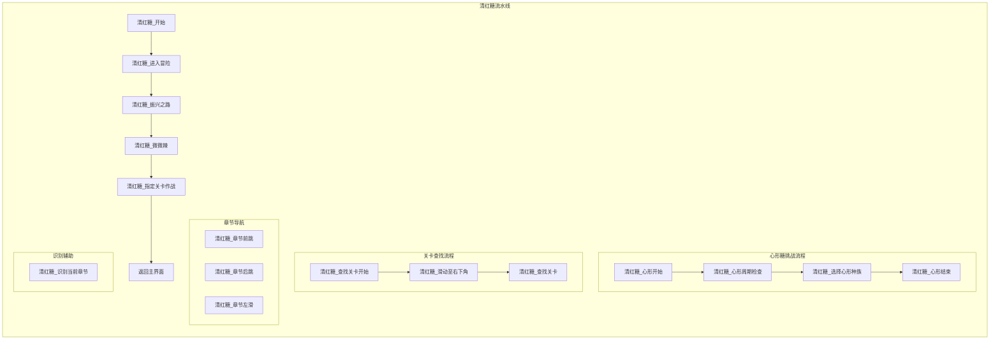
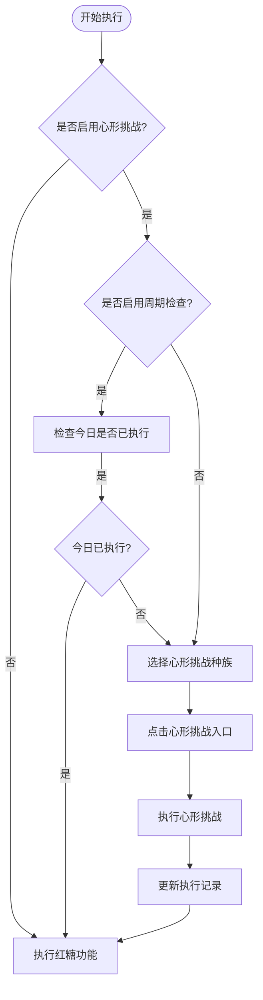
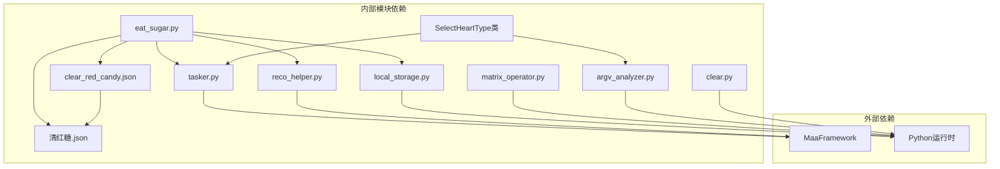
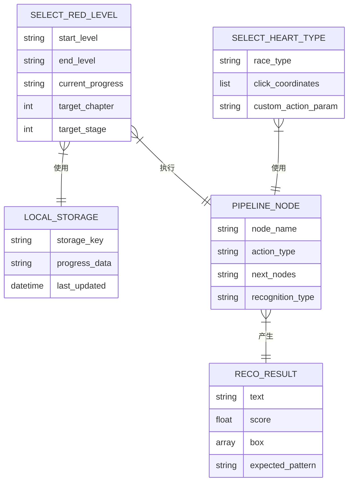

# 每日清红糖功能

<cite>
**本文档引用的文件**
- [clear_red_candy.json](file://assets/resource/tasks/daily/clear_red_candy.json)
- [eat_sugar.py](file://agent/customs/special_treat/eat_sugar.py)
- [清红糖.json](file://assets/resource/base/pipeline/日常任务/清红糖.json)
- [local_storage.py](file://agent/customs/utils/local_storage.py)
- [reco_helper.py](file://agent/customs/maahelper/reco_helper.py)
- [tasker.py](file://agent/customs/maahelper/tasker.py)
- [matrix_operator.py](file://agent/customs/utils/matrix_operator.py)
- [clear.py](file://agent/preprocess/clear.py)
- [clear_red_candy.md](file://assets/resource/descs/daily/clear_red_candy.md)
- [README.md](file://README.md)
</cite>

## 更新摘要
**所做更改**
- 新增心形糖清除功能章节，详细介绍新增的SelectHeartType自定义动作类
- 扩展任务配置部分，增加心形糖相关的选项和配置
- 更新架构概览，包含心形糖功能的集成
- 新增心形糖挑战类型选择机制的详细说明
- 扩展依赖关系分析，包含心形糖功能的组件

## 目录
1. [简介](#简介)
2. [项目结构](#项目结构)
3. [核心组件](#核心组件)
4. [架构概览](#架构概览)
5. [详细组件分析](#详细组件分析)
6. [心形糖功能](#心形糖功能)
7. [依赖关系分析](#依赖关系分析)
8. [性能考虑](#性能考虑)
9. [故障排除指南](#故障排除指南)
10. [结论](#结论)

## 简介

每日清红糖功能是MaaDuDuL项目中的一个重要自动化功能，专门用于清理游戏中红色糖果关卡。该功能基于MaaFramework和MFAAvalonia构建，能够自动完成从进入游戏界面到完成关卡挑战的完整流程。

根据项目README文档，清红糖功能属于"清体力"类别，主要用于获取角色培养所需的装备合成素材。该功能具有以下特点：

- **自动化程度高**：从进入游戏到完成关卡挑战全程自动化
- **智能进度管理**：支持关卡区间循环执行和进度持久化
- **用户友好**：提供直观的配置界面和详细的错误处理
- **稳定性强**：具备完善的异常处理和恢复机制
- **扩展性强**：支持心形糖挑战等新功能的集成

## 项目结构

该项目采用模块化设计，将不同的功能特性分布在相应的目录结构中：

**图表来源**
- [README.md:28-66](file://README.md#L28-L66)

**章节来源**
- [README.md:1-117](file://README.md#L1-L117)

## 核心组件

每日清红糖功能由多个核心组件协同工作，形成完整的自动化解决方案：

### 主要功能模块

1. **自定义动作模块** (`eat_sugar.py`)
   - 实现SelectRedLevel类，负责红糖关卡的选择和执行
   - 实现SelectHeartType类，负责心形糖挑战类型的选择和执行
   - 提供关卡区间循环执行和进度持久化功能

2. **任务配置模块** (`clear_red_candy.json`)
   - 定义任务的基本信息和选项配置
   - 支持关卡区间的动态参数传递
   - 新增心形糖挑战选项和配置

3. **流水线执行模块** (`清红糖.json`)
   - 提供完整的UI自动化流程定义
   - 包含关卡查找、章节跳转、战斗执行等功能节点
   - 扩展支持心形糖挑战的执行流程

4. **辅助工具模块**
   - LocalStorage：提供本地持久化存储功能
   - RecoHelper：封装识别结果处理和点击操作
   - Tasker：封装MaaFramework任务执行接口

**章节来源**
- [eat_sugar.py:283-331](file://agent/customs/special_treat/eat_sugar.py#L283-L331)
- [clear_red_candy.json:1-153](file://assets/resource/tasks/daily/clear_red_candy.json#L1-L153)

## 架构概览

每日清红糖功能采用分层架构设计，各层职责明确，耦合度低：

**图表来源**
- [eat_sugar.py:283-331](file://agent/customs/special_treat/eat_sugar.py#L283-L331)
- [local_storage.py:10-111](file://agent/customs/utils/local_storage.py#L10-L111)

### 数据流架构

**图表来源**
- [eat_sugar.py:333-448](file://agent/customs/special_treat/eat_sugar.py#L333-L448)
- [清红糖.json:25-311](file://assets/resource/base/pipeline/日常任务/清红糖.json#L25-L311)

## 详细组件分析

### 自定义动作组件

#### SelectHeartType类分析

SelectHeartType是新增的心形糖功能核心自定义动作类，实现了心形挑战类型选择和执行逻辑：

**图表来源**
- [eat_sugar.py:283-331](file://agent/customs/special_treat/eat_sugar.py#L283-L331)
- [eat_sugar.py:333-448](file://agent/customs/special_treat/eat_sugar.py#L333-L448)
- [argv_analyzer.py:17-159](file://agent/customs/maahelper/argv_analyzer.py#L17-L159)
- [local_storage.py:10-111](file://agent/customs/utils/local_storage.py#L10-L111)
- [reco_helper.py:17-256](file://agent/customs/maahelper/reco_helper.py#L17-L256)
- [tasker.py:16-190](file://agent/customs/maahelper/tasker.py#L16-L190)

#### 心形挑战类型映射

SelectHeartType类支持七种不同种族的心形挑战，每种种族对应特定的点击坐标：

| 种族类型 | 坐标位置 | 功能说明 |
|----------|----------|----------|
| 龙族 | [408, 168] | 基础心形挑战入口 |
| 精灵 | [638, 185] | 魔法系心形挑战入口 |
| 幽灵 | [883, 171] | 隐秘系心形挑战入口 |
| 仙灵 | [662, 341] | 自然系心形挑战入口 |
| 魔女 | [900, 323] | 咒术系心形挑战入口 |
| 自然灵 | [381, 463] | 生命系心形挑战入口 |
| 兽人 | [868, 488] | 力量系心形挑战入口 |

**章节来源**
- [eat_sugar.py:283-331](file://agent/customs/special_treat/eat_sugar.py#L283-L331)

### 任务配置组件

#### 任务定义分析

任务配置文件定义了清红糖功能的完整参数和行为，现已扩展支持心形糖功能：

| 配置项 | 类型 | 描述 | 默认值 |
|--------|------|------|--------|
| 任务名称 | string | 任务显示名称 | "清红糖" |
| 标签 | string | UI标签显示 | "🍭清红糖" |
| 入口节点 | string | 任务起始节点 | "清红糖_开始" |
| 关卡区间 | object | 起始和结束关卡配置 | - |
| 心形挑战 | option | 心形糖挑战开关 | - |
| 周期检查 | option | 每日检查限制 | - |
| 种族选择 | select | 七种心形挑战类型 | - |

**章节来源**
- [clear_red_candy.json:1-153](file://assets/resource/tasks/daily/clear_red_candy.json#L1-L153)

### 流水线执行组件

#### 流程节点分析

流水线文件定义了完整的UI自动化流程，现已扩展支持心形糖挑战：

**图表来源**
- [清红糖.json:25-311](file://assets/resource/base/pipeline/日常任务/清红糖.json#L25-L311)

**章节来源**
- [清红糖.json:1-311](file://assets/resource/base/pipeline/日常任务/清红糖.json#L1-L311)

## 心形糖功能

### 功能概述

心形糖功能是清红糖功能的重要扩展，专门用于处理游戏中的心形挑战。该功能支持七种不同种族的心形挑战，每种挑战都有独特的属性和效果。

### 核心特性

1. **多种族支持**：支持龙族、精灵、幽灵、仙灵、魔女、自然灵、兽人七种心形挑战
2. **智能坐标映射**：每种种族对应特定的游戏界面坐标
3. **无缝集成**：与现有红糖功能完全兼容，共享相同的配置界面
4. **周期检查机制**：可配置每日仅检查一次，避免重复执行

### 配置选项

心形糖功能通过以下配置选项提供灵活的控制：

| 选项名称 | 类型 | 描述 | 默认行为 |
|----------|------|------|----------|
| 清红糖-心形 | switch | 启用心形糖挑战功能 | 关闭 |
| 清红糖-心形-周期检查 | switch | 每日仅检查一次 | 关闭 |
| 清红糖-心形-种族选择 | select | 选择心形挑战种族 | 无默认值 |

### 执行流程

**图表来源**
- [eat_sugar.py:283-331](file://agent/customs/special_treat/eat_sugar.py#L283-L331)
- [clear_red_candy.json:13-108](file://assets/resource/tasks/daily/clear_red_candy.json#L13-L108)

**章节来源**
- [eat_sugar.py:283-331](file://agent/customs/special_treat/eat_sugar.py#L283-L331)
- [clear_red_candy.json:13-108](file://assets/resource/tasks/daily/clear_red_candy.json#L13-L108)

## 依赖关系分析

### 组件依赖图

**图表来源**
- [eat_sugar.py:9-16](file://agent/customs/special_treat/eat_sugar.py#L9-L16)
- [tasker.py:7-13](file://agent/customs/maahelper/tasker.py#L7-L13)

### 数据依赖关系

**图表来源**
- [eat_sugar.py:283-331](file://agent/customs/special_treat/eat_sugar.py#L283-L331)
- [eat_sugar.py:333-448](file://agent/customs/special_treat/eat_sugar.py#L333-L448)
- [local_storage.py:80-111](file://agent/customs/utils/local_storage.py#L80-L111)

**章节来源**
- [eat_sugar.py:15-16](file://agent/customs/special_treat/eat_sugar.py#L15-L16)
- [tasker.py:7-13](file://agent/customs/maahelper/tasker.py#L7-L13)

## 性能考虑

### 执行效率优化

1. **智能进度管理**
   - 使用LocalStorage持久化关卡进度，避免重复执行已完成的关卡
   - 支持关卡区间循环执行，提高整体效率
   - 心形糖功能支持周期检查，避免重复执行

2. **识别优化**
   - 采用OCR识别当前章节，减少不必要的界面跳转
   - 支持识别结果缓存，降低重复识别开销
   - 心形糖功能使用坐标点击，避免复杂的界面识别

3. **网络和I/O优化**
   - 本地存储使用JSON文件格式，读写效率高
   - 预处理阶段清理调试图片，避免磁盘空间浪费
   - 心形糖功能使用直接坐标点击，减少识别延迟

### 内存管理

- 自动垃圾回收机制，避免长时间运行内存泄漏
- 截图缓存管理，及时释放不需要的图像数据
- 识别结果过滤，只保留高质量的结果
- 心形糖功能使用静态坐标映射，减少动态计算开销

## 故障排除指南

### 常见问题及解决方案

#### 关卡识别失败

**问题现象**：系统无法识别目标关卡或章节

**可能原因**：
1. OCR识别参数设置不当
2. 游戏界面分辨率不匹配
3. 屏幕截图质量差

**解决步骤**：
1. 检查OCR识别ROI区域设置
2. 验证游戏界面缩放比例
3. 确认截图功能正常工作

#### 进度记录异常

**问题现象**：关卡进度无法正确保存或读取

**可能原因**：
1. 本地存储文件权限问题
2. JSON格式损坏
3. 路径配置错误

**解决步骤**：
1. 检查config/mddl目录权限
2. 验证local_storage.json文件完整性
3. 确认存储路径配置正确

#### 章节跳转失败

**问题现象**：无法正确跳转到目标章节

**可能原因**：
1. 章节按钮坐标偏移
2. 界面元素识别错误
3. 滑动距离设置不当

**解决步骤**：
1. 调整章节跳转节点的点击坐标
2. 验证OCR识别准确性
3. 检查滑动操作参数

#### 心形糖挑战失败

**问题现象**：心形糖挑战无法正常执行

**可能原因**：
1. 心形入口坐标不正确
2. 种族选择参数错误
3. 游戏界面布局变化

**解决步骤**：
1. 验证心形入口坐标映射
2. 检查种族选择参数格式
3. 确认游戏界面元素可见性

**章节来源**
- [clear.py:10-41](file://agent/preprocess/clear.py#L10-L41)
- [prompter.py:16-55](file://agent/customs/utils/prompter.py#L16-L55)

### 调试和监控

系统提供了完善的错误处理和调试功能：

1. **统一错误处理**：所有异常都会通过Prompter.error进行格式化输出
2. **进度跟踪**：详细的日志记录，便于问题诊断
3. **自动恢复**：关键节点失败时的回退机制
4. **心形糖调试**：新增的心形糖功能错误处理和状态监控

## 结论

每日清红糖功能展现了现代自动化测试框架的强大能力。通过精心设计的模块化架构和完善的错误处理机制，该功能实现了高度可靠的自动化关卡清理。

### 主要优势

1. **高度自动化**：从参数配置到执行完成全程无需人工干预
2. **智能进度管理**：支持关卡区间循环执行和进度持久化
3. **稳定可靠**：完善的异常处理和恢复机制
4. **易于扩展**：模块化设计便于功能扩展和维护
5. **功能丰富**：支持红糖和心形糖双重挑战类型

### 技术亮点

- **分层架构设计**：清晰的职责分离和低耦合度
- **智能识别算法**：基于OCR的界面元素识别
- **持久化存储**：可靠的进度记录和状态管理
- **用户友好界面**：直观的配置和监控界面
- **多挑战支持**：红糖和心形糖双模式并行

### 新功能价值

心形糖功能的加入进一步提升了系统的实用性：

- **多样化挑战**：支持七种不同属性的心形挑战
- **智能选择**：自动化的种族选择和坐标映射
- **周期控制**：防止重复执行，优化资源利用
- **无缝集成**：与现有功能完全兼容，无额外学习成本

该功能不仅提高了游戏自动化效率，也为类似场景的自动化开发提供了优秀的参考实现。通过持续的优化和改进，相信该功能能够在未来的版本中发挥更大的价值。