# 每日采购功能

<cite>
**本文档引用的文件**
- [每日采购.json](file://assets/resource/base/pipeline/日常任务/每日采购.json)
- [purchase.md](file://assets/resource/descs/daily/purchase.md)
- [store.py](file://agent/customs/special_treat/store.py)
- [tasker.py](file://agent/customs/maahelper/tasker.py)
- [argv_analyzer.py](file://agent/customs/maahelper/argv_analyzer.py)
- [prompter.py](file://agent/customs/utils/prompter.py)
- [main.py](file://agent/main.py)
</cite>

## 更新摘要
**所做更改**
- 新增特殊商店购买功能章节，详细介绍SpecialBuy自定义动作实现
- 更新商店购买模块，增加2x3网格购买模式的详细说明
- 新增OCR识别支持在特殊商店购买中的应用
- 更新架构概览，反映新增的特殊商店购买流程
- 增强故障排除指南，包含特殊商店购买相关的调试技巧

## 目录
1. [简介](#简介)
2. [项目结构](#项目结构)
3. [核心组件](#核心组件)
4. [架构概览](#架构概览)
5. [详细组件分析](#详细组件分析)
6. [特殊商店购买功能](#特殊商店购买功能)
7. [依赖关系分析](#依赖关系分析)
8. [性能考虑](#性能考虑)
9. [故障排除指南](#故障排除指南)
10. [结论](#结论)

## 简介

每日采购功能是MaaDuDuL自动化框架中的一个核心日常任务模块，专门用于自动执行游戏中的商店采购和礼包领取操作。该功能通过智能的OCR识别和模板匹配技术，实现了对日常商店、尊享商店、战斗宝石商店等多种商店类型的自动化操作。

### 功能特性
- **多商店支持**：涵盖日常商店、尊享商店、战斗宝石商店、普通商店等
- **智能识别**：基于OCR文字识别和模板匹配的双重验证机制
- **周期管理**：支持每日、每周、每月礼包的周期性检查和记录
- **异常处理**：完善的错误处理和重试机制
- **可视化流程**：通过MPE可视化编辑器构建复杂的任务流程
- **特殊商店购买**：新增的2x3网格购买模式，支持固定位置的商品批量购买

## 项目结构

每日采购功能的代码组织遵循清晰的分层架构，主要分为以下几个层次：

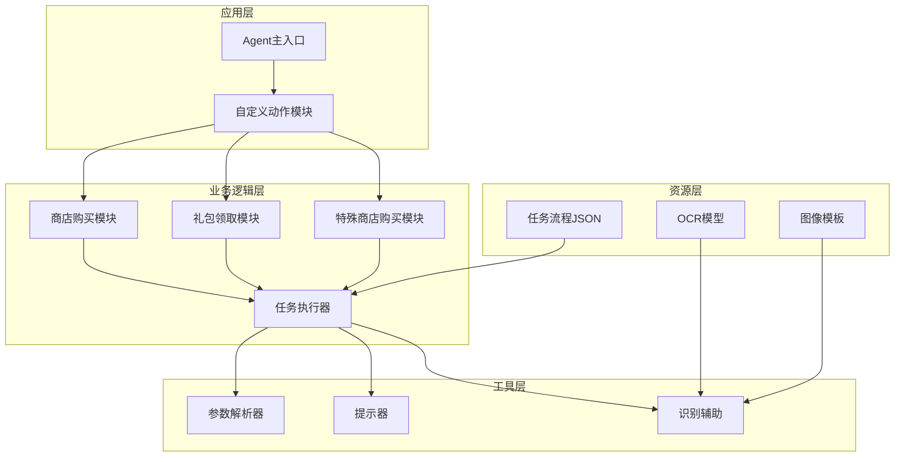

**图表来源**
- [main.py:47-78](file://agent/main.py#L47-L78)
- [store.py:14-136](file://agent/customs/special_treat/store.py#L14-L136)
- [tasker.py:16-190](file://agent/customs/maahelper/tasker.py#L16-L190)

**章节来源**
- [main.py:1-78](file://agent/main.py#L1-L78)
- [store.py:1-136](file://agent/customs/special_treat/store.py#L1-L136)

## 核心组件

### 任务流程引擎

每日采购功能的核心是基于MaaFramework的任务流程引擎，通过JSON配置文件定义完整的自动化流程。每个商店类型都有独立的处理流程，包括入口检查、状态判断、具体操作和结果验证等步骤。

### 自定义动作模块

系统提供了三个核心的自定义动作类，用于处理不同的业务场景：

1. **Gift类**：专门处理礼包领取操作
2. **Buy类**：专门处理商品购买操作
3. **SpecialBuy类**：新增的特殊商店批量购买操作

这些类通过装饰器注册到Agent服务器，使其能够在任务流程中作为自定义动作调用。

### 任务执行器

Tasker类封装了MaaFramework的所有核心操作，包括截图、点击、滑动、等待等功能，为上层业务逻辑提供统一的操作接口。

**章节来源**
- [tasker.py:16-190](file://agent/customs/maahelper/tasker.py#L16-L190)
- [store.py:14-136](file://agent/customs/special_treat/store.py#L14-L136)

## 架构概览

每日采购功能采用分层架构设计，各层职责明确，耦合度低，便于维护和扩展。

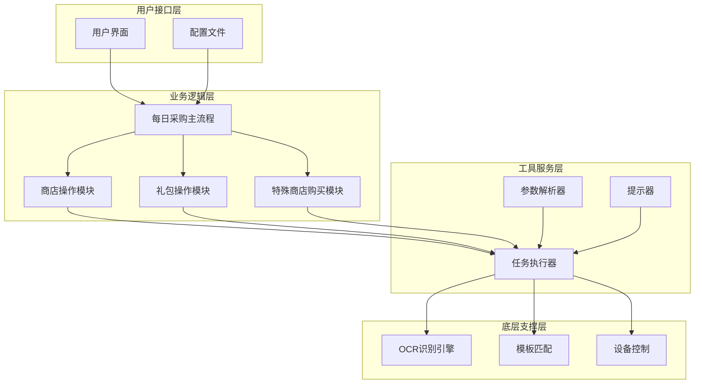

**图表来源**
- [每日采购.json:25-1534](file://assets/resource/base/pipeline/日常任务/每日采购.json#L25-L1534)
- [store.py:21-136](file://agent/customs/special_treat/store.py#L21-L136)
- [tasker.py:33-190](file://agent/customs/maahelper/tasker.py#L33-L190)

## 详细组件分析

### 商店购买模块

商店购买模块是每日采购功能的核心组件，负责处理各种商店的商品购买操作。

#### Buy类分析

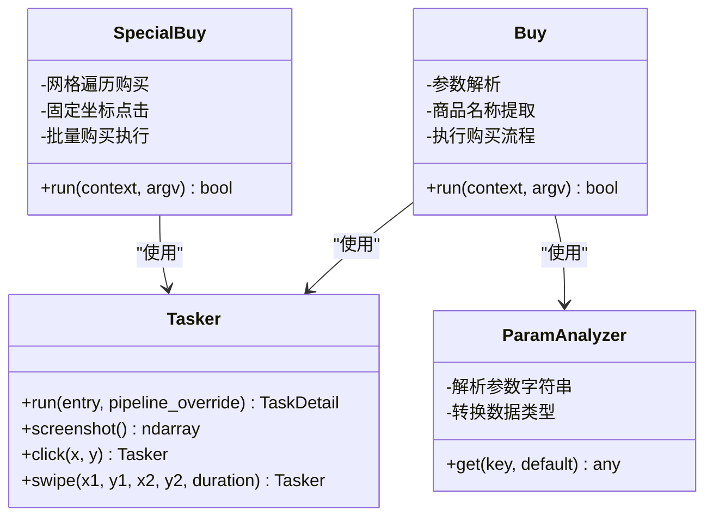

**图表来源**
- [store.py:52-136](file://agent/customs/special_treat/store.py#L52-L136)
- [tasker.py:60-122](file://agent/customs/maahelper/tasker.py#L60-L122)
- [argv_analyzer.py:103-159](file://agent/customs/maahelper/argv_analyzer.py#L103-L159)

Buy类提供了灵活的商品购买接口，支持多种参数格式：

- **商品名称参数**：支持`goods`、`g`、`commodity`、`c`等多种别名
- **动态参数解析**：自动识别JSON和查询字符串格式
- **类型转换**：自动将数字字符串转换为对应的数值类型

#### 商品购买流程

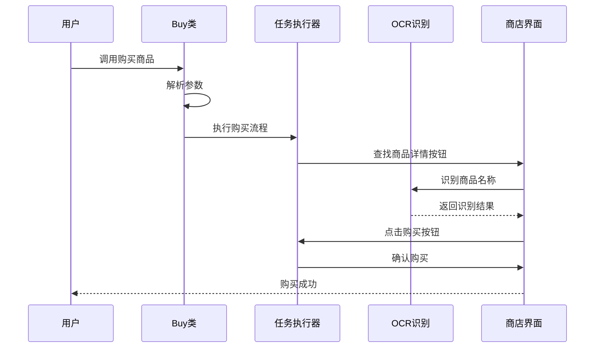

**图表来源**
- [store.py:59-136](file://agent/customs/special_treat/store.py#L59-L136)
- [tasker.py:60-122](file://agent/customs/maahelper/tasker.py#L60-L122)

**章节来源**
- [store.py:52-136](file://agent/customs/special_treat/store.py#L52-L136)
- [argv_analyzer.py:17-159](file://agent/customs/maahelper/argv_analyzer.py#L17-L159)

### 礼包领取模块

礼包领取模块专门处理各种免费礼包的自动领取操作，包括每日、每周、每月礼包。

#### Gift类分析

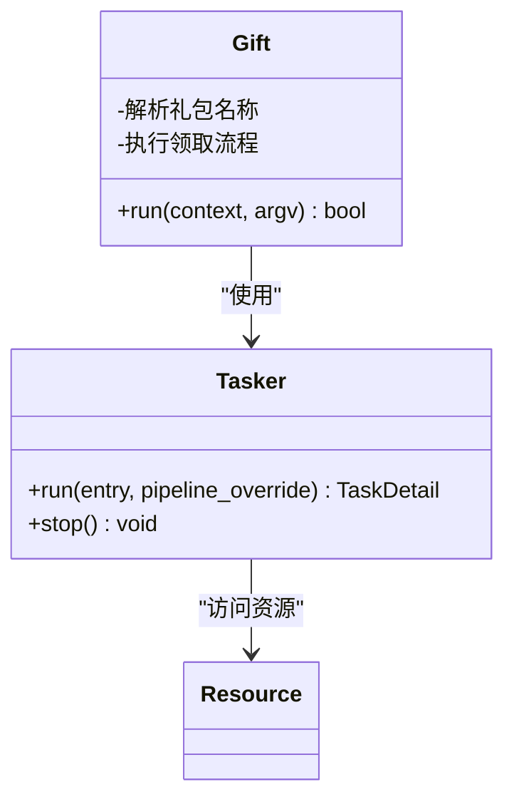

**图表来源**
- [store.py:14-50](file://agent/customs/special_treat/store.py#L14-L50)
- [tasker.py:60-122](file://agent/customs/maahelper/tasker.py#L60-L122)

Gift类的设计简洁高效，主要特点包括：

- **参数灵活性**：支持`gift`和`g`两种参数格式
- **流程封装**：内部封装完整的领取流程
- **错误处理**：完善的异常捕获和错误报告机制

#### 礼包领取流程

**图表来源**
- [store.py:21-49](file://agent/customs/special_treat/store.py#L21-L49)

**章节来源**
- [store.py:14-50](file://agent/customs/special_treat/store.py#L14-L50)

### 任务执行器

任务执行器是整个系统的基础设施，提供了统一的任务执行接口和强大的监控能力。

#### 核心功能

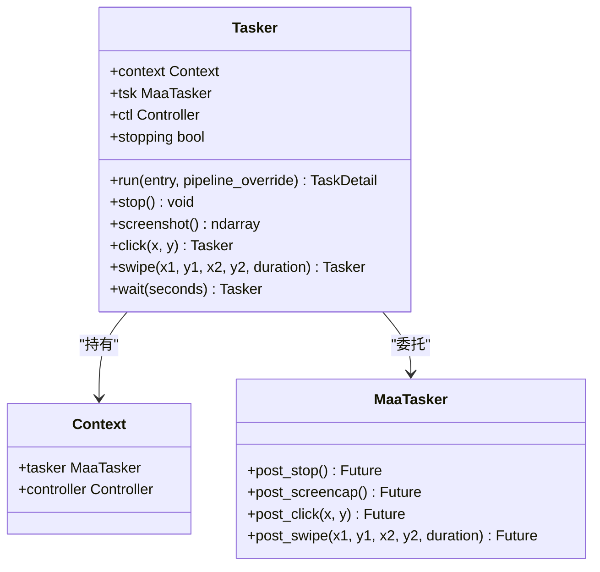

**图表来源**
- [tasker.py:16-190](file://agent/customs/maahelper/tasker.py#L16-L190)

任务执行器的主要优势：

- **自动注入监控**：为所有节点自动注入运行监测器
- **链式调用**：支持方法链式调用，提高代码可读性
- **类型安全**：完整的类型注解，便于IDE智能提示
- **异常处理**：内置的异常捕获和处理机制

**章节来源**
- [tasker.py:16-190](file://agent/customs/maahelper/tasker.py#L16-L190)

### 参数解析器

参数解析器负责处理来自MaaFramework的各种参数格式，支持JSON和查询字符串两种主要格式。

#### 解析策略

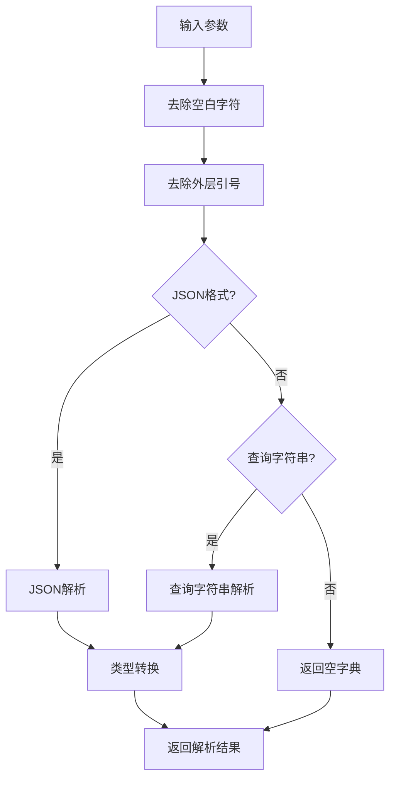

**图表来源**
- [argv_analyzer.py:48-101](file://agent/customs/maahelper/argv_analyzer.py#L48-L101)

参数解析器的特点：

- **多格式支持**：同时支持JSON和查询字符串格式
- **智能类型转换**：自动将数字字符串转换为对应数值类型
- **错误容错**：解析失败时优雅降级为空字典
- **灵活键名**：支持多种键名别名映射

**章节来源**
- [argv_analyzer.py:17-159](file://agent/customs/maahelper/argv_analyzer.py#L17-L159)

## 特殊商店购买功能

### SpecialBuy自定义动作实现

新增的SpecialBuy类是每日采购功能的重要扩展，专门处理特殊商店中的批量商品购买操作。该功能采用固定的2x3网格模式，按预设坐标依次购买前六个刷新商品。

#### 核心特性

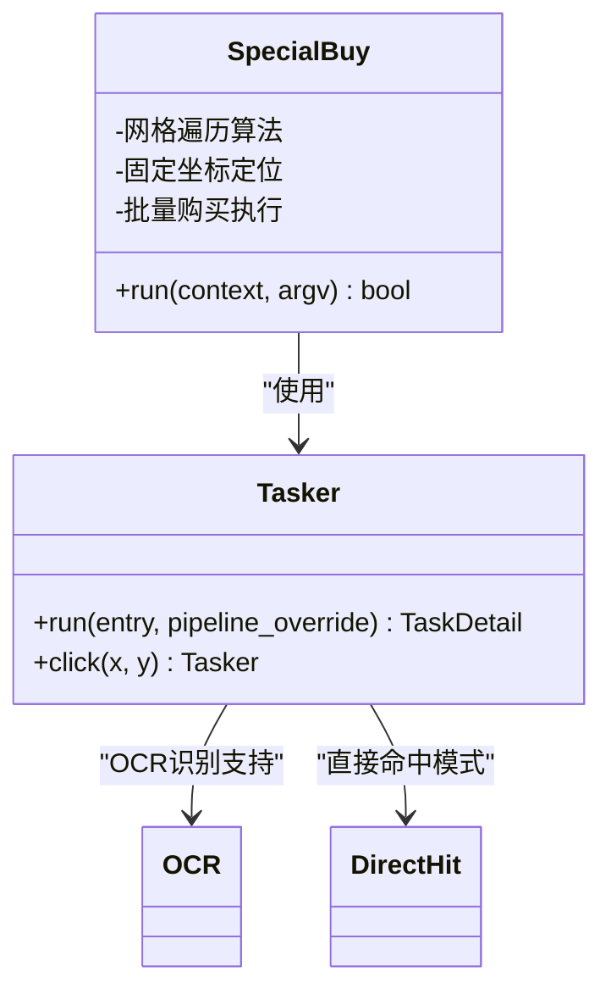

**图表来源**
- [store.py:100-136](file://agent/customs/special_treat/store.py#L100-L136)
- [tasker.py:60-122](file://agent/customs/maahelper/tasker.py#L60-L122)

#### 2x3网格购买模式

SpecialBuy实现了精确的网格定位系统：

- **行列遍历**：按行优先顺序遍历2行3列的网格
- **固定坐标系统**：使用预设坐标偏移量计算实际点击位置
- **精确点击**：每个商品位置都经过精确计算和验证
- **延时控制**：每购买一个商品后添加0.4秒延时

#### OCR识别支持

在特殊商店购买中，系统集成了OCR识别支持：

- **界面识别**：通过OCR识别"特別商店"界面标题
- **状态验证**：验证商店界面的正确加载
- **商品定位**：结合OCR和DirectHit模式精确定位商品

#### 购买流程

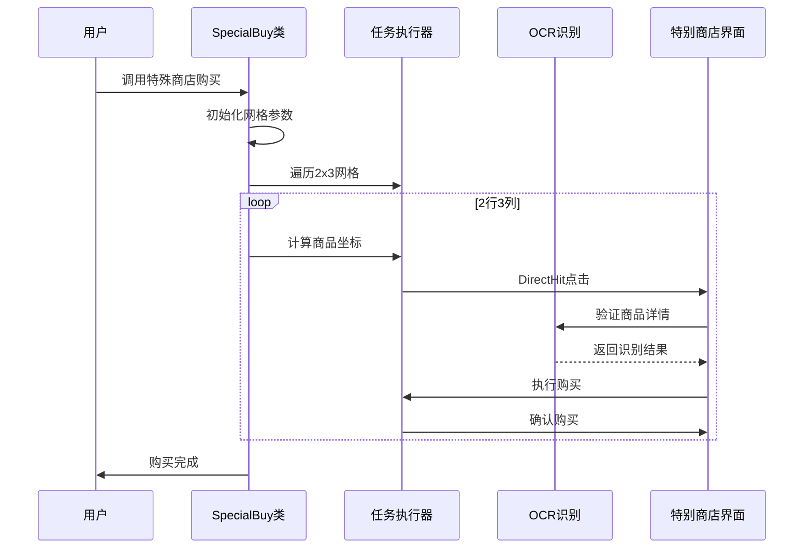

**图表来源**
- [store.py:117-136](file://agent/customs/special_treat/store.py#L117-L136)
- [tasker.py:60-122](file://agent/customs/maahelper/tasker.py#L60-L122)

**章节来源**
- [store.py:100-136](file://agent/customs/special_treat/store.py#L100-L136)
- [每日采购.json:1355-1386](file://assets/resource/base/pipeline/日常任务/每日采购.json#L1355-L1386)

## 依赖关系分析

每日采购功能的依赖关系相对简单，主要依赖于MaaFramework提供的核心功能。

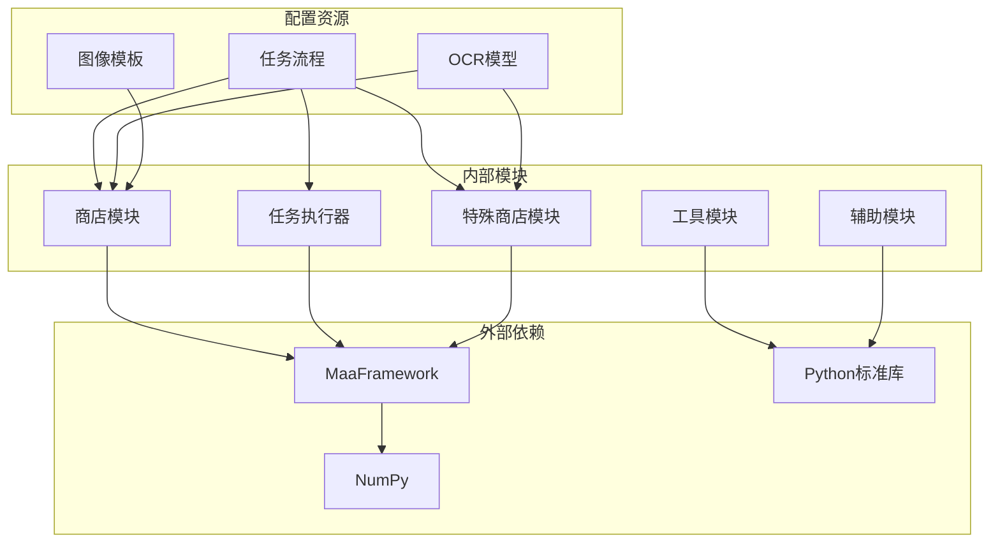

**图表来源**
- [main.py:49-62](file://agent/main.py#L49-L62)
- [store.py:6-13](file://agent/customs/special_treat/store.py#L6-L13)

### 核心依赖

| 依赖项 | 版本要求 | 用途 |
|--------|----------|------|
| MaaFramework | 最新稳定版 | 核心自动化框架 |
| NumPy | 1.21+ | 图像处理和数组操作 |
| Python | 3.8+ | 语言运行时环境 |

### 模块间依赖

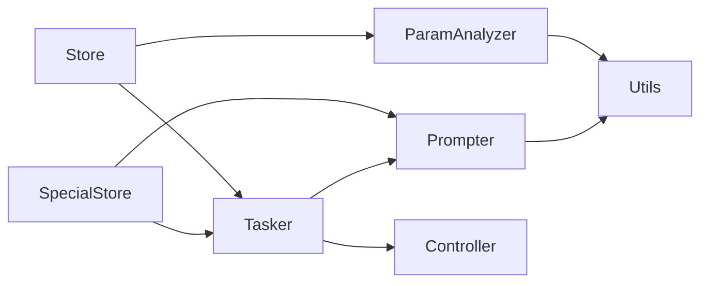

**图表来源**
- [store.py:10-13](file://agent/customs/special_treat/store.py#L10-L13)
- [tasker.py:7-9](file://agent/customs/maahelper/tasker.py#L7-L9)

**章节来源**
- [main.py:49-62](file://agent/main.py#L49-L62)
- [store.py:6-13](file://agent/customs/special_treat/store.py#L6-L13)

## 性能考虑

### 识别效率优化

每日采购功能在识别效率方面采用了多项优化策略：

1. **ROI区域限制**：通过限定识别区域减少计算量
2. **模板匹配缓存**：避免重复的模板匹配操作
3. **OCR优先级**：根据识别难度调整识别优先级
4. **DirectHit模式**：特殊商店购买中使用直接命中模式提高效率

### 内存管理

- **及时释放**：识别完成后及时释放内存资源
- **批量操作**：合并相似操作减少函数调用开销
- **资源复用**：复用已有的连接和句柄

### 网络和I/O优化

- **异步操作**：尽可能使用异步API减少阻塞
- **批量处理**：将多个小操作合并为批量操作
- **缓存策略**：对频繁使用的数据建立缓存

## 故障排除指南

### 常见问题及解决方案

#### 识别失败

**问题现象**：OCR识别或模板匹配失败
**可能原因**：
- 屏幕分辨率不匹配
- 游戏界面元素变化
- 网络延迟导致的截图延迟

**解决方法**：
1. 检查屏幕分辨率设置
2. 更新识别模板和OCR模型
3. 增加适当的等待时间

#### 点击位置错误

**问题现象**：点击位置与预期不符
**可能原因**：
- 屏幕缩放比例不正确
- 设备分辨率差异
- 界面布局变化

**解决方法**：
1. 调整坐标偏移量
2. 使用相对坐标而非绝对坐标
3. 实现自适应布局检测

#### 任务超时

**问题现象**：任务执行超过预设时间
**可能原因**：
- 网络连接不稳定
- 游戏响应缓慢
- 系统资源不足

**解决方法**：
1. 增加超时阈值
2. 添加重试机制
3. 优化任务流程

#### 特殊商店购买问题

**问题现象**：SpecialBuy动作执行失败
**可能原因**：
- 网格坐标偏移量不正确
- OCR识别失败
- DirectHit模式不适用

**解决方法**：
1. 检查并调整网格坐标参数
2. 验证OCR识别准确性
3. 确认DirectHit模式的适用性
4. 添加适当的延时和重试机制

**章节来源**
- [prompter.py:16-55](file://agent/customs/utils/prompter.py#L16-L55)
- [tasker.py:124-183](file://agent/customs/maahelper/tasker.py#L124-L183)
- [store.py:117-136](file://agent/customs/special_treat/store.py#L117-L136)

### 调试技巧

1. **启用详细日志**：使用`Prompter.log()`输出详细执行信息
2. **截图分析**：利用`screenshot()`功能保存关键界面
3. **参数验证**：检查参数解析结果的正确性
4. **流程监控**：观察任务执行的每个步骤
5. **特殊商店调试**：使用日志输出确认网格遍历的每个步骤

## 结论

每日采购功能展现了现代自动化框架的最佳实践，通过精心设计的架构和完善的工具链，实现了高度可靠的商店采购自动化。该系统的主要优势包括：

### 技术优势

- **模块化设计**：清晰的分层架构便于维护和扩展
- **强类型支持**：完整的类型注解提高代码质量
- **智能识别**：结合OCR和模板匹配的双重验证
- **异常处理**：完善的错误处理和恢复机制
- **特殊商店支持**：新增的2x3网格购买模式提升了自动化程度

### 应用价值

- **提升效率**：大幅减少重复性手工操作
- **保证一致性**：标准化的操作流程确保结果一致
- **降低门槛**：友好的API设计降低使用难度
- **易于集成**：良好的模块化设计便于与其他系统集成
- **灵活扩展**：支持新增商店类型和购买模式

### 发展前景

随着游戏内容的不断更新，每日采购功能将继续演进，重点发展方向包括：

1. **智能化识别**：引入更先进的机器学习算法
2. **自适应布局**：支持更多设备和分辨率
3. **扩展功能**：增加更多商店类型的支持
4. **性能优化**：进一步提升执行效率和稳定性
5. **特殊商店优化**：改进网格定位算法和识别精度

该功能为MaaDuDuL项目提供了坚实的基础，也为其他类似自动化需求提供了优秀的参考模板。新增的特殊商店购买功能进一步增强了系统的实用性和自动化水平，为用户提供了更加完整和高效的日常任务自动化解决方案。