# 每日采购功能

<cite>
**本文档引用的文件**
- [每日采购.json](file://assets/resource/base/pipeline/日常任务/每日采购.json)
- [purchase.md](file://assets/resource/descs/daily/purchase.md)
- [store.py](file://agent/customs/special_treat/store.py)
- [tasker.py](file://agent/customs/maahelper/tasker.py)
- [argv_analyzer.py](file://agent/customs/maahelper/argv_analyzer.py)
- [prompter.py](file://agent/customs/utils/prompter.py)
- [main.py](file://agent/main.py)
- [purchase.json](file://assets/resource/tasks/daily/purchase.json)
- [clear_red_candy.json](file://assets/resource/tasks/daily/clear_red_candy.json)
- [clear_purple_candy.json](file://assets/resource/tasks/daily/clear_purple_candy.json)
- [clear_red_candy.md](file://assets/resource/descs/daily/clear_red_candy.md)
- [clear_purple_candy.md](file://assets/resource/descs/daily/clear_purple_candy.md)
</cite>

## 更新摘要
**所做更改**
- 新增糖果购买功能章节，详细介绍BuyCandy自定义动作实现
- 更新商店购买模块，增加300+行新的流水线配置支持
- 新增糖果采购任务配置扩展，支持红糖和紫糖的批量购买
- 新增清红糖和清紫糖独立任务，支持关卡清理功能
- 更新架构概览，反映新增的糖果采购和清理流程
- 增强故障排除指南，包含糖果购买相关的调试技巧

## 目录
1. [简介](#简介)
2. [项目结构](#项目结构)
3. [核心组件](#核心组件)
4. [架构概览](#架构概览)
5. [详细组件分析](#详细组件分析)
6. [糖果购买功能](#糖果购买功能)
7. [依赖关系分析](#依赖关系分析)
8. [性能考虑](#性能考虑)
9. [故障排除指南](#故障排除指南)
10. [结论](#结论)

## 简介

每日采购功能是MaaDuDuL自动化框架中的一个核心日常任务模块，专门用于自动执行游戏中的商店采购和礼包领取操作。该功能通过智能的OCR识别和模板匹配技术，实现了对日常商店、尊享商店、战斗宝石商店等多种商店类型的自动化操作。

### 功能特性
- **多商店支持**：涵盖日常商店、尊享商店、战斗宝石商店、普通商店等
- **智能识别**：基于OCR文字识别和模板匹配的双重验证机制
- **周期管理**：支持每日、每周、每月礼包的周期性检查和记录
- **异常处理**：完善的错误处理和重试机制
- **可视化流程**：通过MPE可视化编辑器构建复杂的任务流程
- **特殊商店购买**：新增的2x3网格购买模式，支持固定位置的商品批量购买
- **糖果采购**：新增的红糖和紫糖购买功能，支持指定数量的批量采购
- **糖果清理**：独立的清红糖和清紫糖任务，支持关卡清理和材料获取

## 项目结构

每日采购功能的代码组织遵循清晰的分层架构，主要分为以下几个层次：

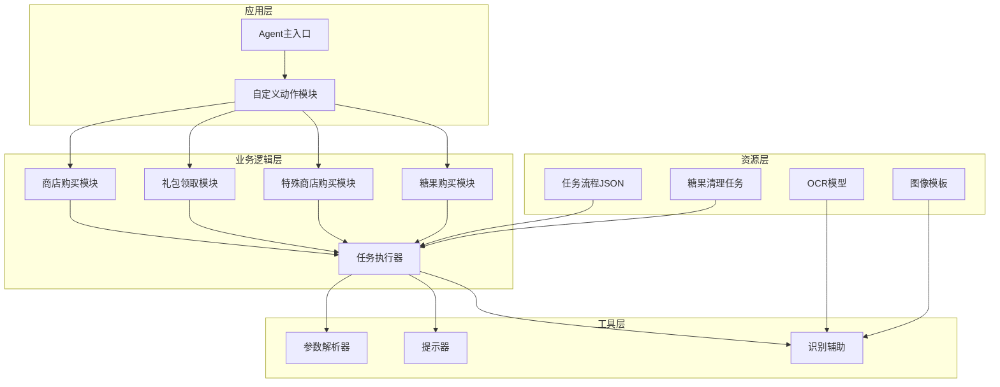

**图表来源**
- [main.py:47-78](file://agent/main.py#L47-L78)
- [store.py:14-186](file://agent/customs/special_treat/store.py#L14-L186)
- [tasker.py:16-190](file://agent/customs/maahelper/tasker.py#L16-L190)

**章节来源**
- [main.py:1-78](file://agent/main.py#L1-L78)
- [store.py:1-186](file://agent/customs/special_treat/store.py#L1-L186)

## 核心组件

### 任务流程引擎

每日采购功能的核心是基于MaaFramework的任务流程引擎，通过JSON配置文件定义完整的自动化流程。每个商店类型都有独立的处理流程，包括入口检查、状态判断、具体操作和结果验证等步骤。

### 自定义动作模块

系统提供了四个核心的自定义动作类，用于处理不同的业务场景：

1. **Gift类**：专门处理礼包领取操作
2. **Buy类**：专门处理商品购买操作
3. **SpecialBuy类**：新增的特殊商店批量购买操作
4. **BuyCandy类**：新增的糖果购买操作

这些类通过装饰器注册到Agent服务器，使其能够在任务流程中作为自定义动作调用。

### 任务执行器

Tasker类封装了MaaFramework的所有核心操作，包括截图、点击、滑动、等待等功能，为上层业务逻辑提供统一的操作接口。

**章节来源**
- [tasker.py:16-190](file://agent/customs/maahelper/tasker.py#L16-L190)
- [store.py:14-186](file://agent/customs/special_treat/store.py#L14-L186)

## 架构概览

每日采购功能采用分层架构设计，各层职责明确，耦合度低，便于维护和扩展。

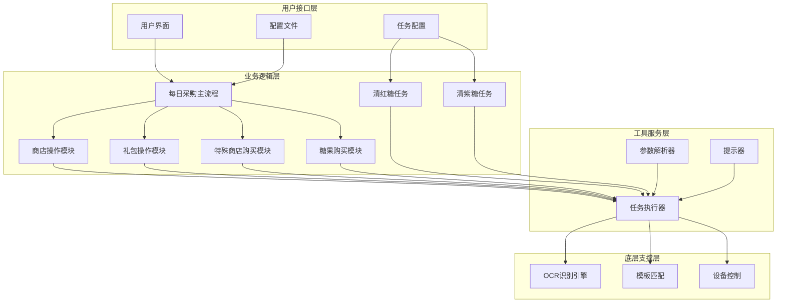

**图表来源**
- [每日采购.json:25-1872](file://assets/resource/base/pipeline/日常任务/每日采购.json#L25-L1872)
- [store.py:21-186](file://agent/customs/special_treat/store.py#L21-L186)
- [tasker.py:33-190](file://agent/customs/maahelper/tasker.py#L33-L190)

## 详细组件分析

### 商店购买模块

商店购买模块是每日采购功能的核心组件，负责处理各种商店的商品购买操作。

#### Buy类分析

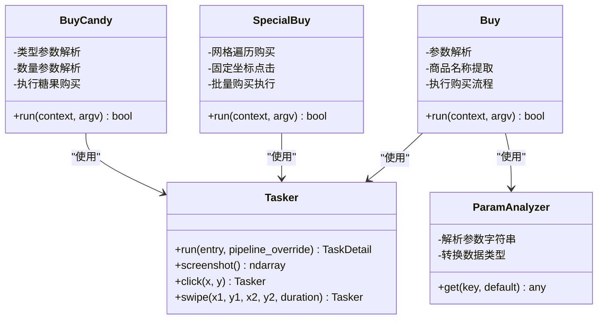

**图表来源**
- [store.py:52-186](file://agent/customs/special_treat/store.py#L52-L186)
- [tasker.py:60-122](file://agent/customs/maahelper/tasker.py#L60-L122)
- [argv_analyzer.py:103-159](file://agent/customs/maahelper/argv_analyzer.py#L103-L159)

Buy类提供了灵活的商品购买接口，支持多种参数格式：

- **商品名称参数**：支持`goods`、`g`、`commodity`、`c`等多种别名
- **动态参数解析**：自动识别JSON和查询字符串格式
- **类型转换**：自动将数字字符串转换为对应的数值类型

#### 商品购买流程

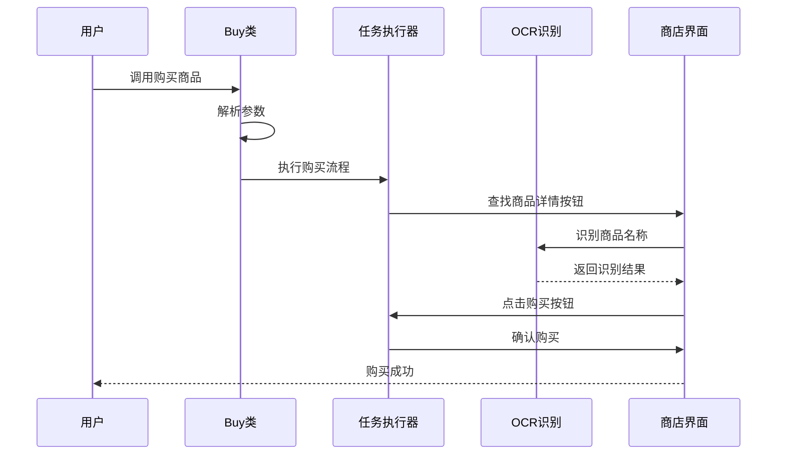

**图表来源**
- [store.py:59-186](file://agent/customs/special_treat/store.py#L59-L186)
- [tasker.py:60-122](file://agent/customs/maahelper/tasker.py#L60-L122)

**章节来源**
- [store.py:52-186](file://agent/customs/special_treat/store.py#L52-L186)
- [argv_analyzer.py:17-159](file://agent/customs/maahelper/argv_analyzer.py#L17-L159)

### 礼包领取模块

礼包领取模块专门处理各种免费礼包的自动领取操作，包括每日、每周、每月礼包。

#### Gift类分析

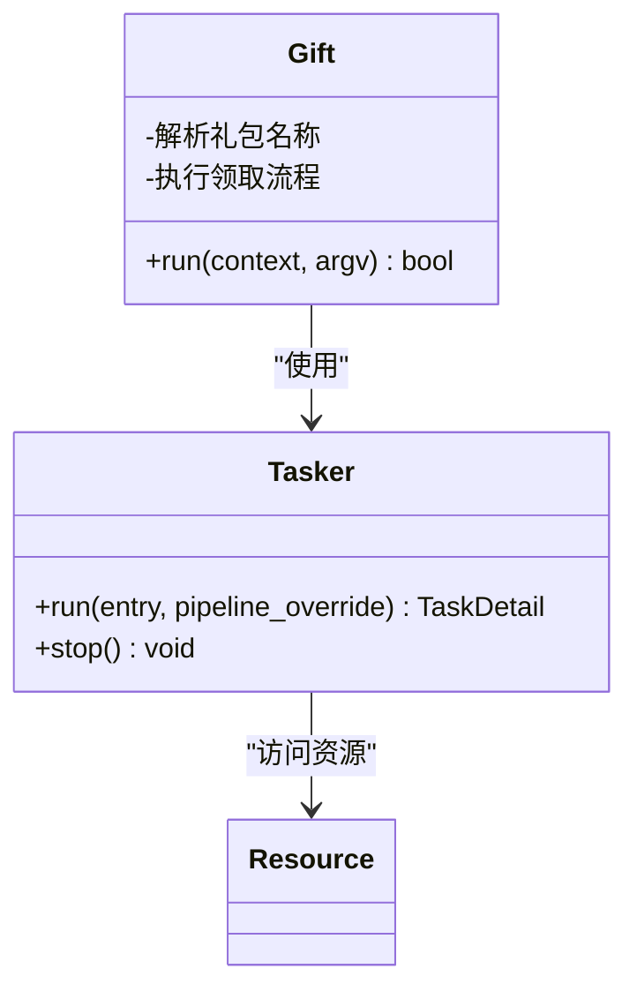

**图表来源**
- [store.py:14-50](file://agent/customs/special_treat/store.py#L14-L50)
- [tasker.py:60-122](file://agent/customs/maahelper/tasker.py#L60-L122)

Gift类的设计简洁高效，主要特点包括：

- **参数灵活性**：支持`gift`和`g`两种参数格式
- **流程封装**：内部封装完整的领取流程
- **错误处理**：完善的异常捕获和错误报告机制

#### 礼包领取流程

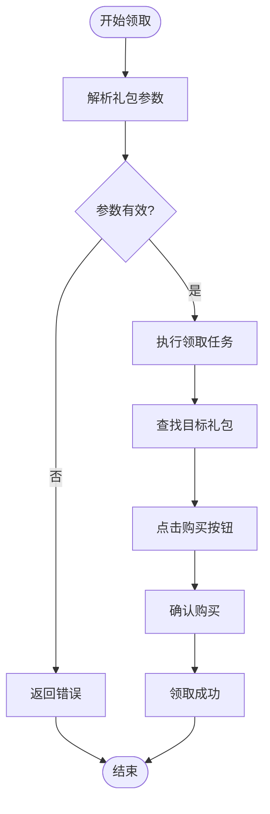

**图表来源**
- [store.py:21-49](file://agent/customs/special_treat/store.py#L21-L49)

**章节来源**
- [store.py:14-50](file://agent/customs/special_treat/store.py#L14-L50)

### 任务执行器

任务执行器是整个系统的基础设施，提供了统一的任务执行接口和强大的监控能力。

#### 核心功能

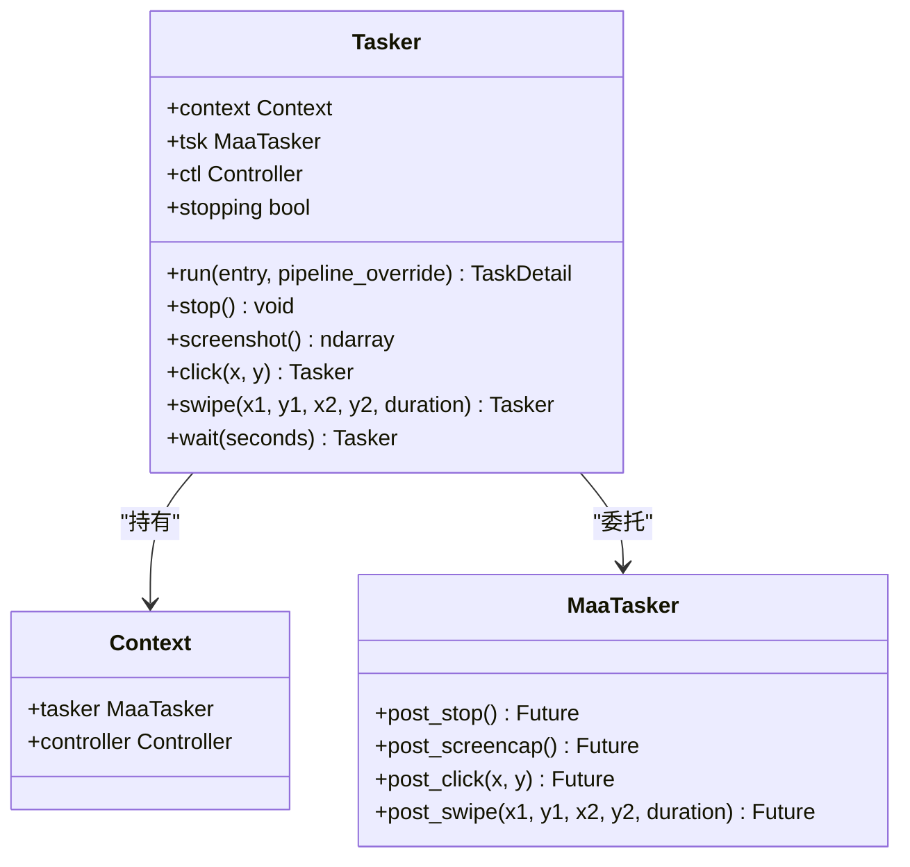

**图表来源**
- [tasker.py:16-190](file://agent/customs/maahelper/tasker.py#L16-L190)

任务执行器的主要优势：

- **自动注入监控**：为所有节点自动注入运行监测器
- **链式调用**：支持方法链式调用，提高代码可读性
- **类型安全**：完整的类型注解，便于IDE智能提示
- **异常处理**：内置的异常捕获和处理机制

**章节来源**
- [tasker.py:16-190](file://agent/customs/maahelper/tasker.py#L16-L190)

### 参数解析器

参数解析器负责处理来自MaaFramework的各种参数格式，支持JSON和查询字符串两种主要格式。

#### 解析策略

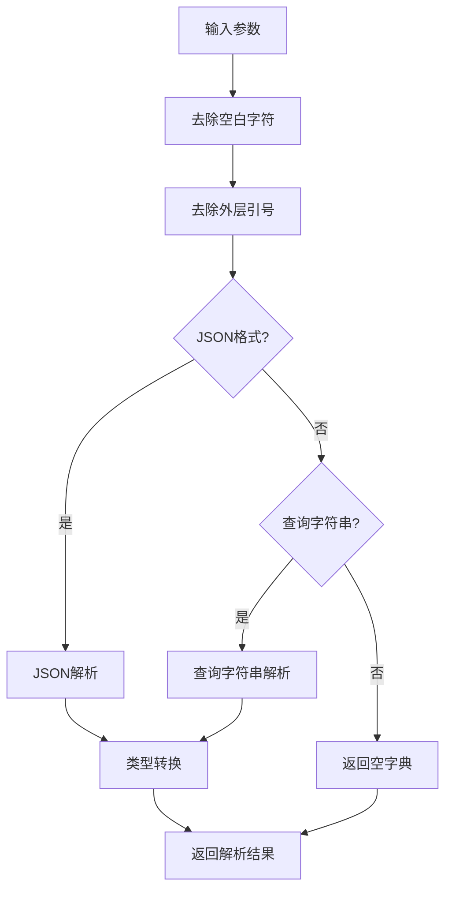

**图表来源**
- [argv_analyzer.py:48-101](file://agent/customs/maahelper/argv_analyzer.py#L48-L101)

参数解析器的特点：

- **多格式支持**：同时支持JSON和查询字符串格式
- **智能类型转换**：自动将数字字符串转换为对应数值类型
- **错误容错**：解析失败时优雅降级为空字典
- **灵活键名**：支持多种键名别名映射

**章节来源**
- [argv_analyzer.py:17-159](file://agent/customs/maahelper/argv_analyzer.py#L17-L159)

## 糖果购买功能

### BuyCandy自定义动作实现

新增的BuyCandy类是每日采购功能的重要扩展，专门处理红糖和紫糖的购买操作。该功能支持指定购买数量，为用户提供灵活的糖果采购方案。

#### 核心特性

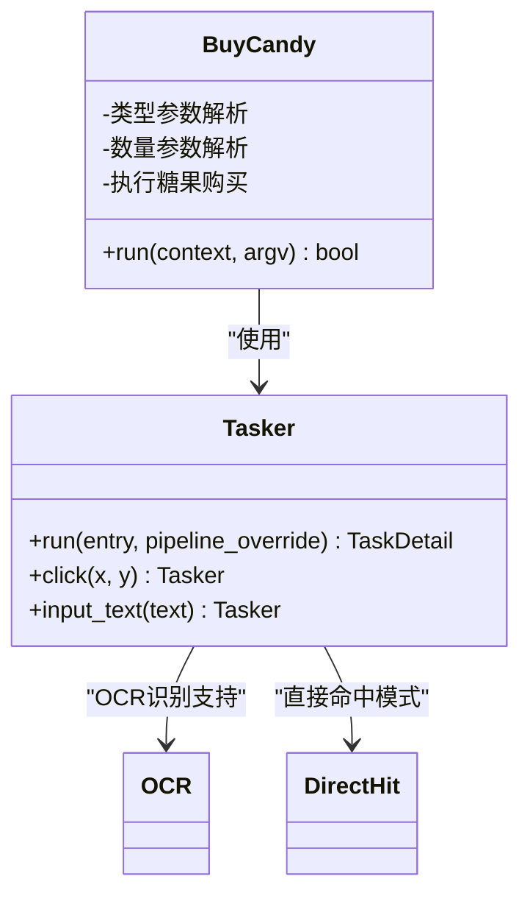

**图表来源**
- [store.py:138-186](file://agent/customs/special_treat/store.py#L138-L186)
- [tasker.py:60-122](file://agent/customs/maahelper/tasker.py#L60-L122)

#### 糖果类型支持

BuyCandy类支持两种糖果类型：

- **红糖（red/r）**：使用627坐标位置进行购买
- **紫糖（purple/p）**：使用813坐标位置进行购买

#### 数量控制机制

- **参数解析**：支持`count`和`c`两种参数格式
- **输入验证**：自动将字符串转换为数字类型
- **动态输入**：根据购买数量动态输入文本

#### 购买流程

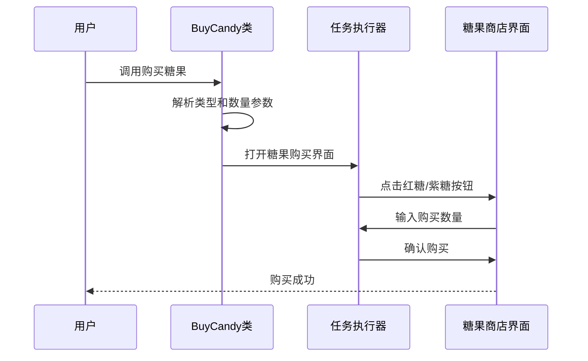

**图表来源**
- [store.py:159-186](file://agent/customs/special_treat/store.py#L159-L186)
- [tasker.py:60-122](file://agent/customs/maahelper/tasker.py#L60-L122)

### 糖果采购流水线配置

在每日采购的流水线配置中，新增了大量与糖果采购相关的节点，形成了完整的糖果购买流程。

#### 糖果采购节点

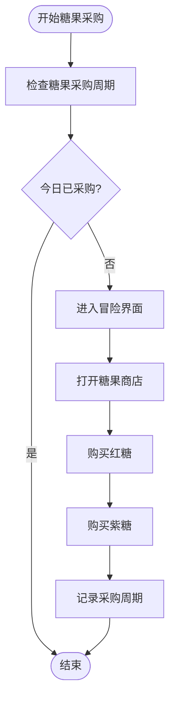

**图表来源**
- [每日采购.json:1405-1457](file://assets/resource/base/pipeline/日常任务/每日采购.json#L1405-L1457)

#### 糖果输入节点

系统还包含了专门的糖果输入和确认节点：

- **每日采购_输入糖果数量**：处理购买数量的输入
- **每日采购_确认糖果数量**：确认购买数量
- **每日采购_确认购买糖果**：最终确认购买操作

**章节来源**
- [store.py:138-186](file://agent/customs/special_treat/store.py#L138-L186)
- [每日采购.json:1405-1474](file://assets/resource/base/pipeline/日常任务/每日采购.json#L1405-L1474)

### 独立糖果清理任务

除了日常采购功能外，系统还提供了独立的糖果清理任务，专门用于清空红糖和紫糖的库存。

#### 清红糖任务

清红糖任务支持关卡区间设置，允许用户指定要清理的关卡范围：

- **关卡区间输入**：支持格式为"章-关"（如"24-9"）
- **自动循环**：每次运行时步进循环清理
- **独立执行**：可单独运行，不依赖日常采购流程

#### 清紫糖任务

清紫糖任务提供了更丰富的副本选择：

- **克隆工厂**：支持多种关卡选择
- **副本系统**：包括到手蜡、糖果自由、神秘面包房、金币大作战等
- **类型选择**：支持不同类型的糖果材料获取
- **关卡定制**：可选择最适合的关卡进行清理

**章节来源**
- [clear_red_candy.json:1-39](file://assets/resource/tasks/daily/clear_red_candy.json#L1-L39)
- [clear_purple_candy.json:1-276](file://assets/resource/tasks/daily/clear_purple_candy.json#L1-L276)

## 依赖关系分析

每日采购功能的依赖关系相对简单，主要依赖于MaaFramework提供的核心功能。

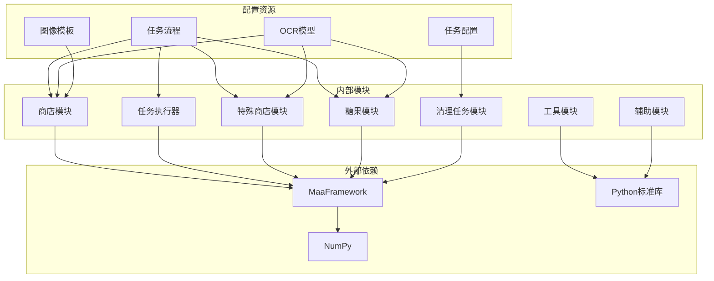

**图表来源**
- [main.py:49-62](file://agent/main.py#L49-L62)
- [store.py:6-13](file://agent/customs/special_treat/store.py#L6-L13)

### 核心依赖

| 依赖项 | 版本要求 | 用途 |
|--------|----------|------|
| MaaFramework | 最新稳定版 | 核心自动化框架 |
| NumPy | 1.21+ | 图像处理和数组操作 |
| Python | 3.8+ | 语言运行时环境 |

### 模块间依赖

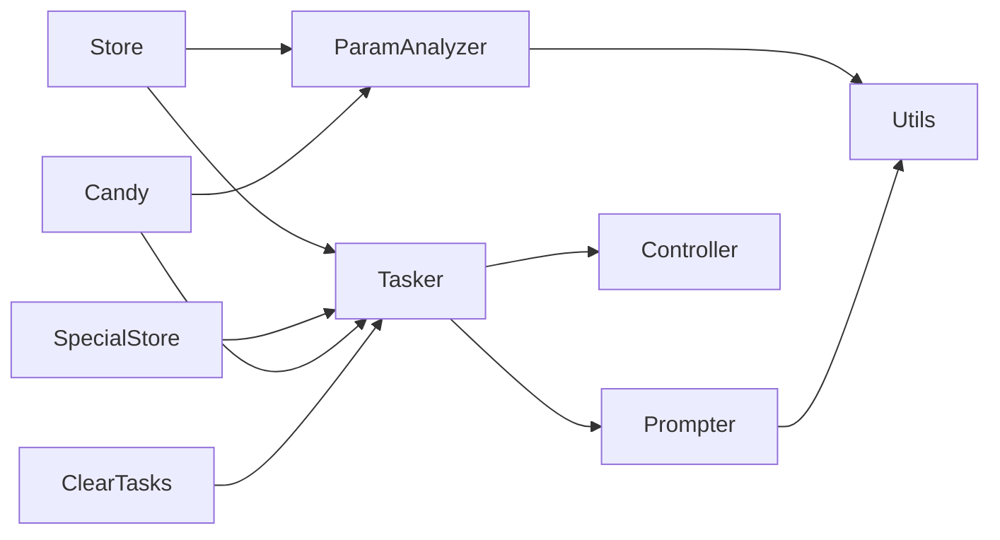

**图表来源**
- [store.py:10-13](file://agent/customs/special_treat/store.py#L10-L13)
- [tasker.py:7-9](file://agent/customs/maahelper/tasker.py#L7-L9)

**章节来源**
- [main.py:49-62](file://agent/main.py#L49-L62)
- [store.py:6-13](file://agent/customs/special_treat/store.py#L6-L13)

## 性能考虑

### 识别效率优化

每日采购功能在识别效率方面采用了多项优化策略：

1. **ROI区域限制**：通过限定识别区域减少计算量
2. **模板匹配缓存**：避免重复的模板匹配操作
3. **OCR优先级**：根据识别难度调整识别优先级
4. **DirectHit模式**：特殊商店购买中使用直接命中模式提高效率
5. **糖果购买优化**：糖果购买使用坐标直接点击，减少识别开销

### 内存管理

- **及时释放**：识别完成后及时释放内存资源
- **批量操作**：合并相似操作减少函数调用开销
- **资源复用**：复用已有的连接和句柄

### 网络和I/O优化

- **异步操作**：尽可能使用异步API减少阻塞
- **批量处理**：将多个小操作合并为批量操作
- **缓存策略**：对频繁使用的数据建立缓存

## 故障排除指南

### 常见问题及解决方案

#### 识别失败

**问题现象**：OCR识别或模板匹配失败
**可能原因**：
- 屏幕分辨率不匹配
- 游戏界面元素变化
- 网络延迟导致的截图延迟

**解决方法**：
1. 检查屏幕分辨率设置
2. 更新识别模板和OCR模型
3. 增加适当的等待时间

#### 点击位置错误

**问题现象**：点击位置与预期不符
**可能原因**：
- 屏幕缩放比例不正确
- 设备分辨率差异
- 界面布局变化

**解决方法**：
1. 调整坐标偏移量
2. 使用相对坐标而非绝对坐标
3. 实现自适应布局检测

#### 任务超时

**问题现象**：任务执行超过预设时间
**可能原因**：
- 网络连接不稳定
- 游戏响应缓慢
- 系统资源不足

**解决方法**：
1. 增加超时阈值
2. 添加重试机制
3. 优化任务流程

#### 糖果购买问题

**问题现象**：BuyCandy动作执行失败
**可能原因**：
- 糖果类型参数不正确
- 购买数量输入无效
- 糖果商店界面未正确加载

**解决方法**：
1. 检查类型参数（red/r 或 purple/p）
2. 验证数量参数为有效数字
3. 确认糖果商店界面的正确加载
4. 添加适当的延时和重试机制

#### 糖果清理任务问题

**问题现象**：清红糖或清紫糖任务执行失败
**可能原因**：
- 关卡区间格式不正确
- 选择的关卡不可用
- 副本选择参数错误

**解决方法**：
1. 检查关卡区间格式（如"24-9"）
2. 验证关卡编号的有效性
3. 确认副本选择的正确性
4. 添加适当的错误处理和重试机制

**章节来源**
- [prompter.py:16-55](file://agent/customs/utils/prompter.py#L16-L55)
- [tasker.py:124-183](file://agent/customs/maahelper/tasker.py#L124-L183)
- [store.py:159-186](file://agent/customs/special_treat/store.py#L159-L186)

### 调试技巧

1. **启用详细日志**：使用`Prompter.log()`输出详细执行信息
2. **截图分析**：利用`screenshot()`功能保存关键界面
3. **参数验证**：检查参数解析结果的正确性
4. **流程监控**：观察任务执行的每个步骤
5. **糖果购买调试**：使用日志输出确认类型和数量参数的解析
6. **清理任务调试**：验证关卡区间和副本选择的正确性

## 结论

每日采购功能展现了现代自动化框架的最佳实践，通过精心设计的架构和完善的工具链，实现了高度可靠的商店采购自动化。该系统的主要优势包括：

### 技术优势

- **模块化设计**：清晰的分层架构便于维护和扩展
- **强类型支持**：完整的类型注解提高代码质量
- **智能识别**：结合OCR和模板匹配的双重验证
- **异常处理**：完善的错误处理和恢复机制
- **特殊商店支持**：新增的2x3网格购买模式提升了自动化程度
- **糖果功能扩展**：新增的糖果购买和清理功能丰富了自动化能力
- **独立任务支持**：清红糖和清紫糖任务提供了灵活的材料获取方案

### 应用价值

- **提升效率**：大幅减少重复性手工操作
- **保证一致性**：标准化的操作流程确保结果一致
- **降低门槛**：友好的API设计降低使用难度
- **易于集成**：良好的模块化设计便于与其他系统集成
- **灵活扩展**：支持新增商店类型和购买模式
- **材料管理**：通过糖果清理任务实现材料的自动化管理

### 发展前景

随着游戏内容的不断更新，每日采购功能将继续演进，重点发展方向包括：

1. **智能化识别**：引入更先进的机器学习算法
2. **自适应布局**：支持更多设备和分辨率
3. **扩展功能**：增加更多商店类型的支持
4. **性能优化**：进一步提升执行效率和稳定性
5. **特殊商店优化**：改进网格定位算法和识别精度
6. **糖果功能增强**：支持更多类型的糖果购买和清理
7. **任务自动化**：实现更复杂的材料获取和管理流程

该功能为MaaDuDuL项目提供了坚实的基础，也为其他类似自动化需求提供了优秀的参考模板。新增的糖果购买和清理功能进一步增强了系统的实用性和自动化水平，为用户提供了更加完整和高效的日常任务自动化解决方案。