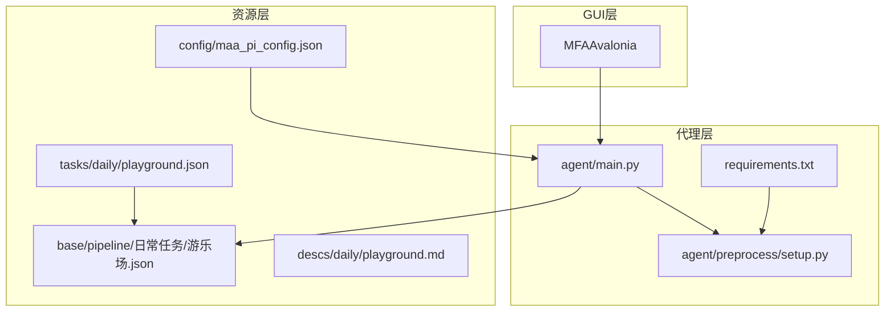
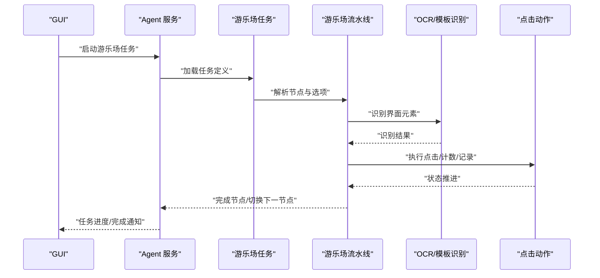
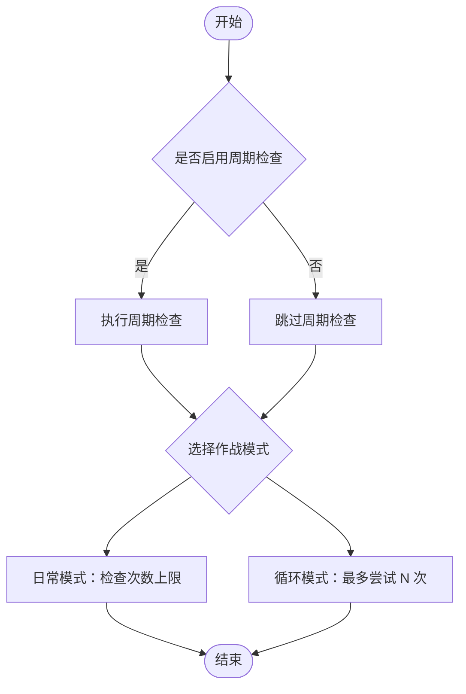
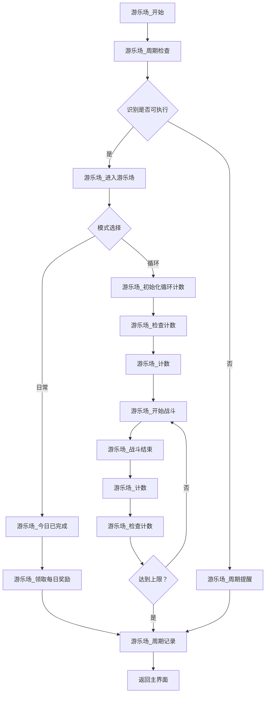
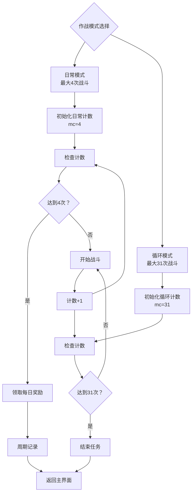
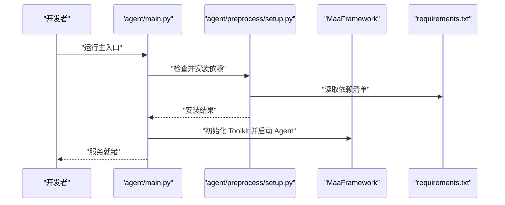
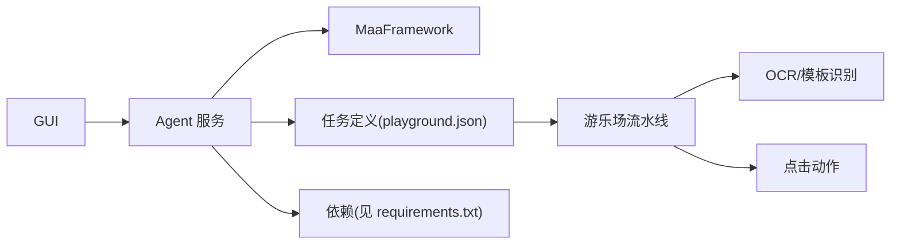

# 游乐场日常任务

<cite>
**本文引用的文件**
- [README.md](file://README.md)
- [agent/main.py](file://agent/main.py)
- [agent/preprocess/setup.py](file://agent/preprocess/setup.py)
- [requirements.txt](file://requirements.txt)
- [assets/config/maa_pi_config.json](file://assets/config/maa_pi_config.json)
- [assets/resource/tasks/daily/playground.json](file://assets/resource/tasks/daily/playground.json)
- [assets/resource/base/pipeline/日常任务/游乐场.json](file://assets/resource/base/pipeline/日常任务/游乐场.json)
- [assets/resource/descs/daily/playground.md](file://assets/resource/descs/daily/playground.md)
</cite>

## 更新摘要
**变更内容**
- 修复游乐场日常任务战斗次数限制问题
- 将循环模式最大战斗次数从30次增加到31次
- 将日常模式最大战斗次数从3次增加到4次
- 更新视口设置和同步时间戳信息

## 目录
1. [简介](#简介)
2. [项目结构](#项目结构)
3. [核心组件](#核心组件)
4. [架构总览](#架构总览)
5. [详细组件分析](#详细组件分析)
6. [依赖关系分析](#依赖关系分析)
7. [性能考虑](#性能考虑)
8. [故障排除指南](#故障排除指南)
9. [结论](#结论)

## 简介
本项目是基于 MaaFramework 的"嘟嘟脸恶作剧"自动化助手，提供图形识别与模拟控制能力，覆盖登录签到、日常补给、每日采购、清体力、圣团巡礼、农场视察、巅峰对决、奖励领取、活动相关以及开荒相关等完整日常任务链路。本文聚焦"游乐场日常任务"的实现与使用，涵盖任务入口、流水线配置、选项开关、界面跳转与计数逻辑，并给出可视化流程图与排障建议。

## 项目结构
项目采用"资源 + 代理 + GUI"的分层组织方式：
- 资源层：包含任务定义、流水线、描述文件与 OCR 模型等
- 代理层：负责环境初始化、依赖安装、Agent 服务启动与任务调度
- GUI 层：基于 MFAAvalonia 提供用户交互界面

**图表来源**
- [agent/main.py:1-78](file://agent/main.py#L1-L78)
- [agent/preprocess/setup.py:1-230](file://agent/preprocess/setup.py#L1-L230)
- [assets/resource/tasks/daily/playground.json:1-58](file://assets/resource/tasks/daily/playground.json#L1-L58)
- [assets/resource/base/pipeline/日常任务/游乐场.json:1-441](file://assets/resource/base/pipeline/日常任务/游乐场.json#L1-L441)
- [assets/resource/descs/daily/playground.md:1-13](file://assets/resource/descs/daily/playground.md#L1-L13)
- [assets/config/maa_pi_config.json:1-3](file://assets/config/maa_pi_config.json#L1-L3)
- [requirements.txt:1-3](file://requirements.txt#L1-L3)

**章节来源**
- [README.md:1-117](file://README.md#L1-L117)
- [agent/main.py:1-78](file://agent/main.py#L1-L78)
- [agent/preprocess/setup.py:1-230](file://agent/preprocess/setup.py#L1-L230)
- [assets/resource/tasks/daily/playground.json:1-58](file://assets/resource/tasks/daily/playground.json#L1-L58)
- [assets/resource/base/pipeline/日常任务/游乐场.json:1-441](file://assets/resource/base/pipeline/日常任务/游乐场.json#L1-L441)
- [assets/resource/descs/daily/playground.md:1-13](file://assets/resource/descs/daily/playground.md#L1-L13)
- [assets/config/maa_pi_config.json:1-3](file://assets/config/maa_pi_config.json#L1-L3)
- [requirements.txt:1-3](file://requirements.txt#L1-L3)

## 核心组件
- 代理主入口：负责初始化环境、依赖检查、启动 Agent 服务与守护
- 依赖安装模块：根据 interface.json 版本与 pip 配置自动安装/更新 Python 依赖
- 任务定义：游乐场日常任务的任务元数据与可选参数
- 流水线：游乐场日常任务的节点化执行流程，包含 OCR 识别、点击、计数与周期记录
- 描述文件：任务功能说明与起止界面提示
- 配置文件：资源选择（如 B 服）

**章节来源**
- [agent/main.py:47-78](file://agent/main.py#L47-L78)
- [agent/preprocess/setup.py:204-230](file://agent/preprocess/setup.py#L204-L230)
- [assets/resource/tasks/daily/playground.json:1-58](file://assets/resource/tasks/daily/playground.json#L1-L58)
- [assets/resource/base/pipeline/日常任务/游乐场.json:1-441](file://assets/resource/base/pipeline/日常任务/游乐场.json#L1-L441)
- [assets/resource/descs/daily/playground.md:1-13](file://assets/resource/descs/daily/playground.md#L1-L13)
- [assets/config/maa_pi_config.json:1-3](file://assets/config/maa_pi_config.json#L1-L3)

## 架构总览
游乐场日常任务的执行路径如下：
- GUI 触发任务 → 代理启动服务 → 读取任务定义与流水线 → 执行节点识别与点击 → 周期检查与计数 → 返回主界面

**图表来源**
- [agent/main.py:47-78](file://agent/main.py#L47-L78)
- [assets/resource/tasks/daily/playground.json:1-58](file://assets/resource/tasks/daily/playground.json#L1-L58)
- [assets/resource/base/pipeline/日常任务/游乐场.json:1-441](file://assets/resource/base/pipeline/日常任务/游乐场.json#L1-L441)

## 详细组件分析

### 任务定义与选项
- 任务入口：游乐场任务以"游乐场_开始"为入口节点
- 任务分组：标记为"continuous"，表示可作为连续任务执行
- 选项：
  - 游乐场-周期检查：开关项，支持"仅检查一次"或"始终检查"
  - 游乐场-作战模式：选择项，支持"日常模式"和"循环模式"

**图表来源**
- [assets/resource/tasks/daily/playground.json:12-56](file://assets/resource/tasks/daily/playground.json#L12-L56)

**章节来源**
- [assets/resource/tasks/daily/playground.json:1-58](file://assets/resource/tasks/daily/playground.json#L1-L58)

### 流水线节点与执行逻辑
- 周期检查：通过自定义动作 periodic_check 实现每日仅执行一次的约束
- 进入游乐场：识别"游乐场"文字区域，进入日常/循环模式分支
- 日常模式：识别"今日已完成"后进行计数与奖励领取
- 循环模式：初始化循环计数，多次尝试直至上限
- 战斗流程：匹配成功后开始战斗，战斗结束后计数并返回
- 周期记录：完成任务后记录周期状态，返回主界面

**图表来源**
- [assets/resource/base/pipeline/日常任务/游乐场.json:25-441](file://assets/resource/base/pipeline/日常任务/游乐场.json#L25-L441)

**章节来源**
- [assets/resource/base/pipeline/日常任务/游乐场.json:1-441](file://assets/resource/base/pipeline/日常任务/游乐场.json#L1-L441)

### 作战模式与计数限制

**更新** 修复了战斗次数限制问题，提升了任务执行的灵活性

- **循环模式**：最大战斗次数从30次增加到31次
  - 计数初始化：`init_counter` 动作，参数为 `k=游乐场&mc=31`
  - 适用于需要更多战斗机会的场景
  - 无周期检查约束，可连续执行直到手动停止

- **日常模式**：最大战斗次数从3次增加到4次  
  - 计数初始化：`init_counter` 动作，参数为 `k=游乐场&mc=4`
  - 适用于日常任务的扩展执行
  - 保持每日周期检查约束

**图表来源**
- [assets/resource/base/pipeline/日常任务/游乐场.json:61-95](file://assets/resource/base/pipeline/日常任务/游乐场.json#L61-L95)
- [assets/resource/tasks/daily/playground.json:42-55](file://assets/resource/tasks/daily/playground.json#L42-L55)

**章节来源**
- [assets/resource/base/pipeline/日常任务/游乐场.json:61-95](file://assets/resource/base/pipeline/日常任务/游乐场.json#L61-L95)
- [assets/resource/tasks/daily/playground.json:42-55](file://assets/resource/tasks/daily/playground.json#L42-L55)

### 代理启动与依赖管理
- 启动流程：清理调试文件 → 初始化 Toolkit → 启动 Agent 服务 → devops 打卡 → 等待服务结束
- 依赖安装：根据 interface.json 版本与 pip 配置，自动安装 requirements.txt 中的依赖，支持多镜像源回退

**图表来源**
- [agent/main.py:47-78](file://agent/main.py#L47-L78)
- [agent/preprocess/setup.py:204-230](file://agent/preprocess/setup.py#L204-L230)
- [requirements.txt:1-3](file://requirements.txt#L1-L3)

**章节来源**
- [agent/main.py:1-78](file://agent/main.py#L1-L78)
- [agent/preprocess/setup.py:1-230](file://agent/preprocess/setup.py#L1-L230)
- [requirements.txt:1-3](file://requirements.txt#L1-L3)

### 任务描述与起止界面
- 功能说明：游乐场日常任务
- 起止界面：任意界面 → 主界面

**章节来源**
- [assets/resource/descs/daily/playground.md:1-13](file://assets/resource/descs/daily/playground.md#L1-L13)

## 依赖关系分析
- 代理依赖 MaaFramework 与 requests
- 任务执行依赖资源层的 OCR 模型与图片模板
- GUI 通过 Agent 与资源层协同工作

**图表来源**
- [requirements.txt:1-3](file://requirements.txt#L1-L3)
- [assets/resource/tasks/daily/playground.json:1-58](file://assets/resource/tasks/daily/playground.json#L1-L58)
- [assets/resource/base/pipeline/日常任务/游乐场.json:1-441](file://assets/resource/base/pipeline/日常任务/游乐场.json#L1-L441)

**章节来源**
- [requirements.txt:1-3](file://requirements.txt#L1-L3)
- [assets/resource/tasks/daily/playground.json:1-58](file://assets/resource/tasks/daily/playground.json#L1-L58)
- [assets/resource/base/pipeline/日常任务/游乐场.json:1-441](file://assets/resource/base/pipeline/日常任务/游乐场.json#L1-L441)

## 性能考虑
- 识别 ROI 与模板优化：合理设置识别区域与模板，减少误判与重试
- 节点速率限制：为高频点击节点设置 rate_limit，避免触发风控
- 超时控制：为关键识别设置 timeout，防止长时间阻塞
- 计数与周期：通过计数器与周期记录避免重复执行，提升整体效率

## 故障排除指南
- 依赖安装失败
  - 现象：安装过程报错或超时
  - 排查：确认 pip 配置与镜像源可用；检查网络连通性；查看安装日志
  - 参考路径：[agent/preprocess/setup.py:135-198](file://agent/preprocess/setup.py#L135-L198)
- 识别失败
  - 现象：OCR 无法识别目标文字或模板匹配不到
  - 排查：调整 ROI、模板清晰度或对比度；确认资源路径正确
  - 参考路径：[assets/resource/base/pipeline/日常任务/游乐场.json:396-410](file://assets/resource/base/pipeline/日常任务/游乐场.json#L396-L410)
- 点击无效
  - 现象：点击后无响应或误触
  - 排查：检查坐标偏移与分辨率；确认节点 focus 的识别条件
  - 参考路径：[assets/resource/base/pipeline/日常任务/游乐场.json:240-266](file://assets/resource/base/pipeline/日常任务/游乐场.json#L240-L266)
- 周期检查未生效
  - 现象：任务重复执行或未按预期执行
  - 排查：确认 periodic_check 与 record_period 的调用；检查周期键名一致性
  - 参考路径：[assets/resource/base/pipeline/日常任务/游乐场.json:171-193](file://assets/resource/base/pipeline/日常任务/游乐场.json#L171-L193)
- 战斗次数限制问题
  - 现象：任务提前结束或无法达到预期战斗次数
  - 排查：确认计数器初始化参数中的最大次数设置；检查计数逻辑
  - 参考路径：[assets/resource/base/pipeline/日常任务/游乐场.json:61-95](file://assets/resource/base/pipeline/日常任务/游乐场.json#L61-L95)

**章节来源**
- [agent/preprocess/setup.py:135-198](file://agent/preprocess/setup.py#L135-L198)
- [assets/resource/base/pipeline/日常任务/游乐场.json:240-266](file://assets/resource/base/pipeline/日常任务/游乐场.json#L240-L266)
- [assets/resource/base/pipeline/日常任务/游乐场.json:396-410](file://assets/resource/base/pipeline/日常任务/游乐场.json#L396-L410)
- [assets/resource/base/pipeline/日常任务/游乐场.json:171-193](file://assets/resource/base/pipeline/日常任务/游乐场.json#L171-L193)
- [assets/resource/base/pipeline/日常任务/游乐场.json:61-95](file://assets/resource/base/pipeline/日常任务/游乐场.json#L61-L95)

## 结论
游乐场日常任务通过清晰的任务定义与节点化的流水线实现，结合周期检查与计数机制，能够在保证稳定性的前提下高效完成日常作战与奖励领取。本次更新修复了战斗次数限制问题，将循环模式的最大战斗次数从30次增加到31次，日常模式从3次增加到4次，显著提升了任务执行的灵活性和成功率。

配合 GUI 与代理层的统一调度，用户可便捷地开启"循环模式"或"日常模式"，并依据自身需求灵活配置选项。建议在首次部署时校验 OCR 模板与识别 ROI，并在运行中关注节点速率限制与超时设置，以获得最佳体验。同时，新的计数限制设置应确保不会超出游戏的实际限制，建议用户根据自己的游戏情况合理配置战斗次数。