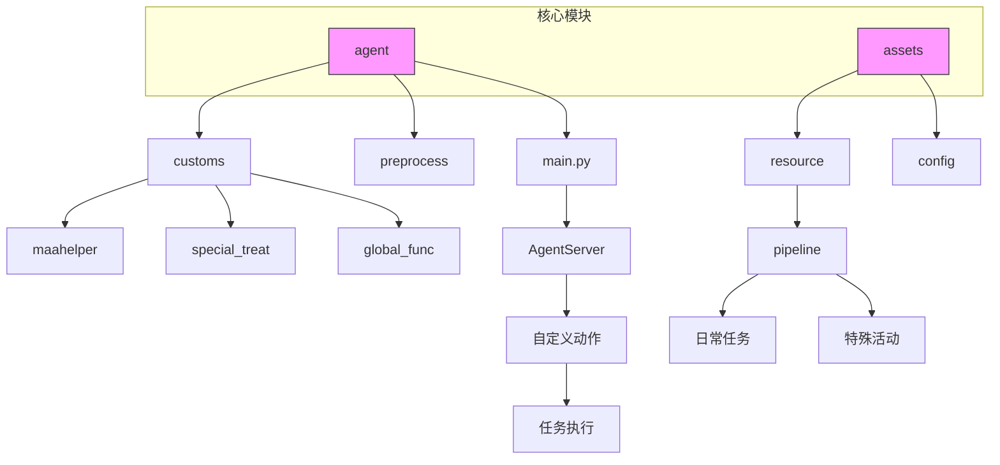
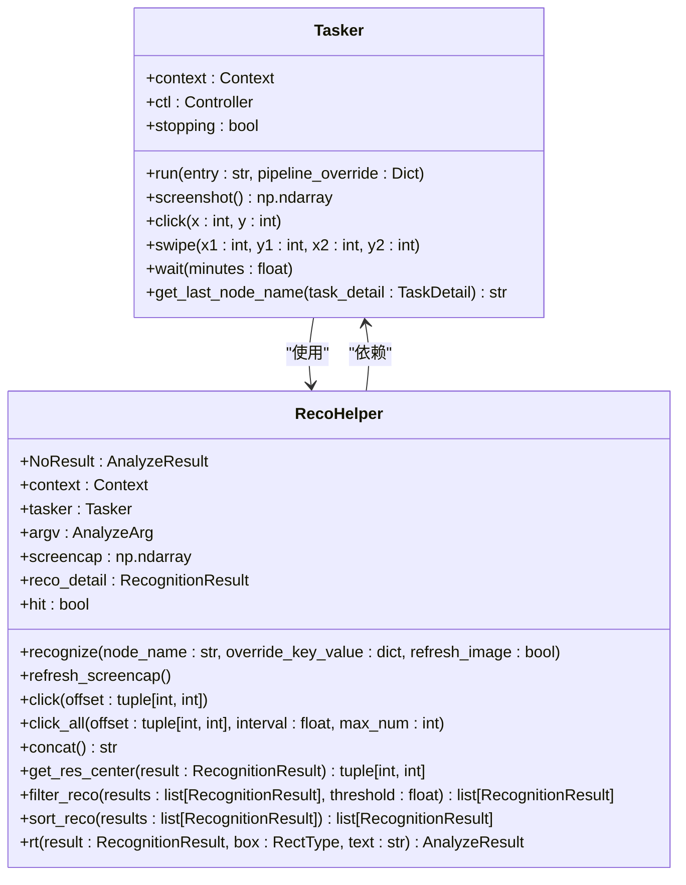
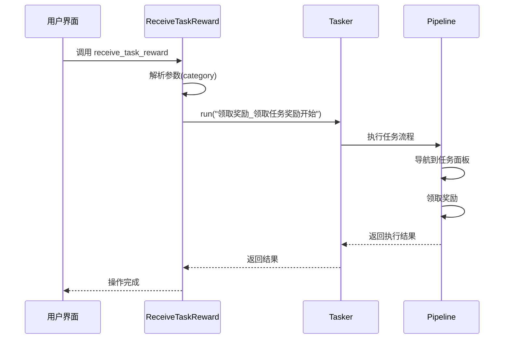
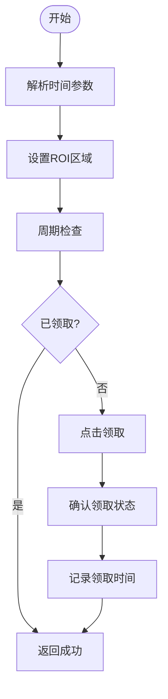
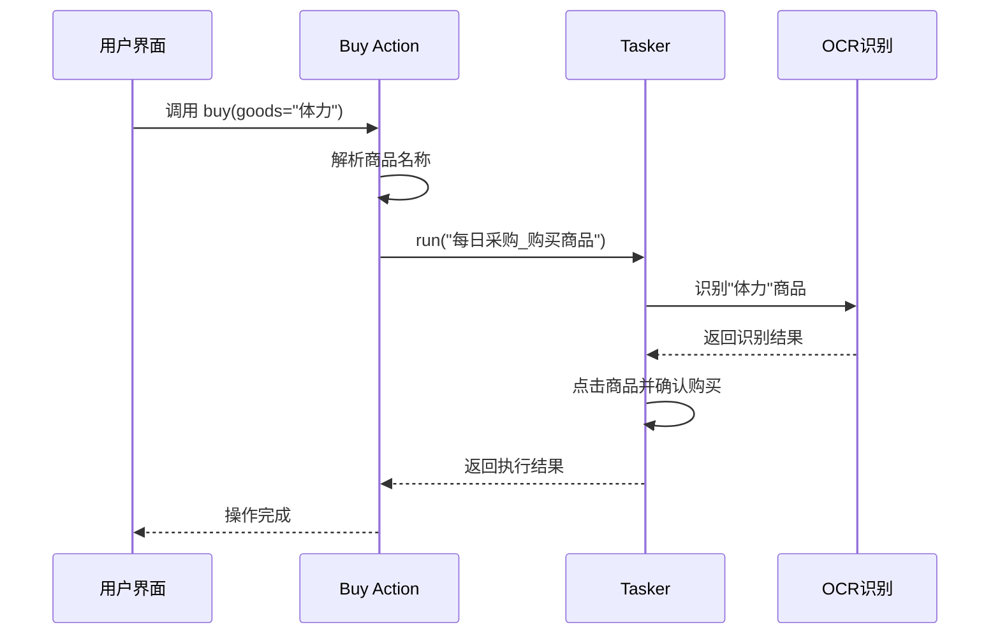
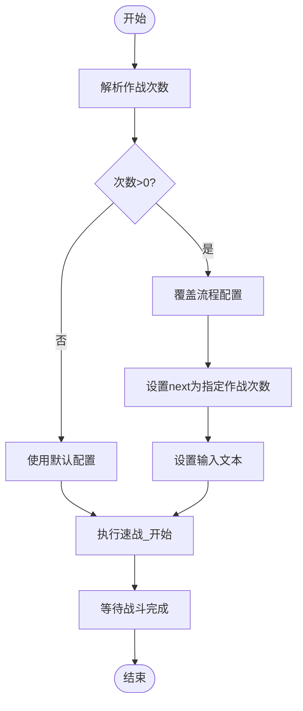
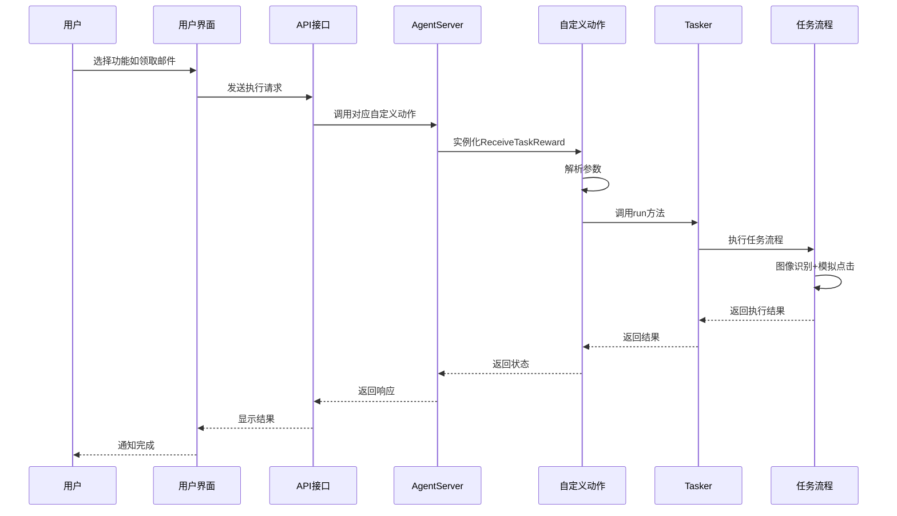

# 核心功能详解

<cite>
**本文档引用的文件**
- [main.py](file://agent/main.py)
- [setup.py](file://agent/preprocess/setup.py)
- [clear.py](file://agent/preprocess/clear.py)
- [tasker.py](file://agent/customs/maahelper/tasker.py)
- [reco_helper.py](file://agent/customs/maahelper/reco_helper.py)
- [eat_sugar.py](file://agent/customs/special_treat/eat_sugar.py)
- [receive_reward.py](file://agent/customs/special_treat/receive_reward.py)
- [store.py](file://agent/customs/special_treat/store.py)
- [activity.py](file://agent/customs/special_treat/activity.py)
- [default_pipeline.json](file://assets/resource/base/default_pipeline.json)
- [maa_pi_config.json](file://assets/config/maa_pi_config.json)
- [claim_mail.md](file://descs/daily/claim_mail.md)
- [claim_candy.md](file://descs/daily/claim_candy.md)
- [purchase.md](file://descs/daily/purchase.md)
- [saint_tour.md](file://descs/daily/saint_tour.md)
- [peak_battle.md](file://descs/daily/peak_battle.md)
- [领取邮件.json](file://assets/resource/base/pipeline/日常任务/领取邮件.json)
- [领取糖果.json](file://assets/resource/base/pipeline/日常任务/领取糖果.json)
- [每日采购.json](file://assets/resource/base/pipeline/日常任务/每日采购.json)
- [圣团巡礼.json](file://assets/resource/base/pipeline/日常任务/圣团巡礼.json)
- [巅峰对决.json](file://assets/resource/base/pipeline/日常任务/巅峰对决.json)
</cite>

## 目录
1. [项目结构](#项目结构)
2. [核心组件](#核心组件)
3. [日常任务功能实现](#日常任务功能实现)
   - [领取邮件](#领取邮件)
   - [领取糖果](#领取糖果)
   - [每日采购](#每日采购)
4. [特殊活动功能实现](#特殊活动功能实现)
   - [圣团巡礼](#圣团巡礼)
   - [巅峰对决](#巅峰对决)
5. [功能调用链路分析](#功能调用链路分析)
6. [配置文件结构分析](#配置文件结构分析)
7. [使用建议与异常处理](#使用建议与异常处理)

## 项目结构

MaaDuDuL项目采用模块化设计，核心自动化功能主要分布在`agent`和`assets`目录下。`agent`目录包含Python实现的自定义动作逻辑，而`assets`目录则存放任务流程配置和资源文件。



**图示来源**
- [main.py](file://agent/main.py#L1-L48)
- [agent目录结构](file://agent/)

## 核心组件

系统核心由MaaFramework驱动，通过自定义动作（Custom Action）机制实现自动化功能。`Tasker`类封装了任务执行的核心接口，提供运行任务、截图、点击等基础操作。



**图示来源**
- [tasker.py](file://agent/customs/maahelper/tasker.py#L16-L177)
- [reco_helper.py](file://agent/customs/maahelper/reco_helper.py#L17-L256)

**本节来源**
- [tasker.py](file://agent/customs/maahelper/tasker.py#L1-L177)
- [reco_helper.py](file://agent/customs/maahelper/reco_helper.py#L1-L256)

## 日常任务功能实现

### 领取邮件

"领取邮件"功能通过`receive_reward.py`中的`ReceiveTaskReward`类实现。该功能支持领取不同类型的任务奖励，包括日常、周常等。系统通过参数解析确定奖励类别，并调用相应的任务流程。

实现机制：
1. 解析输入参数，确定奖励类别
2. 调用"领取奖励_领取任务奖励开始"任务节点
3. 通过`pipeline_override`参数指定具体要领取的奖励类型
4. 系统自动导航到对应任务面板并完成领取

触发条件：用户通过UI选择"领取邮件"功能并指定奖励类别。

执行逻辑：


**图示来源**
- [receive_reward.py](file://agent/customs/special_treat/receive_reward.py#L9-L34)
- [领取邮件.json](file://assets/resource/base/pipeline/日常任务/领取邮件.json)

**本节来源**
- [receive_reward.py](file://agent/customs/special_treat/receive_reward.py#L9-L34)
- [claim_mail.md](file://descs/daily/claim_mail.md)

### 领取糖果

"领取糖果"功能在`activity.py`中通过`ClaimCandy`类实现。该功能支持领取"早饭"和"晚饭"两个时间段的糖果奖励。

实现机制：
1. 解析时间参数（早饭/晚饭）
2. 根据时间段设置不同的ROI（感兴趣区域）
3. 执行周期性检查，避免重复领取
4. 在指定ROI区域内点击领取按钮

关键特性：
- 使用`periodic_check`机制防止重复执行
- 不同时间段对应不同的屏幕坐标区域
- 包含多重确认节点确保操作成功



**图示来源**
- [activity.py](file://agent/customs/special_treat/activity.py#L60-L102)
- [领取糖果.json](file://assets/resource/base/pipeline/日常任务/领取糖果.json)

**本节来源**
- [activity.py](file://agent/customs/special_treat/activity.py#L60-L102)
- [claim_candy.md](file://descs/daily/claim_candy.md)

### 每日采购

"每日采购"功能通过`store.py`中的`Buy`和`Gift`类实现，支持购买商品和领取礼包两种操作。

实现机制：
1. `Buy`类处理商品购买，支持多种参数别名（goods/g/commodity/c）
2. `Gift`类处理礼包领取，通过礼包名称识别目标
3. 均通过调用"每日采购_"前缀的任务节点执行具体操作

参数处理：
- 支持参数别名，提高调用灵活性
- 商品/礼包名称作为期望值传递给图像识别模块
- 通过模板匹配定位目标商品



**图示来源**
- [store.py](file://agent/customs/special_treat/store.py#L52-L96)
- [每日采购.json](file://assets/resource/base/pipeline/日常任务/每日采购.json)

**本节来源**
- [store.py](file://agent/customs/special_treat/store.py#L52-L96)
- [purchase.md](file://descs/daily/purchase.md)

## 特殊活动功能实现

### 圣团巡礼

"圣团巡礼"功能通过调用预定义的任务流程实现自动化操作。虽然具体实现代码未直接提供，但根据项目结构和命名规范，可以推断其执行机制。

实现推测：
1. 通过"进入活动界面"流程导航到圣团巡礼活动
2. 执行预设的巡礼路线和操作序列
3. 完成所有巡礼任务后返回主界面

依赖组件：
- 进入活动界面通用功能
- 通用任务执行框架
- 图像识别定位关键节点

**本节来源**
- [saint_tour.md](file://descs/daily/saint_tour.md)
- [圣团巡礼.json](file://assets/resource/base/pipeline/日常任务/圣团巡礼.json)

### 巅峰对决

"巅峰对决"功能在`eat_sugar.py`中通过`QuickFight`类实现，提供快速战斗功能。

实现机制：
1. 支持指定作战次数（times参数）
2. 通过`pipeline_override`动态修改任务流程
3. 调用"速战"相关任务节点执行战斗

关键代码逻辑：
- 当指定作战次数时，覆盖默认的速战流程
- 注入"速战_指定作战次数"节点
- 设置输入文本为指定的次数



**图示来源**
- [eat_sugar.py](file://agent/customs/special_treat/eat_sugar.py#L21-L63)
- [巅峰对决.json](file://assets/resource/base/pipeline/日常任务/巅峰对决.json)

**本节来源**
- [eat_sugar.py](file://agent/customs/special_treat/eat_sugar.py#L21-L63)
- [peak_battle.md](file://descs/daily/peak_battle.md)

## 功能调用链路分析

从UI选择任务到Agent执行的完整调用链路如下：



**图示来源**
- [main.py](file://agent/main.py#L17-L47)
- [tasker.py](file://agent/customs/maahelper/tasker.py#L51-L113)
- 各自定义动作实现文件

## 配置文件结构分析

### pipeline配置文件结构

以"领取邮件.json"为例，pipeline配置文件的基本结构如下：

```json
{
  "Default": {
    "timeout": 30000,
    "pre_delay": 600
  },
  "领取奖励_领取任务奖励开始": {
    "description": "领取任务奖励流程入口",
    "next": "领取奖励_进入具体任务面板"
  },
  "领取奖励_进入具体任务面板": {
    "recognition": "TemplateMatch",
    "template": "task_panel.png",
    "target": "expected",
    "action": "Click"
  }
}
```

关键字段说明：
- **timeout**: 节点超时时间（毫秒）
- **pre_delay**: 执行前延迟（毫秒）
- **next**: 下一个节点名称
- **recognition**: 识别方式（模板匹配、OCR等）
- **template**: 模板图像路径
- **target**: 匹配目标
- **action**: 执行动作（点击、滑动等）

配置文件作用：
- 定义任务执行的流程和顺序
- 配置图像识别参数
- 设置超时和重试机制
- 实现任务的可配置化和可维护性

**本节来源**
- [default_pipeline.json](file://assets/resource/base/default_pipeline.json)
- [领取邮件.json](file://assets/resource/base/pipeline/日常任务/领取邮件.json)
- [maa_pi_config.json](file://assets/config/maa_pi_config.json)

## 使用建议与异常处理

### 使用建议

1. **执行频率设置**：
   - 领取邮件：建议每天执行1-2次
   - 领取糖果：根据游戏内时间规律，设置定时执行
   - 每日采购：每天执行1次，避免资源浪费
   - 圣团巡礼：根据活动周期合理安排
   - 巅峰对决：根据体力恢复情况设置执行频率

2. **参数配置建议**：
   - 确保设备分辨率与配置文件匹配
   - 根据网络状况适当调整超时时间
   - 定期更新模板图像以适应游戏版本变化

### 异常处理策略

1. **通用异常处理**：
   - 所有自定义动作均使用try-catch包裹
   - 异常信息通过`Prompter.error`统一输出
   - 返回False表示操作失败

2. **特定异常处理**：
   - 图像识别失败：自动重试机制
   - 网络延迟：增加超时时间
   - 界面变化：使用多种识别方式组合

3. **恢复机制**：
   - 周期性检查防止重复操作
   - 任务状态记录
   - 错误截图保存用于调试

**本节来源**
- [tasker.py](file://agent/customs/maahelper/tasker.py#L51-L113)
- [reco_helper.py](file://agent/customs/maahelper/reco_helper.py#L62-L94)
- 各自定义动作实现文件中的异常处理代码