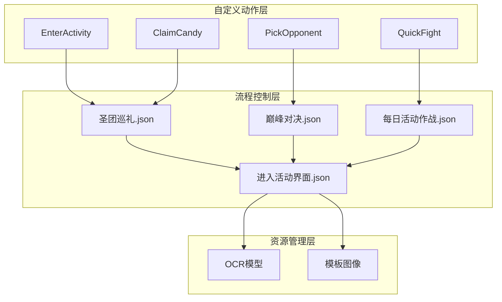
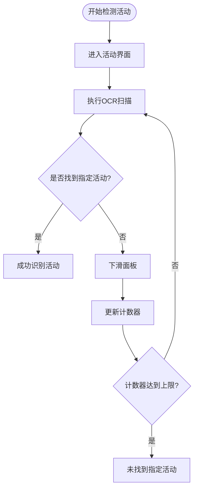
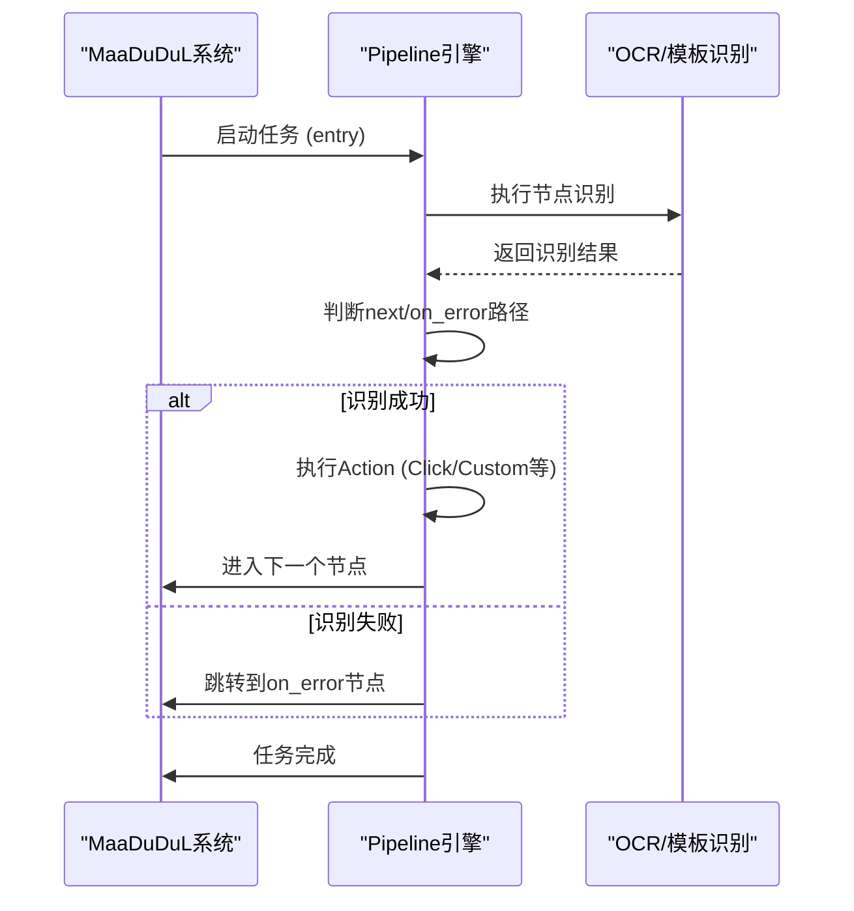
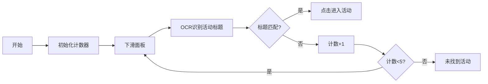
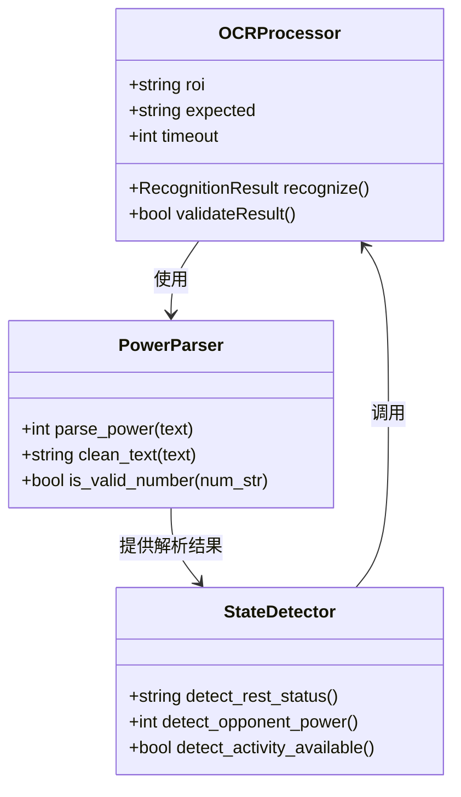

# 特殊活动功能

<cite>
**本文档引用文件**   
- [activity.py](file://agent/customs/special_treat/activity.py)
- [peak_showdown.py](file://agent/customs/special_treat/peak_showdown.py)
- [圣团巡礼.json](file://assets/resource/base/pipeline/日常任务/圣团巡礼.json)
- [巅峰对决.json](file://assets/resource/base/pipeline/日常任务/巅峰对决.json)
- [每日活动作战.json](file://assets/resource/base/pipeline/日常任务/每日活动作战.json)
- [进入活动界面.json](file://assets/resource/base/pipeline/通用/进入活动界面.json)
- [tasker.py](file://agent/customs/maahelper/tasker.py)
- [reco_helper.py](file://agent/customs/maahelper/reco_helper.py)
- [argv_analyzer.py](file://agent/customs/maahelper/argv_analyzer.py)
- [prompter.py](file://agent/customs/utils/prompter.py)
</cite>

## 目录
1. [引言](#引言)
2. [核心功能架构](#核心功能架构)
3. [活动检测与阶段判断](#活动检测与阶段判断)
4. [流程跳转逻辑设计](#流程跳转逻辑设计)
5. [多阶段任务调度机制](#多阶段任务调度机制)
6. [OCR识别在状态判断中的作用](#ocr识别在状态判断中的作用)
7. [活动规则变化适配策略](#活动规则变化适配策略)
8. [任务启用条件与时间窗口配置](#任务启用条件与时间窗口配置)
9. [失败重试机制](#失败重试机制)
10. [与日常任务的资源协调](#与日常任务的资源协调)
11. [结论](#结论)

## 引言
MaaDuDuL是一款基于MaaFramework架构的自动化助手工具，专注于为《嘟嘟脸恶作剧》游戏提供智能化的周期性活动支持。本系统通过深度集成OCR识别、自定义动作执行和智能流程调度等技术，实现了对“圣团巡礼”、“巅峰对决”和“活动作战”三大核心周期性活动的全面自动化处理。系统采用模块化设计，结合Pipeline配置文件驱动的任务流，能够精准识别活动界面状态、动态判断活动阶段，并根据当前开放的活动内容自动选择最优执行路径。通过灵活的参数化配置和强大的错误恢复机制，确保在复杂多变的游戏环境中稳定运行，有效提升用户的游戏体验和效率。

## 核心功能架构
MaaDuDuL的特殊活动支持能力建立在一个高度模块化的架构之上，该架构由自定义动作层、流程控制层和资源管理层三大部分构成。自定义动作层通过`activity.py`和`peak_showdown.py`等文件定义了进入活动、领取奖励、选择对手等基础操作；流程控制层利用JSON格式的Pipeline配置文件编排复杂的多阶段任务流程；资源管理层则负责OCR模型、模板图像等识别资源的加载与管理。整个系统以MaaFramework为核心引擎，通过`Tasker`类封装任务执行逻辑，`RecoHelper`类处理识别结果，`ParamAnalyzer`类解析运行参数，形成了一套完整且可扩展的自动化解决方案。

**图示来源**
- [activity.py](file://agent/customs/special_treat/activity.py)
- [peak_showdown.py](file://agent/customs/special_treat/peak_showdown.py)
- [圣团巡礼.json](file://assets/resource/base/pipeline/日常任务/圣团巡礼.json)
- [巅峰对决.json](file://assets/resource/base/pipeline/日常任务/巅峰对决.json)
- [每日活动作战.json](file://assets/resource/base/pipeline/日常任务/每日活动作战.json)
- [进入活动界面.json](file://assets/resource/base/pipeline/通用/进入活动界面.json)

## 活动检测与阶段判断
MaaDuDuL通过结合OCR识别和模板匹配技术实现精准的活动检测与阶段判断。系统首先通过“进入活动界面”流程定位活动入口，然后利用OCR技术扫描活动面板上的文本信息来识别当前开放的具体活动。例如，在`activity.py`中定义的`EnterActivity`类通过调用“进入活动界面_识别活动”节点，使用OCR在指定区域内查找匹配的活动标题。对于“巅峰对决”这类特殊活动，系统会进一步检查特定UI元素的存在与否来判断当前阶段，如通过识别“战斗宝石”或“对战次数”等关键词来确定是否可以进行相应操作。此外，系统还引入了周期性检查机制，通过`periodic_check`自定义动作记录每个活动的执行状态，避免重复执行已完成的任务。

**图示来源**
- [activity.py](file://agent/customs/special_treat/activity.py#L17-L54)
- [进入活动界面.json](file://assets/resource/base/pipeline/通用/进入活动界面.json)

## 流程跳转逻辑设计
MaaDuDuL的流程跳转逻辑基于事件驱动的Pipeline机制实现，每个活动任务都被设计为一个独立的流程图，节点之间通过条件分支进行跳转。系统通过`on_error`和`next`字段定义了清晰的执行路径和异常处理策略。例如，在“圣团巡礼”流程中，当系统检测到角色处于“休息中”状态时，会自动跳过相关操作并继续后续任务。对于多分支选择场景，如“巅峰对决”中的对手选择，系统通过自定义识别器`PickOpponent`分析所有可见对手的战斗力，并返回最优目标的位置信息，从而实现智能决策。整个流程跳转过程由MaaFramework的运行时引擎控制，确保了高可靠性和可预测性。

**图示来源**
- [圣团巡礼.json](file://assets/resource/base/pipeline/日常任务/圣团巡礼.json)
- [巅峰对决.json](file://assets/resource/base/pipeline/日常任务/巅峰对决.json)

## 多阶段任务调度机制
MaaDuDuL通过“进入活动界面.json”这一通用流程实现了多阶段任务的动态调度。该流程采用计数器机制遍历活动列表，通过滑动操作逐个检查每个活动项。具体来说，系统首先初始化一个最大值为5的计数器，然后每次下滑面板后递增计数，直到找到目标活动或计数器超限。一旦定位到目标活动，系统会立即停止遍历并执行相应的具体活动流程。这种设计使得系统能够灵活应对活动顺序变化的情况，无需硬编码具体的屏幕坐标。同时，通过`pipeline_override`参数，上级流程可以动态注入期望的活动标题，实现真正的动态选择。例如，“每日活动作战”流程会先调用“进入活动界面”流程，传入当前开放活动的名称，从而准确进入对应的活动副本。

**图示来源**
- [进入活动界面.json](file://assets/resource/base/pipeline/通用/进入活动界面.json)
- [每日活动作战.json](file://assets/resource/base/pipeline/日常任务/每日活动作战.json)

## OCR识别在状态判断中的作用
OCR识别在MaaDuDuL的状态判断中扮演着至关重要的角色，是系统理解游戏界面语义的核心手段。系统利用PPOCR系列模型对屏幕特定区域进行文字识别，从而获取关键的游戏状态信息。例如，在“圣团巡礼”中，系统通过OCR识别“我要休息了”来判断角色状态；在“巅峰对决”中，通过识别“战斗力：12,345”来获取对手实力数据。为了提高识别准确率，系统采用了多种优化策略：首先，通过设置精确的ROI（感兴趣区域）缩小识别范围；其次，对识别结果进行后处理，如`parse_power`函数能正确处理全角/半角数字和千分位分隔符；最后，结合上下文逻辑进行结果验证，避免误识别导致的错误操作。这些措施共同保证了OCR识别在复杂游戏环境下的高可靠性。

**图示来源**
- [peak_showdown.py](file://agent/customs/special_treat/peak_showdown.py#L17-L45)
- [圣团巡礼.json](file://assets/resource/base/pipeline/日常任务/圣团巡礼.json)

## 活动规则变化适配策略
MaaDuDuL通过高度参数化的设计和模块化的架构有效应对活动规则的变化。系统将所有可变的配置项（如活动名称、坐标位置、识别阈值等）从代码中剥离，集中存储在JSON格式的Pipeline配置文件中。当游戏活动规则发生变化时，只需修改相应的配置文件，无需改动核心代码逻辑。例如，如果“巅峰对决”的入口位置发生改变，只需调整“进入巅峰对决”节点的点击坐标即可。此外，系统还提供了`custom_action_param`机制，允许在运行时动态传递参数，增强了灵活性。对于重大规则变更，系统支持通过新增自定义识别器或动作类来扩展功能，保持了良好的可维护性和可扩展性。

**本节来源**
- [activity.py](file://agent/customs/special_treat/activity.py)
- [peak_showdown.py](file://agent/customs/special_treat/peak_showdown.py)
- [圣团巡礼.json](file://assets/resource/base/pipeline/日常任务/圣团巡礼.json)
- [巅峰对决.json](file://assets/resource/base/pipeline/日常任务/巅峰对决.json)

## 任务启用条件与时间窗口配置
MaaDuDuL通过周期性检查机制和外部配置相结合的方式管理任务的启用条件和时间窗口。每个周期性任务都关联一个唯一的键值（key），如“参观”、“冒险”等，用于记录任务的执行状态。系统通过`periodic_check`自定义动作检查该键值对应的任务是否已在当前周期内完成，若已完成则跳转到提醒节点，避免重复执行。时间窗口的配置主要通过外部调度器实现，MaaDuDuL本身不内置时间管理功能，而是依赖外部调用方在合适的时间点触发任务。建议的配置策略是：将高频任务（如每日糖果）安排在固定时间点执行，而将低频或资源密集型任务（如巅峰对决）分散在不同时间段，以平衡服务器负载和设备性能。

**本节来源**
- [圣团巡礼.json](file://assets/resource/base/pipeline/日常任务/圣团巡礼.json)
- [巅峰对决.json](file://assets/resource/base/pipeline/日常任务/巅峰对决.json)
- [每日活动作战.json](file://assets/resource/base/pipeline/日常任务/每日活动作战.json)

## 失败重试机制
MaaDuDuL内置了多层次的失败重试机制以确保任务的鲁棒性。首先，在单个节点级别，系统支持`repeat`和`repeat_delay`参数，允许对关键操作（如点击返回按钮）进行多次重试。其次，在流程级别，通过`on_error`字段定义了错误处理路径，当某个节点识别失败时，可以跳转到预设的恢复节点尝试修复状态。最后，在任务级别，`Tasker.run()`方法会自动注入运行监测器，监控整个任务的执行过程。如果任务因异常中断，系统会记录错误日志并通过`Prompter.error()`进行告警。值得注意的是，系统避免了无限重试，通过计数器限制最大尝试次数，防止陷入死循环，体现了“优雅失败”的设计理念。

**本节来源**
- [tasker.py](file://agent/customs/maahelper/tasker.py#L51-L113)
- [圣团巡礼.json](file://assets/resource/base/pipeline/日常任务/圣团巡礼.json)
- [进入活动界面.json](file://assets/resource/base/pipeline/通用/进入活动界面.json)

## 与日常任务的资源协调
MaaDuDuL通过任务队列和状态隔离机制实现与日常任务的并行执行和资源协调。系统将“圣团巡礼”、“巅峰对决”等特殊活动视为独立的任务单元，每个单元都有明确的开始和结束节点（通常以“返回主界面”结束），确保执行前后游戏状态的一致性。当与日常任务并行执行时，建议采用串行化调度策略，即按优先级依次执行不同类型的任务，避免同时操作导致的资源冲突。对于共享资源（如体力值），系统通过读取游戏内UI状态进行协调，例如在执行“清紫糖”前检查剩余体力是否充足。此外，通过`stopping`属性监控任务停止信号，确保在用户中断时能及时释放设备控制权，保障了系统的安全性和响应性。

**本节来源**
- [tasker.py](file://agent/customs/maahelper/tasker.py#L43-L49)
- [圣团巡礼.json](file://assets/resource/base/pipeline/日常任务/圣团巡礼.json)
- [巅峰对决.json](file://assets/resource/base/pipeline/日常任务/巅峰对决.json)

## 结论
MaaDuDuL通过对“圣团巡礼”、“巅峰对决”和“活动作战”三大周期性活动的深入支持，展现了一套成熟且高效的自动化解决方案。系统通过自定义动作、Pipeline流程和OCR识别的有机结合，实现了从活动检测、阶段判断到流程执行的全链路自动化。其模块化的设计和参数化的配置使其具备良好的可维护性和扩展性，能够快速适应游戏规则的变化。多层级的错误处理和资源协调机制确保了系统在复杂环境下的稳定运行。未来可进一步优化的方向包括引入机器学习模型提升识别准确率、实现更智能的任务调度算法以及增强与其他第三方服务的集成能力，持续提升用户体验。