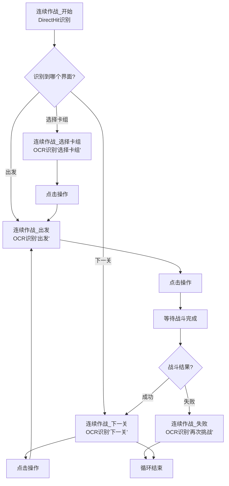
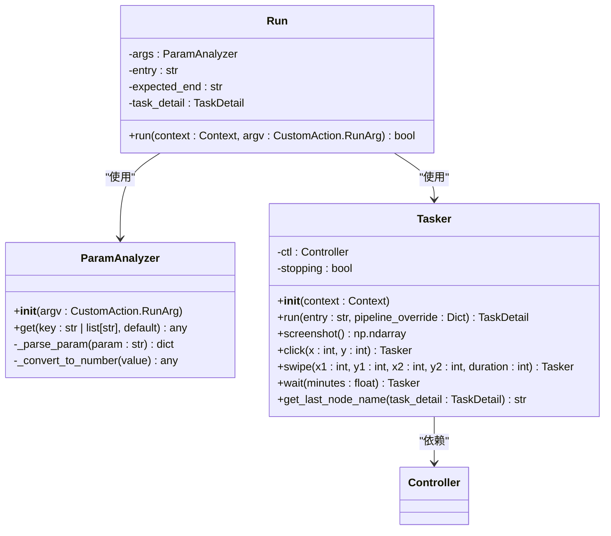
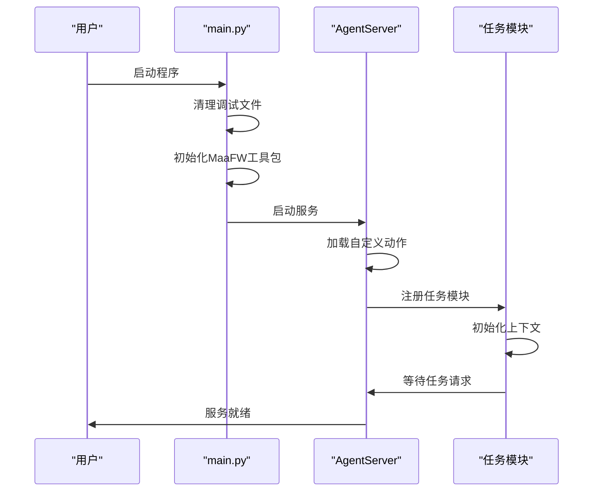
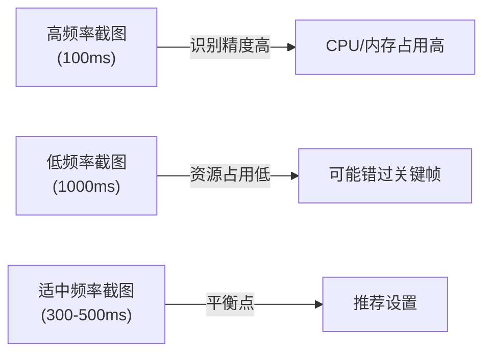
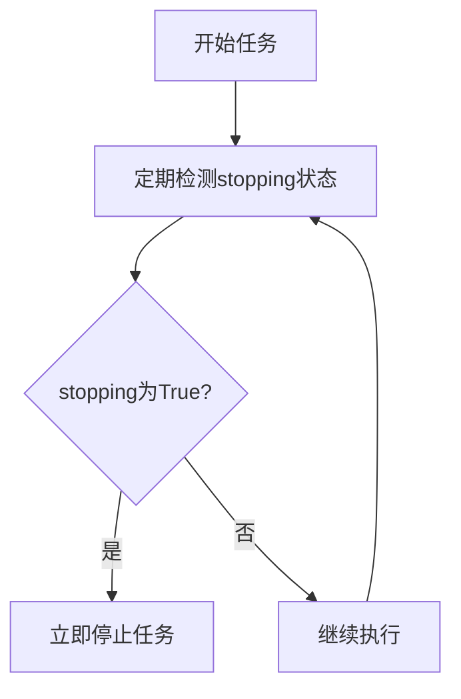

# 连续作战功能

<cite>
**本文档引用的文件**
- [continuous_battle.md](file://descs/single/continuous_battle.md)
- [连续作战.json](file://assets/resource/base/pipeline/开荒功能/连续作战.json)
- [pipeline_helper.py](file://agent/customs/global_func/pipeline_helper.py)
- [tasker.py](file://agent/customs/maahelper/tasker.py)
- [argv_analyzer.py](file://agent/customs/maahelper/argv_analyzer.py)
- [reco_helper.py](file://agent/customs/maahelper/reco_helper.py)
- [process_guard.py](file://agent/customs/global_func/process_guard.py)
- [main.py](file://agent/main.py)
</cite>

## 目录
1. [简介](#简介)
2. [使用场景与限制条件](#使用场景与限制条件)
3. [Pipeline循环控制逻辑](#pipeline循环控制逻辑)
4. [任务链动态构建机制](#任务链动态构建机制)
5. [长周期任务加载与启动](#长周期任务加载与启动)
6. [性能优化建议](#性能优化建议)
7. [总结](#总结)

## 简介

"连续作战"功能是MaaDuDuL系统中的一项核心自动化功能，专为需要重复执行战斗任务的场景设计。该功能通过自动化识别和操作，实现了在特定游戏场景下的连续战斗执行，特别适用于开荒推图等需要大量重复操作的场景。本功能基于MaaFramework构建，利用自定义动作和识别机制，实现了高效、稳定的自动化流程。

**Section sources**
- [continuous_battle.md](file://descs/single/continuous_battle.md#L1-L13)

## 使用场景与限制条件

连续作战功能主要应用于需要重复挑战关卡的场景，特别是在没有内置自动连续作战功能的游戏副本中。该功能的启动界面为关卡选择界面，结束界面为战斗结算界面或失败界面。作为独立任务和开荒功能的一部分，它为用户提供了在特定场景下自动进行连续挑战的能力。

该功能特别适用于以下场景：
- 新手开荒阶段的推图任务
- 需要重复获取特定资源的副本挑战
- 没有自动连续作战功能的游戏关卡

**Section sources**
- [continuous_battle.md](file://descs/single/continuous_battle.md#L9-L13)

## Pipeline循环控制逻辑

连续作战功能的核心在于其精心设计的Pipeline循环控制逻辑。通过分析`连续作战.json`文件，我们可以看到一个完整的循环控制结构，包括战斗结束判断、再战按钮识别和退出条件检测。

**Diagram sources**
- [连续作战.json](file://assets/resource/base/pipeline/开荒功能/连续作战.json#L79-L118)

该Pipeline通过多个节点的协同工作实现循环控制：
1. **开始节点**：使用DirectHit识别，作为流程的入口点
2. **选择卡组节点**：通过OCR识别"选择卡组"文本，并执行点击操作
3. **出发节点**：识别"出发"按钮并点击，开始战斗
4. **下一关节点**：战斗成功后识别"下一关"按钮并点击，进入下一轮循环
5. **失败节点**：识别"再次挑战"文本，作为循环的退出条件

每个节点都配置了相应的识别区域(ROI)和预期文本，确保在不同界面状态下能够准确识别并执行相应操作。

**Section sources**
- [连续作战.json](file://assets/resource/base/pipeline/开荒功能/连续作战.json#L1-L120)

## 任务链动态构建机制

任务链的动态构建机制主要通过`pipeline_helper.py`和`tasker.py`中的辅助函数实现。`Run`类作为自定义动作，负责执行任务链的核心逻辑。

**Diagram sources**
- [pipeline_helper.py](file://agent/customs/global_func/pipeline_helper.py#L9-L25)
- [tasker.py](file://agent/customs/maahelper/tasker.py#L16-L177)
- [argv_analyzer.py](file://agent/customs/maahelper/argv_analyzer.py#L17-L159)

`Tasker`类封装了MaaFramework的上下文对象，提供了便捷的任务执行接口。其`run`方法是任务链动态构建的核心，通过以下机制实现：

1. **参数解析**：使用`ParamAnalyzer`解析传入的参数，支持JSON和查询字符串格式
2. **Pipeline覆盖**：动态修改节点行为，实现任务流程的灵活调整
3. **监测器注入**：自动为所有节点注入运行监测器，确保任务执行过程可被监控
4. **结果验证**：通过`expected_end`参数验证任务是否在预期节点结束

`run`方法的关键特性包括：
- 支持通过`entry`参数指定任务入口节点
- 支持通过`expected_end`参数验证任务结束状态
- 自动处理节点间的跳转逻辑
- 异常处理机制确保任务的稳定性

**Section sources**
- [pipeline_helper.py](file://agent/customs/global_func/pipeline_helper.py#L9-L25)
- [tasker.py](file://agent/customs/maahelper/tasker.py#L51-L113)
- [argv_analyzer.py](file://agent/customs/maahelper/argv_analyzer.py#L17-L159)

## 长周期任务加载与启动

长周期任务的加载与启动机制主要在`main.py`中实现。系统通过AgentServer启动服务，并加载相应的任务模块。

**Diagram sources**
- [main.py](file://agent/main.py#L1-L48)
- [pipeline_helper.py](file://agent/customs/global_func/pipeline_helper.py#L9-L25)

`main.py`中的`main`函数负责初始化环境、检查依赖并启动Agent服务器。关键步骤包括：

1. **环境初始化**：将项目根目录添加到Python路径，确保模块正确导入
2. **依赖检查**：在非开发模式下检查并安装必要的依赖
3. **服务启动**：初始化MaaFW工具包并启动AgentServer
4. **任务注册**：通过`@AgentServer.custom_action`装饰器注册自定义动作

状态隔离通过以下机制实现：
- 每个任务在独立的上下文中执行
- 使用`context.tasker.stopping`属性检测任务停止状态
- 通过`pipeline_override`参数实现任务流程的隔离

**Section sources**
- [main.py](file://agent/main.py#L1-L48)
- [pipeline_helper.py](file://agent/customs/global_func/pipeline_helper.py#L9-L25)

## 性能优化建议

为了提高连续作战功能的性能和稳定性，建议采取以下优化措施：

### 截图间隔调整
合理设置截图间隔可以平衡性能和响应速度。在`连续作战.json`中，`rate_limit`字段用于控制节点的执行频率：

**Diagram sources**
- [连续作战.json](file://assets/resource/base/pipeline/开荒功能/连续作战.json#L50)

### 识别精度与速度的权衡
通过调整OCR识别的参数，可以在精度和速度之间找到最佳平衡点：

1. **ROI区域优化**：精确设置识别区域，减少处理的数据量
2. **预期文本精简**：只识别关键文本，减少匹配时间
3. **可信度阈值**：适当调整识别的可信度要求

### 设备负载监控策略
系统通过`process_guard.py`实现了任务停止检测机制，确保在高负载情况下能够及时响应：

**Diagram sources**
- [process_guard.py](file://agent/customs/global_func/process_guard.py#L72-L99)

具体实现中，`CheckStopping`类通过`context.tasker.stopping`属性实时检测任务状态，确保在用户请求停止时能够快速响应。

**Section sources**
- [连续作战.json](file://assets/resource/base/pipeline/开荒功能/连续作战.json#L50)
- [process_guard.py](file://agent/customs/global_func/process_guard.py#L72-L99)
- [reco_helper.py](file://agent/customs/maahelper/reco_helper.py#L232-L255)

## 总结

连续作战功能通过精心设计的Pipeline结构、灵活的任务链构建机制和高效的性能优化策略，实现了在特定场景下的自动化连续战斗。该功能的核心优势在于：

1. **灵活的循环控制**：通过多个识别节点的协同工作，实现了精确的循环控制
2. **动态任务构建**：支持通过参数动态调整任务流程，提高了功能的适应性
3. **稳定的状态管理**：通过任务监测和停止检测机制，确保了长周期任务的稳定性
4. **可配置的性能优化**：提供了多种性能调优选项，适应不同设备和场景的需求

该功能的设计充分考虑了实际使用场景中的各种情况，通过合理的架构设计和代码实现，为用户提供了高效、可靠的自动化解决方案。