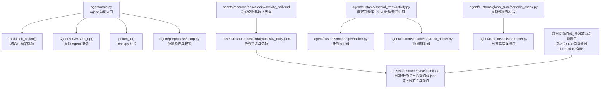
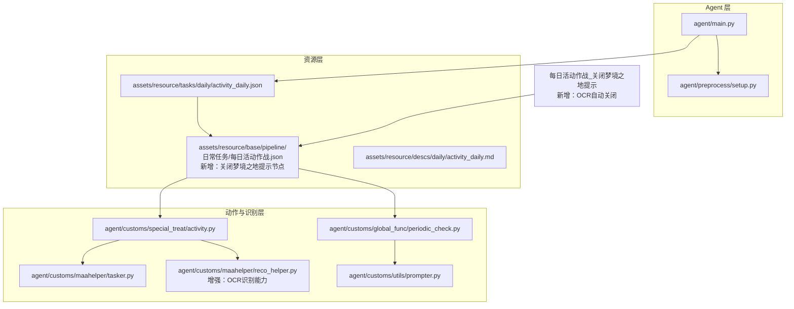
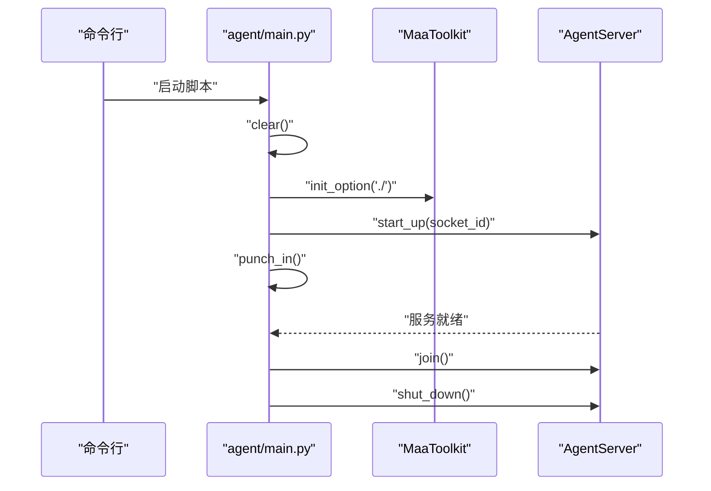
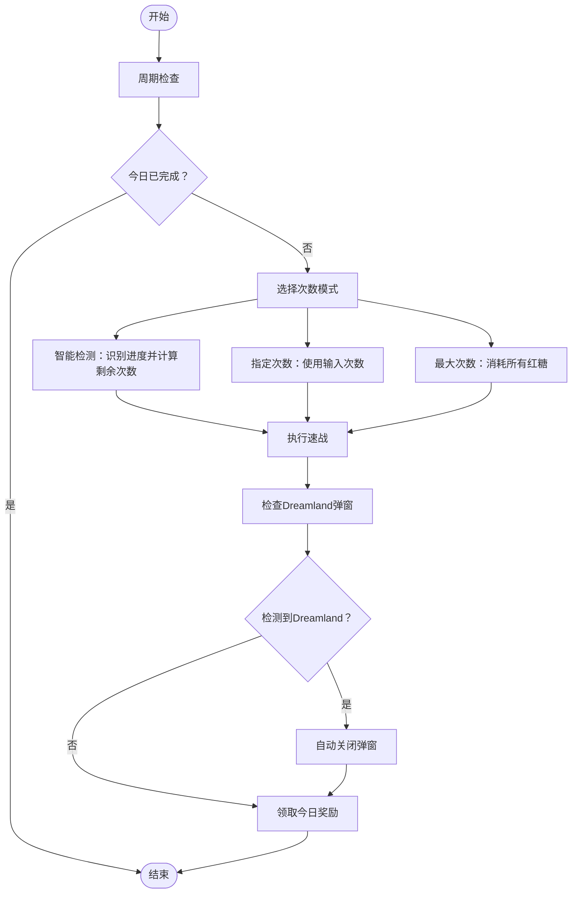
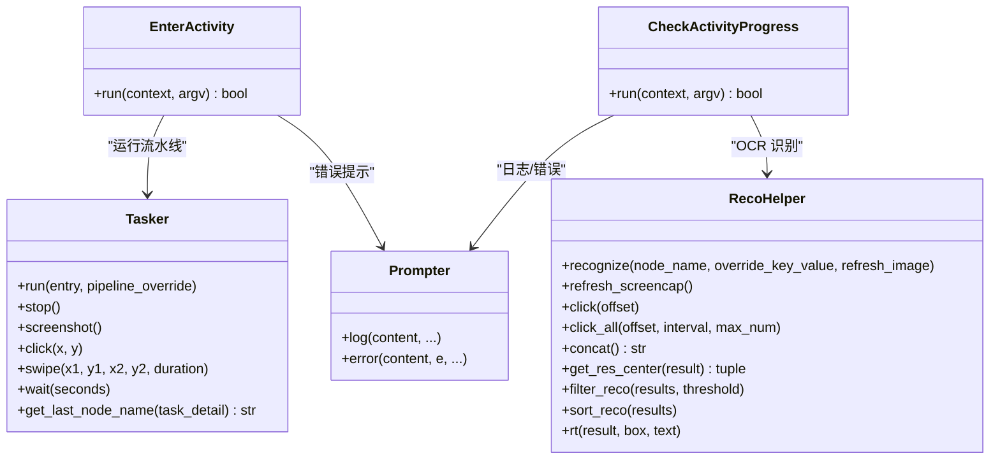
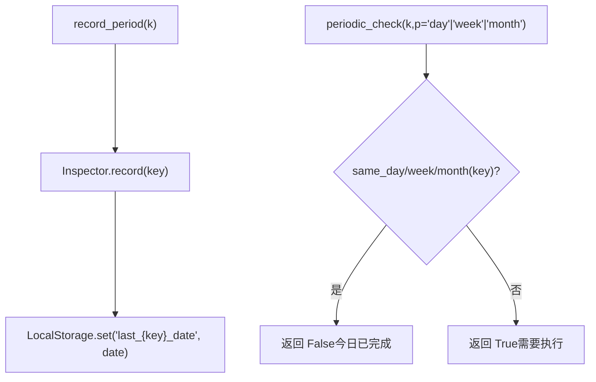
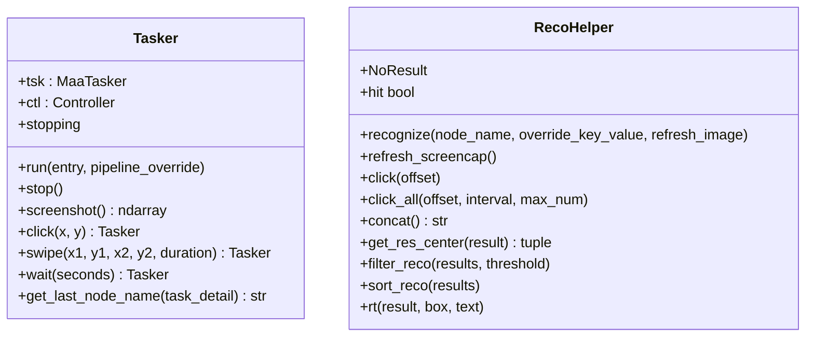
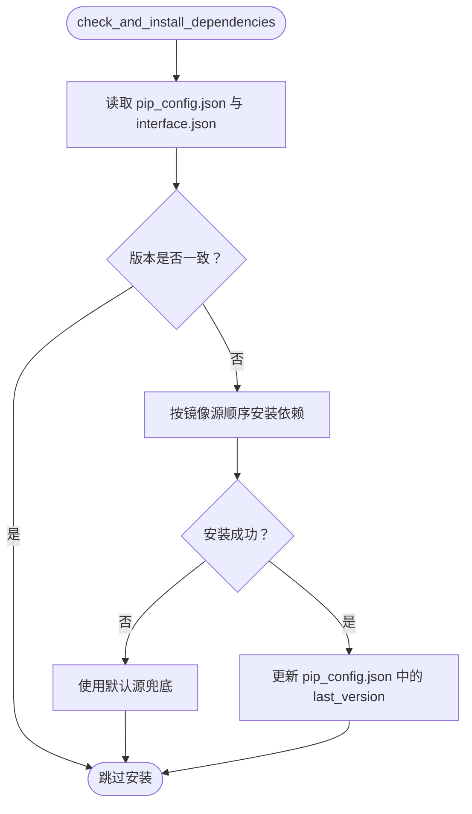
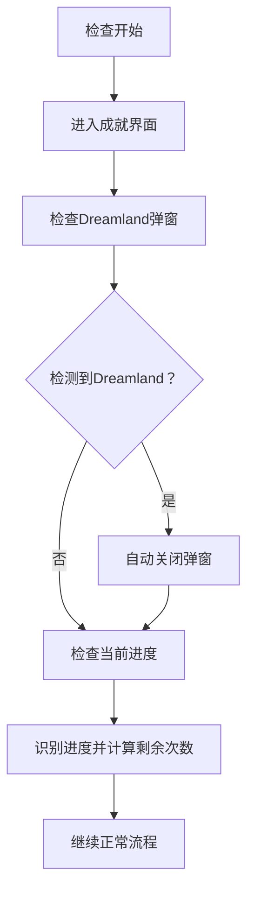
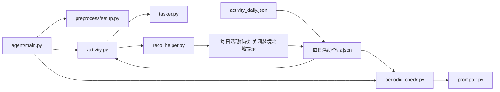

# 每日活动作战

<cite>
**本文引用的文件**
- [README.md](file://README.md)
- [agent/main.py](file://agent/main.py)
- [assets/resource/tasks/daily/activity_daily.json](file://assets/resource/tasks/daily/activity_daily.json)
- [assets/resource/base/pipeline/日常任务/每日活动作战.json](file://assets/resource/base/pipeline/日常任务/每日活动作战.json)
- [assets/resource/descs/daily/activity_daily.md](file://assets/resource/descs/daily/activity_daily.md)
- [agent/customs/special_treat/activity.py](file://agent/customs/special_treat/activity.py)
- [agent/customs/utils/prompter.py](file://agent/customs/utils/prompter.py)
- [agent/customs/maahelper/tasker.py](file://agent/customs/maahelper/tasker.py)
- [agent/customs/maahelper/reco_helper.py](file://agent/customs/maahelper/reco_helper.py)
- [agent/customs/global_func/periodic_check.py](file://agent/customs/global_func/periodic_check.py)
- [agent/preprocess/setup.py](file://agent/preprocess/setup.py)
- [package.json](file://package.json)
</cite>

## 更新摘要
**变更内容**
- 新增"关闭梦境之地提示"节点，解决战斗操作卡在Dreamland界面的问题
- 更新viewport坐标从[-8052, -939, 1.32]调整为[-5708, -114, 1.14]
- 添加OCR识别机制自动检测和关闭Dreamland通知弹窗
- 优化检查进度流程，增加对Dreamland弹窗的自动处理

## 目录
1. [简介](#简介)
2. [项目结构](#项目结构)
3. [核心组件](#核心组件)
4. [架构总览](#架构总览)
5. [详细组件分析](#详细组件分析)
6. [依赖关系分析](#依赖关系分析)
7. [性能考量](#性能考量)
8. [故障排查指南](#故障排查指南)
9. [结论](#结论)
10. [附录](#附录)

## 简介
本项目为基于 MaaFramework 与 MFAAvalonia 的自动化助手，面向游戏《嘟嘟脸恶作剧》的日常活动作战与奖励领取场景。文档聚焦"每日活动作战"功能，涵盖任务编排、OCR 识别、周期性检查、自定义动作与流水线配置等关键能力，帮助用户在不同界面间自动完成活动入口导航、进度检查、战斗挑战与奖励领取。

**更新** 新增对Dreamland界面的自动检测和处理机制，解决战斗操作卡在特定界面的问题。

## 项目结构
项目采用模块化组织，核心围绕 Agent 启动、资源与流水线配置、自定义动作与识别辅助、周期性检查与环境准备等模块协同工作。

**图表来源**
- [agent/main.py:47-78](file://agent/main.py#L47-L78)
- [agent/preprocess/setup.py:204-230](file://agent/preprocess/setup.py#L204-L230)
- [assets/resource/tasks/daily/activity_daily.json:1-79](file://assets/resource/tasks/daily/activity_daily.json#L1-L79)
- [assets/resource/base/pipeline/日常任务/每日活动作战.json:1-699](file://assets/resource/base/pipeline/日常任务/每日活动作战.json#L1-L699)
- [agent/customs/special_treat/activity.py:14-101](file://agent/customs/special_treat/activity.py#L14-L101)
- [agent/customs/maahelper/tasker.py:16-190](file://agent/customs/maahelper/tasker.py#L16-L190)
- [agent/customs/maahelper/reco_helper.py:17-256](file://agent/customs/maahelper/reco_helper.py#L17-L256)
- [agent/customs/global_func/periodic_check.py:29-279](file://agent/customs/global_func/periodic_check.py#L29-L279)
- [agent/customs/utils/prompter.py:16-55](file://agent/customs/utils/prompter.py#L16-L55)
- [assets/resource/descs/daily/activity_daily.md:1-13](file://assets/resource/descs/daily/activity_daily.md#L1-L13)

**章节来源**
- [agent/main.py:1-78](file://agent/main.py#L1-L78)
- [agent/preprocess/setup.py:1-230](file://agent/preprocess/setup.py#L1-L230)
- [assets/resource/tasks/daily/activity_daily.json:1-79](file://assets/resource/tasks/daily/activity_daily.json#L1-L79)
- [assets/resource/base/pipeline/日常任务/每日活动作战.json:1-699](file://assets/resource/base/pipeline/日常任务/每日活动作战.json#L1-L699)
- [assets/resource/descs/daily/activity_daily.md:1-13](file://assets/resource/descs/daily/activity_daily.md#L1-L13)

## 核心组件
- Agent 启动与环境初始化：负责清理调试文件、初始化 MaaFramework、启动 Agent 服务与 DevOps 打卡，并等待服务结束。
- 任务与流水线：通过 JSON 定义任务、选项与节点，支持周期检查、OCR 识别、点击与自定义动作组合。
- 自定义动作：提供"进入活动界面""检查活动进度"等动作，结合识别辅助器与任务执行器实现自动化。
- 周期性检查：基于本地存储记录任务完成时间，支持按日/周/月判断是否需要执行。
- 依赖管理：自动检测版本差异并按镜像源顺序尝试安装依赖，保障运行环境一致性。
- **新增** Dreamland 弹窗自动处理：通过OCR识别Dreamland通知弹窗并自动关闭，防止战斗操作卡死。

**章节来源**
- [agent/main.py:47-78](file://agent/main.py#L47-L78)
- [agent/customs/special_treat/activity.py:14-101](file://agent/customs/special_treat/activity.py#L14-L101)
- [agent/customs/global_func/periodic_check.py:29-279](file://agent/customs/global_func/periodic_check.py#L29-L279)
- [agent/preprocess/setup.py:204-230](file://agent/preprocess/setup.py#L204-L230)

## 架构总览
整体架构围绕"任务定义—流水线执行—自定义动作—识别辅助—周期检查—环境准备"的闭环展开，Agent 作为统一入口协调各模块。

**图表来源**
- [agent/main.py:47-78](file://agent/main.py#L47-L78)
- [agent/preprocess/setup.py:204-230](file://agent/preprocess/setup.py#L204-L230)
- [assets/resource/tasks/daily/activity_daily.json:1-79](file://assets/resource/tasks/daily/activity_daily.json#L1-L79)
- [assets/resource/base/pipeline/日常任务/每日活动作战.json:159-184](file://assets/resource/base/pipeline/日常任务/每日活动作战.json#L159-L184)
- [agent/customs/special_treat/activity.py:14-101](file://agent/customs/special_treat/activity.py#L14-L101)
- [agent/customs/maahelper/tasker.py:16-190](file://agent/customs/maahelper/tasker.py#L16-L190)
- [agent/customs/maahelper/reco_helper.py:17-256](file://agent/customs/maahelper/reco_helper.py#L17-L256)
- [agent/customs/global_func/periodic_check.py:29-279](file://agent/customs/global_func/periodic_check.py#L29-L279)
- [agent/customs/utils/prompter.py:16-55](file://agent/customs/utils/prompter.py#L16-L55)

## 详细组件分析

### Agent 启动与服务生命周期
- 清理调试文件与初始化 Toolkit。
- 从命令行参数读取 socket ID 并启动 Agent 服务。
- 启动 DevOps 打卡后等待服务结束并关闭。

**图表来源**
- [agent/main.py:47-78](file://agent/main.py#L47-L78)

**章节来源**
- [agent/main.py:47-78](file://agent/main.py#L47-L78)

### 任务定义与选项（每日活动作战）
- 任务元数据：名称、标签、入口节点、默认检查开关、描述文件与分组。
- 选项体系：
  - 周期检查：是否仅执行一次。
  - 作战次数：智能检测、指定次数、最大次数三种策略；指定次数时通过覆盖节点参数动态注入次数。

**图表来源**
- [assets/resource/tasks/daily/activity_daily.json:13-79](file://assets/resource/tasks/daily/activity_daily.json#L13-L79)
- [assets/resource/base/pipeline/日常任务/每日活动作战.json:171-421](file://assets/resource/base/pipeline/日常任务/每日活动作战.json#L171-L421)
- [assets/resource/base/pipeline/日常任务/每日活动作战.json:159-184](file://assets/resource/base/pipeline/日常任务/每日活动作战.json#L159-L184)

**章节来源**
- [assets/resource/tasks/daily/activity_daily.json:1-79](file://assets/resource/tasks/daily/activity_daily.json#L1-L79)
- [assets/resource/base/pipeline/日常任务/每日活动作战.json:171-421](file://assets/resource/base/pipeline/日常任务/每日活动作战.json#L171-L421)

### 自定义动作：进入活动与检查进度
- 进入活动：解析参数获取活动标题，调用任务执行器运行"进入活动界面"流水线，最终依据节点名判断是否成功进入。
- 检查进度：OCR 识别进度文本，解析剩余次数，动态覆盖"速战"节点参数，实现智能次数注入；若已达上限则返回 False。

**图表来源**
- [agent/customs/special_treat/activity.py:14-101](file://agent/customs/special_treat/activity.py#L14-L101)
- [agent/customs/maahelper/tasker.py:16-190](file://agent/customs/maahelper/tasker.py#L16-L190)
- [agent/customs/maahelper/reco_helper.py:17-256](file://agent/customs/maahelper/reco_helper.py#L17-L256)
- [agent/customs/utils/prompter.py:16-55](file://agent/customs/utils/prompter.py#L16-L55)

**章节来源**
- [agent/customs/special_treat/activity.py:14-101](file://agent/customs/special_treat/activity.py#L14-L101)
- [agent/customs/maahelper/tasker.py:60-123](file://agent/customs/maahelper/tasker.py#L60-L123)
- [agent/customs/maahelper/reco_helper.py:62-95](file://agent/customs/maahelper/reco_helper.py#L62-L95)

### 周期性检查与记录
- Inspector 提供按日/周/月的周期判断与记录功能，内部使用本地存储保存上次完成日期。
- 4 点刷新机制：凌晨 4 点前视为前一天，保证周期判断符合游戏逻辑。
- 提供自定义动作 periodic_check 与 record_period，分别用于判断与记录任务完成时间。

**图表来源**
- [agent/customs/global_func/periodic_check.py:68-180](file://agent/customs/global_func/periodic_check.py#L68-L180)
- [agent/customs/global_func/periodic_check.py:185-279](file://agent/customs/global_func/periodic_check.py#L185-L279)

**章节来源**
- [agent/customs/global_func/periodic_check.py:29-279](file://agent/customs/global_func/periodic_check.py#L29-L279)

### 识别辅助与任务执行器
- 识别辅助器：支持识别、截图缓存、点击最佳匹配、批量点击、结果拼接与排序等。
- 任务执行器：封装 MaaFramework 的任务执行、截图、点击、滑动、等待与节点名获取等常用操作，提供链式调用与 next/on_error 注入。

**图表来源**
- [agent/customs/maahelper/tasker.py:16-190](file://agent/customs/maahelper/tasker.py#L16-L190)
- [agent/customs/maahelper/reco_helper.py:17-256](file://agent/customs/maahelper/reco_helper.py#L17-L256)

**章节来源**
- [agent/customs/maahelper/tasker.py:16-190](file://agent/customs/maahelper/tasker.py#L16-L190)
- [agent/customs/maahelper/reco_helper.py:17-256](file://agent/customs/maahelper/reco_helper.py#L17-L256)

### 依赖管理与环境准备
- 自动检测 interface.json 版本与本地配置，若不一致则按镜像源顺序尝试安装 requirements.txt。
- 支持禁用自动安装与自定义镜像源列表，失败时回退至官方默认源。

**图表来源**
- [agent/preprocess/setup.py:204-230](file://agent/preprocess/setup.py#L204-L230)

**章节来源**
- [agent/preprocess/setup.py:204-230](file://agent/preprocess/setup.py#L204-L230)

### **新增** Dreamland 弹窗自动处理机制
- **新增节点**：每日活动作战_关闭梦境之地提示，专门用于检测和关闭Dreamland通知弹窗。
- **OCR 识别**：使用OCR技术识别界面中的"Dreamland"文本，ROI区域经过优化以提高识别准确率。
- **自动关闭**：一旦检测到Dreamland弹窗，系统会自动点击关闭按钮，防止战斗操作卡死。
- **流程集成**：该节点被集成到检查进度流程中，作为JumpBack目标，确保不会影响正常的活动流程。

**图表来源**
- [assets/resource/base/pipeline/日常任务/每日活动作战.json:159-184](file://assets/resource/base/pipeline/日常任务/每日活动作战.json#L159-L184)
- [assets/resource/base/pipeline/日常任务/每日活动作战.json:387-388](file://assets/resource/base/pipeline/日常任务/每日活动作战.json#L387-L388)

**章节来源**
- [assets/resource/base/pipeline/日常任务/每日活动作战.json:159-184](file://assets/resource/base/pipeline/日常任务/每日活动作战.json#L159-L184)
- [assets/resource/base/pipeline/日常任务/每日活动作战.json:387-388](file://assets/resource/base/pipeline/日常任务/每日活动作战.json#L387-L388)

## 依赖关系分析
- 低耦合高内聚：自定义动作与识别辅助器通过 Tasker 与 RecoHelper 解耦，便于扩展与复用。
- 数据流：任务定义 → 流水线节点 → 识别辅助器 → 自定义动作 → 周期性检查 → 环境准备。
- 外部依赖：MaaFramework、MFAAvalonia、OCR 模型与模板资源。
- **新增**：Dreamland 弹窗处理机制与现有流水线无缝集成，不影响原有功能。

**图表来源**
- [agent/customs/special_treat/activity.py:14-101](file://agent/customs/special_treat/activity.py#L14-L101)
- [agent/customs/maahelper/tasker.py:16-190](file://agent/customs/maahelper/tasker.py#L16-L190)
- [agent/customs/maahelper/reco_helper.py:17-256](file://agent/customs/maahelper/reco_helper.py#L17-L256)
- [agent/customs/global_func/periodic_check.py:29-279](file://agent/customs/global_func/periodic_check.py#L29-L279)
- [agent/customs/utils/prompter.py:16-55](file://agent/customs/utils/prompter.py#L16-L55)
- [agent/main.py:47-78](file://agent/main.py#L47-L78)
- [agent/preprocess/setup.py:204-230](file://agent/preprocess/setup.py#L204-L230)
- [assets/resource/tasks/daily/activity_daily.json:1-79](file://assets/resource/tasks/daily/activity_daily.json#L1-L79)
- [assets/resource/base/pipeline/日常任务/每日活动作战.json:1-699](file://assets/resource/base/pipeline/日常任务/每日活动作战.json#L1-L699)

**章节来源**
- [agent/customs/special_treat/activity.py:14-101](file://agent/customs/special_treat/activity.py#L14-L101)
- [agent/customs/maahelper/tasker.py:16-190](file://agent/customs/maahelper/tasker.py#L16-L190)
- [agent/customs/maahelper/reco_helper.py:17-256](file://agent/customs/maahelper/reco_helper.py#L17-L256)
- [agent/customs/global_func/periodic_check.py:29-279](file://agent/customs/global_func/periodic_check.py#L29-L279)
- [agent/customs/utils/prompter.py:16-55](file://agent/customs/utils/prompter.py#L16-L55)
- [agent/main.py:47-78](file://agent/main.py#L47-L78)
- [agent/preprocess/setup.py:204-230](file://agent/preprocess/setup.py#L204-L230)
- [assets/resource/tasks/daily/activity_daily.json:1-79](file://assets/resource/tasks/daily/activity_daily.json#L1-L79)
- [assets/resource/base/pipeline/日常任务/每日活动作战.json:1-699](file://assets/resource/base/pipeline/日常任务/每日活动作战.json#L1-L699)

## 性能考量
- 图像识别与点击延迟：合理设置 pre/post delay 与 repeat_delay，避免频繁重复点击造成卡顿。
- OCR 识别范围：限定 ROI 与模板匹配，减少误判与无效识别。
- 智能次数注入：通过进度识别动态调整次数，避免无效战斗与资源浪费。
- 网络镜像源：按顺序尝试镜像源并兜底默认源，提升依赖安装成功率与时效。
- **新增** Dreamland 弹窗处理：优化的OCR识别ROI区域，提高识别准确率，减少误触发。

## 故障排查指南
- Agent 启动失败：检查环境编码设置与依赖安装状态，确认 Toolkit 初始化与 Agent 服务端口可用。
- 识别失败：确认 OCR 模型与模板资源完整，适当扩大 ROI 或调整识别阈值。
- 周期检查异常：检查本地存储键值格式与日期解析，确保 4 点刷新逻辑正确。
- 依赖安装失败：检查网络与镜像源配置，必要时禁用自动安装并手动安装。
- **新增** Dreamland 弹窗问题：检查OCR识别ROI区域设置，确认"Dreamland"文本识别准确，如识别失败可适当调整识别阈值。

**章节来源**
- [agent/main.py:69-71](file://agent/main.py#L69-L71)
- [agent/customs/utils/prompter.py:33-55](file://agent/customs/utils/prompter.py#L33-L55)
- [agent/preprocess/setup.py:164-198](file://agent/preprocess/setup.py#L164-L198)

## 结论
"每日活动作战"功能通过清晰的任务定义、灵活的流水线节点与自定义动作、可靠的 OCR 识别与周期性检查机制，实现了从活动入口到战斗挑战再到奖励领取的全链路自动化。**新增的Dreamland弹窗自动处理机制进一步增强了系统的稳定性，通过OCR识别和自动关闭功能有效解决了战斗操作卡死的问题。**配合依赖管理与环境准备模块，整体方案具备良好的可维护性与扩展性。

## 附录
- 功能说明与起止界面参考：[功能说明:1-13](file://assets/resource/descs/daily/activity_daily.md#L1-L13)
- 任务与选项定义：[任务定义:1-79](file://assets/resource/tasks/daily/activity_daily.json#L1-L79)
- 流水线节点与动作：[流水线:1-699](file://assets/resource/base/pipeline/日常任务/每日活动作战.json#L1-L699)
- 开发与调试脚本：[脚本:2-8](file://package.json#L2-L8)
- **新增** Dreamland 弹窗处理节点：[每日活动作战_关闭梦境之地提示:159-184](file://assets/resource/base/pipeline/日常任务/每日活动作战.json#L159-L184)