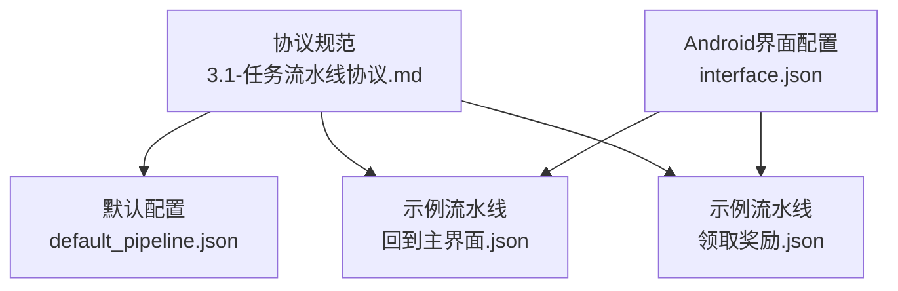
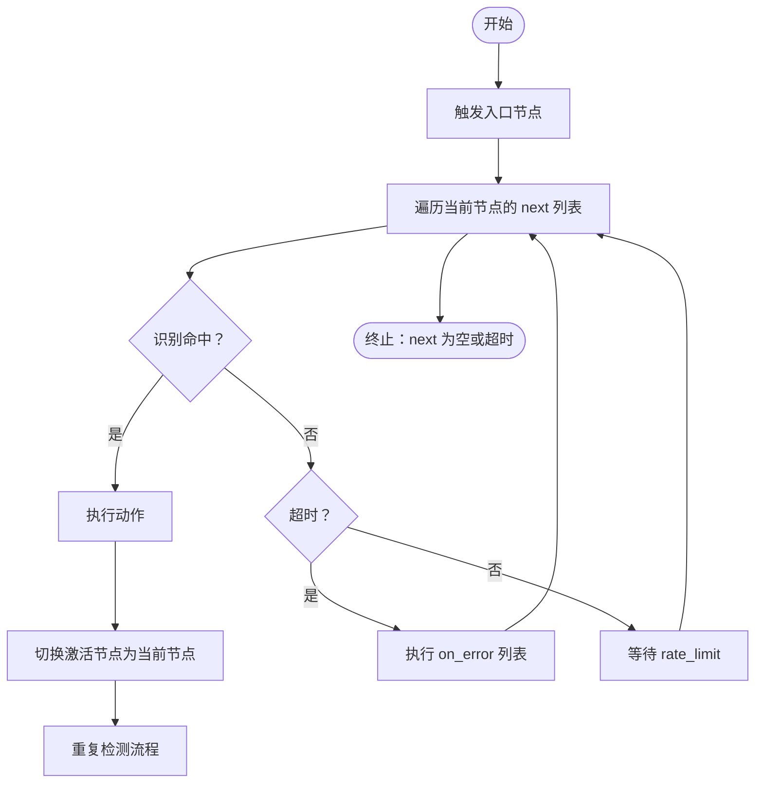
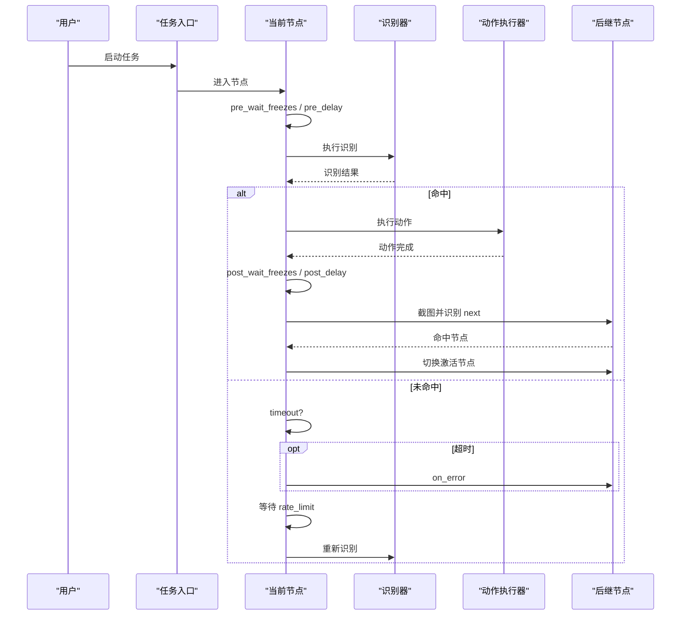
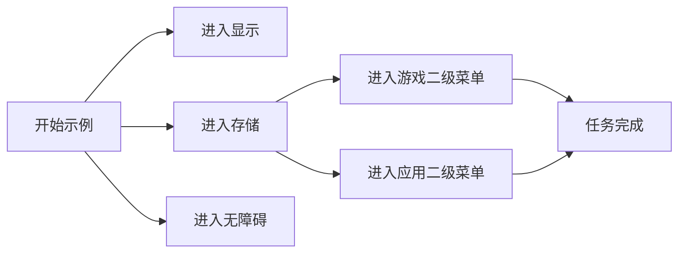
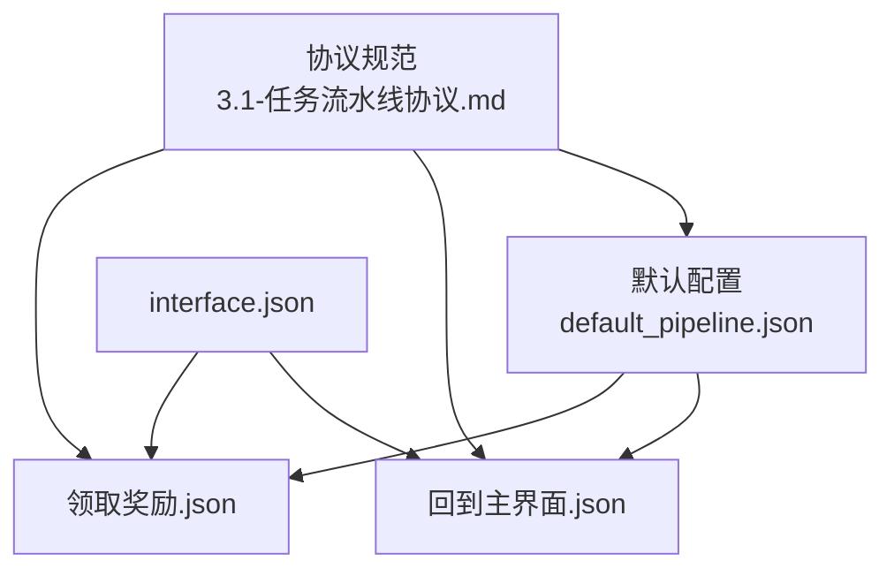

# 任务流水线协议规范

<cite>
**本文引用的文件**
- [任务流水线协议.md](file://instructions/maafw-guide/3.1-任务流水线协议.md)
- [default_pipeline.json](file://assets/resource/base/default_pipeline.json)
- [interface.json](file://assets/interface.json)
- [回到主界面.json](file://assets/resource/base/pipeline/通用/回到主界面.json)
- [领取奖励.json](file://assets/resource/base/pipeline/日常任务/领取奖励.json)
</cite>

## 目录
1. [简介](#简介)
2. [项目结构](#项目结构)
3. [核心组件](#核心组件)
4. [架构总览](#架构总览)
5. [详细组件分析](#详细组件分析)
6. [依赖关系分析](#依赖关系分析)
7. [性能考量](#性能考量)
8. [故障排查指南](#故障排查指南)
9. [结论](#结论)
10. [附录](#附录)

## 简介
本文件系统化解析 MaaDuDuL 任务流水线的 JSON 协议规范，涵盖节点（Node）核心属性结构、v1 与 v2 的格式差异、默认配置继承优先级、以及 Android 设置界面示例中的多级菜单跳转配置逻辑。同时给出 default_pipeline.json 的最佳实践与以点（.）和美元符（$）开头的文件/字段的特殊处理机制说明。

## 项目结构
- 协议与规范：位于 instructions/maafw-guide/3.1-任务流水线协议.md
- 默认流水线配置：assets/resource/base/default_pipeline.json
- 任务流水线示例：assets/resource/base/pipeline/通用/回到主界面.json、assets/resource/base/pipeline/日常任务/领取奖励.json
- Android 设置界面示例：assets/interface.json（含多级菜单与选项联动）

图表来源
- [任务流水线协议.md](file://instructions/maafw-guide/3.1-任务流水线协议.md#L1-L1451)
- [default_pipeline.json](file://assets/resource/base/default_pipeline.json#L1-L7)
- [回到主界面.json](file://assets/resource/base/pipeline/通用/回到主界面.json#L1-L202)
- [领取奖励.json](file://assets/resource/base/pipeline/日常任务/领取奖励.json#L1-L629)
- [interface.json](file://assets/interface.json#L1-L1196)

章节来源
- [任务流水线协议.md](file://instructions/maafw-guide/3.1-任务流水线协议.md#L1-L1451)
- [default_pipeline.json](file://assets/resource/base/default_pipeline.json#L1-L7)
- [interface.json](file://assets/interface.json#L1-L1196)

## 核心组件
- 节点（Node）：由若干属性组成，包含识别（recognition）、动作（action）、后继节点列表（next）等。
- v1 与 v2：v2 将 recognition/action 的类型与参数拆分为 type/param 的二级字典结构，其余字段保持兼容。
- 默认配置（default_pipeline.json）：为所有节点与特定算法/动作类型提供默认参数，减少重复配置。
- 继承优先级：节点定义 > 算法/动作默认值 > Default 全局配置 > 框架内置值。
- 特殊字段处理：以点（.）开头的文件夹/文件不被读取；以 $ 开头的 JSON root field 不被解析。

章节来源
- [任务流水线协议.md](file://instructions/maafw-guide/3.1-任务流水线协议.md#L132-L387)

## 架构总览
任务流水线的执行流程遵循“入口节点 -> 顺序检测 next -> 命中后执行动作 -> 切换激活节点 -> 循环检测”的闭环。终止条件为 next 为空或超时。

图表来源
- [任务流水线协议.md](file://instructions/maafw-guide/3.1-任务流水线协议.md#L22-L51)

## 详细组件分析

### 节点属性与生命周期
- 核心属性
  - recognition：识别算法类型（v1 字符串；v2 为 { type, param }）
  - action：执行动作类型（v1 字符串；v2 为 { type, param }）
  - next：后继节点列表（可混用字符串与带属性节点）
  - on_error：识别超时或动作失败后的备用节点列表
  - anchor/jump_back：锚点与跳回机制（节点属性）
  - pre/post delay/wait_freezes：前后延时与画面静止等待
  - repeat/repeat_delay/repeat_wait_freezes：动作重复与间隔
  - focus/attach：节点通知与附加配置
  - enabled/max_hit/inverse：启用、命中上限、反转识别
  - rate_limit/timeout：识别速率与超时
- 生命周期顺序
  - pre_wait_freezes -> pre_delay -> action -> [repeat] -> post_wait_freezes -> post_delay -> 截图 -> 识别 next -> 命中/超时/重试

图表来源
- [任务流水线协议.md](file://instructions/maafw-guide/3.1-任务流水线协议.md#L234-L255)

章节来源
- [任务流水线协议.md](file://instructions/maafw-guide/3.1-任务流水线协议.md#L132-L255)

### v1 与 v2 格式差异
- v1：recognition/action 直接为字符串或对象
- v2：recognition/action 为对象，包含 type 与 param 两层结构
- 其他字段保持兼容，便于渐进迁移

章节来源
- [任务流水线协议.md](file://instructions/maafw-guide/3.1-任务流水线协议.md#L257-L288)

### 默认配置与继承优先级
- default_pipeline.json 提供三类默认：
  - Default：通用字段默认值（如 rate_limit、timeout、pre_delay）
  - 算法名称对象：识别算法默认参数（如 TemplateMatch、OCR、FeatureMatch）
  - 动作名称对象：动作默认参数（如 Click、Swipe、StartApp）
- 继承优先级（从高到低）：
  1) 节点中直接定义的参数
  2) default_pipeline.json 中对应算法/动作类型的默认参数
  3) default_pipeline.json 中 Default 对象的默认参数
  4) 框架内置默认值
- 多 Bundle 加载时，各 Bundle 的 default_pipeline.json 会按顺序合并，后加载覆盖先加载；已加载节点不受后续默认值影响

章节来源
- [任务流水线协议.md](file://instructions/maafw-guide/3.1-任务流水线协议.md#L290-L418)

### Android 设置界面示例：多级菜单跳转
- 示例场景：Android 设置界面存在菜单“显示”“存储”“无障碍”，其中“存储”打开后包含二级菜单“游戏”“应用”
- 配置要点
  - 入口节点 next 列表包含一级菜单节点
  - “存储”节点 next 包含二级菜单节点
  - 二级菜单节点 next 为空或指向最终操作节点
- 执行流程
  - 逐个识别 next 中的节点，命中后执行动作并切换激活节点
  - 若全部未命中，等待 rate_limit 再次尝试，直至超时

图表来源
- [任务流水线协议.md](file://instructions/maafw-guide/3.1-任务流水线协议.md#L52-L131)

章节来源
- [任务流水线协议.md](file://instructions/maafw-guide/3.1-任务流水线协议.md#L52-L131)

### default_pipeline.json 最佳实践
- 将调试与生产的速率控制分离到不同 Bundle 的 default_pipeline.json 中，实现配置隔离
- base Bundle 使用较高 rate_limit，debug Bundle 使用较低 rate_limit，从而在不同环境下分别控制识别频率
- 已加载节点不受后续 Bundle 默认值影响，确保稳定性

章节来源
- [任务流水线协议.md](file://instructions/maafw-guide/3.1-任务流水线协议.md#L381-L418)
- [default_pipeline.json](file://assets/resource/base/default_pipeline.json#L1-L7)

### 特殊处理机制：以点（.）和美元符（$）开头的文件/字段
- 以点（.）开头的文件夹、JSON 文件不会被读取
- 以 $ 开头的 JSON root field 不会被解析

章节来源
- [任务流水线协议.md](file://instructions/maafw-guide/3.1-任务流水线协议.md#L134-L137)

### 示例：回到主界面流水线
- 节点结构
  - 开始节点：触发自定义动作，next 包含“检测主界面”“导航类返回”“面板类返回”“闲时捏脸”
  - 导航类返回：模板匹配返回按钮，执行点击
  - 面板类返回：模板匹配多种关闭按钮，执行点击
  - 闲时捏脸：自定义识别
  - 检测主界面：自定义识别，用于确认回到主界面
- v2 结构：recognition/action 均采用 type/param 二级字典

章节来源
- [回到主界面.json](file://assets/resource/base/pipeline/通用/回到主界面.json#L1-L202)

### 示例：领取奖励流水线
- 节点结构
  - 开始节点：触发自定义动作，next 指向“任务开始”
  - 任务开始：点击任务入口，next 指向“确保进入任务界面”
  - 确保进入任务界面：OCR 识别“任务”，next 指向“领取日任务奖励”
  - 领取日任务奖励：自定义动作领取，next 指向“领取周任务奖励”
  - 通行证相关：进入不同通行证界面，识别并领取奖励
  - 返回主界面：自定义动作调用返回主界面
- v2 结构：recognition/action 均采用 type/param 二级字典

章节来源
- [领取奖励.json](file://assets/resource/base/pipeline/日常任务/领取奖励.json#L1-L629)

## 依赖关系分析
- 协议规范与示例文件相互印证：协议定义字段，示例文件展示字段用法
- default_pipeline.json 与流水线文件共同决定节点最终行为
- interface.json 中的选项与流水线的 pipeline_override 协同，实现运行时参数注入

图表来源
- [任务流水线协议.md](file://instructions/maafw-guide/3.1-任务流水线协议.md#L1-L1451)
- [default_pipeline.json](file://assets/resource/base/default_pipeline.json#L1-L7)
- [回到主界面.json](file://assets/resource/base/pipeline/通用/回到主界面.json#L1-L202)
- [领取奖励.json](file://assets/resource/base/pipeline/日常任务/领取奖励.json#L1-L629)
- [interface.json](file://assets/interface.json#L1-L1196)

章节来源
- [任务流水线协议.md](file://instructions/maafw-guide/3.1-任务流水线协议.md#L1-L1451)
- [default_pipeline.json](file://assets/resource/base/default_pipeline.json#L1-L7)
- [interface.json](file://assets/interface.json#L1-L1196)

## 性能考量
- 速率控制：通过 rate_limit 控制每轮识别的最小耗时，避免过于频繁的截图与识别
- 超时控制：timeout 与 rate_limit 共同决定识别循环的节奏
- 延迟与等待：合理使用 pre/post delay 与 wait_freezes，减少误判与抖动
- 重复执行：repeat/repeat_delay/repeat_wait_freezes 用于批量或稳健操作，注意与 delay 的配合

章节来源
- [任务流水线协议.md](file://instructions/maafw-guide/3.1-任务流水线协议.md#L164-L223)

## 故障排查指南
- 识别未命中
  - 检查 next 列表顺序与识别参数（ROI、阈值等）
  - 使用 on_error 指定兜底节点
- 超时
  - 调整 timeout 与 rate_limit
  - 使用 wait_freezes 等待画面稳定
- 动作失败
  - 检查 target/target_offset、contact 等参数
  - 使用 focus 获取节点通知，定位问题
- 配置冲突
  - 明确继承优先级，必要时在节点中显式覆盖默认值

章节来源
- [任务流水线协议.md](file://instructions/maafw-guide/3.1-任务流水线协议.md#L172-L232)

## 结论
MaaDuDuL 的任务流水线协议以清晰的节点属性与严格的继承优先级为基础，结合 v1/v2 的灵活结构与 default_pipeline.json 的默认配置，实现了高度可维护与可扩展的自动化流程。通过 Android 设置界面示例，可以直观理解多级菜单跳转的配置思路；通过分离 Bundle 的 default_pipeline.json，可实现调试与生产的速率控制隔离。遵循以点（.）与美元符（$）开头的特殊处理机制，有助于避免不必要的资源加载与解析。

## 附录
- 术语
  - 节点：流水线的基本执行单元
  - next/on_error：节点间的控制流
  - anchor/jump_back：节点属性，用于锚点与跳回
  - v1/v2：协议版本差异
  - Default：全局默认配置对象
- 参考文件
  - 协议规范：instructions/maafw-guide/3.1-任务流水线协议.md
  - 默认配置：assets/resource/base/default_pipeline.json
  - 示例流水线：assets/resource/base/pipeline/通用/回到主界面.json、assets/resource/base/pipeline/日常任务/领取奖励.json
  - Android 界面：assets/interface.json