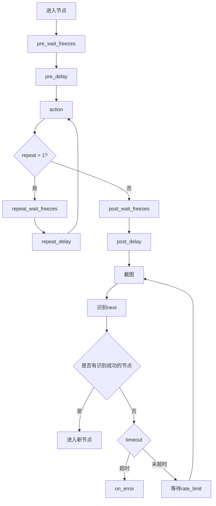
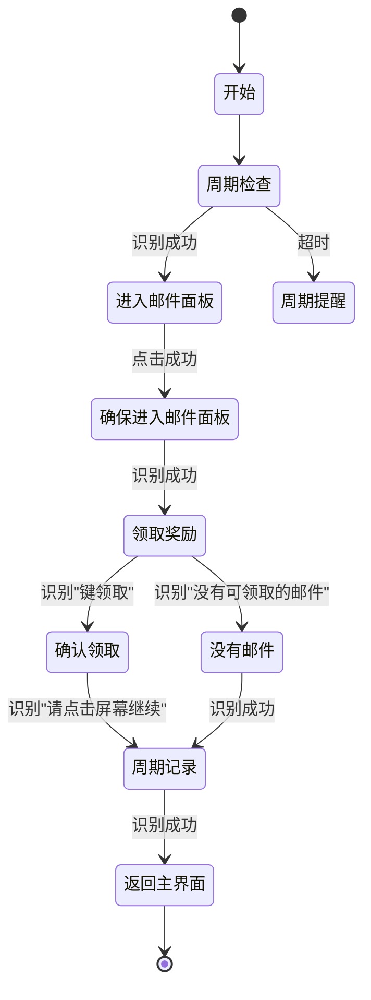

# 任务流水线架构

<cite>
**本文档引用的文件**   
- [3.1-任务流水线协议.md](file://instructions/maafw-guide/3.1-任务流水线协议.md)
- [pipeline_helper.py](file://agent/customs/global_func/pipeline_helper.py)
- [tasker.py](file://agent/customs/maahelper/tasker.py)
- [reco_helper.py](file://agent/customs/maahelper/reco_helper.py)
- [prompter.py](file://agent/customs/utils/prompter.py)
- [local_storage.py](file://agent/customs/utils/local_storage.py)
- [default_pipeline.json](file://assets/resource/base/default_pipeline.json)
- [领取邮件.json](file://assets/resource/base/pipeline/日常任务/领取邮件.json)
- [巅峰对决.json](file://assets/resource/base/pipeline/日常任务/巅峰对决.json)
- [回到主界面.json](file://assets/resource/base/pipeline/通用/回到主界面.json)
- [速战.json](file://assets/resource/base/pipeline/通用/速战.json)
</cite>

## 目录
1. [引言](#引言)
2. [任务流水线协议规范](#任务流水线协议规范)
3. [核心执行逻辑分析](#核心执行逻辑分析)
4. [工具函数支持机制](#工具函数支持机制)
5. [实际配置文件解析](#实际配置文件解析)
6. [状态转换图](#状态转换图)
7. [可复用性设计](#可复用性设计)
8. [结论](#结论)

## 引言

MaaDuDuL的任务流水线（Pipeline）架构是一种基于JSON格式的自动化任务执行框架，通过定义节点间的识别、动作和跳转逻辑来实现复杂的游戏自动化操作。该架构设计灵活，支持多种识别算法和执行动作，并通过条件判断和循环机制实现智能决策。本文档将深入解析其架构设计，详细说明协议规范、执行逻辑、工具函数支持以及实际应用案例。

## 任务流水线协议规范

### 基础格式

任务流水线采用JSON格式描述，由若干节点（Node）构成，每个节点包含识别算法、执行动作和后继节点列表等核心属性。节点通过`recognition`字段指定识别方式，`action`字段定义执行动作，`next`字段列出可能的后续节点。

### 节点类型

#### Action（动作类型）

动作类型定义了在识别成功后执行的具体操作。支持多种动作类型，包括：
- `DoNothing`：不执行任何操作
- `Click`：点击操作
- `Swipe`：滑动操作
- `InputText`：文本输入
- `Custom`：自定义动作

#### Recognition（识别类型）

识别类型决定了如何判断当前游戏界面状态。支持多种识别算法：
- `DirectHit`：直接命中，不进行识别
- `TemplateMatch`：模板匹配
- `OCR`：文字识别
- `Custom`：自定义识别器

### 执行逻辑

#### 流程控制机制

任务流水线的执行遵循严格的流程控制机制：
1. **任务触发**：通过`tasker.post_task`接口指定入口节点启动任务
2. **顺序检测**：对当前节点的`next`列表进行顺序检测，依次尝试识别每个子节点配置的特征
3. **中断机制**：当检测到某个子节点匹配成功时，立即终止后续节点检测
4. **后继处理**：执行匹配节点的动作后，将激活节点切换为当前节点，重复执行检测流程

#### 终止条件

当满足以下任意条件时，任务流程终止：
- 当前节点的`next`列表为空
- 所有后继节点持续检测失败直至超时

### 属性字段

#### Pipeline v1与v2

支持两种协议版本：
- **Pipeline v1**：直接在节点根对象中定义`recognition`和`action`
- **Pipeline v2**：将`recognition`和`action`相关字段放入二级字典中，提高结构清晰度

#### 默认属性

通过`default_pipeline.json`文件为所有节点设置默认参数，减少重复配置。该文件包含通用字段、特定算法和动作类型的默认值，形成多层次的默认值继承体系。

**Section sources**
- [3.1-任务流水线协议.md](file://instructions/maafw-guide/3.1-任务流水线协议.md#L1-L800)

## 核心执行逻辑分析

### 识别与动作生命周期

每个节点的执行遵循严格的生命周期顺序：
1. `pre_wait_freezes`：识别到后等待画面静止
2. `pre_delay`：识别到到执行动作前的延迟
3. `action`：执行指定动作
4. `repeat_wait_freezes`和`repeat_delay`：重复执行时的等待和延迟
5. `post_wait_freezes`：动作执行后等待画面静止
6. `post_delay`：动作执行后到识别`next`的延迟



**Diagram sources **
- [3.1-任务流水线协议.md](file://instructions/maafw-guide/3.1-任务流水线协议.md#L236-L255)

### 条件判断实现机制

条件判断通过`next`列表的顺序检测机制实现。系统按顺序尝试识别每个后继节点，一旦某个节点识别成功，立即执行其对应的动作并跳转，后续节点不再检测。这种机制实现了类似"if-else if"的条件分支逻辑。

`on_error`字段用于处理识别超时或动作执行失败的情况，提供异常处理路径。`anchor`字段允许设置锚点，后续节点可通过`[Anchor]`引用最后设置的锚点节点，实现动态跳转。

**Section sources**
- [3.1-任务流水线协议.md](file://instructions/maafw-guide/3.1-任务流水线协议.md#L132-L255)

## 工具函数支持机制

### pipeline_helper.py功能分析

`pipeline_helper.py`文件提供了`Run`自定义动作类，封装了任务执行的核心逻辑：

```python
@AgentServer.custom_action("run")
class Run(CustomAction):
    def run(self, context: Context, argv: CustomAction.RunArg) -> bool:
        try:
            args = ParamAnalyzer(argv)
            entry = args.get(["task", "t", "node", "n", "entry"])
            expected_end = args.get(["expected_end", "ee", "e"], "")

            task_detail = Tasker(context).run(entry)

            if expected_end:
                if Tasker.get_last_node_name(task_detail) != expected_end:
                    return False
            return True
        except Exception as e:
            return Prompter.error("运行任务", e)
```

该类实现了任务执行的封装，支持指定入口节点和预期结束节点的验证，增强了任务执行的可靠性和可验证性。

**Section sources**
- [pipeline_helper.py](file://agent/customs/global_func/pipeline_helper.py#L1-L25)

### 辅助模块协同工作

#### Tasker模块

`tasker.py`提供了任务执行器的封装，包含运行任务、截图、点击、滑动等核心功能。`run`方法实现了任务执行的预处理，自动为节点注入运行监测器，确保任务执行过程可被监控。

#### RecoHelper模块

`reco_helper.py`提供了识别辅助功能，封装了识别结果处理、点击操作、结果过滤等常用功能。支持识别结果的中心坐标计算、可信度过滤和排序等功能。

#### Prompter模块

`prompter.py`提供了日志输出和错误处理功能，支持格式化的信息输出和错误报告，便于调试和问题追踪。

**Section sources**
- [tasker.py](file://agent/customs/maahelper/tasker.py#L1-L177)
- [reco_helper.py](file://agent/customs/maahelper/reco_helper.py#L1-L256)
- [prompter.py](file://agent/customs/utils/prompter.py#L1-L55)

## 实际配置文件解析

### 领取邮件任务分析

`领取邮件.json`配置文件展示了日常任务的典型结构：

```json
{
    "领取邮件_开始": {
        "action": {
            "param": {
                "custom_action": "on_task_start",
                "custom_action_param": "h=hs"
            },
            "type": "Custom"
        },
        "next": ["领取邮件_周期检查"]
    },
    "领取邮件_周期检查": {
        "action": {
            "param": {
                "custom_action": "periodic_check",
                "custom_action_param": "k=领取邮件"
            },
            "type": "Custom"
        },
        "next": ["领取邮件_进入邮件面板"],
        "on_error": ["领取邮件_周期提醒"]
    }
}
```

该任务流程包括任务开始、周期检查、进入邮件面板、领取奖励等节点，通过`Custom`动作调用周期检查和记录功能，体现了任务的模块化设计。

**Section sources**
- [领取邮件.json](file://assets/resource/base/pipeline/日常任务/领取邮件.json#L1-L240)

### 巅峰对决任务分析

`巅峰对决.json`配置文件展示了更复杂的任务流程，包含对战和宝石领取两个主要分支：

```json
{
    "巅峰对决_对战循环": {
        "next": ["巅峰对决_选择对手", "巅峰对决_对战次数耗尽"],
        "recognition": {
            "param": {
                "expected": ["请选择对手"],
                "roi": [544, 69, 195, 69]
            },
            "type": "OCR"
        }
    },
    "巅峰对决_选择对手": {
        "action": {
            "param": {},
            "type": "Click"
        },
        "recognition": {
            "param": {
                "custom_recognition": "pick_opponent"
            },
            "type": "Custom"
        }
    }
}
```

该任务通过OCR识别"请选择对手"文本判断是否进入对战循环，并使用自定义识别器`pick_opponent`来选择对手，体现了复杂决策逻辑的实现。

**Section sources**
- [巅峰对决.json](file://assets/resource/base/pipeline/日常任务/巅峰对决.json#L1-L566)

### 通用模块分析

#### 回到主界面模块

`回到主界面.json`是一个典型的通用模块，通过多种识别方式检测当前界面状态：

```json
{
    "返回主界面_开始": {
        "next": [
            "返回主界面_检测主界面",
            {
                "jump_back": true,
                "name": "返回主界面_导航类返回"
            }
        ],
        "recognition": {
            "param": {},
            "type": "DirectHit"
        }
    }
}
```

该模块使用`jump_back`机制实现返回操作，通过模板匹配识别返回按钮，体现了通用功能的抽象原则。

#### 速战模块

`速战.json`展示了战斗类任务的典型流程：

```json
{
    "速战_打开速战面板": {
        "next": ["速战_确保可战斗", "速战_无法速战", "速战_体力不足"],
        "recognition": {
            "param": {
                "expected": ["速战"],
                "roi": [709, 511, 527, 203]
            },
            "type": "OCR"
        }
    }
}
```

该模块通过OCR识别"速战"文本判断是否可以进行速战，并处理体力不足等异常情况，体现了错误处理的完整性。

**Section sources**
- [回到主界面.json](file://assets/resource/base/pipeline/通用/回到主界面.json#L1-L202)
- [速战.json](file://assets/resource/base/pipeline/通用/速战.json#L1-L307)

## 状态转换图



**Diagram sources **
- [领取邮件.json](file://assets/resource/base/pipeline/日常任务/领取邮件.json#L1-L240)

## 可复用性设计

### 通用模块抽象原则

任务流水线的可复用性设计体现在以下几个方面：

1. **功能模块化**：将常用功能如"回到主界面"、"速战"等抽象为独立模块，可在不同任务中重复使用
2. **参数化配置**：通过`custom_action_param`传递参数，使同一模块可适应不同场景
3. **错误处理标准化**：统一的`on_error`处理机制确保异常情况下的稳定性和可预测性

### 版本管理策略

通过`default_pipeline.json`实现版本管理：

```json
{
    "Default": {
        "timeout": 30000,
        "pre_delay": 600
    }
}
```

该文件为所有节点提供默认参数，形成基础配置层。当加载多个资源包时，后加载的`default_pipeline.json`会覆盖先加载的同名字段，但已加载的节点不受影响，确保了版本兼容性。

**Section sources**
- [default_pipeline.json](file://assets/resource/base/default_pipeline.json#L1-L7)

## 结论

MaaDuDuL的任务流水线架构设计体现了高度的模块化和灵活性。通过JSON格式的协议定义，实现了任务逻辑的清晰表达；通过丰富的识别算法和动作类型，支持复杂的游戏自动化操作；通过工具函数的封装，提高了代码的可维护性和可扩展性。实际应用中的配置文件展示了该架构在日常任务和复杂战斗场景中的有效性，而通用模块的设计则体现了良好的可复用性原则。整体架构设计合理，为游戏自动化提供了强大而灵活的解决方案。