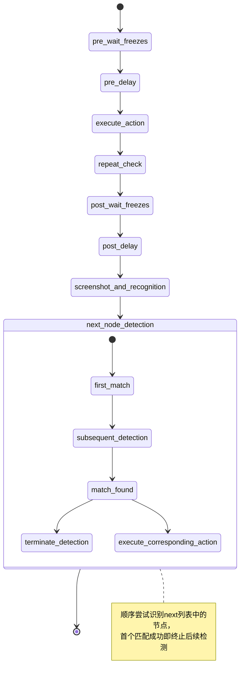
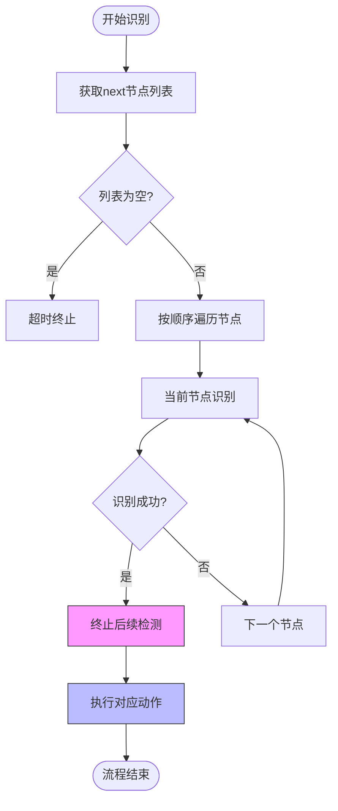
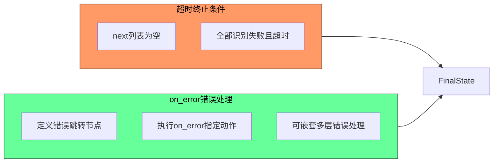
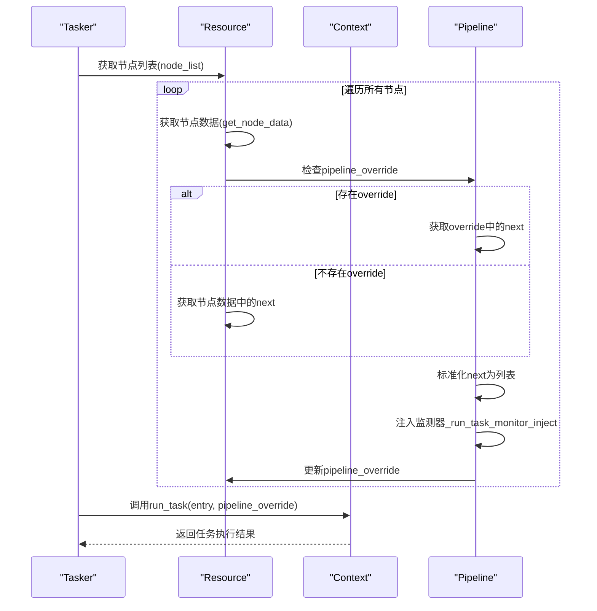
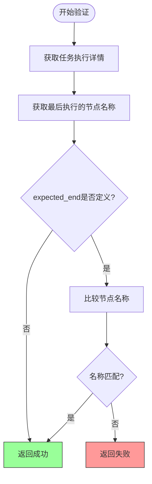

# 流水线执行引擎机制

<cite>
**本文档引用文件**  
- [pipeline_helper.py](file://agent/customs/global_func/pipeline_helper.py#L1-L25)
- [tasker.py](file://agent/customs/maahelper/tasker.py#L1-L177)
- [argv_analyzer.py](file://agent/customs/maahelper/argv_analyzer.py#L1-L159)
- [process_guard.py](file://agent/customs/global_func/process_guard.py#L45-L87)
- [hooks.json](file://assets/resource/base/pipeline/其他/hooks.json#L1-L9)
- [领取奖励.json](file://assets/resource/base/pipeline/日常任务/领取奖励.json#L1-L629)
- [连续作战.json](file://assets/resource/base/pipeline/开荒功能/连续作战.json#L1-L120)
- [回到主界面.json](file://assets/resource/base/pipeline/通用/回到主界面.json#L1-L202)
- [3.1-任务流水线协议.md](file://instructions/maafw-guide/3.1-任务流水线协议.md#L1159-L1301)
- [2.3-回调协议.md](file://instructions/maafw-guide/2.3-回调协议.md#L133-L319)
</cite>

## 目录
1. [引言](#引言)
2. [核心组件分析](#核心组件分析)
3. [执行流程状态机](#执行流程状态机)
4. [顺序检测与中断机制](#顺序检测与中断机制)
5. [超时与错误处理](#超时与错误处理)
6. [Run自定义动作实现](#run自定义动作实现)
7. [参数解析与任务执行](#参数解析与任务执行)
8. [预期结束节点验证](#预期结束节点验证)
9. [结论](#结论)

## 引言
本文档详细解析MaaDuDuL项目中任务流水线的执行引擎工作流程。基于系统架构和代码实现，深入分析从`tasker.post_task`触发入口节点开始的完整生命周期，包括预等待、延迟、动作执行、重复机制、后置延迟、截图识别等关键环节。重点阐述顺序检测与中断机制、超时终止条件及错误处理跳转逻辑，并结合`pipeline_helper.py`中的Run自定义动作，说明参数解析、任务执行和预期结束节点验证的实现方式。

## 核心组件分析

**本文档引用文件**  
- [pipeline_helper.py](file://agent/customs/global_func/pipeline_helper.py#L1-L25)
- [tasker.py](file://agent/customs/maahelper/tasker.py#L1-L177)
- [argv_analyzer.py](file://agent/customs/maahelper/argv_analyzer.py#L1-L159)

## 执行流程状态机



**图示来源**  
- [3.1-任务流水线协议.md](file://instructions/maafw-guide/3.1-任务流水线协议.md#L1159-L1301)

## 顺序检测与中断机制



**图示来源**  
- [领取奖励.json](file://assets/resource/base/pipeline/日常任务/领取奖励.json#L1-L629)
- [连续作战.json](file://assets/resource/base/pipeline/开荒功能/连续作战.json#L1-L120)

## 超时与错误处理



**图示来源**  
- [2.3-回调协议.md](file://instructions/maafw-guide/2.3-回调协议.md#L133-L319)
- [hooks.json](file://assets/resource/base/pipeline/其他/hooks.json#L1-L9)

## Run自定义动作实现

```mermaid
classDiagram
class Run {
+run(context : Context, argv : CustomAction.RunArg) bool
}
class ParamAnalyzer {
+__init__(argv : CustomAction.RunArg)
+get(key : str | list[str], default=None) any
+_parse_param(param : str) dict
+_convert_to_number(value) any
}
class Tasker {
+__init__(context : Context)
+run(entry : str, pipeline_override : Dict) TaskDetail
+get_last_node_name(task_detail : TaskDetail) str
}
class Prompter {
+error(content : str, e : Exception) bool
}
Run --> ParamAnalyzer : "使用"
Run --> Tasker : "使用"
Run --> Prompter : "使用"
note right of Run
Run自定义动作核心实现：
1. 解析参数获取入口节点
2. 调用Tasker执行任务
3. 验证预期结束节点
4. 错误处理与返回
end note
```

**图示来源**  
- [pipeline_helper.py](file://agent/customs/global_func/pipeline_helper.py#L1-L25)
- [tasker.py](file://agent/customs/maahelper/tasker.py#L1-L177)
- [argv_analyzer.py](file://agent/customs/maahelper/argv_analyzer.py#L1-L159)

## 参数解析与任务执行



**图示来源**  
- [tasker.py](file://agent/customs/maahelper/tasker.py#L48-L106)
- [hooks.json](file://assets/resource/base/pipeline/其他/hooks.json#L1-L9)

## 预期结束节点验证



**图示来源**  
- [pipeline_helper.py](file://agent/customs/global_func/pipeline_helper.py#L1-L25)
- [tasker.py](file://agent/customs/maahelper/tasker.py#L172-L177)

## 结论
本文档全面解析了MaaDuDuL项目中任务流水线执行引擎的工作流程。系统通过`tasker.post_task`触发入口节点，经历预等待、延迟、动作执行、重复机制、后置延迟、截图识别等完整生命周期。核心机制包括：顺序检测与中断机制（首个匹配成功即终止后续检测）、超时终止条件（next为空或全部识别失败超时）以及on_error错误处理跳转逻辑。通过`pipeline_helper.py`中的Run自定义动作，实现了参数解析、任务执行和预期结束节点验证的完整闭环。系统设计充分考虑了异常处理和流程控制，确保了任务执行的稳定性和可靠性。