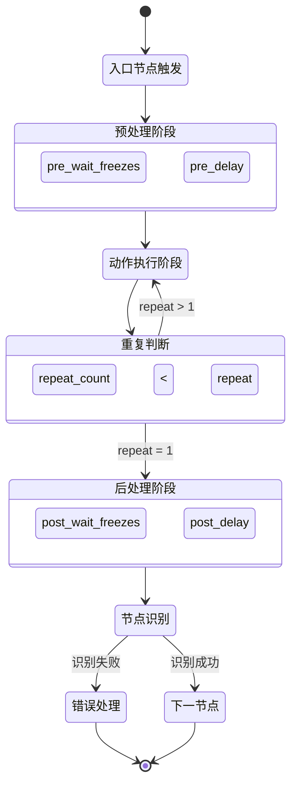

# 流水线执行流程

<cite>
**本文档引用的文件**
- [tasker.py](file://agent/customs/maahelper/tasker.py)
- [3.1-任务流水线协议.md](file://instructions/maafw-guide/3.1-任务流水线协议.md)
- [default_pipeline.json](file://assets/resource/base/default_pipeline.json)
- [领取奖励.json](file://assets/resource/base/pipeline/日常任务/领取奖励.json)
- [回到主界面.json](file://assets/resource/base/pipeline/通用/回到主界面.json)
- [hooks.json](file://assets/resource/base/pipeline/其他/hooks.json)
- [reco_helper.py](file://agent/customs/maahelper/reco_helper.py)
</cite>

## 目录
1. [任务流水线执行流程概述](#任务流水线执行流程概述)
2. [完整执行流程解析](#完整执行流程解析)
3. [状态图：流水线执行逻辑](#状态图流水线执行逻辑)
4. [循环检测机制：rate_limit与timeout](#循环检测机制ratelimit与timeout)
5. [配置参数最佳实践](#配置参数最佳实践)

## 任务流水线执行流程概述

任务流水线是自动化执行系统的核心机制，通过定义一系列有序的节点来实现复杂操作的自动化。整个流程从`tasker.post_task`触发入口节点开始，经过预处理、动作执行、后处理等阶段，最终完成任务并识别下一个节点。系统通过`rate_limit`和`timeout`机制确保循环检测的稳定性和可靠性。

**本节来源**
- [3.1-任务流水线协议.md](file://instructions/maafw-guide/3.1-任务流水线协议.md#执行逻辑)

## 完整执行流程解析

任务流水线的执行流程遵循严格的顺序和逻辑控制，确保每个操作都能在正确的时机执行。以下是完整的执行流程解析：

### 入口节点触发

流程始于`tasker.post_task`接口调用，该接口通过`Tasker.run()`方法启动指定的入口节点。在启动过程中，系统会自动为所有节点注入`_run_task_monitor_inject`监测器，用于检查任务是否正在停止。

```python
def run(self, entry: str, pipeline_override: Dict = {}):
    # 注入运行监测器
    for node_name in node_list:
        if current_next and current_next[0] != "_run_task_monitor_inject":
            new_next = ["_run_task_monitor_inject"] + current_next
            # ...注入逻辑
    return self.context.run_task(entry, pipeline_override)
```

**本节来源**
- [tasker.py](file://agent/customs/maahelper/tasker.py#L51-L113)

### 预处理阶段

预处理阶段包含两个关键步骤：`pre_wait_freezes`和`pre_delay`。

- **pre_wait_freezes**: 在识别到目标后，等待画面静止指定时间（毫秒）。系统会连续检测画面变化，只有当画面在指定时间内没有较大变化时才会继续执行。这确保了在动态画面稳定后再进行操作。
- **pre_delay**: 在执行动作前的固定延迟，单位为毫秒。用于确保系统有足够时间准备执行动作。

执行顺序为：`pre_wait_freezes` → `pre_delay`

**本节来源**
- [3.1-任务流水线协议.md](file://instructions/maafw-guide/3.1-任务流水线协议.md#-pre_wait_freezes--uint--object)

### 动作执行阶段

动作执行阶段是流水线的核心，根据节点配置的`action`类型执行相应的操作：

- **Click**: 在指定坐标点击
- **LongPress**: 长按操作
- **Swipe**: 滑动操作
- **Custom**: 执行自定义动作

动作执行通过`Tasker`类的`click()`、`swipe()`等方法实现，这些方法会调用底层控制器进行实际操作。

```python
def click(self, x: int, y: int):
    self.ctl.post_click(x, y).wait()
    return self
```

**本节来源**
- [tasker.py](file://agent/customs/maahelper/tasker.py#L125-L138)
- [3.1-任务流水线协议.md](file://instructions/maafw-guide/3.1-任务流水线协议.md#-action-string)

### 重复机制

`repeat`参数控制动作的重复执行次数，默认为1（不重复）。当`repeat > 1`时，执行流程为：

`action` → [`repeat_wait_freezes` → `repeat_delay` → `action`] × (repeat-1)

其中：
- `repeat_wait_freezes`: 每次重复动作之间等待画面静止的时间
- `repeat_delay`: 每次重复动作之间的延迟时间

**本节来源**
- [3.1-任务流水线协议.md](file://instructions/maafw-guide/3.1-任务流水线协议.md#-repeat--uint)

### 后处理阶段

后处理阶段在动作执行完成后进行，包含`post_wait_freezes`和`post_delay`：

- **post_wait_freezes**: 动作执行后等待画面静止的时间，确保操作效果完全呈现
- **post_delay**: 执行动作后到识别下一个节点的延迟时间

执行顺序为：`post_wait_freezes` → `post_delay`

**本节来源**
- [3.1-任务流水线协议.md](file://instructions/maafw-guide/3.1-任务流水线协议.md#-post_wait_freezes--uint--object)

### 节点识别与跳转

最后阶段通过截图和识别来确定下一个执行节点：

1. 系统调用`Tasker.screenshot()`获取当前画面
2. 根据`next`列表中的节点配置进行顺序检测
3. 依次尝试识别每个节点的特征（OCR、模板匹配等）
4. 当检测到某个节点匹配成功时，立即终止后续检测并执行该节点
5. 如果所有节点都检测失败，则根据`on_error`配置处理错误情况

```python
def screenshot(self) -> np.ndarray:
    return self.ctl.post_screencap().wait().get()
```

**本节来源**
- [tasker.py](file://agent/customs/maahelper/tasker.py#L115-L123)
- [3.1-任务流水线协议.md](file://instructions/maafw-guide/3.1-任务流水线协议.md#顺序检测)

## 状态图：流水线执行逻辑



**图表来源**
- [3.1-任务流水线协议.md](file://instructions/maafw-guide/3.1-任务流水线协议.md)
- [tasker.py](file://agent/customs/maahelper/tasker.py)

## 循环检测机制：rate_limit与timeout

循环检测机制是确保流水线稳定运行的关键，主要由`rate_limit`和`timeout`两个参数控制。

### rate_limit机制

`rate_limit`定义了每轮识别的最低消耗时间（单位：毫秒），默认为1000毫秒。其作用机制如下：

- 每次识别循环至少消耗`rate_limit`毫秒时间
- 如果实际识别时间不足`rate_limit`，系统会自动sleep等待补足时间
- 防止过于频繁的识别操作导致系统过载
- 确保设备有足够时间响应和更新画面

```json
{
    "rate_limit": 1000
}
```

**本节来源**
- [3.1-任务流水线协议.md](file://instructions/maafw-guide/3.1-任务流水线协议.md#-rate_limit--uint)

### timeout机制

`timeout`定义了识别的超时时间（单位：毫秒），默认为20000毫秒。其作用机制如下：

- 系统在`timeout`时间内持续循环检测`next`列表中的节点
- 一旦检测到匹配节点立即终止循环并执行相应动作
- 如果超时仍未检测到任何节点，则触发`on_error`处理流程
- 防止无限等待导致任务卡死

```json
{
    "timeout": 30000
}
```

**本节来源**
- [3.1-任务流水线协议.md](file://instructions/maafw-guide/3.1-任务流水线协议.md#-timeout--uint)
- [default_pipeline.json](file://assets/resource/base/default_pipeline.json)

### 循环逻辑

两个参数共同作用的循环逻辑可表示为：

```
while(!timeout) { 
    foreach(next); 
    sleep_until(rate_limit); 
}
```

这种设计确保了既不会过于频繁地检测（受`rate_limit`限制），也不会无限期等待（受`timeout`限制）。

**本节来源**
- [3.1-任务流水线协议.md](file://instructions/maafw-guide/3.1-任务流水线协议.md#-timeout--uint)

## 配置参数最佳实践

基于实际配置文件和系统设计，以下是各阶段参数设置的最佳实践建议。

### 默认配置实践

在`default_pipeline.json`中定义了全局默认值：

```json
{
    "Default": {
        "timeout": 30000,
        "pre_delay": 600
    }
}
```

建议：
- 设置合理的全局`timeout`避免任务卡死
- `pre_delay`不宜过短，确保画面稳定

**本节来源**
- [default_pipeline.json](file://assets/resource/base/default_pipeline.json)

### 实际配置示例

以`领取奖励.json`为例，展示了复杂的流水线配置：

```json
{
    "领取奖励_进入任务界面": {
        "action": "Click",
        "next": ["领取奖励_确保进入任务界面"],
        "recognition": {
            "type": "TemplateMatch",
            "param": {
                "roi": [1022, 66, 254, 236],
                "template": ["main/task.png"]
            }
        }
    }
}
```

最佳实践：
- 使用`TemplateMatch`进行精确的模板匹配
- 设置合理的`roi`（感兴趣区域）提高识别效率
- 为关键节点配置`on_error`处理异常情况

**本节来源**
- [领取奖励.json](file://assets/resource/base/pipeline/日常任务/领取奖励.json)

### 通用配置建议

参考`回到主界面.json`中的设计模式：

```json
{
    "返回主界面_开始": {
        "next": [
            "返回主界面_检测主界面",
            {
                "jump_back": true,
                "name": "返回主界面_导航类返回"
            }
        ],
        "recognition": "DirectHit"
    }
}
```

建议：
- 使用`DirectHit`作为流程控制节点
- 合理使用`jump_back`功能实现复杂跳转逻辑
- 为用户交互类操作设置较长的`post_delay`
- 优先使用过程节点而非延迟来控制流程

**本节来源**
- [回到主界面.json](file://assets/resource/base/pipeline/通用/回到主界面.json)

### 参数设置原则

1. **pre_delay/post_delay**: 优先增加中间过程节点，少用延迟
2. **wait_freezes**: 在动态画面变化后使用，确保画面稳定
3. **timeout**: 根据操作复杂度设置，一般20-30秒
4. **rate_limit**: 保持默认1000毫秒，避免过于频繁的检测
5. **repeat**: 用于需要多次执行的重复性操作

**本节来源**
- [3.1-任务流水线协议.md](file://instructions/maafw-guide/3.1-任务流水线协议.md#-pre_delay--uint)