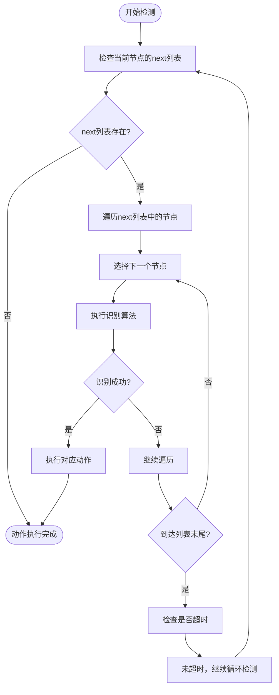
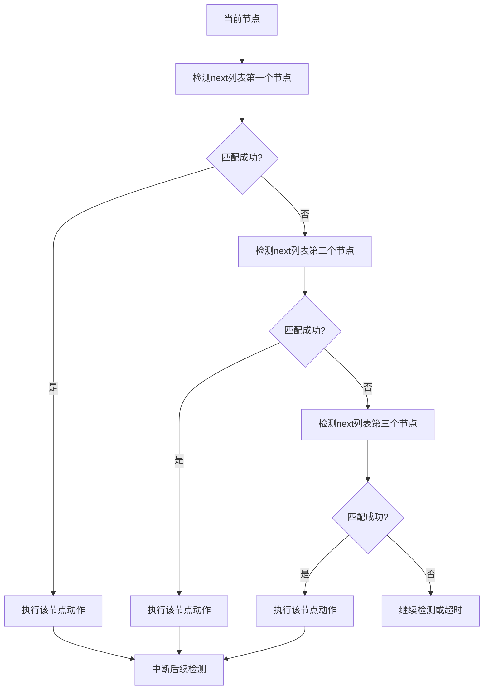
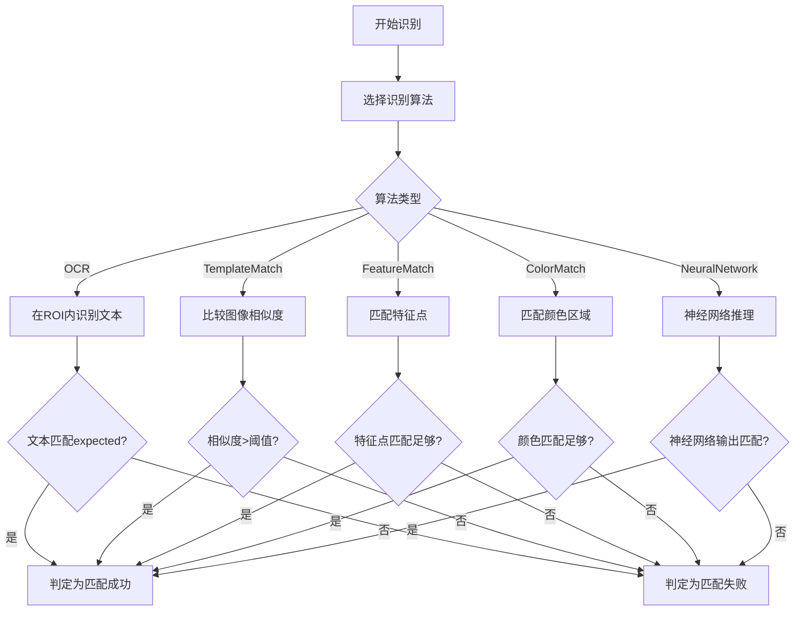
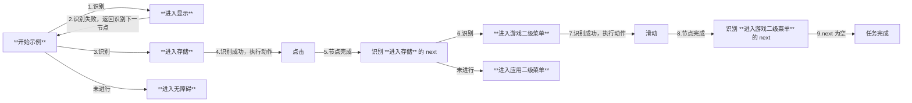
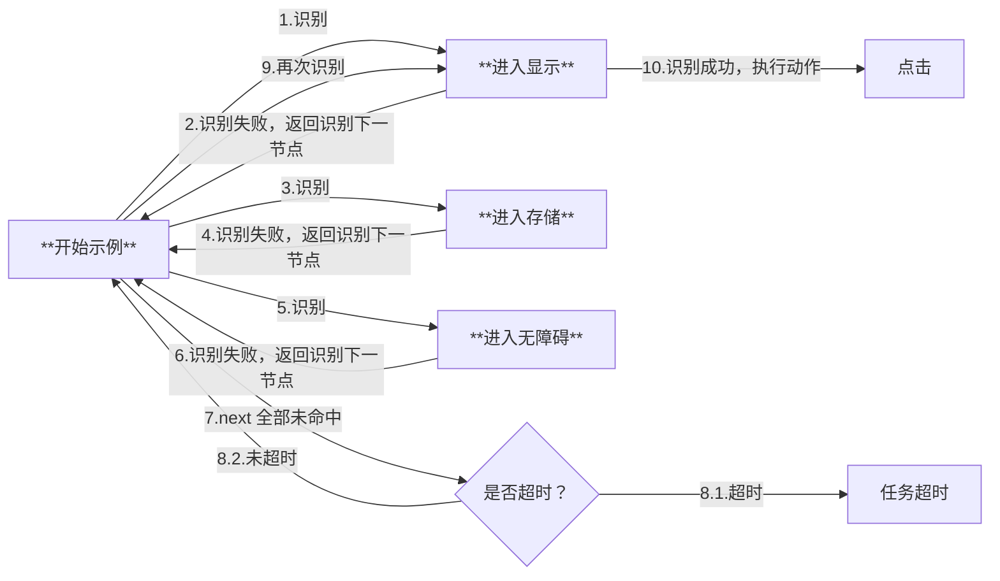
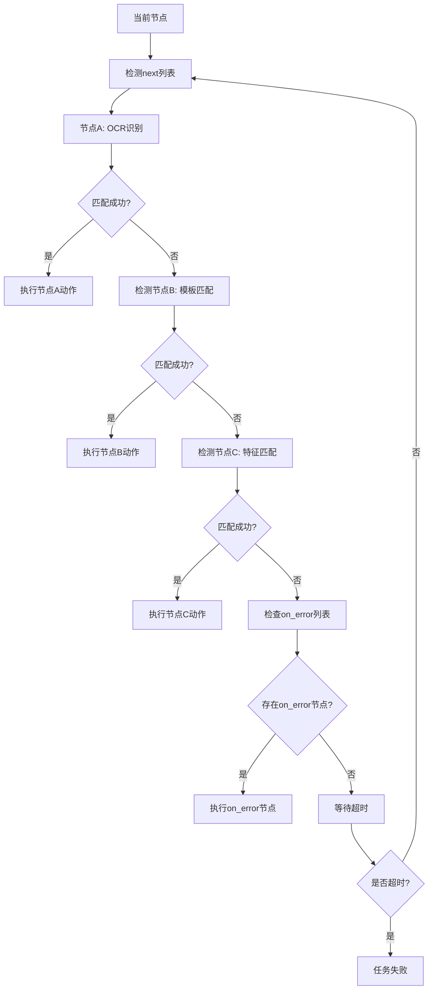

# 流程控制与中断机制

<cite>
**本文档引用文件**  
- [main.py](file://agent/main.py)
- [pipeline_helper.py](file://agent/customs/global_func/pipeline_helper.py)
- [reco_helper.py](file://agent/customs/maahelper/reco_helper.py)
- [tasker.py](file://agent/customs/maahelper/tasker.py)
- [领取奖励.json](file://assets/resource/base/pipeline/日常任务/领取奖励.json)
- [领取糖果.json](file://assets/resource/base/pipeline/日常任务/领取糖果.json)
- [3.1-任务流水线协议.md](file://instructions/maafw-guide/3.1-任务流水线协议.md)
- [hooks.json](file://assets/resource/base/pipeline/其他/hooks.json)
- [prompter.py](file://agent/customs/utils/prompter.py)
</cite>

## 目录
1. [引言](#引言)
2. [流水线顺序检测机制](#流水线顺序检测机制)
3. [中断机制与执行优先级](#中断机制与执行优先级)
4. [识别匹配判定标准](#识别匹配判定标准)
5. [Android设置菜单示例分析](#android设置菜单示例分析)
6. [多节点竞争场景分析](#多节点竞争场景分析)
7. [实际应用案例](#实际应用案例)
8. [结论](#结论)

## 引言
本文档深入解析MaaDuDuL自动化框架中的流水线顺序检测与中断机制。该机制是自动化流程控制的核心，决定了系统如何在复杂界面环境中进行决策和执行。通过分析代码实现和配置文件，我们将详细说明next列表的顺序识别尝试、首个匹配成功节点的中断执行原理，以及在多节点竞争场景下的执行优先级策略。

**本文档引用文件**  
- [main.py](file://agent/main.py)
- [3.1-任务流水线协议.md](file://instructions/maafw-guide/3.1-任务流水线协议.md)

## 流水线顺序检测机制
流水线顺序检测机制是自动化流程的核心控制逻辑。系统按照预定义的顺序对next列表中的节点进行逐一检测，直到找到第一个匹配成功的节点。

### 检测流程
根据任务流水线协议文档，顺序检测的执行逻辑如下：
1. 对当前节点的next列表进行顺序检测
2. 依次尝试识别每个子节点配置的recognition特征
3. 当检测到某个子节点匹配成功时，立即终止后续节点检测
4. 执行匹配节点的action定义的操作

这种机制确保了流程的确定性和可预测性，避免了多个节点同时匹配导致的执行冲突。

### 代码实现
在`tasker.py`文件中，`run`方法实现了对流水线的动态覆盖和监测器注入，确保每个节点的next列表都能被正确处理。系统通过`pipeline_override`参数动态修改节点行为，为所有节点注入运行监测器，确保任务执行过程可被监控。



**图示来源**  
- [3.1-任务流水线协议.md](file://instructions/maafw-guide/3.1-任务流水线协议.md#执行逻辑)

**本节来源**  
- [tasker.py](file://agent/customs/maahelper/tasker.py#L51-L113)
- [3.1-任务流水线协议.md](file://instructions/maafw-guide/3.1-任务流水线协议.md#执行逻辑)

## 中断机制与执行优先级
中断机制是流水线控制的关键特性，确保了流程的高效执行和资源的合理利用。

### 中断执行原理
当系统在next列表中检测到第一个匹配成功的节点时，会立即终止后续节点的检测过程。这种"短路"机制避免了不必要的计算资源消耗，提高了执行效率。

在`reco_helper.py`文件中，`hit`属性用于判断是否识别到结果：
```python
@property
def hit(self):
    """判断是否识别到结果。"""
    return (
        True
        if self.reco_detail
        and self.reco_detail.hit
        and self.reco_detail.best_result
        else False
    )
```

### 执行优先级策略
执行优先级由next列表中的节点顺序决定。列表中靠前的节点具有更高的优先级，系统会优先尝试匹配这些节点。这种基于顺序的优先级策略简单而有效，避免了复杂的优先级计算。

在`领取奖励.json`配置文件中，我们可以看到典型的优先级设置：
```json
"next": ["领取奖励_确认领取任务奖励", "领取奖励_任务奖励不可领取"]
```
这里系统会优先尝试"领取奖励_确认领取任务奖励"节点，只有当该节点匹配失败时，才会尝试"领取奖励_任务奖励不可领取"节点。



**图示来源**  
- [reco_helper.py](file://agent/customs/maahelper/reco_helper.py#L97-L109)
- [领取奖励.json](file://assets/resource/base/pipeline/日常任务/领取奖励.json#L137)

**本节来源**  
- [reco_helper.py](file://agent/customs/maahelper/reco_helper.py#L97-L109)
- [领取奖励.json](file://assets/resource/base/pipeline/日常任务/领取奖励.json)

## 识别匹配判定标准
识别匹配的判定标准基于recognition算法的结果，不同的算法有不同的匹配条件。

### OCR识别算法
OCR（光学字符识别）算法通过识别屏幕上的文本内容来判断匹配。在`领取奖励.json`文件中，我们看到OCR算法的配置：
```json
"recognition": {
    "param": {
        "expected": ["全部领取"],
        "roi": [1035, 633, 163, 73]
    },
    "type": "OCR"
}
```
这里系统会在指定的ROI（感兴趣区域）内识别文本，当识别到"全部领取"时判定为匹配成功。

### 模板匹配算法
模板匹配算法通过比较屏幕截图与预设模板的相似度来判断匹配。在`领取糖果.json`文件中，我们看到模板匹配的配置：
```json
"recognition": {
    "param": {
        "roi": [820, 469, 280, 100],
        "template": ["activity/candy/received.png"]
    },
    "type": "TemplateMatch"
}
```
系统会在指定区域内查找与模板图像相似的部分，当相似度超过阈值时判定为匹配成功。

### 组合识别算法
Or算法实现了逻辑或的组合识别，命中第一个即成功，后续不再识别。这与流水线的顺序检测机制相辅相成，提供了更灵活的匹配方式。



**图示来源**  
- [领取奖励.json](file://assets/resource/base/pipeline/日常任务/领取奖励.json#L139-L143)
- [领取糖果.json](file://assets/resource/base/pipeline/日常任务/领取糖果.json#L107-L109)
- [3.1-任务流水线协议.md](file://instructions/maafw-guide/3.1-任务流水线协议.md#or)

**本节来源**  
- [领取奖励.json](file://assets/resource/base/pipeline/日常任务/领取奖励.json)
- [领取糖果.json](file://assets/resource/base/pipeline/日常任务/领取糖果.json)
- [3.1-任务流水线协议.md](file://instructions/maafw-guide/3.1-任务流水线协议.md)

## Android设置菜单示例分析
以Android设置菜单为例，展示不同界面状态下流程跳转的实际行为差异。

### 配置示例
根据任务流水线协议文档中的示例，Android设置菜单存在`显示`/`存储`/`无障碍`三个选项，其中`存储`打开后包含二级菜单`游戏`/`应用`。

```json
{
    "开始示例": {
        "next": [
            "进入显示",
            "进入存储",
            "进入无障碍"
        ]
    },
    "进入存储": {
        "next": [
            "进入游戏二级菜单",
            "进入应用二级菜单"
        ]
    }
}
```

### 执行过程推演
#### 情况一：正常执行流程
当"进入显示"节点识别失败，"进入存储"节点识别成功时，执行流程如下：



#### 情况二：全部识别失败
当所有节点都识别失败时，系统会循环检测直到超时：



**图示来源**  
- [3.1-任务流水线协议.md](file://instructions/maafw-guide/3.1-任务流水线协议.md#执行过程推演)

**本节来源**  
- [3.1-任务流水线协议.md](file://instructions/maafw-guide/3.1-任务流水线协议.md#执行过程推演)

## 多节点竞争场景分析
在复杂的用户界面中，多个节点可能同时满足匹配条件，系统需要通过优先级策略来决定执行顺序。

### 竞争场景示例
在`领取糖果.json`文件中，`进入活动界面`节点的next列表展示了多节点竞争场景：
```json
"next": ["领取糖果_确保进入活动界面", "领取糖果_确保进入活动界面2"]
```
这两个节点都用于确认是否已进入活动界面，但使用了不同的识别方法。

### 优先级决策
系统按照next列表中的顺序进行检测，因此`领取糖果_确保进入活动界面`节点具有更高的优先级。只有当该节点匹配失败时，系统才会尝试`领取糖果_确保进入活动界面2`节点。

这种设计考虑了不同识别方法的效率和准确性。OCR识别通常比模板匹配更快，因此被放在前面作为首选方法。

### 错误处理机制
在`领取糖果.json`文件中，`周期检查`节点配置了on_error处理：
```json
"on_error": ["领取糖果_周期提醒"]
```
当`周期检查`节点执行失败时，系统会跳转到`领取糖果_周期提醒`节点，提供错误反馈和处理。



**图示来源**  
- [领取糖果.json](file://assets/resource/base/pipeline/日常任务/领取糖果.json#L252)

**本节来源**  
- [领取糖果.json](file://assets/resource/base/pipeline/日常任务/领取糖果.json)

## 实际应用案例
通过分析`领取奖励.json`和`领取糖果.json`两个实际配置文件，我们可以深入了解流水线机制在真实场景中的应用。

### 领取奖励流程分析
`领取奖励.json`文件定义了一个复杂的奖励领取流程，包含了多个识别和动作节点。该流程展示了如何通过顺序检测和中断机制实现复杂的自动化任务。

流程从`领取奖励_开始`节点开始，依次尝试进入任务界面、领取任务奖励、进入通行证界面、领取通行证奖励等操作。每个步骤都通过next列表定义了可能的后续操作和错误处理路径。

### 周期性任务处理
`领取糖果.json`文件展示了如何处理周期性任务。通过`周期检查`节点，系统可以定期检查是否需要执行特定任务，并根据检查结果决定后续操作。

这种设计模式适用于需要定期执行的任务，如每日签到、定时领取奖励等。系统通过`periodic_check`自定义动作实现周期性检查，并根据检查结果决定是否执行领取操作。

### 自定义动作集成
在`pipeline_helper.py`文件中，`Run`类实现了自定义动作的集成：
```python
@AgentServer.custom_action("run")
class Run(CustomAction):
    def run(self, context: Context, argv: CustomAction.RunArg) -> bool:
        try:
            args = ParamAnalyzer(argv)
            entry = args.get(["task", "t", "node", "n", "entry"])
            expected_end = args.get(["expected_end", "ee", "e"], "")
            
            task_detail = Tasker(context).run(entry)
            
            if expected_end:
                if Tasker.get_last_node_name(task_detail) != expected_end:
                    return False
            return True
        except Exception as e:
            return Prompter.error("运行任务", e)
```
这个自定义动作允许在流水线中调用其他任务，实现了任务间的嵌套和复用。

**本节来源**  
- [领取奖励.json](file://assets/resource/base/pipeline/日常任务/领取奖励.json)
- [领取糖果.json](file://assets/resource/base/pipeline/日常任务/领取糖果.json)
- [pipeline_helper.py](file://agent/customs/global_func/pipeline_helper.py#L9-L24)

## 结论
MaaDuDuL框架的流水线顺序检测与中断机制是一个高效、可靠的流程控制方案。通过按顺序检测next列表中的节点，并在首个匹配成功时立即中断后续检测，系统实现了确定性的流程控制。

该机制的核心优势包括：
1. **确定性**：基于顺序的优先级策略确保了流程的可预测性
2. **高效性**：短路机制避免了不必要的计算资源消耗
3. **灵活性**：支持多种识别算法和组合逻辑，适应复杂场景
4. **可靠性**：完善的错误处理机制确保了系统的稳定性

在实际应用中，开发者应合理设计next列表的顺序，将最可能匹配的节点放在前面，以提高执行效率。同时，应充分利用on_error机制处理异常情况，确保自动化流程的健壮性。