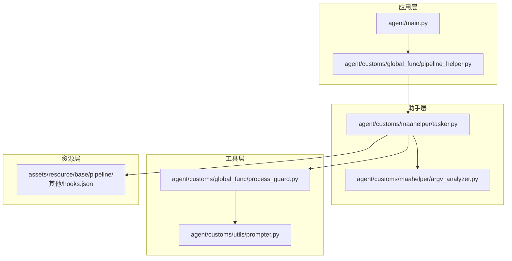
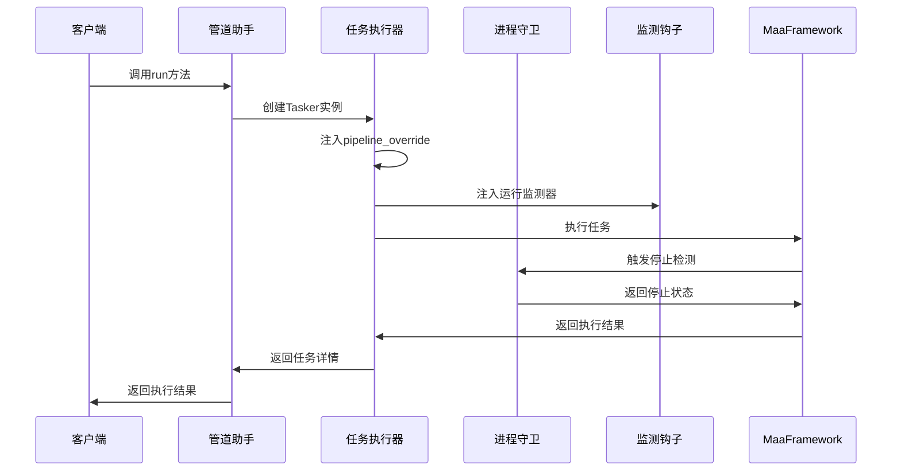
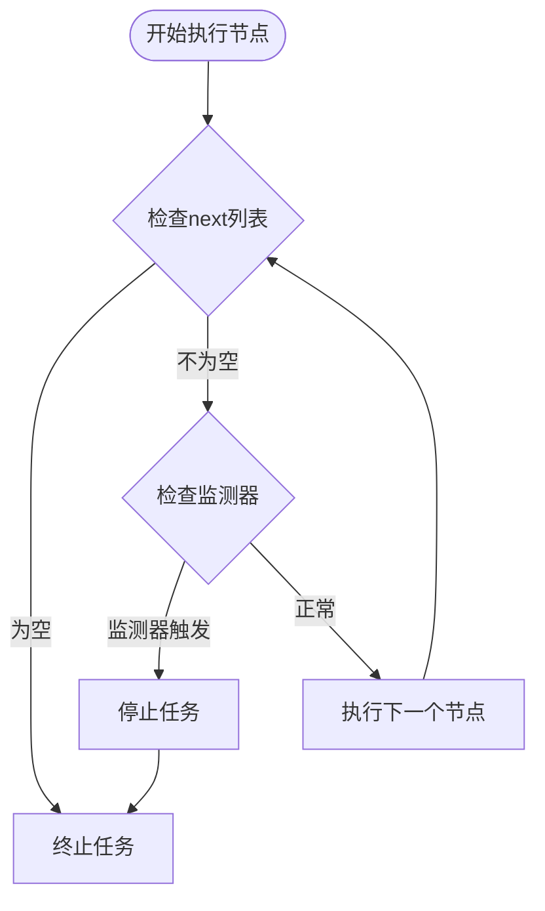
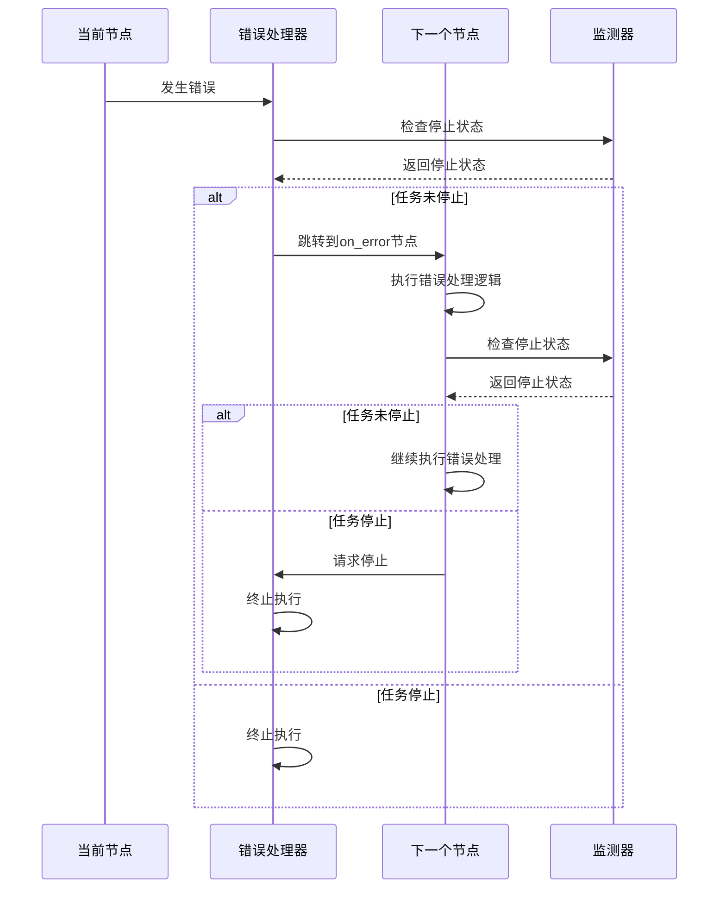
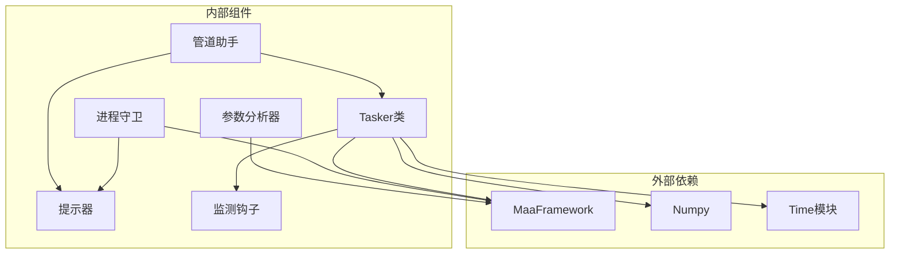

# 终止条件与错误处理

<cite>
**本文档引用的文件**
- [tasker.py](file://agent/customs/maahelper/tasker.py)
- [pipeline_helper.py](file://agent/customs/global_func/pipeline_helper.py)
- [process_guard.py](file://agent/customs/global_func/process_guard.py)
- [argv_analyzer.py](file://agent/customs/maahelper/argv_analyzer.py)
- [prompter.py](file://agent/customs/utils/prompter.py)
- [hooks.json](file://assets/resource/base/pipeline/其他/hooks.json)
- [main.py](file://agent/main.py)
</cite>

## 目录
1. [简介](#简介)
2. [项目结构](#项目结构)
3. [核心组件](#核心组件)
4. [架构概览](#架构概览)
5. [详细组件分析](#详细组件分析)
6. [依赖关系分析](#依赖关系分析)
7. [性能考量](#性能考量)
8. [故障排除指南](#故障排除指南)
9. [结论](#结论)

## 简介

本文档深入分析MaaDuDuL项目中任务流程的终止条件与错误处理机制。重点涵盖以下方面：

- **终止条件判断逻辑**：当前节点next列表为空或所有后继节点持续检测失败直至超时的具体判断机制
- **on_error错误处理跳转机制**：识别超时或动作执行失败后的节点跳转流程
- **pipeline_override注入实现**：on_error链式处理和运行监测器注入的技术细节
- **Tasker类的pipeline_override机制**：如何为所有节点自动注入运行监测器

## 项目结构

该项目采用模块化架构，主要分为以下几个层次：



**图表来源**
- [main.py](file://agent/main.py#L1-L48)
- [pipeline_helper.py](file://agent/customs/global_func/pipeline_helper.py#L1-L25)
- [tasker.py](file://agent/customs/maahelper/tasker.py#L1-L177)

**章节来源**
- [main.py](file://agent/main.py#L1-L48)
- [pipeline_helper.py](file://agent/customs/global_func/pipeline_helper.py#L1-L25)

## 核心组件

### Tasker类 - 任务执行器

Tasker类是整个任务执行系统的核心，负责封装MaaFramework的Context对象并提供便捷的任务执行接口。

**关键特性**：
- 自动为所有节点注入运行监测器
- 提供统一的任务执行入口
- 支持pipeline_override动态修改节点行为
- 集成错误处理和日志记录功能

**章节来源**
- [tasker.py](file://agent/customs/maahelper/tasker.py#L16-L177)

### 进程守卫模块

进程守卫模块提供任务生命周期监控功能，包括任务启动监听和停止检测。

**核心功能**：
- 任务停止状态检测
- 任务启动钩子处理
- 错误处理和异常捕获

**章节来源**
- [process_guard.py](file://agent/customs/global_func/process_guard.py#L1-L99)

### 参数分析器

参数分析器负责解析MaaFramework传递的各种参数，支持多种参数格式的自动解析。

**功能特点**：
- 支持JSON格式解析
- 支持查询字符串格式解析
- 自动类型转换
- 错误处理机制

**章节来源**
- [argv_analyzer.py](file://agent/customs/maahelper/argv_analyzer.py#L1-L158)

## 架构概览

系统采用分层架构设计，各层职责明确，耦合度低：



**图表来源**
- [pipeline_helper.py](file://agent/customs/global_func/pipeline_helper.py#L9-L25)
- [tasker.py](file://agent/customs/maahelper/tasker.py#L51-L113)
- [process_guard.py](file://agent/customs/global_func/process_guard.py#L72-L98)

## 详细组件分析

### 终止条件判断机制

#### next列表为空判断

系统通过以下逻辑判断任务流程是否应该终止：



**图表来源**
- [tasker.py](file://agent/customs/maahelper/tasker.py#L64-L90)
- [process_guard.py](file://agent/customs/global_func/process_guard.py#L79-L98)

#### 超时检测机制

系统通过`_run_task_monitor_inject`钩子实现超时检测：

**监测器注入流程**：
1. 遍历所有节点
2. 检查节点的next和on_error字段
3. 为每个节点注入`_run_task_monitor_inject`监测器
4. 确保任务执行过程可被监控

**章节来源**
- [tasker.py](file://agent/customs/maahelper/tasker.py#L64-L113)
- [hooks.json](file://assets/resource/base/pipeline/其他/hooks.json#L1-L8)

### on_error错误处理跳转机制

#### 错误处理链式处理

系统实现了完整的on_error链式处理机制：



**图表来源**
- [tasker.py](file://agent/customs/maahelper/tasker.py#L92-L112)
- [process_guard.py](file://agent/customs/global_func/process_guard.py#L79-L98)

#### 节点跳转流程

**错误处理跳转的具体步骤**：

1. **错误检测**：当前节点执行失败或超时
2. **on_error检查**：读取节点的on_error配置
3. **监测器注入**：确保on_error链路也包含监测器
4. **链式执行**：按照on_error列表顺序执行错误处理节点
5. **状态检查**：每步执行后检查任务停止状态
6. **最终决策**：根据执行结果决定是否继续或终止

**章节来源**
- [tasker.py](file://agent/customs/maahelper/tasker.py#L92-L112)
- [process_guard.py](file://agent/customs/global_func/process_guard.py#L72-L98)

### pipeline_override注入实现

#### 注入机制详解

Tasker类通过`pipeline_override`参数实现对任务流程的动态修改：

**注入流程**：
1. 获取所有节点列表
2. 遍历每个节点
3. 读取节点的next和on_error配置
4. 标准化配置格式
5. 注入监测器到链路开头
6. 返回修改后的配置

**章节来源**
- [tasker.py](file://agent/customs/maahelper/tasker.py#L64-L113)

#### 技术实现细节

**next字段处理**：
- 支持字符串和列表格式
- 自动转换为标准列表格式
- 避免重复注入监测器

**on_error字段处理**：
- 与next字段相同的处理逻辑
- 确保错误处理链路的完整性
- 维护原有的错误处理逻辑

**章节来源**
- [tasker.py](file://agent/customs/maahelper/tasker.py#L71-L112)

### 运行监测器注入

#### 监测器配置

系统通过hooks.json配置运行监测器：

```json
{
    "_run_task_monitor_inject": {
        "recognition": "Custom",
        "custom_recognition": "check_stopping",
        "pre_delay": 0,
        "post_delay": 0
    }
}
```

**监测器功能**：
- 实时检测任务停止状态
- 防止任务无限循环执行
- 提供优雅的任务终止机制

**章节来源**
- [hooks.json](file://assets/resource/base/pipeline/其他/hooks.json#L1-L8)
- [process_guard.py](file://agent/customs/global_func/process_guard.py#L72-L98)

## 依赖关系分析

系统各组件之间的依赖关系如下：



**图表来源**
- [tasker.py](file://agent/customs/maahelper/tasker.py#L7-L13)
- [process_guard.py](file://agent/customs/global_func/process_guard.py#L6-L12)

**章节来源**
- [tasker.py](file://agent/customs/maahelper/tasker.py#L1-L177)
- [process_guard.py](file://agent/customs/global_func/process_guard.py#L1-L99)

## 性能考量

### 监测器开销控制

系统通过以下方式控制监测器的性能开销：

1. **最小化检测频率**：监测器只在关键节点执行
2. **快速返回机制**：停止状态检测快速返回
3. **避免重复注入**：防止重复注入监测器造成性能损失

### 内存管理

- **及时释放资源**：任务结束后自动清理相关资源
- **避免内存泄漏**：确保所有回调函数正确释放
- **优化数据结构**：使用高效的数据结构存储节点信息

## 故障排除指南

### 常见问题及解决方案

#### 问题1：任务无法正常终止

**症状**：任务执行后无法停止，CPU占用率过高

**原因分析**：
- next列表配置错误
- 监测器注入失败
- 任务停止状态检测异常

**解决方案**：
1. 检查节点的next配置是否正确
2. 验证监测器是否正确注入
3. 查看任务停止状态检测日志

**章节来源**
- [tasker.py](file://agent/customs/maahelper/tasker.py#L78-L90)
- [process_guard.py](file://agent/customs/global_func/process_guard.py#L95-L98)

#### 问题2：on_error链路不生效

**症状**：节点执行失败后没有跳转到错误处理节点

**原因分析**：
- on_error配置格式错误
- 监测器未正确注入到on_error链路
- 错误处理节点本身存在异常

**解决方案**：
1. 检查on_error配置格式
2. 验证监测器注入逻辑
3. 测试错误处理节点的独立执行

**章节来源**
- [tasker.py](file://agent/customs/maahelper/tasker.py#L99-L112)
- [process_guard.py](file://agent/customs/global_func/process_guard.py#L79-L98)

#### 问题3：参数解析异常

**症状**：自定义识别或动作执行时参数解析失败

**原因分析**：
- 参数格式不符合预期
- 缺少必要的参数
- 参数类型转换错误

**解决方案**：
1. 检查参数格式是否符合JSON或查询字符串规范
2. 验证必需参数是否存在
3. 查看参数类型转换日志

**章节来源**
- [argv_analyzer.py](file://agent/customs/maahelper/argv_analyzer.py#L48-L84)
- [prompter.py](file://agent/customs/utils/prompter.py#L34-L54)

### 调试技巧

1. **启用详细日志**：查看任务执行过程中的详细信息
2. **监控资源使用**：观察CPU和内存使用情况
3. **测试单个节点**：验证单个节点的执行效果
4. **检查配置文件**：确保所有配置文件正确无误

## 结论

本系统通过Tasker类的pipeline_override机制和进程守卫模块的协作，实现了完善的任务流程终止条件与错误处理机制。主要特点包括：

1. **自动监测器注入**：为所有节点自动注入运行监测器，确保任务执行过程可被监控
2. **链式错误处理**：on_error链式处理机制提供了灵活的错误恢复能力
3. **优雅的任务终止**：通过停止状态检测实现任务的优雅终止
4. **健壮的错误处理**：完善的异常捕获和错误报告机制

这些设计使得系统能够在复杂的应用场景中保持稳定运行，同时为开发者提供了清晰的调试和故障排除路径。