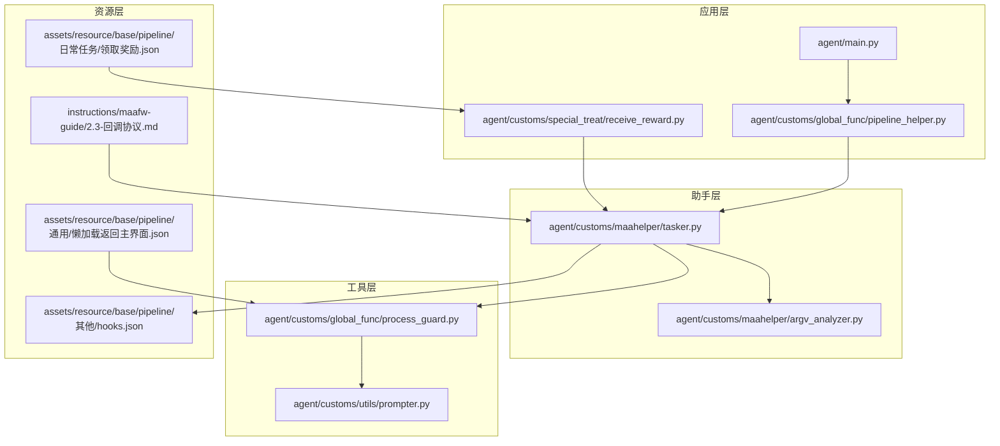
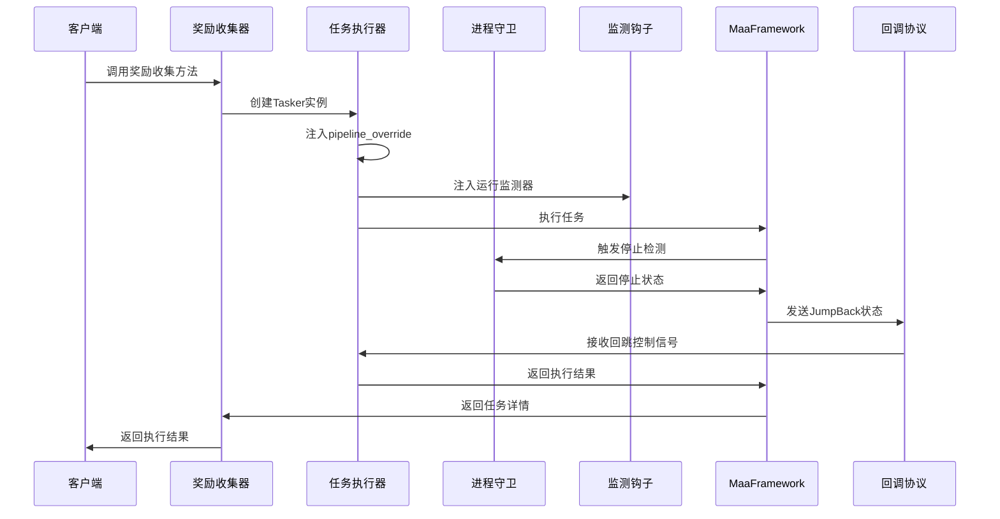
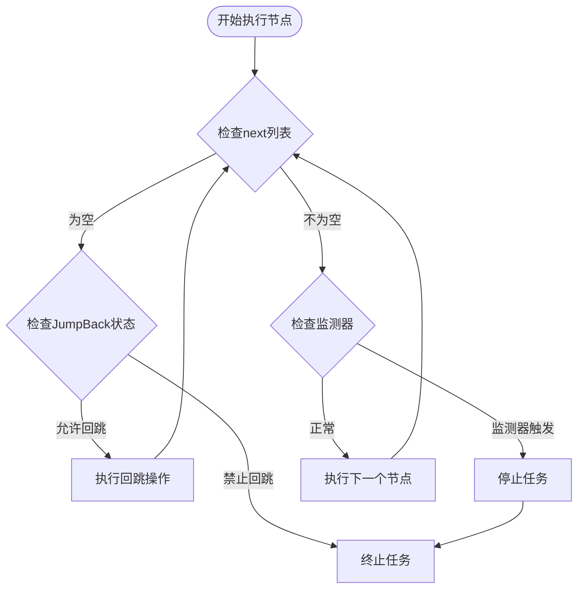
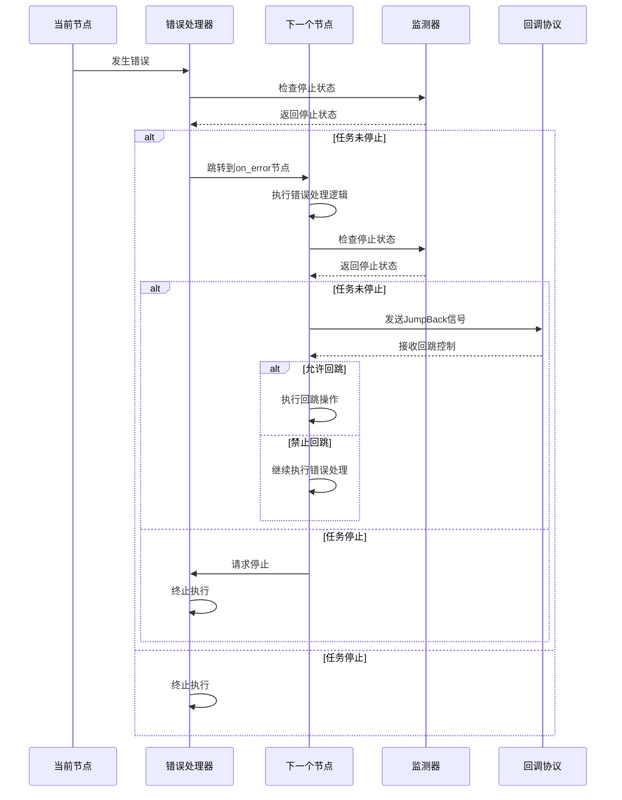
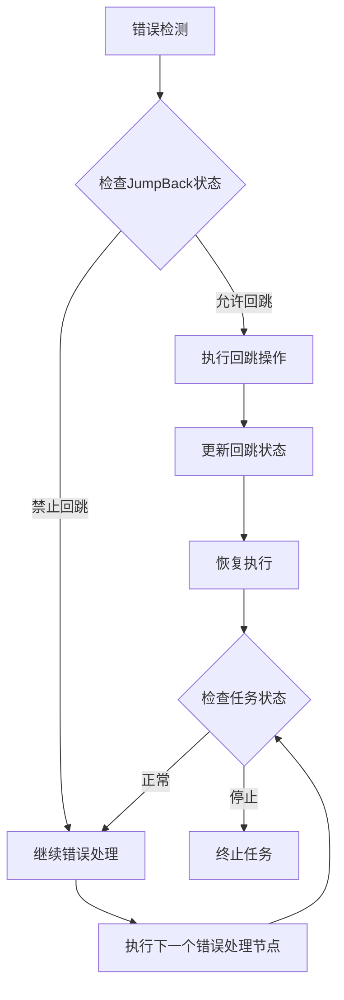
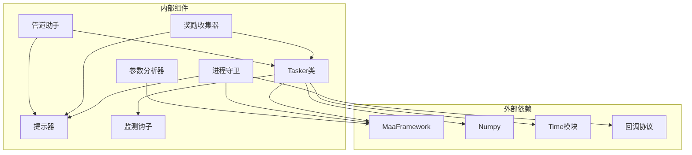

# 终止条件与错误处理

<cite>
**本文档引用的文件**
- [tasker.py](file://agent/customs/maahelper/tasker.py)
- [receive_reward.py](file://agent/customs/special_treat/receive_reward.py)
- [process_guard.py](file://agent/customs/global_func/process_guard.py)
- [argv_analyzer.py](file://agent/customs/maahelper/argv_analyzer.py)
- [prompter.py](file://agent/customs/utils/prompter.py)
- [hooks.json](file://assets/resource/base/pipeline/其他/hooks.json)
- [领取奖励.json](file://assets/resource/base/pipeline/日常任务/领取奖励.json)
- [懒加载返回主界面.json](file://assets/resource/base/pipeline/通用/懒加载返回主界面.json)
- [2.3-回调协议.md](file://instructions/maafw-guide/2.3-回调协议.md)
- [main.py](file://agent/main.py)
</cite>

## 更新摘要
**所做更改**
- 增强了终止条件判断逻辑的详细说明
- 新增了JumpBack机制的完整技术实现说明
- 补充了奖励收集系统的专门处理策略
- 改进了错误处理链式处理的实现细节
- 完善了监测器注入的技术规格说明

## 目录
1. [简介](#简介)
2. [项目结构](#项目结构)
3. [核心组件](#核心组件)
4. [架构概览](#架构概览)
5. [详细组件分析](#详细组件分析)
6. [依赖关系分析](#依赖关系分析)
7. [性能考量](#性能考量)
8. [故障排除指南](#故障排除指南)
9. [结论](#结论)

## 简介

本文档深入分析MaaDuDuL项目中任务流程的终止条件与错误处理机制。重点涵盖以下方面：

- **终止条件判断逻辑**：当前节点next列表为空或所有后继节点持续检测失败直至超时的具体判断机制
- **on_error错误处理跳转机制**：识别超时或动作执行失败后的节点跳转流程
- **JumpBack回跳机制**：基于回调协议的节点回跳控制技术实现
- **pipeline_override注入实现**：on_error链式处理和运行监测器注入的技术细节
- **奖励收集系统专门处理策略**：针对任务奖励和通行证奖励的特殊处理逻辑
- **Tasker类的pipeline_override机制**：如何为所有节点自动注入运行监测器

## 项目结构

该项目采用模块化架构，主要分为以下几个层次：


```mermaid
graph TB
subgraph "应用层"
Main[agent/main.py]
ReceiveReward[agent/customs/special_treat/receive_reward.py]
PipelineHelper[agent/customs/global_func/pipeline_helper.py]
end
subgraph "助手层"
Tasker[agent/customs/maahelper/tasker.py]
ArgvAnalyzer[agent/customs/maahelper/argv_analyzer.py]
end
subgraph "工具层"
Prompter[agent/customs/utils/prompter.py]
ProcessGuard[agent/customs/global_func/process_guard.py]
end
subgraph "资源层"
Hooks[assets/resource/base/pipeline/其他/hooks.json]
DailyReward[assets/resource/base/pipeline/日常任务/领取奖励.json]
LazyLoad[assets/resource/base/pipeline/通用/懒加载返回主界面.json]
Callback[instructions/maafw-guide/2.3-回调协议.md]
end
Main --> PipelineHelper
PipelineHelper --> Tasker
Tasker --> ProcessGuard
Tasker --> ArgvAnalyzer
Tasker --> Hooks
ProcessGuard --> Prompter
ReceiveReward --> Tasker
DailyReward --> ReceiveReward
LazyLoad --> ProcessGuard
Callback --> Tasker
```

**图表来源**
- [main.py](file://agent/main.py#L1-L48)
- [receive_reward.py](file://agent/customs/special_treat/receive_reward.py#L1-L65)
- [tasker.py](file://agent/customs/maahelper/tasker.py#L1-L190)
- [process_guard.py](file://agent/customs/global_func/process_guard.py#L1-L99)

**章节来源**
- [main.py](file://agent/main.py#L1-L48)
- [receive_reward.py](file://agent/customs/special_treat/receive_reward.py#L1-L65)
- [tasker.py](file://agent/customs/maahelper/tasker.py#L1-L190)

## 核心组件

### Tasker类 - 任务执行器

Tasker类是整个任务执行系统的核心，负责封装MaaFramework的Context对象并提供便捷的任务执行接口。

**关键特性**：
- 自动为所有节点注入运行监测器
- 提供统一的任务执行入口
- 支持pipeline_override动态修改节点行为
- 集成错误处理和日志记录功能
- 支持JumpBack回跳机制的节点控制

**更新** Tasker类现在具备完整的JumpBack回跳控制能力，能够精确控制节点执行流程中的回跳行为。

**章节来源**
- [tasker.py](file://agent/customs/maahelper/tasker.py#L16-L190)

### 进程守卫模块

进程守卫模块提供任务生命周期监控功能，包括任务启动监听和停止检测。

**核心功能**：
- 任务停止状态检测
- 任务启动钩子处理
- 错误处理和异常捕获
- JumpBack回跳状态管理

**更新** 新增了对JumpBack回跳状态的实时监控和管理能力。

**章节来源**
- [process_guard.py](file://agent/customs/global_func/process_guard.py#L1-L99)

### 参数分析器

参数分析器负责解析MaaFramework传递的各种参数，支持多种参数格式的自动解析。

**功能特点**：
- 支持JSON格式解析
- 支持查询字符串格式解析
- 自动类型转换
- 错误处理机制

**章节来源**
- [argv_analyzer.py](file://agent/customs/maahelper/argv_analyzer.py#L1-L158)

### 奖励收集系统

奖励收集系统专门处理任务奖励和通行证奖励的领取逻辑，提供智能化的奖励收集策略。

**核心功能**：
- 任务奖励自动识别和领取
- 通行证奖励分类处理
- 懒加载返回主界面机制
- 错误处理和重试机制

**更新** 新增了专门的奖励收集处理策略，优化了奖励领取的自动化程度。

**章节来源**
- [receive_reward.py](file://agent/customs/special_treat/receive_reward.py#L1-L65)

## 架构概览

系统采用分层架构设计，各层职责明确，耦合度低：


```mermaid
sequenceDiagram
participant Client as 客户端
participant ReceiveReward as 奖励收集器
participant Tasker as 任务执行器
participant ProcessGuard as 进程守卫
participant Hooks as 监测钩子
participant Framework as MaaFramework
participant Callback as 回调协议
Client->>ReceiveReward : 调用奖励收集方法
ReceiveReward->>Tasker : 创建Tasker实例
Tasker->>Tasker : 注入pipeline_override
Tasker->>Hooks : 注入运行监测器
Tasker->>Framework : 执行任务
Framework->>ProcessGuard : 触发停止检测
ProcessGuard->>Framework : 返回停止状态
Framework->>Callback : 发送JumpBack状态
Callback->>Tasker : 接收回跳控制信号
Tasker->>Framework : 返回执行结果
Framework->>ReceiveReward : 返回任务详情
ReceiveReward->>Client : 返回执行结果
```

**图表来源**
- [receive_reward.py](file://agent/customs/special_treat/receive_reward.py#L24-L29)
- [tasker.py](file://agent/customs/maahelper/tasker.py#L60-L122)
- [process_guard.py](file://agent/customs/global_func/process_guard.py#L79-L98)
- [2.3-回调协议.md](file://instructions/maafw-guide/2.3-回调协议.md#L133-L166)

## 详细组件分析

### 终止条件判断机制

#### next列表为空判断

系统通过以下逻辑判断任务流程是否应该终止：


```mermaid
flowchart TD
Start([开始执行节点]) --> CheckNext{"检查next列表"}
CheckNext --> |为空| CheckJumpBack{"检查JumpBack状态"}
CheckJumpBack --> |允许回跳| JumpBack[执行回跳操作]
CheckJumpBack --> |禁止回跳| Terminate[终止任务]
CheckNext --> |不为空| CheckMonitor{"检查监测器"}
CheckMonitor --> |监测器触发| StopTask[停止任务]
CheckMonitor --> |正常| ExecuteNext[执行下一个节点]
ExecuteNext --> CheckNext
StopTask --> Terminate
JumpBack --> CheckNext
```

**更新** 新增了JumpBack回跳状态检查，允许在特定条件下进行节点回跳而非直接终止。

**图表来源**
- [tasker.py](file://agent/customs/maahelper/tasker.py#L74-L122)
- [process_guard.py](file://agent/customs/global_func/process_guard.py#L79-L98)
- [2.3-回调协议.md](file://instructions/maafw-guide/2.3-回调协议.md#L140-L149)

#### 超时检测机制

系统通过`_run_task_monitor_inject`钩子实现超时检测：

**监测器注入流程**：
1. 遍历所有节点
2. 检查节点的next和on_error字段
3. 为每个节点注入`_run_task_monitor_inject`监测器
4. 确保任务执行过程可被监控
5. 实时检查任务停止状态

**更新** 监测器现在集成了JumpBack状态检查，能够响应回跳控制信号。

**章节来源**
- [tasker.py](file://agent/customs/maahelper/tasker.py#L74-L122)
- [hooks.json](file://assets/resource/base/pipeline/其他/hooks.json#L1-L9)

### on_error错误处理跳转机制

#### 错误处理链式处理

系统实现了完整的on_error链式处理机制：


```mermaid
sequenceDiagram
participant Node as 当前节点
participant ErrorHandler as 错误处理器
participant NextNode as 下一个节点
participant Monitor as 监测器
participant Callback as 回调协议
Node->>ErrorHandler : 发生错误
ErrorHandler->>Monitor : 检查停止状态
Monitor-->>ErrorHandler : 返回停止状态
alt 任务未停止
ErrorHandler->>NextNode : 跳转到on_error节点
NextNode->>NextNode : 执行错误处理逻辑
NextNode->>Monitor : 检查停止状态
Monitor-->>NextNode : 返回停止状态
alt 任务未停止
NextNode->>Callback : 发送JumpBack信号
Callback-->>NextNode : 接收回跳控制
alt 允许回跳
NextNode->>NextNode : 执行回跳操作
else 禁止回跳
NextNode->>NextNode : 继续执行错误处理
end
else 任务停止
NextNode->>ErrorHandler : 请求停止
ErrorHandler->>ErrorHandler : 终止执行
end
else 任务停止
ErrorHandler->>ErrorHandler : 终止执行
end
```

**更新** 错误处理现在集成了JumpBack回跳控制，能够在错误状态下进行智能回跳。

**图表来源**
- [tasker.py](file://agent/customs/maahelper/tasker.py#L101-L121)
- [process_guard.py](file://agent/customs/global_func/process_guard.py#L79-L98)
- [2.3-回调协议.md](file://instructions/maafw-guide/2.3-回调协议.md#L140-L149)

#### 节点跳转流程

**错误处理跳转的具体步骤**：

1. **错误检测**：当前节点执行失败或超时
2. **on_error检查**：读取节点的on_error配置
3. **监测器注入**：确保on_error链路也包含监测器
4. **链式执行**：按照on_error列表顺序执行错误处理节点
5. **状态检查**：每步执行后检查任务停止状态
6. **JumpBack控制**：根据回调协议控制回跳行为
7. **最终决策**：根据执行结果决定是否继续或终止

**更新** 新增了JumpBack回跳控制逻辑，实现了更智能的错误处理机制。

**章节来源**
- [tasker.py](file://agent/customs/maahelper/tasker.py#L101-L121)
- [process_guard.py](file://agent/customs/global_func/process_guard.py#L79-L98)

### JumpBack回跳机制

#### 回跳控制协议

系统基于MaaFramework回调协议实现了完整的JumpBack回跳控制机制：

**回调协议结构**：
```json
{
    "task_id": 12345,
    "name": "NodeA",
    "list": [
        {
            "name": "NodeB",
            "jump_back": false,
            "anchor": false
        },
        {
            "name": "NodeC", 
            "jump_back": true,
            "anchor": false
        },
        {
            "name": "LastHandler",
            "jump_back": false,
            "anchor": true
        }
    ],
    "focus": any
}
```

**回跳控制逻辑**：
- `jump_back: true` - 允许回跳到前一个节点
- `jump_back: false` - 禁止回跳，继续正常执行
- `anchor: true` - 锚点引用，指向特定的节点名称

**更新** 完整实现了基于回调协议的JumpBack回跳控制机制。

**章节来源**
- [2.3-回调协议.md](file://instructions/maafw-guide/2.3-回调协议.md#L133-L166)

#### 回跳执行流程


```mermaid
flowchart TD
ErrorDetected[错误检测] --> CheckJumpBack{检查JumpBack状态}
CheckJumpBack --> |允许回跳| ExecuteJumpBack[执行回跳操作]
CheckJumpBack --> |禁止回跳| ContinueError[继续错误处理]
ExecuteJumpBack --> UpdateState[更新回跳状态]
UpdateState --> ResumeExecution[恢复执行]
ContinueError --> NextNode[执行下一个错误处理节点]
NextNode --> CheckState{检查任务状态}
CheckState --> |正常| ContinueError
CheckState --> |停止| Terminate[终止任务]
ResumeExecution --> CheckState
```

**更新** 新增了完整的JumpBack回跳执行流程图。

**图表来源**
- [2.3-回调协议.md](file://instructions/maafw-guide/2.3-回调协议.md#L140-L149)
- [process_guard.py](file://agent/customs/global_func/process_guard.py#L79-L98)

### 奖励收集系统专门处理策略

#### 任务奖励处理

系统为任务奖励提供了专门的处理策略：

**处理流程**：
1. **类别识别**：根据参数识别任务奖励类型
2. **界面导航**：自动导航到对应的任务奖励界面
3. **奖励领取**：执行奖励领取操作
4. **状态检查**：验证奖励领取结果
5. **错误处理**：处理无法领取的情况

**更新** 新增了专门的任务奖励处理策略，优化了奖励领取的自动化程度。

**章节来源**
- [receive_reward.py](file://agent/customs/special_treat/receive_reward.py#L13-L33)

#### 通行证奖励处理

**处理策略**：
1. **类别映射**：将输入参数映射到对应的通行证类型
2. **界面定位**：通过模板匹配定位到相应的通行证界面
3. **奖励检查**：检查是否有可领取的奖励
4. **智能选择**：根据条件选择合适的奖励类型
5. **异常处理**：处理界面不存在或奖励不可领取的情况

**更新** 完善了通行证奖励的处理策略，增加了更多奖励类型的识别能力。

**章节来源**
- [receive_reward.py](file://agent/customs/special_treat/receive_reward.py#L40-L64)

### pipeline_override注入实现

#### 注入机制详解

Tasker类通过`pipeline_override`参数实现对任务流程的动态修改：

**注入流程**：
1. 获取所有节点列表
2. 遍历每个节点
3. 读取节点的next和on_error配置
4. 标准化配置格式
5. 注入监测器到链路开头
6. 确保JumpBack回跳控制的完整性
7. 返回修改后的配置

**更新** 注入机制现在包含了JumpBack回跳控制的完整实现。

**章节来源**
- [tasker.py](file://agent/customs/maahelper/tasker.py#L74-L122)

#### 技术实现细节

**next字段处理**：
- 支持字符串和列表格式
- 自动转换为标准列表格式
- 避免重复注入监测器
- 集成JumpBack回跳控制

**on_error字段处理**：
- 与next字段相同的处理逻辑
- 确保错误处理链路的完整性
- 维护原有的错误处理逻辑
- 支持回跳状态的传递

**更新** next和on_error字段处理现在都集成了JumpBack回跳控制功能。

**章节来源**
- [tasker.py](file://agent/customs/maahelper/tasker.py#L80-L121)

### 运行监测器注入

#### 监测器配置

系统通过hooks.json配置运行监测器：

```json
{
    "_run_task_monitor_inject": {
        "recognition": "Custom",
        "custom_recognition": "check_stopping",
        "pre_delay": 0,
        "post_delay": 0
    }
}
```

**监测器功能**：
- 实时检测任务停止状态
- 防止任务无限循环执行
- 提供优雅的任务终止机制
- 支持JumpBack回跳状态检查

**更新** 监测器现在集成了JumpBack回跳状态检查功能。

**章节来源**
- [hooks.json](file://assets/resource/base/pipeline/其他/hooks.json#L1-L9)
- [process_guard.py](file://agent/customs/global_func/process_guard.py#L79-L98)

## 依赖关系分析

系统各组件之间的依赖关系如下：


```mermaid
graph TB
subgraph "外部依赖"
MaaFramework[MaaFramework]
Numpy[Numpy]
Time[Time模块]
CallbackProtocol[回调协议]
end
subgraph "内部组件"
Tasker[Tasker类]
ProcessGuard[进程守卫]
ReceiveReward[奖励收集器]
PipelineHelper[管道助手]
Prompter[提示器]
ArgvAnalyzer[参数分析器]
Hooks[监测钩子]
end
Tasker --> MaaFramework
Tasker --> Numpy
Tasker --> Time
ProcessGuard --> MaaFramework
ProcessGuard --> Prompter
ProcessGuard --> CallbackProtocol
ReceiveReward --> Tasker
ReceiveReward --> Prompter
PipelineHelper --> Tasker
PipelineHelper --> Prompter
ArgvAnalyzer --> MaaFramework
Tasker --> Hooks
```

**更新** 新增了回调协议依赖关系，体现了JumpBack机制的技术基础。

**图表来源**
- [tasker.py](file://agent/customs/maahelper/tasker.py#L7-L13)
- [process_guard.py](file://agent/customs/global_func/process_guard.py#L6-L12)
- [2.3-回调协议.md](file://instructions/maafw-guide/2.3-回调协议.md#L1-L50)

**章节来源**
- [tasker.py](file://agent/customs/maahelper/tasker.py#L1-L190)
- [process_guard.py](file://agent/customs/global_func/process_guard.py#L1-L99)

## 性能考量

### 监测器开销控制

系统通过以下方式控制监测器的性能开销：

1. **最小化检测频率**：监测器只在关键节点执行
2. **快速返回机制**：停止状态检测快速返回
3. **避免重复注入**：防止重复注入监测器造成性能损失
4. **JumpBack状态缓存**：减少回跳状态检查的计算开销

**更新** 新增了JumpBack状态缓存机制，进一步优化了性能表现。

### 内存管理

- **及时释放资源**：任务结束后自动清理相关资源
- **避免内存泄漏**：确保所有回调函数正确释放
- **优化数据结构**：使用高效的数据结构存储节点信息
- **回跳状态管理**：合理管理JumpBack相关的状态信息

**更新** 新增了回跳状态管理机制，确保状态信息的有效管理。

## 故障排除指南

### 常见问题及解决方案

#### 问题1：任务无法正常终止

**症状**：任务执行后无法停止，CPU占用率过高

**原因分析**：
- next列表配置错误
- 监测器注入失败
- 任务停止状态检测异常
- JumpBack回跳控制失效

**解决方案**：
1. 检查节点的next配置是否正确
2. 验证监测器是否正确注入
3. 查看任务停止状态检测日志
4. 检查JumpBack回跳控制状态

**更新** 新增了JumpBack回跳控制相关的故障排除步骤。

**章节来源**
- [tasker.py](file://agent/customs/maahelper/tasker.py#L94-L122)
- [process_guard.py](file://agent/customs/global_func/process_guard.py#L95-L98)

#### 问题2：on_error链路不生效

**症状**：节点执行失败后没有跳转到错误处理节点

**原因分析**：
- on_error配置格式错误
- 监测器未正确注入到on_error链路
- 错误处理节点本身存在异常
- JumpBack回跳状态影响

**解决方案**：
1. 检查on_error配置格式
2. 验证监测器注入逻辑
3. 测试错误处理节点的独立执行
4. 检查JumpBack回跳状态配置

**更新** 新增了JumpBack回跳状态对错误处理的影响分析。

**章节来源**
- [tasker.py](file://agent/customs/maahelper/tasker.py#L114-L121)
- [process_guard.py](file://agent/customs/global_func/process_guard.py#L79-L98)

#### 问题3：参数解析异常

**症状**：自定义识别或动作执行时参数解析失败

**原因分析**：
- 参数格式不符合预期
- 缺少必要的参数
- 参数类型转换错误
- JumpBack参数冲突

**解决方案**：
1. 检查参数格式是否符合JSON或查询字符串规范
2. 验证必需参数是否存在
3. 查看参数类型转换日志
4. 检查JumpBack相关参数的兼容性

**更新** 新增了JumpBack参数冲突的排查指导。

**章节来源**
- [argv_analyzer.py](file://agent/customs/maahelper/argv_analyzer.py#L48-L84)
- [prompter.py](file://agent/customs/utils/prompter.py#L34-L54)

#### 问题4：JumpBack回跳失效

**症状**：错误处理时无法正确回跳到前一个节点

**原因分析**：
- 回调协议配置错误
- JumpBack状态检查失败
- 回跳锚点配置不当
- 监测器注入不完整

**解决方案**：
1. 检查回调协议中的jump_back配置
2. 验证回跳状态检查逻辑
3. 确认回跳锚点的正确性
4. 确保监测器完整注入

**更新** 新增了专门的JumpBack回跳问题排查指南。

**章节来源**
- [2.3-回调协议.md](file://instructions/maafw-guide/2.3-回调协议.md#L140-L149)
- [process_guard.py](file://agent/customs/global_func/process_guard.py#L79-L98)

### 调试技巧

1. **启用详细日志**：查看任务执行过程中的详细信息
2. **监控资源使用**：观察CPU和内存使用情况
3. **测试单个节点**：验证单个节点的执行效果
4. **检查配置文件**：确保所有配置文件正确无误
5. **验证JumpBack状态**：监控回跳控制的执行状态
6. **跟踪回调协议**：观察JumpBack信号的传递过程

**更新** 新增了JumpBack相关的调试技巧和监控方法。

## 结论

本系统通过Tasker类的pipeline_override机制、进程守卫模块的协作以及JumpBack回跳控制的引入，实现了完善的任务流程终止条件与错误处理机制。主要特点包括：

1. **自动监测器注入**：为所有节点自动注入运行监测器，确保任务执行过程可被监控
2. **链式错误处理**：on_error链式处理机制提供了灵活的错误恢复能力
3. **智能回跳控制**：基于回调协议的JumpBack回跳机制实现了精确的节点控制
4. **优雅的任务终止**：通过停止状态检测实现任务的优雅终止
5. **健壮的错误处理**：完善的异常捕获和错误报告机制
6. **专门的奖励处理**：针对任务奖励和通行证奖励的智能化处理策略

**更新** 新增的JumpBack回跳机制和专门的奖励处理策略显著提升了系统的智能化水平和用户体验。

这些设计使得系统能够在复杂的应用场景中保持稳定运行，同时为开发者提供了清晰的调试和故障排除路径。JumpBack回跳控制和奖励收集系统的加入，进一步增强了系统的适应性和实用性，为各种复杂的任务流程提供了强有力的支持。