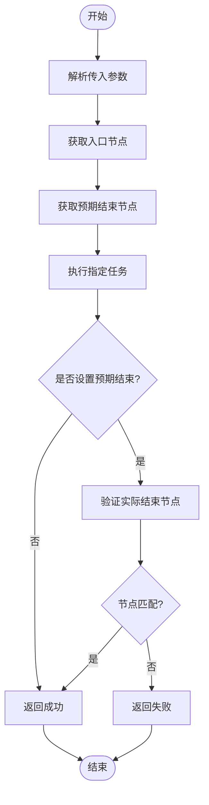
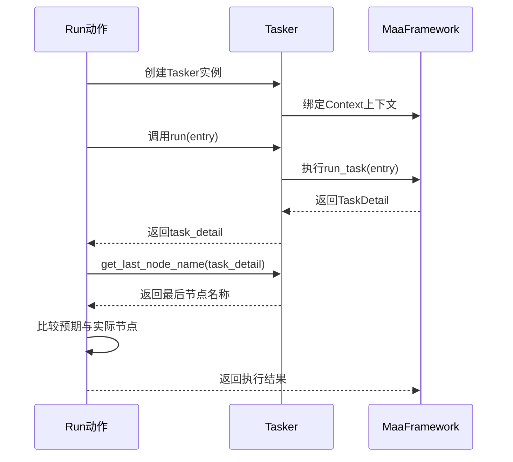
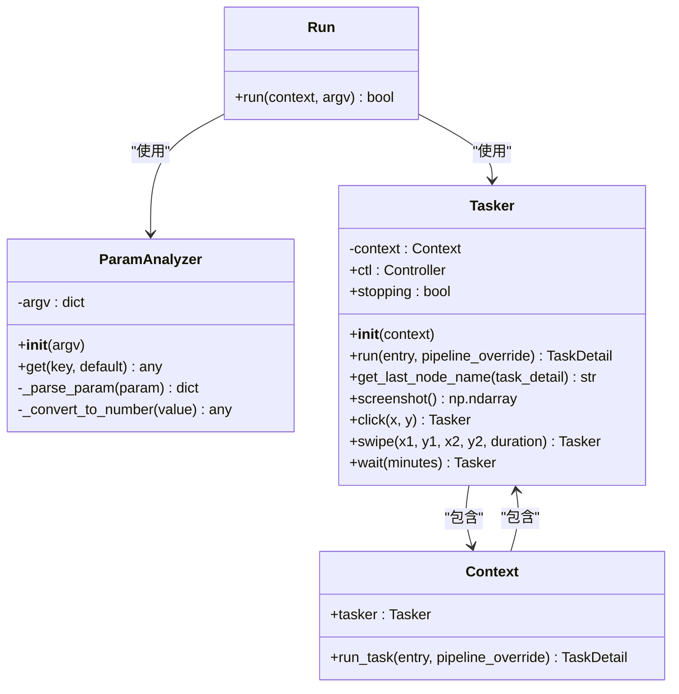

# 自定义Run动作实现

<cite>
**本文档引用文件**  
- [pipeline_helper.py](file://agent/customs/global_func/pipeline_helper.py)
- [tasker.py](file://agent/customs/maahelper/tasker.py)
- [argv_analyzer.py](file://agent/customs/maahelper/argv_analyzer.py)
- [启动游戏.json](file://assets/resource/base/pipeline/日常任务/启动游戏.json)
- [关闭游戏.json](file://assets/resource/base/pipeline/日常任务/关闭游戏.json)
</cite>

## 目录
1. [简介](#简介)
2. [参数解析机制](#参数解析机制)
3. [任务执行流程](#任务执行流程)
4. [预期结束节点验证](#预期结束节点验证)
5. [使用示例分析](#使用示例分析)
6. [核心组件关系图](#核心组件关系图)
7. [错误处理机制](#错误处理机制)
8. [总结](#总结)

## 简介
本文档深入分析`pipeline_helper.py`中`Run`自定义动作的实现机制。该功能允许通过参数化方式调用指定任务入口，并验证任务是否按预期路径结束。系统通过`ParamAnalyzer`解析传入参数，支持多种别名格式，并通过`Tasker`执行任务和验证结果。

## 参数解析机制

`Run`动作通过`ParamAnalyzer`类解析传入的参数。该类能够处理JSON格式和查询字符串格式的参数，并支持自动类型转换。

参数解析过程如下：
1. 接收`CustomAction.RunArg`类型的参数对象
2. 提取`custom_action_param`字符串
3. 尝试按JSON格式解析
4. 若JSON解析失败，则尝试按查询字符串格式解析
5. 返回解析后的字典对象

对于别名支持，`get`方法接受字符串列表作为键名，按顺序查找第一个存在的键。

**Section sources**
- [argv_analyzer.py](file://agent/customs/maahelper/argv_analyzer.py#L17-L159)
- [pipeline_helper.py](file://agent/customs/global_func/pipeline_helper.py#L13-L15)

## 任务执行流程

`Run`动作的核心执行流程包括参数解析、任务调用和结果验证三个阶段。

**Diagram sources**
- [pipeline_helper.py](file://agent/customs/global_func/pipeline_helper.py#L11-L24)

## 预期结束节点验证

预期结束节点的验证是`Run`动作的重要安全机制，确保任务按预期路径执行完毕。

验证逻辑实现如下：
1. 从参数中获取`expected_end`（支持`expected_end`、`ee`、`e`三种别名）
2. 如果设置了预期结束节点，则进行验证
3. 通过`Tasker.get_last_node_name`获取实际最后执行的节点名称
4. 比较实际节点与预期节点是否一致
5. 不一致则返回失败，中断后续流程

`get_last_node_name`静态方法通过检查`TaskDetail`对象的`nodes`列表最后一个元素来确定最终执行节点。

**Diagram sources**
- [tasker.py](file://agent/customs/maahelper/tasker.py#L172-L177)
- [pipeline_helper.py](file://agent/customs/global_func/pipeline_helper.py#L19-L21)

## 使用示例分析

通过分析实际的pipeline配置文件，可以更好地理解`Run`动作的使用方式。

在`启动游戏.json`配置中，可以看到任务流程的组织方式：
- 使用`DirectHit`识别器作为流程起点
- 通过`next`字段定义后续执行节点
- 包含多个条件分支和跳转逻辑

`关闭游戏.json`配置展示了简单的任务流程：
- 以`on_task_start`自定义动作为起点
- 执行`StopApp`动作关闭指定应用
- 流程简洁明了，适合用作`Run`动作的目标任务

这些配置文件中的节点名称可以直接作为`entry`参数传递给`Run`动作，实现任务的动态调用。

**Section sources**
- [启动游戏.json](file://assets/resource/base/pipeline/日常任务/启动游戏.json)
- [关闭游戏.json](file://assets/resource/base/pipeline/日常任务/关闭游戏.json)

## 核心组件关系图

**Diagram sources**
- [pipeline_helper.py](file://agent/customs/global_func/pipeline_helper.py#L9-L24)
- [tasker.py](file://agent/customs/maahelper/tasker.py#L16-L177)
- [argv_analyzer.py](file://agent/customs/maahelper/argv_analyzer.py#L17-L159)

## 错误处理机制

`Run`动作实现了完善的错误处理机制，确保异常情况下的系统稳定性。

异常处理流程：
1. 使用try-catch包裹整个执行过程
2. 捕获所有异常类型
3. 通过`Prompter.error`记录错误信息
4. 返回False表示执行失败

这种设计确保了即使在参数解析或任务执行过程中发生异常，也不会导致整个系统崩溃，而是优雅地返回失败状态，便于上层逻辑进行错误处理。

**Section sources**
- [pipeline_helper.py](file://agent/customs/global_func/pipeline_helper.py#L12-L24)
- [tasker.py](file://agent/customs/maahelper/tasker.py#L51-L113)

## 总结
`Run`自定义动作提供了一种灵活且安全的任务调用机制。通过支持多别名的参数解析、任务执行和预期结束验证，实现了高度可配置的任务编排能力。该实现充分利用了MaaFramework的扩展接口，通过清晰的职责分离和完善的错误处理，为自动化任务提供了可靠的基础设施支持。