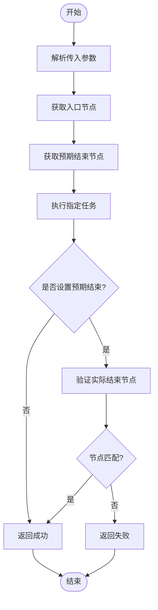
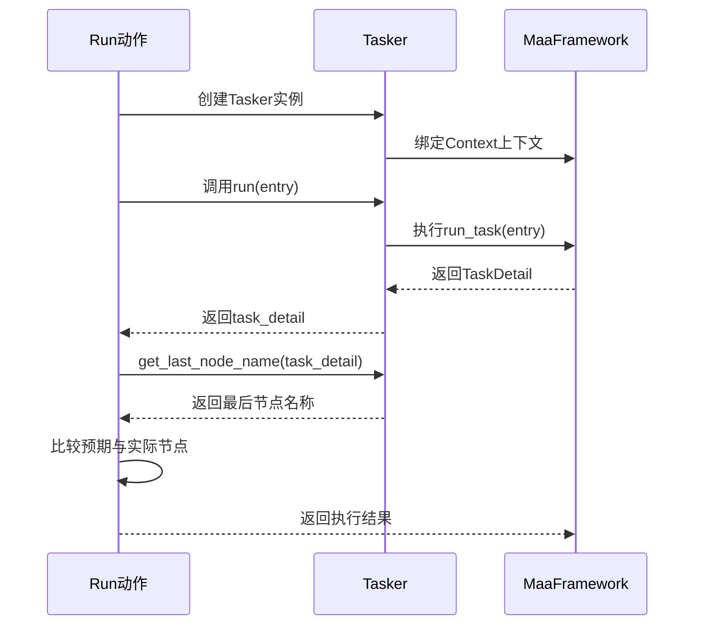
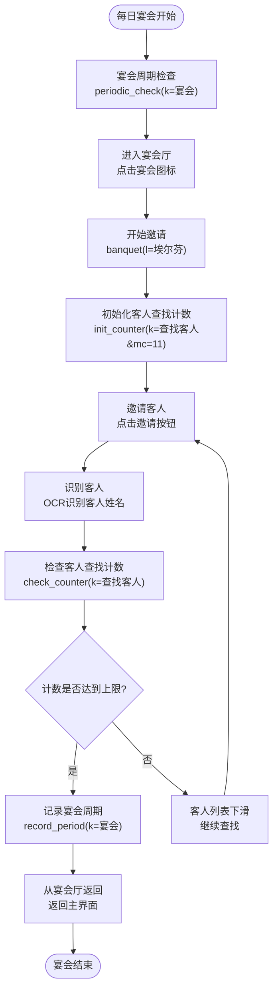
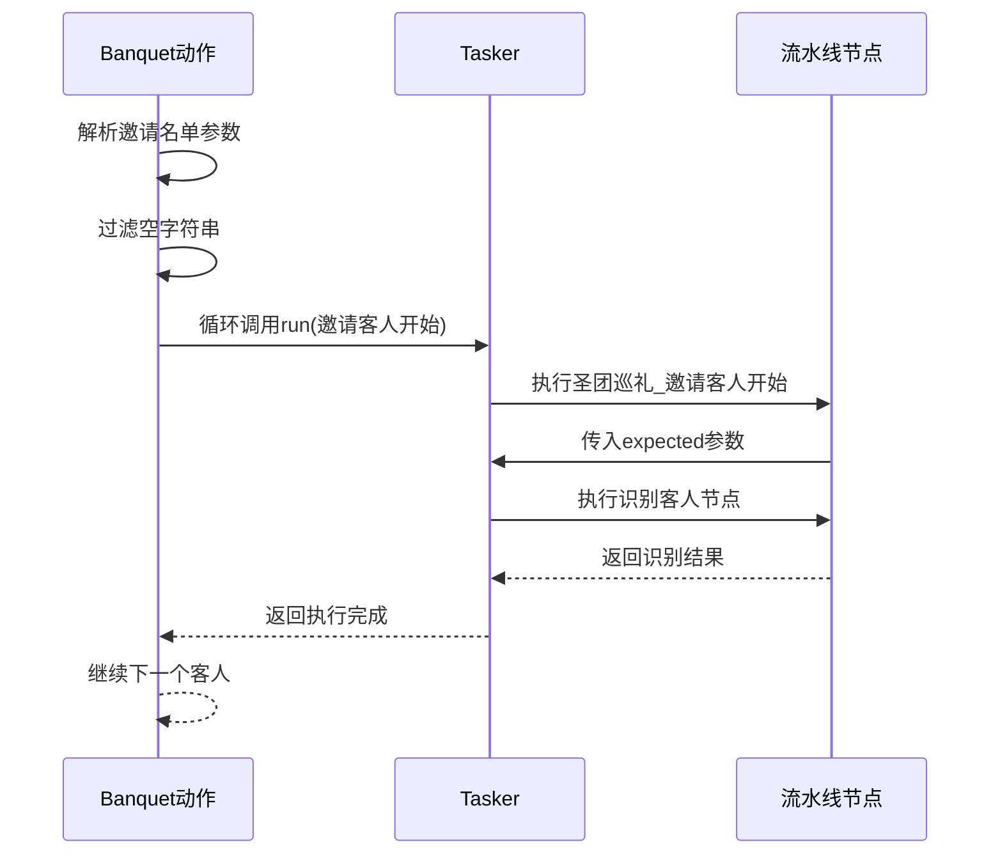
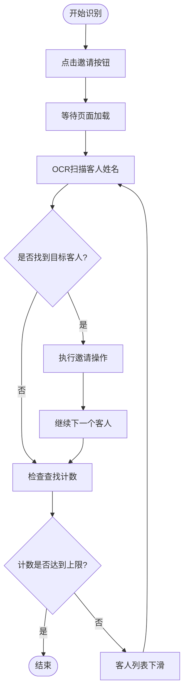
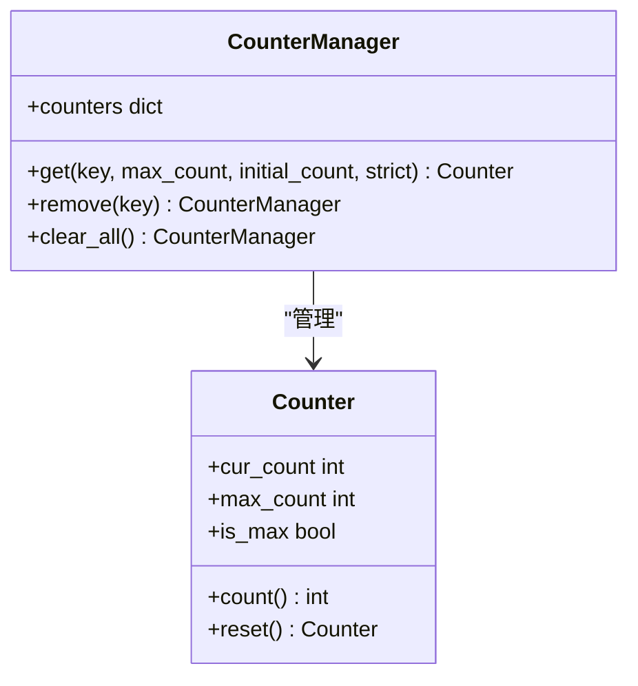
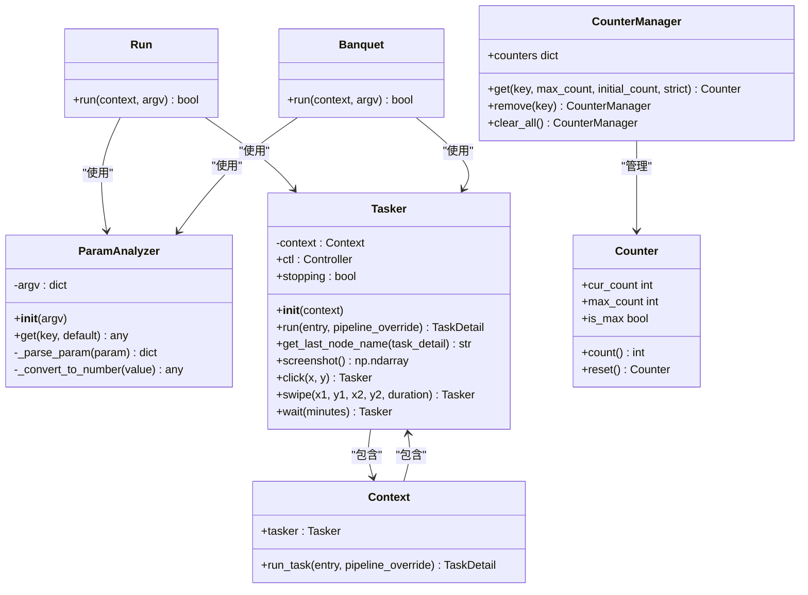

# 自定义Run动作实现

<cite>
**本文档引用文件**  
- [pipeline_helper.py](file://agent/customs/global_func/pipeline_helper.py)
- [tasker.py](file://agent/customs/maahelper/tasker.py)
- [argv_analyzer.py](file://agent/customs/maahelper/argv_analyzer.py)
- [holy.py](file://agent/customs/special_treat/holy.py)
- [圣团巡礼.json](file://assets/resource/base/pipeline/日常任务/圣团巡礼.json)
- [saint_tour.json](file://assets/resource/tasks/daily/saint_tour.json)
- [counter.py](file://agent/customs/global_func/counter.py)
- [清红糖.json](file://assets/resource/base/pipeline/日常任务/清红糖.json)
- [eat_sugar.py](file://agent/customs/special_treat/eat_sugar.py)
- [启动游戏.json](file://assets/resource/base/pipeline/日常任务/启动游戏.json)
- [关闭游戏.json](file://assets/resource/base/pipeline/日常任务/关闭游戏.json)
</cite>

## 更新摘要
**所做更改**   
- 新增每日宴会自定义动作节点的完整分析
- 增加客人识别、邀请流程、计数控制等自动化功能说明
- 更新参数解析机制，包含新的别名支持
- 完善预期结束节点验证机制的说明
- 新增宴会厅自动化流程的使用示例

## 目录
1. [简介](#简介)
2. [参数解析机制](#参数解析机制)
3. [任务执行流程](#任务执行流程)
4. [预期结束节点验证](#预期结束节点验证)
5. [每日宴会自动化流程](#每日宴会自动化流程)
6. [客人识别与邀请系统](#客人识别与邀请系统)
7. [计数控制系统](#计数控制系统)
8. [使用示例分析](#使用示例分析)
9. [核心组件关系图](#核心组件关系图)
10. [错误处理机制](#错误处理机制)
11. [总结](#总结)

## 简介
本文档深入分析`pipeline_helper.py`中`Run`自定义动作的实现机制。该功能允许通过参数化方式调用指定任务入口，并验证任务是否按预期路径结束。系统通过`ParamAnalyzer`解析传入参数，支持多种别名格式，并通过`Tasker`执行任务和验证结果。

**更新** 新增了每日宴会自动化流程，包括客人识别、邀请系统、计数控制等完整功能，以及心形关卡自动化流程的支持。

## 参数解析机制

`Run`动作通过`ParamAnalyzer`类解析传入的参数。该类能够处理JSON格式和查询字符串格式的参数，并支持自动类型转换。

参数解析过程如下：
1. 接收`CustomAction.RunArg`类型的参数对象
2. 提取`custom_action_param`字符串
3. 尝试按JSON格式解析
4. 若JSON解析失败，则尝试按查询字符串格式解析
5. 返回解析后的字典对象

对于别名支持，`get`方法接受字符串列表作为键名，按顺序查找第一个存在的键。

**更新** 参数解析现在支持以下别名格式：
- `task`、`t`：任务入口参数
- `node`、`n`：节点入口参数  
- `entry`：入口节点参数
- `expected_end`、`ee`、`e`：预期结束节点参数

**Section sources**
- [argv_analyzer.py:17-159](file://agent/customs/maahelper/argv_analyzer.py#L17-L159)
- [pipeline_helper.py:13-15](file://agent/customs/global_func/pipeline_helper.py#L13-L15)

## 任务执行流程

`Run`动作的核心执行流程包括参数解析、任务调用和结果验证三个阶段。

```mermaid
flowchart TD
Start([开始]) --> ParseParam["解析传入参数"]
ParseParam --> GetEntry["获取入口节点"]
GetEntry --> GetExpected["获取预期结束节点"]
GetExpected --> ExecuteTask["执行指定任务"]
ExecuteTask --> HasExpected{"是否设置预期结束?"}
HasExpected --> |是| ValidateEnd["验证实际结束节点"]
HasExpected --> |否| ReturnSuccess["返回成功"]
ValidateEnd --> IsMatch{"节点匹配?"}
IsMatch --> |是| ReturnSuccess
IsMatch --> |否| ReturnFail["返回失败"]
ReturnSuccess --> End([结束])
ReturnFail --> End
```

**Diagram sources**
- [pipeline_helper.py:11-24](file://agent/customs/global_func/pipeline_helper.py#L11-L24)

## 预期结束节点验证

预期结束节点的验证是`Run`动作的重要安全机制，确保任务按预期路径执行完毕。

验证逻辑实现如下：
1. 从参数中获取`expected_end`（支持`expected_end`、`ee`、`e`三种别名）
2. 如果设置了预期结束节点，则进行验证
3. 通过`Tasker.get_last_node_name`获取实际最后执行的节点名称
4. 比较实际节点与预期节点是否一致
5. 不一致则返回失败，中断后续流程

`get_last_node_name`静态方法通过检查`TaskDetail`对象的`nodes`列表最后一个元素来确定最终执行节点。

```mermaid
sequenceDiagram
participant Run as Run动作
participant Tasker as Tasker
participant Maa as MaaFramework
Run->>Tasker : 创建Tasker实例
Tasker->>Maa : 绑定Context上下文
Run->>Tasker : 调用run(entry)
Tasker->>Maa : 执行run_task(entry)
Maa-->>Tasker : 返回TaskDetail
Tasker-->>Run : 返回task_detail
Run->>Tasker : get_last_node_name(task_detail)
Tasker-->>Run : 返回最后节点名称
Run->>Run : 比较预期与实际节点
Run-->>Maa : 返回执行结果
```

**Diagram sources**
- [tasker.py:185-190](file://agent/customs/maahelper/tasker.py#L185-L190)
- [pipeline_helper.py:19-21](file://agent/customs/global_func/pipeline_helper.py#L19-L21)

## 每日宴会自动化流程

**新增** 基于圣团巡礼.json流水线配置，实现了完整的每日宴会自动化流程。该流程包含客人识别、邀请系统、计数控制等完整功能。

### 宴会厅节点链路

```mermaid
flowchart TD
Start([每日宴会开始]) --> CycleCheck["宴会周期检查<br/>periodic_check(k=宴会)"]
CycleCheck --> EnterHall["进入宴会厅<br/>点击宴会图标"]
EnterHall --> StartInvite["开始邀请<br/>banquet(l=埃尔芬)"]
StartInvite --> InitCounter["初始化客人查找计数<br/>init_counter(k=查找客人&mc=11)"]
InitCounter --> InviteGuest["邀请客人<br/>点击邀请按钮"]
InviteGuest --> RecognizeGuest["识别客人<br/>OCR识别客人姓名"]
RecognizeGuest --> CheckCounter["检查客人查找计数<br/>check_counter(k=查找客人)"]
CheckCounter --> IsMax{"计数是否达到上限?"}
IsMax --> |是| RecordPeriod["记录宴会周期<br/>record_period(k=宴会)"]
IsMax --> |否| ScrollList["客人列表下滑<br/>继续查找"]
ScrollList --> InviteGuest
RecordPeriod --> ReturnHome["从宴会厅返回<br/>返回主界面"]
ReturnHome --> End([宴会结束])
```

### 关键节点功能说明

1. **宴会周期检查** (`圣团巡礼_宴会周期检查`)
   - 调用`periodic_check`自定义动作检查宴会周期
   - 参数：`k=宴会`（键名：宴会）
   - 失败时跳转到`圣团巡礼_宴会周期提醒`

2. **进入宴会厅** (`圣团巡礼_进入宴会厅`)
   - 通过模板匹配识别宴会图标
   - ROI区域：`[12, 583, 400, 136]`
   - 模板：`holy/banquet.png`

3. **开始宴会** (`圣团巡礼_开始宴会`)
   - 调用`banquet`自定义动作执行邀请流程
   - 参数：`l=埃尔芬`（邀请名单：埃尔芬）

4. **初始化客人查找计数** (`圣团巡礼_初始化客人查找计数`)
   - 调用`init_counter`自定义动作
   - 参数：`k=查找客人&mc=11`（键名：查找客人，最大计数：11）

5. **邀请客人** (`圣团巡礼_邀请客人`)
   - 点击邀请按钮
   - 识别ROI区域：`[481, 57, 341, 201]`
   - 模板：`holy/invite.png`

6. **识别客人** (`圣团巡礼_识别客人`)
   - OCR识别客人姓名
   - ROI区域：`[932, 539, 343, 175]`
   - 期望文本："客人列表"

7. **检查客人查找计数** (`圣团巡礼_检查客人查找计数`)
   - 调用`check_counter`自定义识别
   - 参数：`k=查找客人`（键名：查找客人）

### 宴会邀请系统

**新增** `Banquet`自定义动作实现了完整的客人邀请系统：

```mermaid
sequenceDiagram
participant Banquet as Banquet动作
participant Tasker as Tasker
participant Pipeline as 流水线节点
Banquet->>Banquet : 解析邀请名单参数
Banquet->>Banquet : 过滤空字符串
Banquet->>Tasker : 循环调用run(邀请客人开始)
Tasker->>Pipeline : 执行圣团巡礼_邀请客人开始
Pipeline->>Tasker : 传入expected参数
Tasker->>Pipeline : 执行识别客人节点
Pipeline-->>Tasker : 返回识别结果
Tasker-->>Banquet : 返回执行完成
Banquet-->>Banquet : 继续下一个客人
```

**Diagram sources**
- [holy.py:27-57](file://agent/customs/special_treat/holy.py#L27-L57)

**Section sources**
- [holy.py:18-57](file://agent/customs/special_treat/holy.py#L18-L57)
- [圣团巡礼.json:941-1001](file://assets/resource/base/pipeline/日常任务/圣团巡礼.json#L941-L1001)
- [圣团巡礼.json:1078-1097](file://assets/resource/base/pipeline/日常任务/圣团巡礼.json#L1078-L1097)
- [圣团巡礼.json:2109-2159](file://assets/resource/base/pipeline/日常任务/圣团巡礼.json#L2109-L2159)

## 客人识别与邀请系统

**新增** 客人识别系统基于OCR技术实现，能够准确识别宴会厅中的客人姓名。

### 识别流程

```mermaid
flowchart TD
Start([开始识别]) --> ClickInvite["点击邀请按钮"]
ClickInvite --> WaitLoad["等待页面加载"]
WaitLoad --> OCRScan["OCR扫描客人姓名"]
OCRScan --> CheckName{"是否找到目标客人?"}
CheckName --> |是| Invite["执行邀请操作"]
CheckName --> |否| CheckCounter["检查查找计数"]
CheckCounter --> IsMax{"计数是否达到上限?"}
IsMax --> |是| End([结束])
IsMax --> |否| ScrollDown["客人列表下滑"]
ScrollDown --> OCRScan
Invite --> NextGuest["继续下一个客人"]
NextGuest --> CheckCounter
```

### 计数控制机制

系统通过计数器机制防止无限循环查找：
- 初始化最大查找次数：11次
- 每次查找后计数器递增
- 达到上限后停止查找并记录宴会周期

**Section sources**
- [圣团巡礼.json:1833-1840](file://assets/resource/base/pipeline/日常任务/圣团巡礼.json#L1833-L1840)
- [圣团巡礼.json:1335-1364](file://assets/resource/base/pipeline/日常任务/圣团巡礼.json#L1335-L1364)
- [圣团巡礼.json:2129-2142](file://assets/resource/base/pipeline/日常任务/圣团巡礼.json#L2129-L2142)

## 计数控制系统

**新增** 计数器系统提供了完整的计数管理功能，支持初始化、计数操作和状态检查。

### 计数器架构

```mermaid
classDiagram
class Counter {
+count() int
+cur_count int
+max_count int
+is_max bool
+reset() Counter
}
class CounterManager {
+counters dict
+get(key, max_count, initial_count, strict) Counter
+remove(key) CounterManager
+clear_all() CounterManager
}
CounterManager --> Counter : "管理"
```

### 计数器功能

1. **初始化计数器** (`init_counter`)
   - 参数：`k/key`（键名），`ic/initial_count`（初始值），`mc/max_count/m`（最大值）
   - 重新创建计数器实例

2. **执行计数** (`count`)
   - 参数：`k/key`（键名）
   - 计数值加1，超过最大值返回-1

3. **检查计数器状态** (`check_counter`)
   - 参数：`k/key`（键名）
   - 当计数值达到最大值时返回识别成功

**Section sources**
- [counter.py:21-117](file://agent/customs/global_func/counter.py#L21-L117)
- [圣团巡礼.json:558-577](file://assets/resource/base/pipeline/日常任务/圣团巡礼.json#L558-L577)
- [圣团巡礼.json:908-924](file://assets/resource/base/pipeline/日常任务/圣团巡礼.json#L908-L924)

## 使用示例分析

通过分析实际的pipeline配置文件，可以更好地理解`Run`动作的使用方式。

在`启动游戏.json`配置中，可以看到任务流程的组织方式：
- 使用`DirectHit`识别器作为流程起点
- 通过`next`字段定义后续执行节点
- 包含多个条件分支和跳转逻辑

`关闭游戏.json`配置展示了简单的任务流程：
- 以`on_task_start`自定义动作为起点
- 执行`StopApp`动作关闭指定应用
- 流程简洁明了，适合用作`Run`动作的目标任务

**更新** 圣团巡礼.json配置展示了每日宴会的完整自动化流程，包括：
- 宴会周期检查和记录
- 客人识别和邀请系统
- 计数控制和错误处理
- 预期结束节点验证

**更新** 清红糖.json配置展示了心形关卡的完整自动化流程，包括：
- 心形周期检查和记录
- 种族选择和速刷执行
- 预期结束节点验证
- 错误处理和跳转机制

这些配置文件中的节点名称可以直接作为`entry`参数传递给`Run`动作，实现任务的动态调用。

**Section sources**
- [圣团巡礼.json:1-2220](file://assets/resource/base/pipeline/日常任务/圣团巡礼.json#L1-L2220)
- [saint_tour.json:102-174](file://assets/resource/tasks/daily/saint_tour.json#L102-L174)
- [清红糖.json:1-526](file://assets/resource/base/pipeline/日常任务/清红糖.json#L1-L526)
- [启动游戏.json](file://assets/resource/base/pipeline/日常任务/启动游戏.json)
- [关闭游戏.json](file://assets/resource/base/pipeline/日常任务/关闭游戏.json)

## 核心组件关系图

```mermaid
classDiagram
class Run {
+run(context, argv) bool
}
class ParamAnalyzer {
-argv : dict
+__init__(argv)
+get(key, default) any
-_parse_param(param) dict
-_convert_to_number(value) any
}
class Tasker {
-context : Context
+__init__(context)
+run(entry, pipeline_override) TaskDetail
+get_last_node_name(task_detail) str
+ctl : Controller
+stopping : bool
+screenshot() np.ndarray
+click(x, y) Tasker
+swipe(x1, y1, x2, y2, duration) Tasker
+wait(minutes) Tasker
}
class Context {
+tasker : Tasker
+run_task(entry, pipeline_override) TaskDetail
}
class Banquet {
+run(context, argv) bool
}
class Counter {
+count() int
+cur_count int
+max_count int
+is_max bool
+reset() Counter
}
class CounterManager {
+counters dict
+get(key, max_count, initial_count, strict) Counter
+remove(key) CounterManager
+clear_all() CounterManager
}
Run --> ParamAnalyzer : "使用"
Run --> Tasker : "使用"
Tasker --> Context : "包含"
Context --> Tasker : "包含"
Banquet --> ParamAnalyzer : "使用"
Banquet --> Tasker : "使用"
CounterManager --> Counter : "管理"
```

**Diagram sources**
- [pipeline_helper.py:9-24](file://agent/customs/global_func/pipeline_helper.py#L9-L24)
- [tasker.py:16-190](file://agent/customs/maahelper/tasker.py#L16-L190)
- [argv_analyzer.py:17-159](file://agent/customs/maahelper/argv_analyzer.py#L17-L159)
- [holy.py:18-57](file://agent/customs/special_treat/holy.py#L18-L57)
- [counter.py:75-141](file://agent/customs/global_func/counter.py#L75-L141)

## 错误处理机制

`Run`动作实现了完善的错误处理机制，确保异常情况下的系统稳定性。

异常处理流程：
1. 使用try-catch包裹整个执行过程
2. 捕获所有异常类型
3. 通过`Prompter.error`记录错误信息
4. 返回False表示执行失败

**更新** 每日宴会流程中的错误处理机制：
- 周期检查失败时自动跳转到`圣团巡礼_宴会周期提醒`
- 支持`on_error`字段定义错误处理节点
- 通过`expected_end`参数验证任务执行完整性
- 计数器达到上限时自动停止查找

**更新** 心形关卡流程中的错误处理机制：
- 周期检查失败时自动跳转到`清红糖_心形周期提醒`
- 支持`on_error`字段定义错误处理节点
- 通过`expected_end`参数验证任务执行完整性

这种设计确保了即使在参数解析或任务执行过程中发生异常，也不会导致整个系统崩溃，而是优雅地返回失败状态，便于上层逻辑进行错误处理。

**Section sources**
- [pipeline_helper.py:12-24](file://agent/customs/global_func/pipeline_helper.py#L12-L24)
- [tasker.py:51-122](file://agent/customs/maahelper/tasker.py#L51-L122)
- [圣团巡礼.json:961-963](file://assets/resource/base/pipeline/日常任务/圣团巡礼.json#L961-L963)
- [清红糖.json:164-166](file://assets/resource/base/pipeline/日常任务/清红糖.json#L164-L166)

## 总结
`Run`自定义动作提供了一种灵活且安全的任务调用机制。通过支持多别名的参数解析、任务执行和预期结束验证，实现了高度可配置的任务编排能力。该实现充分利用了MaaFramework的扩展接口，通过清晰的职责分离和完善的错误处理，为自动化任务提供了可靠的基础设施支持。

**更新** 新增的每日宴会自动化流程进一步丰富了系统的功能，通过完整的客人识别、邀请系统、计数控制等模块，实现了从周期检查到客人邀请的全流程自动化。该流程不仅展示了`Run`动作的强大功能，也为其他复杂任务的自动化提供了参考模板。

**更新** 新增的心形关卡自动化流程同样体现了系统的强大功能，通过完整的节点链路和自定义动作集成，实现了从周期检查到速刷执行的全流程自动化。该流程的设计思路和实现方式为其他类似场景提供了宝贵的参考经验。