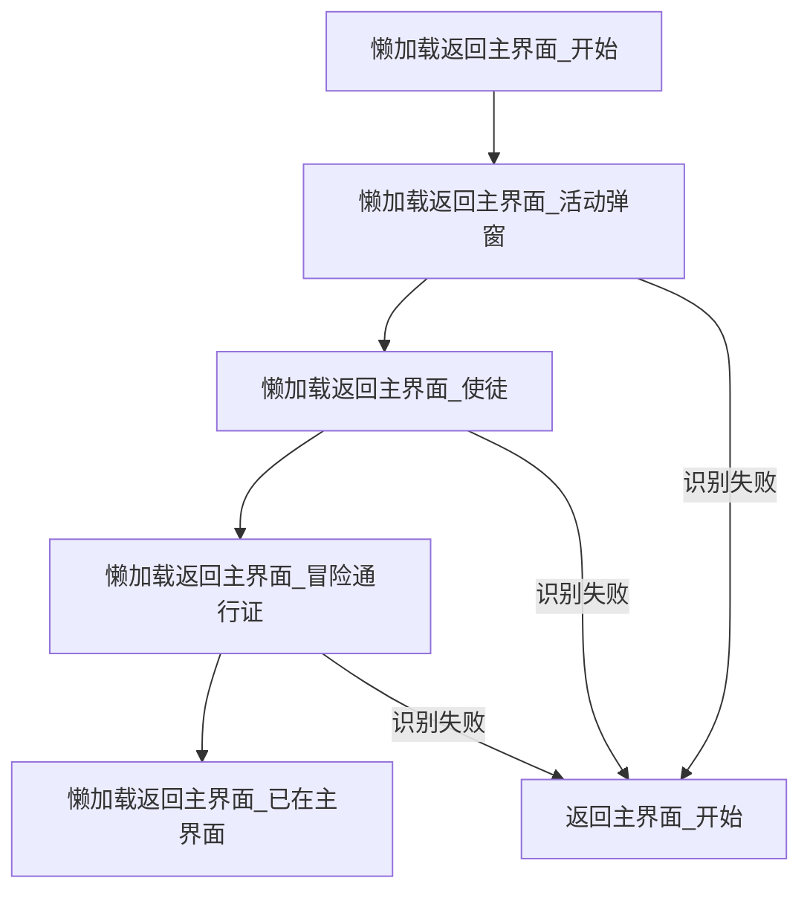
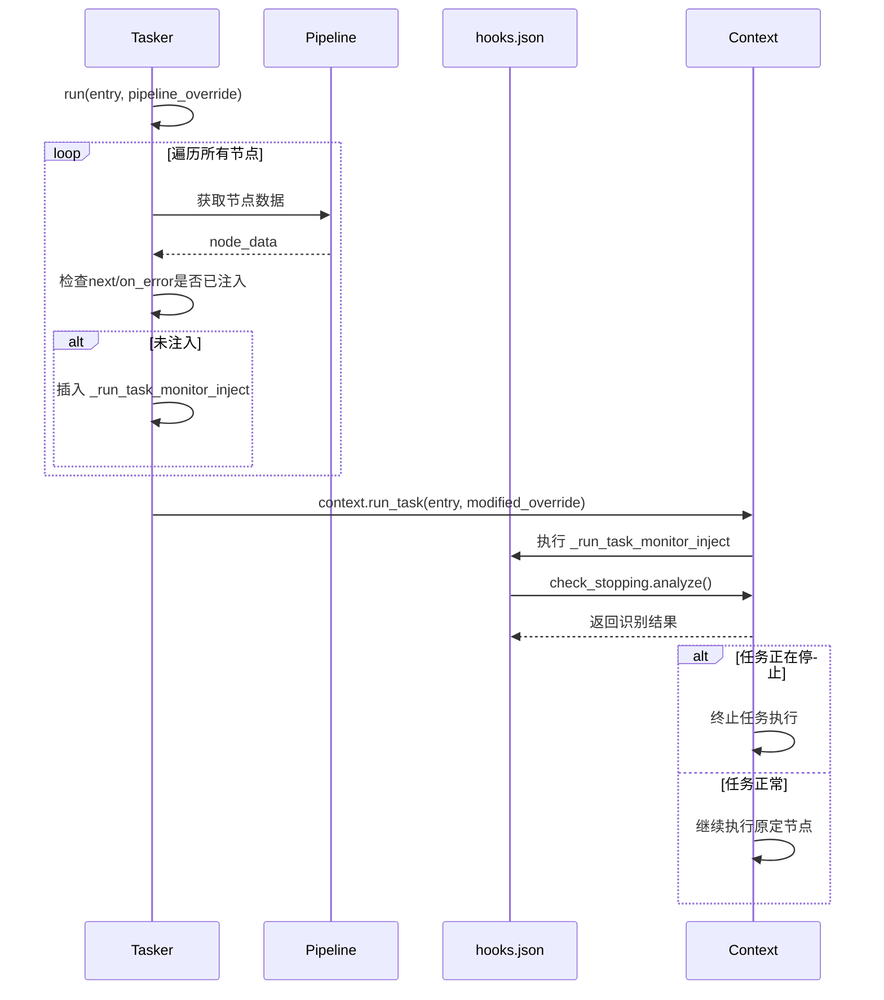

# 可复用模块与动态注入

<cite>
**本文档引用文件**  
- [懒加载返回主界面.json](file://assets/resource/base/pipeline/通用/懒加载返回主界面.json)
- [hooks.json](file://assets/resource/base/pipeline/其他/hooks.json)
- [分隔符.json](file://assets/resource/base/pipeline/其他/分隔符.json)
- [tasker.py](file://agent/customs/maahelper/tasker.py)
- [process_guard.py](file://agent/customs/global_func/process_guard.py)
- [pipeline_helper.py](file://agent/customs/global_func/pipeline_helper.py)
- [启动游戏.json](file://assets/resource/base/pipeline/日常任务/启动游戏.json)
- [领取奖励.json](file://assets/resource/base/pipeline/日常任务/领取奖励.json)
</cite>

## 目录
1. [引言](#引言)
2. [通用模块设计理念与工程价值](#通用模块设计理念与工程价值)
3. [hooks.json动态注入机制分析](#hooks.json动态注入机制分析)
4. [分隔符.json的视觉与逻辑划分作用](#分隔符.json的视觉与逻辑划分作用)
5. [模块调用链与配置复用机制](#模块调用链与配置复用机制)
6. [结论](#结论)

## 引言

本项目基于MaaFramework构建，旨在通过自动化技术实现对《嘟嘟脸恶作剧》游戏的日常任务管理。系统采用模块化设计思想，通过可复用组件和动态注入机制提升配置灵活性与维护效率。核心设计理念是将高频使用的功能抽象为独立模块，结合自定义识别与动作注入技术，实现跨任务的逻辑复用和流程控制。本文档将深入分析“懒加载返回主界面”、“hooks.json动态注入”和“分隔符.json”等关键模块的设计原理与工程价值，揭示其如何通过代码调用链被其他流水线引用，从而提升整体系统的配置复用率与灵活性。

## 通用模块设计理念与工程价值

### 懒加载返回主界面的高效导航实现

“懒加载返回主界面”模块是一种优化的导航策略，其核心理念是按需识别、逐步确认，避免一次性加载所有识别节点带来的性能开销。该模块通过一系列轻量级的OCR识别节点，从特定UI元素的存在与否来判断当前所处界面，从而决定后续导航路径。

该模块的工程价值体现在三个方面：首先，通过将复杂的界面状态判断分解为多个简单的OCR识别步骤，降低了单次识别的计算复杂度；其次，采用“懒加载”策略，只有在前一个节点识别成功后才会继续执行后续节点，有效减少了不必要的图像处理操作；最后，模块化的设计使得该导航逻辑可以被多个任务流水线复用，避免了重复配置。

**图表来源**
- [懒加载返回主界面.json](file://assets/resource/base/pipeline/通用/懒加载返回主界面.json)

**本节来源**
- [懒加载返回主界面.json](file://assets/resource/base/pipeline/通用/懒加载返回主界面.json)

## hooks.json动态注入机制分析

### 动态注入机制原理

`hooks.json`文件定义了一个名为`_run_task_monitor_inject`的特殊节点，该节点采用自定义识别（Custom Recognition）方式，调用名为`check_stopping`的识别器。其核心作用是在每个任务节点执行前，动态注入一个任务停止状态的检测逻辑。

该机制的实现依赖于`tasker.py`中的`run`方法。当执行`Tasker.run()`时，系统会遍历所有节点的`next`和`on_error`字段，检查是否已注入`_run_task_monitor_inject`节点。如果未注入，则在列表开头插入该节点。这种设计确保了无论任务流程如何变化，系统都能在每个执行步骤前进行一次停止状态检查。

**图表来源**
- [hooks.json](file://assets/resource/base/pipeline/其他/hooks.json)
- [tasker.py](file://agent/customs/maahelper/tasker.py)

**本节来源**
- [hooks.json](file://assets/resource/base/pipeline/其他/hooks.json)
- [tasker.py](file://agent/customs/maahelper/tasker.py)
- [process_guard.py](file://agent/customs/global_func/process_guard.py)

### 任务前后自定义逻辑插入能力

`hooks.json`的动态注入机制为系统提供了强大的扩展能力。通过在`process_guard.py`中定义的`on_task_start`和`on_task_stop`等自定义动作，系统可以在任务开始前执行初始化操作（如记录开始时间、发送通知），在任务停止时执行清理操作（如资源释放、状态保存）。

更重要的是，`check_stopping`识别器的实现使得系统能够实时响应外部停止指令。每当`_run_task_monitor_inject`节点被触发时，`CheckStopping.analyze()`方法会检查`context.tasker.stopping`标志位。如果该标志位为真，识别器返回成功，导致任务流程跳转到错误处理分支，最终实现优雅的任务终止。这种机制将任务控制逻辑与业务逻辑解耦，提高了系统的健壮性和响应性。

## 分隔符.json的视觉与逻辑划分作用

### 视觉与逻辑阶段划分

`分隔符.json`文件定义了三个具有特殊`focus`属性的节点：`可连续任务分隔符`、`独立任务分隔符`和`新增任务分隔符`。这些节点本身不执行任何实际操作，其主要作用是通过`focus`字段向用户界面发送通知消息。

在视觉上，这些分隔符在任务执行日志中以醒目的文本形式呈现，清晰地标示出不同任务阶段的边界。例如，“—— 即将执行可连续任务！——”这一提示让用户明确知晓接下来将执行一系列可重复的任务。这种视觉划分有助于用户理解自动化流程的执行进度和结构。

在逻辑上，这些分隔符节点作为流程中的“路标”，为任务流水线提供了结构化的组织方式。通过在不同任务组之间插入相应的分隔符，开发者可以清晰地表达任务的组织逻辑，使得复杂的任务序列更易于理解和维护。

**图表来源**
- [分隔符.json](file://assets/resource/base/pipeline/其他/分隔符.json)

**本节来源**
- [分隔符.json](file://assets/resource/base/pipeline/其他/分隔符.json)

## 模块调用链与配置复用机制

### 模块引用与调用链分析

可复用模块通过多种方式被其他流水线引用，形成复杂的调用链。以“启动游戏”任务为例，其执行流程中多次引用了通用模块：

1.  **直接引用**：在`启动游戏.json`的`启动游戏_启动游戏`节点中，`next`字段直接引用了`启动游戏_连续识别主界面`等通用识别节点。
2.  **自定义动作调用**：在`领取奖励.json`的`领取奖励_开始`节点中，通过`custom_action: "on_task_start"`调用了`process_guard.py`中定义的全局钩子，触发了`hooks.json`的注入逻辑。
3.  **参数化复用**：`pipeline_helper.py`中的`Run`类提供了一个通用的`run`动作，允许其他任务通过传递`entry`参数来启动任意子任务，实现了任务间的嵌套调用。

这种多层次的引用机制构建了一个灵活的模块化架构。核心的导航、状态检测和通知模块被集中管理，而具体的业务任务只需关注其特有的逻辑，通过引用和组合这些通用模块来构建完整的执行流程。

### 配置复用率与灵活性提升

通过上述模块化设计，系统实现了极高的配置复用率和灵活性：

-   **复用率提升**：像“返回主界面”、“启动游戏”这类高频操作被抽象为独立模块，被数十个日常任务所共享，避免了在每个任务中重复配置相同的点击和识别逻辑。
-   **维护效率提高**：当游戏UI发生变化时，只需修改对应的通用模块（如更新OCR识别区域），所有引用该模块的任务都会自动生效，无需逐一修改。
-   **灵活性增强**：动态注入机制允许在不修改原有任务配置的情况下，全局性地添加新的监控或控制逻辑。例如，可以通过修改`hooks.json`来增强任务的停止响应能力，而无需改动任何业务流水线。

## 结论

本项目通过精心设计的可复用模块和动态注入机制，构建了一个高效、灵活且易于维护的自动化系统。`懒加载返回主界面`模块体现了按需加载的优化思想，`hooks.json`的动态注入机制实现了任务控制逻辑的全局统一，而`分隔符.json`则提供了清晰的流程可视化。这些模块通过复杂的调用链相互关联，共同支撑起整个任务流水线系统，显著提升了配置的复用率和系统的整体灵活性。这种架构设计不仅适用于当前的游戏自动化场景，也为其他需要复杂流程控制的自动化项目提供了有价值的参考。