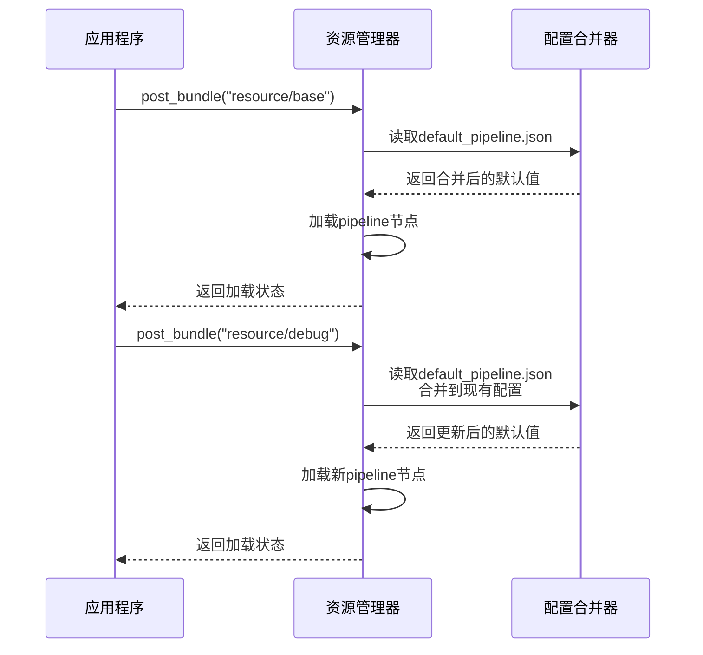
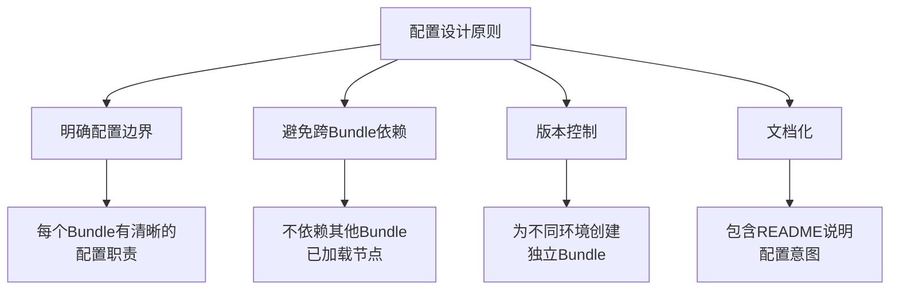

# 多Bundle配置合并规则

<cite>
**本文档引用的文件**  
- [default_pipeline.json](file://assets/resource/base/default_pipeline.json)
- [merge_pipeline.py](file://ci/merge_pipeline.py)
- [3.1-任务流水线协议.md](file://instructions/maafw-guide/3.1-任务流水线协议.md)
- [2.2-集成接口一览.md](file://instructions/maafw-guide/2.2-集成接口一览.md)
- [2.3-回调协议.md](file://instructions/maafw-guide/2.3-回调协议.md)
- [check_resource.py](file://check_resource.py)
- [main.py](file://agent/main.py)
</cite>

## 目录
1. [简介](#简介)
2. [配置合并机制](#配置合并机制)
3. [加载顺序与优先级](#加载顺序与优先级)
4. [技术实现细节](#技术实现细节)
5. [最佳实践建议](#最佳实践建议)
6. [风险提示](#风险提示)
7. [结论](#结论)

## 简介

本系统支持通过多个资源包（Bundle）加载任务流水线配置。当加载多个Bundle时，系统会合并它们的`default_pipeline.json`配置文件，但已加载的任务节点不会被刷新。这种设计确保了配置的稳定性和可预测性，同时也带来了一些需要注意的配置优先级问题。

**Section sources**
- [3.1-任务流水线协议.md](file://instructions/maafw-guide/3.1-任务流水线协议.md)

## 配置合并机制

### 配置文件结构

`default_pipeline.json`文件位于每个Bundle的根目录下，与`pipeline`文件夹同级。该文件用于为所有节点和特定算法/动作类型设置默认参数，减少重复配置。

```json
{
    "Default": {
        "timeout": 30000,
        "pre_delay": 600
    }
}
```

**Diagram sources**
- [default_pipeline.json](file://assets/resource/base/default_pipeline.json)

### 合并规则

当依次加载多个Bundle时，各Bundle的`default_pipeline.json`会按顺序进行字典合并（dict merge），后加载的同名字段会覆盖先加载的。

**关键特性：**
- **字段覆盖**：后加载Bundle中的同名配置字段会覆盖先加载的
- **节点不变性**：已加载的节点不会被后续Bundle的`default_pipeline.json`影响
- **一次性继承**：每个节点在首次加载时使用当时的合并后默认值，之后不再变化

**Section sources**
- [3.1-任务流水线协议.md](file://instructions/maafw-guide/3.1-任务流水线协议.md)

## 加载顺序与优先级

### 参数继承优先级

参数的优先级从高到低为：
1. 节点中直接定义的参数
2. `default_pipeline.json`中对应算法/动作类型的默认参数
3. `default_pipeline.json`中`Default`对象的默认参数
4. 框架内置的默认值

### 实际加载案例

考虑以下加载顺序案例：

```cpp
MaaResourcePostPath(resource, "resource/base");   // base 节点使用 rate_limit: 2000
MaaResourcePostPath(resource, "resource/debug");  // debug 节点使用 rate_limit: 100
```

**加载过程：**
1. 加载`Bundle_Base`：
   - 读取`Bundle_Base/default_pipeline.json`：`{ "Default": { "rate_limit": 2000 } }`
   - 加载`Bundle_Base/pipeline/main.json`中的节点，使用`rate_limit: 2000`
2. 加载`Bundle_Debug`：
   - 读取`Bundle_Debug/default_pipeline.json`：`{ "Default": { "rate_limit": 100 } }`（覆盖默认值）
   - 加载`Bundle_Debug/pipeline/debug.json`中的节点，使用`rate_limit: 100`

加载后，`base` Bundle的节点保持`rate_limit: 2000`，`debug` Bundle的节点使用`rate_limit: 100`。

```mermaid
graph TD
A[开始加载] --> B[加载Bundle_Base]
B --> C[读取Base的default_pipeline.json]
C --> D[加载Base的节点配置]
D --> E[加载Bundle_Debug]
E --> F[读取Debug的default_pipeline.json<br/>覆盖同名字段]
F --> G[加载Debug的节点配置]
G --> H[完成加载]
style D stroke:#f66,stroke-width:2px
style G stroke:#66f,stroke-width:2px
note right of D: 已加载的节点配置<br/>不再受后续影响
note right of G: 新加载的节点使用<br/>最新的默认值
```

**Diagram sources**
- [3.1-任务流水线协议.md](file://instructions/maafw-guide/3.1-任务流水线协议.md)
- [2.2-集成接口一览.md](file://instructions/maafw-guide/2.2-集成接口一览.md)

**Section sources**
- [3.1-任务流水线协议.md](file://instructions/maafw-guide/3.1-任务流水线协议.md)
- [2.2-集成接口一览.md](file://instructions/maafw-guide/2.2-集成接口一览.md)

## 技术实现细节

### 资源加载流程

系统通过`MaaResourcePostBundle`接口加载Bundle资源，加载过程如下：



**Diagram sources**
- [2.2-集成接口一览.md](file://instructions/maafw-guide/2.2-集成接口一览.md)
- [2.3-回调协议.md](file://instructions/maafw-guide/2.3-回调协议.md)

### 配置合并工具

`ci/merge_pipeline.py`脚本负责合并pipeline目录下的所有JSON文件：

```python
def merge_json_files(pipeline_dir):
    """合并pipeline目录下所有.json文件到nodes.json"""
    merged_data = {}
    
    def collect_json(directory):
        for item in directory.iterdir():
            if item.is_dir():
                collect_json(item)
            elif item.suffix == ".json":
                with open(item, "r", encoding="utf-8") as f:
                    data = json.load(f)
                    if isinstance(data, dict):
                        merged_data.update(data)
    
    collect_json(pipeline_dir)
    
    # 写入合并后的nodes.json
    nodes_file = pipeline_dir / "nodes.json"
    with open(nodes_file, "w", encoding="utf-8") as f:
        json.dump(merged_data, f, ensure_ascii=False, indent=4)
```

**Section sources**
- [merge_pipeline.py](file://ci/merge_pipeline.py)

## 最佳实践建议

### 分离特殊配置

可将特殊配置的节点单独组织到一个Bundle，配置专用的`default_pipeline.json`，实现配置隔离。

**推荐做法：**
```cpp
// 将调试相关的节点放在独立的Bundle中
MaaResourcePostPath(resource, "resource/base");   // 基础功能使用标准配置
MaaResourcePostPath(resource, "resource/debug");  // 调试功能使用调试配置
```

### 配置设计原则

1. **明确配置边界**：每个Bundle应有清晰的配置职责
2. **避免跨Bundle依赖**：不要依赖其他Bundle中已加载节点的配置
3. **版本控制**：为不同环境创建独立的Bundle配置
4. **文档化**：在Bundle中包含README说明其配置意图



**Diagram sources**
- [3.1-任务流水线协议.md](file://instructions/maafw-guide/3.1-任务流水线协议.md)

**Section sources**
- [3.1-任务流水线协议.md](file://instructions/maafw-guide/3.1-任务流水线协议.md)

## 风险提示

### 潜在风险

1. **配置不一致**：跨Bundle依赖已加载节点可能导致配置不一致
2. **预期外行为**：后加载的配置不会影响已加载节点，可能导致预期外的行为
3. **调试困难**：配置分散在多个Bundle中，增加调试难度

### 风险规避策略

- **避免反向依赖**：不要让后加载的Bundle依赖先加载Bundle中节点的配置状态
- **使用专用Bundle**：为特殊配置需求创建专用Bundle
- **配置验证**：使用`check_resource.py`工具验证配置完整性

```python
def check(dirs: List[Path]) -> bool:
    resource = Resource()
    for dir in dirs:
        status = resource.post_bundle(dir).wait().status
        if not status.succeeded:
            return False
    return True
```

**Section sources**
- [check_resource.py](file://check_resource.py)
- [3.1-任务流水线协议.md](file://instructions/maafw-guide/3.1-任务流水线协议.md)

## 结论

多Bundle配置合并机制通过后加载的`default_pipeline.json`覆盖先加载的同名字段，实现了配置的灵活管理。然而，已加载的任务节点不会被刷新的特性要求用户特别注意配置的加载顺序和依赖关系。

**核心要点总结：**
- 后加载的配置只影响后续加载的节点
- 已加载节点的配置是固定的，不受后续配置影响
- 推荐将特殊配置分离到独立Bundle中
- 避免跨Bundle依赖已加载节点的配置状态

通过遵循最佳实践，可以确保配置的一致性和系统的稳定性。