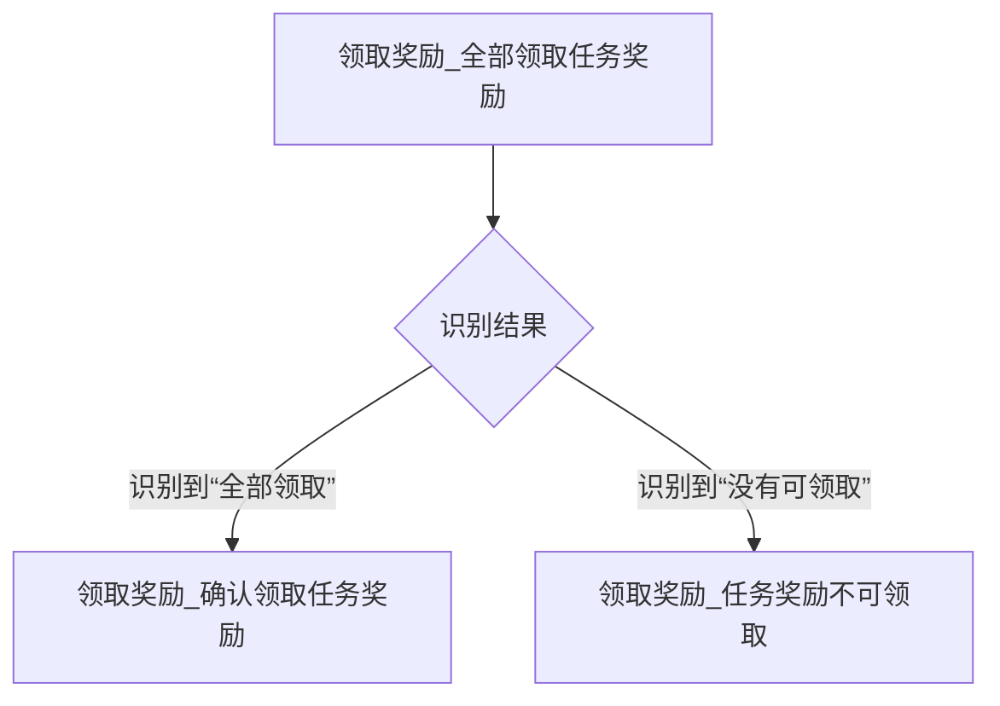

# 流水线文件组织结构

<cite>
**本文档引用的文件**
- [每日活动作战.json](file://assets/resource/base/pipeline/日常任务/每日活动作战.json)
- [领取奖励.json](file://assets/resource/base/pipeline/日常任务/领取奖励.json)
- [回到主界面.json](file://assets/resource/base/pipeline/通用/回到主界面.json)
- [启动游戏.json](file://assets/resource/base/pipeline/日常任务/启动游戏.json)
- [圣团巡礼.json](file://assets/resource/base/pipeline/日常任务/圣团巡礼.json)
- [快捷启动.json](file://assets/resource/base/pipeline/通用/快捷启动.json)
- [hooks.json](file://assets/resource/base/pipeline/其他/hooks.json)
- [分隔符.json](file://assets/resource/base/pipeline/其他/分隔符.json)
- [说明.json](file://assets/resource/base/pipeline/其他/说明.json)
- [activity_daily.md](file://descs/daily/activity_daily.md)
- [start_game.md](file://descs/daily/start_game.md)
- [pipeline_helper.py](file://agent/customs/global_func/pipeline_helper.py)
- [activity.py](file://agent/customs/special_treat/activity.py)
</cite>

## 目录
1. [引言](#引言)
2. [流水线配置文件的目录分类逻辑与组织原则](#流水线配置文件的目录分类逻辑与组织原则)
3. [功能场景与文件夹划分依据](#功能场景与文件夹划分依据)
4. [JSON文件结构共性分析](#json文件结构共性分析)
5. [分类管理对可维护性与可读性的提升](#分类管理对可维护性与可读性的提升)
6. [命名规范与路径约定](#命名规范与路径约定)
7. [新增或修改配置文件的指导](#新增或修改配置文件的指导)
8. [结论](#结论)

## 引言

本项目中的流水线配置文件通过清晰的目录结构和统一的命名规范，实现了自动化任务的高效组织与管理。这些配置文件位于 `assets/resource/base/pipeline/` 目录下，按照功能场景划分为“日常任务”、“特殊活动”、“通用”和“其他”等子目录。每个 JSON 文件定义了一个具体的自动化流程，包含一系列节点（Node），每个节点描述了识别方式、执行动作、前后延迟、跳转逻辑等信息。通过这种结构化的方式，开发者可以快速理解、维护和扩展自动化任务。

## 流水线配置文件的目录分类逻辑与组织原则

流水线配置文件的组织遵循功能导向和复用优先的原则，主要分为四个层级目录：**日常任务**、**特殊活动**、**通用** 和 **其他**。这种分类方式不仅便于用户快速定位所需功能，也极大提升了代码的可维护性和可读性。

- **日常任务**：存放高频执行、周期性强的自动化任务，如每日采购、领取邮件、启动游戏等。这些任务通常具有固定的执行流程和明确的起止条件。
- **特殊活动**：存放与限时活动相关的任务，如“圣团巡礼”、“巅峰对决”等。这类任务通常在活动期间启用，活动结束后可能被禁用或删除。
- **通用**：存放可被多个任务复用的基础功能模块，如“回到主界面”、“速战”等。这些模块通过自定义动作（Custom Action）被其他任务调用，避免了代码重复。
- **其他**：存放辅助性或元数据性质的文件，如 `hooks.json`（注入全局钩子）、`分隔符.json`（任务分组标记）、`说明.json`（注释说明）等，用于增强配置的可读性和功能性。

这种分层结构确保了配置文件的高内聚、低耦合，使得每个任务的职责清晰，易于独立开发和测试。

**Section sources**
- [每日活动作战.json](file://assets/resource/base/pipeline/日常任务/每日活动作战.json)
- [领取奖励.json](file://assets/resource/base/pipeline/日常任务/领取奖励.json)
- [回到主界面.json](file://assets/resource/base/pipeline/通用/回到主界面.json)
- [启动游戏.json](file://assets/resource/base/pipeline/日常任务/启动游戏.json)
- [圣团巡礼.json](file://assets/resource/base/pipeline/日常任务/圣团巡礼.json)
- [快捷启动.json](file://assets/resource/base/pipeline/通用/快捷启动.json)
- [hooks.json](file://assets/resource/base/pipeline/其他/hooks.json)
- [分隔符.json](file://assets/resource/base/pipeline/其他/分隔符.json)
- [说明.json](file://assets/resource/base/pipeline/其他/说明.json)

## 功能场景与文件夹划分依据

各文件夹的划分依据主要基于任务的执行频率、生命周期和复用性。

### 日常任务
“日常任务”文件夹中的任务是用户每日必执行的自动化流程，具有高度的规律性和稳定性。例如：
- `启动游戏.json`：负责从任意状态启动游戏并进入主界面，处理公告、登录奖励等弹窗。
- `领取奖励.json`：集中处理任务奖励、通行证奖励等的领取逻辑。
- `每日活动作战.json`：执行每日活动的速战流程。

这些任务通常在每日自动化脚本的开头或中间执行，构成了自动化流程的主干。

### 特殊活动
“特殊活动”文件夹中的任务与游戏内的限时活动绑定，生命周期较短。例如 `圣团巡礼.json` 实现了圣团巡礼活动的完整流程，包括进入活动、打扫房间、领取奖励等。这类任务的设计考虑了活动的临时性，便于在活动结束后快速下线或归档。

### 通用
“通用”文件夹中的任务是基础工具类模块，被多个上层任务所依赖。例如：
- `回到主界面.json`：提供一个标准化的“返回主界面”流程，被几乎所有任务在结束时调用。
- `快捷启动.json`：定义了快捷方式映射，如将“返回主界面”映射到“返回主界面_开始”节点，简化了任务调用。

通过将这些通用逻辑抽离，避免了在每个任务中重复编写相同的返回逻辑，显著提升了代码的复用率。

### 其他
“其他”文件夹存放非核心流程的辅助文件：
- `hooks.json`：注入全局监控逻辑，如 `_run_task_monitor_inject` 用于检查任务是否被手动停止。
- `分隔符.json`：在任务列表中插入视觉分隔符，如“即将执行可连续任务！”，提升用户界面的可读性。
- `说明.json`：提供注释性节点，用于在流程中添加说明信息。

**Section sources**
- [每日活动作战.json](file://assets/resource/base/pipeline/日常任务/每日活动作战.json)
- [领取奖励.json](file://assets/resource/base/pipeline/日常任务/领取奖励.json)
- [启动游戏.json](file://assets/resource/base/pipeline/日常任务/启动游戏.json)
- [圣团巡礼.json](file://assets/resource/base/pipeline/日常任务/圣团巡礼.json)
- [回到主界面.json](file://assets/resource/base/pipeline/通用/回到主界面.json)
- [快捷启动.json](file://assets/resource/base/pipeline/通用/快捷启动.json)
- [hooks.json](file://assets/resource/base/pipeline/其他/hooks.json)
- [分隔符.json](file://assets/resource/base/pipeline/其他/分隔符.json)
- [说明.json](file://assets/resource/base/pipeline/其他/说明.json)

## JSON文件结构共性分析

所有流水线配置文件遵循统一的 JSON 结构设计模式，核心节点包含 `Task`、`Description` 和 `Next` 等关键字段。

### Task（任务节点）
每个 JSON 文件由多个任务节点构成，节点名称通常采用“任务名_功能描述”的命名方式，如 `领取奖励_进入任务界面`。每个节点包含以下核心属性：
- `action`：定义执行动作，如 `Click`、`DoNothing`、`StartApp` 或 `Custom`（自定义动作）。
- `recognition`：定义识别方式，如 `OCR`（文字识别）、`TemplateMatch`（模板匹配）或 `DirectHit`（直接命中）。
- `next`：定义成功执行后的下一个节点，支持数组形式以实现分支跳转。
- `on_error`：定义识别或执行失败后的错误处理节点。
- `pre_delay` / `post_delay`：定义执行前后的延迟时间。

### Description（描述信息）
虽然 JSON 文件本身不直接包含描述字段，但项目通过 `descs/` 目录下的 Markdown 文件提供了详细的功能说明。例如 `descs/daily/activity_daily.md` 文件描述了“每日活动作战”任务的功能、起止界面和使用建议。此外，节点中的 `focus` 字段也起到了运行时日志的作用，如 `> 进入任务界面`，便于调试和监控。

### Next节点设计模式
`next` 字段的设计体现了流程的线性与分支特性。对于线性流程，`next` 指向单一节点；对于分支流程，则通过 `on_error` 或条件识别实现跳转。例如在 `领取奖励.json` 中，`领取奖励_全部领取任务奖励` 节点的 `next` 包含 `领取奖励_确认领取任务奖励` 和 `领取奖励_任务奖励不可领取`，根据 OCR 识别结果决定后续流程。

**Diagram sources**
- [领取奖励.json](file://assets/resource/base/pipeline/日常任务/领取奖励.json)

**Section sources**
- [每日活动作战.json](file://assets/resource/base/pipeline/日常任务/每日活动作战.json)
- [领取奖励.json](file://assets/resource/base/pipeline/日常任务/领取奖励.json)
- [启动游戏.json](file://assets/resource/base/pipeline/日常任务/启动游戏.json)
- [activity_daily.md](file://descs/daily/activity_daily.md)
- [start_game.md](file://descs/daily/start_game.md)

## 分类管理对可维护性与可读性的提升

通过将任务按功能分类，项目实现了显著的可维护性与可读性提升。

### 可维护性
- **模块化设计**：通用功能（如“回到主界面”）被抽离为独立模块，当需要修改返回逻辑时，只需修改 `回到主界面.json` 文件，所有依赖它的任务自动生效，避免了“一处修改，多处复制”的问题。
- **独立更新**：特殊活动任务与日常任务分离，使得活动任务的上线和下线不会影响日常流程的稳定性。
- **错误隔离**：每个任务的配置独立，一个任务的配置错误不会直接影响其他任务的执行。

### 可读性
- **目录即文档**：用户通过浏览 `pipeline/` 目录即可大致了解系统支持的所有功能。
- **命名规范**：节点命名采用“任务名_功能描述”模式，如 `启动游戏_检测公告界面`，直观地表达了该节点的用途。
- **辅助文件增强**：`分隔符.json` 和 `说明.json` 提供了流程中的视觉提示和注释，使复杂的自动化流程更易于理解。

## 命名规范与路径约定

项目遵循严格的命名规范和路径约定，确保配置的一致性和可预测性。

### 命名规范
- **文件夹命名**：使用中文命名，如“日常任务”、“特殊活动”，语义清晰，便于非技术用户理解。
- **文件命名**：使用中文描述任务功能，如 `领取邮件.json`、`清紫糖.json`，避免使用缩写或拼音。
- **节点命名**：采用“任务名_功能描述”格式，如 `领取奖励_进入任务界面`，确保每个节点的职责明确。

### 路径约定
- 所有流水线配置文件统一存放于 `assets/resource/base/pipeline/` 目录下。
- 子目录按功能划分，路径结构为 `pipeline/<分类>/<任务名>.json`。
- 相关描述文件存放于 `descs/` 目录下，路径结构为 `descs/<分类>/<任务名>.md`，与配置文件一一对应。

这种约定使得开发者可以快速定位和关联配置文件与描述文档。

**Section sources**
- [每日活动作战.json](file://assets/resource/base/pipeline/日常任务/每日活动作战.json)
- [领取奖励.json](file://assets/resource/base/pipeline/日常任务/领取奖励.json)
- [启动游戏.json](file://assets/resource/base/pipeline/日常任务/启动游戏.json)
- [回到主界面.json](file://assets/resource/base/pipeline/通用/回到主界面.json)
- [activity_daily.md](file://descs/daily/activity_daily.md)
- [start_game.md](file://descs/daily/start_game.md)

## 新增或修改配置文件的指导

开发者在新增或修改配置文件时应遵循以下步骤：

1. **确定分类**：根据新任务的性质，选择合适的目录（日常任务、特殊活动、通用等）。
2. **创建文件**：在对应目录下创建 `.json` 文件，文件名应准确描述任务功能。
3. **定义节点**：按照 `Task`、`Description`、`Next` 的设计模式，定义任务的各个节点。优先复用“通用”目录下的模块。
4. **添加描述**：在 `descs/` 目录下创建对应的 `.md` 文件，提供功能说明、起止界面和使用建议。
5. **测试验证**：通过实际运行验证任务流程的正确性和稳定性。
6. **错误处理**：为关键节点配置 `on_error` 处理逻辑，确保任务在异常情况下能优雅降级或重试。

例如，新增一个“领取体力”任务，应将其放入“日常任务”目录，文件命名为 `领取体力.json`，并在 `descs/daily/` 下创建 `claim_stamina.md` 描述文件。

**Section sources**
- [pipeline_helper.py](file://agent/customs/global_func/pipeline_helper.py)
- [activity.py](file://agent/customs/special_treat/activity.py)

## 结论

本项目的流水线配置文件通过科学的目录分类、统一的结构设计和严格的命名规范，构建了一个高效、可维护的自动化任务管理体系。通过将任务划分为“日常任务”、“特殊活动”、“通用”和“其他”四类，实现了功能的清晰分离和代码的高度复用。JSON 文件的共性结构确保了配置的一致性，而 `descs/` 目录下的描述文件则增强了文档的可读性。开发者在遵循既定规范的前提下，可以高效地新增或修改任务配置，确保系统的持续演进和稳定运行。