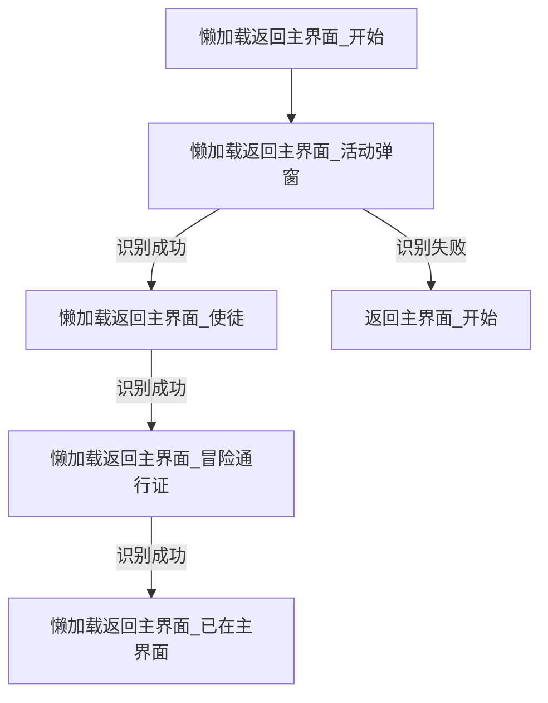
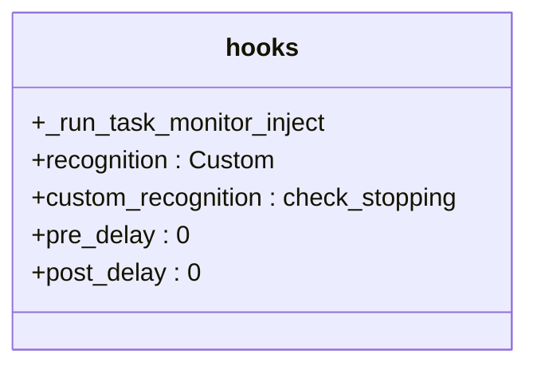

# 流水线配置管理

<cite>
**本文档引用文件**  
- [default_pipeline.json](file://assets/resource/base/default_pipeline.json)
- [领取邮件.json](file://assets/resource/base/pipeline/日常任务/领取邮件.json)
- [巅峰对决.json](file://assets/resource/base/pipeline/日常任务/巅峰对决.json)
- [回到主界面.json](file://assets/resource/base/pipeline/通用/回到主界面.json)
- [懒加载返回主界面.json](file://assets/resource/base/pipeline/通用/懒加载返回主界面.json)
- [hooks.json](file://assets/resource/base/pipeline/其他/hooks.json)
- [分隔符.json](file://assets/resource/base/pipeline/其他/分隔符.json)
</cite>

## 目录
1. [引言](#引言)
2. [配置文件组织结构](#配置文件组织结构)
3. [全局默认配置机制](#全局默认配置机制)
4. [多Bundle加载合并规则](#多bundle加载合并规则)
5. [可复用模块抽象原则](#可复用模块抽象原则)
6. [配置复用与简化策略](#配置复用与简化策略)
7. [结论](#结论)

## 引言
本文档系统阐述任务流水线的配置文件组织与管理策略，重点分析`assets/resource/base/pipeline`目录下各类JSON配置文件的结构设计、分类方式及复用机制。通过解析日常任务、特殊活动和通用模块的配置实例，说明如何通过全局默认参数设置实现配置简化，并探讨多Bundle加载时的合并规则与可复用模块的抽象原则。

## 配置文件组织结构
任务流水线的配置文件按照功能和用途进行分类组织，主要分为以下几类：

- **日常任务**：存放如“领取邮件.json”、“巅峰对决.json”等周期性执行的任务配置
- **通用模块**：包含可被多个任务复用的基础操作，如“回到主界面.json”、“懒加载返回主界面.json”
- **其他**：用于逻辑分组和动态注入的辅助配置，如“hooks.json”、“分隔符.json”

这种分类方式实现了配置的模块化管理，便于维护和扩展。

**Section sources**
- [领取邮件.json](file://assets/resource/base/pipeline/日常任务/领取邮件.json)
- [巅峰对决.json](file://assets/resource/base/pipeline/日常任务/巅峰对决.json)
- [回到主界面.json](file://assets/resource/base/pipeline/通用/回到主界面.json)
- [分隔符.json](file://assets/resource/base/pipeline/其他/分隔符.json)

## 全局默认配置机制
`default_pipeline.json`文件定义了流水线执行的全局默认参数，通过特定键名实现配置复用与简化：

```json
{
    "Default": {
        "timeout": 30000,
        "pre_delay": 600
    }
}
```

其中：
- **Default**：设置所有节点的默认超时时间和前置延迟
- **TemplateMatch**：可定义模板匹配的默认参数
- **Click**：可定义点击操作的默认行为

这些默认值会被所有任务节点继承，避免在每个配置文件中重复定义相同参数，显著简化了配置工作。

**Diagram sources**
- [default_pipeline.json](file://assets/resource/base/default_pipeline.json)

**Section sources**
- [default_pipeline.json](file://assets/resource/base/default_pipeline.json)

## 多Bundle加载合并规则
当系统加载多个配置Bundle时，遵循以下合并规则：

1. **后加载覆盖先加载**：相同键名的配置项，后加载的Bundle会覆盖先加载的值
2. **已加载节点不受影响**：一旦某个节点已被加载并解析，其配置不会因后续Bundle的加载而改变
3. **增量合并**：不同键名的配置项会进行合并，形成完整的配置集合

这一机制确保了配置的灵活性和可扩展性，同时保证了运行时的一致性和稳定性。

**Section sources**
- [default_pipeline.json](file://assets/resource/base/default_pipeline.json)

## 可复用模块抽象原则
通过“通用”文件夹中的配置文件，体现了可复用模块的抽象设计原则：

### 懒加载返回主界面.json
该配置实现了轻量级的主界面检测逻辑，通过OCR识别关键界面元素（如“使徒”、“冒险通行证”），并采用懒加载策略，在需要时才触发完整返回流程。



**Diagram sources**
- [懒加载返回主界面.json](file://assets/resource/base/pipeline/通用/懒加载返回主界面.json)
- [回到主界面.json](file://assets/resource/base/pipeline/通用/回到主界面.json)

### hooks.json实现动态注入
`hooks.json`文件通过自定义识别方式`check_stopping`，实现了运行时的任务监控注入功能，可在不修改主流程的情况下动态添加检查点。



**Diagram sources**
- [hooks.json](file://assets/resource/base/pipeline/其他/hooks.json)

### 分隔符.json进行逻辑分组
`分隔符.json`文件定义了不同类型任务的视觉分隔标识，如“可连续任务分隔符”、“独立任务分隔符”，用于在执行日志中清晰区分任务类别，提升可读性和调试效率。

**Section sources**
- [懒加载返回主界面.json](file://assets/resource/base/pipeline/通用/懒加载返回主界面.json)
- [回到主界面.json](file://assets/resource/base/pipeline/通用/回到主界面.json)
- [hooks.json](file://assets/resource/base/pipeline/其他/hooks.json)
- [分隔符.json](file://assets/resource/base/pipeline/其他/分隔符.json)

## 配置复用与简化策略
系统通过多层次的配置复用机制实现简化：

1. **全局默认值**：通过`Default`等键名设置通用参数
2. **模块化引用**：通用操作（如返回主界面）被抽象为独立配置文件供复用
3. **动态注入**：使用`hooks.json`等机制实现非侵入式功能扩展
4. **逻辑分组**：利用`分隔符.json`等配置提升可维护性

这些策略共同构成了一个高效、灵活且易于维护的配置管理体系。

**Section sources**
- [default_pipeline.json](file://assets/resource/base/default_pipeline.json)
- [回到主界面.json](file://assets/resource/base/pipeline/通用/回到主界面.json)
- [hooks.json](file://assets/resource/base/pipeline/其他/hooks.json)
- [分隔符.json](file://assets/resource/base/pipeline/其他/分隔符.json)

## 结论
本系统通过精心设计的配置文件组织结构和多层次的复用机制，实现了任务流水线配置的高效管理。`default_pipeline.json`提供的全局默认参数大幅简化了配置工作，多Bundle加载的合并规则确保了配置的灵活性，而“通用”模块的抽象设计则体现了高内聚、低耦合的软件工程原则。整体架构既满足了日常任务的自动化需求，又具备良好的可扩展性和可维护性。