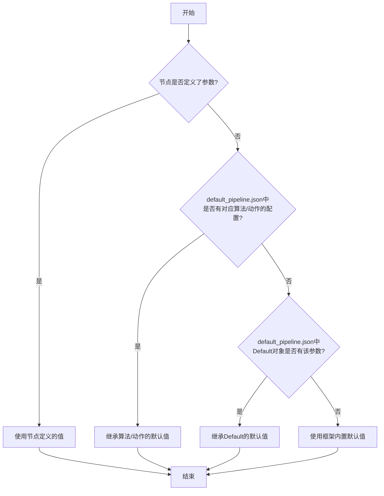
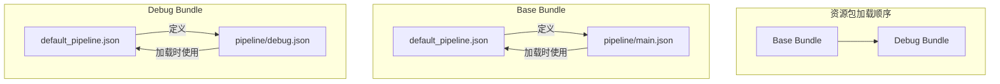

# 默认配置与参数复用

<cite>
**本文档引用文件**  
- [default_pipeline.json](file://assets/resource/base/default_pipeline.json)
- [领取奖励.json](file://assets/resource/base/pipeline/日常任务/领取奖励.json)
- [回到主界面.json](file://assets/resource/base/pipeline/通用/回到主界面.json)
- [maa_pi_config.json](file://assets/config/maa_pi_config.json)
- [3.1-任务流水线协议.md](file://instructions/maafw-guide/3.1-任务流水线协议.md)
- [interface.json](file://assets/interface.json)
- [merge_pipeline.py](file://ci/merge_pipeline.py)
</cite>

## 目录
1. [引言](#引言)
2. [Default、TemplateMatch、Click等顶层键名的语义含义](#defaulttemplatematchclick等顶层键名的语义含义)
3. [全局配置中的继承关系与优先级](#全局配置中的继承关系与优先级)
4. [通过默认参数减少重复定义，提升配置效率](#通过默认参数减少重复定义提升配置效率)
5. [任务节点未显式定义点击行为时的回退机制](#任务节点未显式定义点击行为时的回退机制)
6. [多资源包环境下的基础模板角色](#多资源包环境下的基础模板角色)
7. [总结](#总结)

## 引言

`default_pipeline.json` 是 MaaFramework 自动化框架中的核心配置文件，用于为所有任务节点和特定算法/动作类型设置默认参数。该文件在资源加载时自动读取，其配置作为基础默认值被所有节点继承，从而显著减少重复配置，提升维护效率。本文将深入解析该文件的核心作用与配置机制，阐述 `Default`、`TemplateMatch`、`Click` 等顶层键名的语义含义及其继承关系，并结合实例说明其在多资源包环境下的基础模板角色。

**Section sources**
- [3.1-任务流水线协议.md](file://instructions/maafw-guide/3.1-任务流水线协议.md)

## Default、TemplateMatch、Click等顶层键名的语义含义

`default_pipeline.json` 文件的配置结构由多个顶层键名构成，每个键名代表不同层级的默认配置作用域。

### Default 对象：通用字段的默认值

`Default` 对象用于设置所有任务节点通用的默认参数。这些参数适用于任何类型的节点，无论其使用何种识别算法或执行何种动作。常见的通用字段包括：
- `timeout`：识别超时时间（毫秒）
- `pre_delay`：识别到目标后，执行动作前的延迟（毫秒）
- `post_delay`：执行动作后，进入下一节点前的延迟（毫秒）
- `rate_limit`：识别速率限制（毫秒）

在本项目中，`default_pipeline.json` 的 `Default` 对象配置了 `timeout` 为 30000 毫秒，`pre_delay` 为 600 毫秒。这意味着，除非节点自身显式覆盖，否则所有节点都将继承这些值。

### TemplateMatch 对象：模板匹配算法的默认参数

以算法名称命名的对象（如 `TemplateMatch`、`OCR`、`FeatureMatch`）用于设置对应识别算法类型的默认参数。`TemplateMatch` 对象的配置会自动应用于所有使用模板匹配算法的节点。

其典型配置包括：
- `recognition`：指定识别算法类型为 `TemplateMatch`
- `threshold`：模板匹配的相似度阈值
- `method`：使用的 OpenCV 模板匹配算法模式

当一个节点的 `recognition` 字段设置为 `TemplateMatch` 时，它将继承 `default_pipeline.json` 中 `TemplateMatch` 对象的所有配置，除非该节点自身定义了同名参数。

### Click 对象：点击动作的默认参数

以动作名称命名的对象（如 `Click`、`Swipe`、`StartApp`）用于设置对应动作类型的默认参数。`Click` 对象的配置会自动应用于所有执行点击动作的节点。

其典型配置包括：
- `action`：指定动作为 `Click`
- `target`：点击的目标坐标或区域

当一个节点的 `action` 字段设置为 `Click` 时，它将继承 `default_pipeline.json` 中 `Click` 对象的所有配置，从而避免在每个点击节点中重复定义点击行为。

**Section sources**
- [default_pipeline.json](file://assets/resource/base/default_pipeline.json)
- [3.1-任务流水线协议.md](file://instructions/maafw-guide/3.1-任务流水线协议.md)

## 全局配置中的继承关系与优先级

`default_pipeline.json` 的核心机制在于其清晰的继承优先级。当一个任务节点需要确定某个参数的值时，系统会按照以下优先级从高到低进行查找：

1.  **节点中直接定义的参数**：优先级最高。如果节点自身定义了某个参数，则直接使用该值，完全忽略所有默认值。
2.  **`default_pipeline.json` 中对应算法/动作类型的默认参数**：次高优先级。如果节点未定义，但其使用的算法或动作类型在 `default_pipeline.json` 中有对应配置，则继承该配置。
3.  **`default_pipeline.json` 中 `Default` 对象的默认参数**：第三优先级。如果前两步均未找到，且 `Default` 对象中定义了该通用参数，则继承 `Default` 中的值。
4.  **框架内置的默认值**：最低优先级。如果以上所有层级均未定义，则使用 MaaFramework 框架本身提供的默认值。

这种“就近覆盖”的继承机制确保了配置的灵活性和可维护性。开发者可以在 `default_pipeline.json` 中设置合理的全局默认值，同时在特定节点中进行微调，而不会影响其他节点。



**Diagram sources**
- [3.1-任务流水线协议.md](file://instructions/maafw-guide/3.1-任务流水线协议.md)

## 通过默认参数减少重复定义，提升配置效率

`default_pipeline.json` 的主要价值在于通过参数复用，极大地提升了配置效率和可维护性。

### 减少重复配置

在没有 `default_pipeline.json` 的情况下，每个任务节点都必须完整地定义所有参数。例如，如果所有点击动作都希望有 600 毫秒的前置延迟，那么每个 `Click` 节点都必须显式写入 `"pre_delay": 600`。这不仅增加了配置文件的体积，也使得维护变得困难。

通过在 `default_pipeline.json` 的 `Default` 对象中统一设置 `"pre_delay": 600`，所有节点都可以省略这一行配置，从而将配置文件的复杂度从“每个节点都写”降低到“全局写一次”。

### 提升维护效率

当需要调整全局行为时，例如将所有节点的超时时间从 30 秒延长到 45 秒，只需修改 `default_pipeline.json` 中 `Default` 对象的 `timeout` 值即可。这一改动会自动应用到所有继承该默认值的节点，而无需逐个文件、逐个节点地进行修改。这不仅节省了大量时间，也避免了因遗漏修改而导致的不一致问题。

**Section sources**
- [default_pipeline.json](file://assets/resource/base/default_pipeline.json)
- [3.1-任务流水线协议.md](file://instructions/maafw-guide/3.1-任务流水线协议.md)

## 任务节点未显式定义点击行为时的回退机制

为了说明 `default_pipeline.json` 的回退机制，我们以 `领取奖励.json` 文件中的一个节点为例。

在 `领取奖励_从通行证返回` 节点中，其配置如下：
```json
"领取奖励_从通行证返回": {
    "action": {
        "param": {
            "target": [1236, 38, 0, 0]
        },
        "type": "Click"
    },
    "recognition": {
        "param": {},
        "type": "DirectHit"
    }
}
```
该节点明确指定了 `action` 为 `Click`，并定义了 `target` 坐标。然而，它并未定义 `pre_delay`、`post_delay` 或 `timeout` 等参数。

根据继承优先级：
1.  节点自身未定义 `pre_delay` 和 `timeout`。
2.  节点使用了 `Click` 动作，但 `default_pipeline.json` 中并未定义 `Click` 对象，因此无法从动作类型继承。
3.  节点未定义，但 `default_pipeline.json` 的 `Default` 对象中定义了 `timeout` 和 `pre_delay`。
4.  因此，该节点将继承 `Default` 对象中的 `timeout: 30000` 和 `pre_delay: 600`。

这表明，即使 `default_pipeline.json` 没有为 `Click` 动作设置专门的默认参数，节点依然可以通过 `Default` 对象获得通用参数，确保了配置的完整性。

**Section sources**
- [default_pipeline.json](file://assets/resource/base/default_pipeline.json)
- [领取奖励.json](file://assets/resource/base/pipeline/日常任务/领取奖励.json)

## 多资源包环境下的基础模板角色

在复杂的项目中，常常需要加载多个资源包（Bundle）。`default_pipeline.json` 在这种多资源包环境下扮演着基础模板的角色。

### 多 Bundle 加载行为

当依次加载多个资源包时，其 `default_pipeline.json` 文件会按加载顺序进行合并（字典合并）。后加载的资源包中的同名字段会覆盖先加载的。**关键点在于，已加载的节点不会被后续 Bundle 的 `default_pipeline.json` 影响**。每个节点在首次加载时，会使用当时已合并的默认值，之后其配置便固定不变。

### 最佳实践：配置隔离

这一机制支持一种最佳实践：将特殊配置的节点组织到独立的资源包中，并为其配置专用的 `default_pipeline.json`，从而实现配置隔离。

例如，可以有一个 `base` 资源包，其 `default_pipeline.json` 设置了常规的 `rate_limit`。同时，可以有一个 `debug` 资源包，其 `default_pipeline.json` 将 `rate_limit` 设置为一个极低的值以方便调试。当先加载 `base` 再加载 `debug` 时，`base` 包中的节点使用常规的 `rate_limit`，而 `debug` 包中的节点则使用调试用的低 `rate_limit`，两者互不影响。

在本项目中，`interface.json` 文件通过 `resource` 数组定义了资源包的路径，`merge_pipeline.py` 脚本负责将 `pipeline` 目录下的所有 JSON 文件合并，这为多资源包的管理提供了基础支持。



**Diagram sources**
- [interface.json](file://assets/interface.json)
- [merge_pipeline.py](file://ci/merge_pipeline.py)
- [3.1-任务流水线协议.md](file://instructions/maafw-guide/3.1-任务流水线协议.md)

## 总结

`default_pipeline.json` 是 MaaFramework 自动化配置体系的基石。通过 `Default`、`TemplateMatch`、`Click` 等顶层键名，它构建了一个层次分明的默认参数体系。其清晰的继承优先级（节点定义 > 算法/动作默认 > Default 通用默认 > 框架内置）确保了配置的灵活性和可预测性。该文件通过参数复用，显著减少了重复定义，提升了配置效率和维护性。在多资源包环境下，它作为基础模板，通过加载时的合并与隔离机制，支持了复杂项目的模块化配置管理。正确理解和使用 `default_pipeline.json`，是构建高效、可维护自动化任务的关键。

**Section sources**
- [3.1-任务流水线协议.md](file://instructions/maafw-guide/3.1-任务流水线协议.md)
- [default_pipeline.json](file://assets/resource/base/default_pipeline.json)