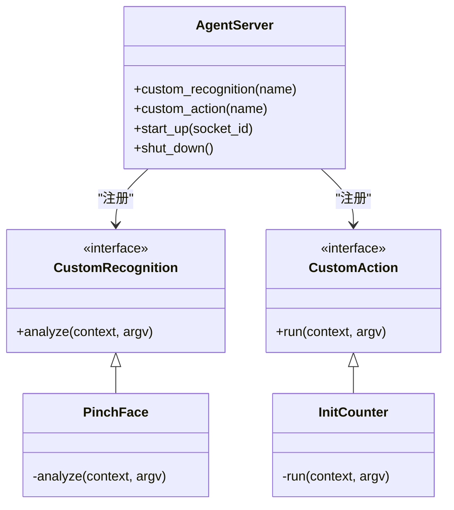
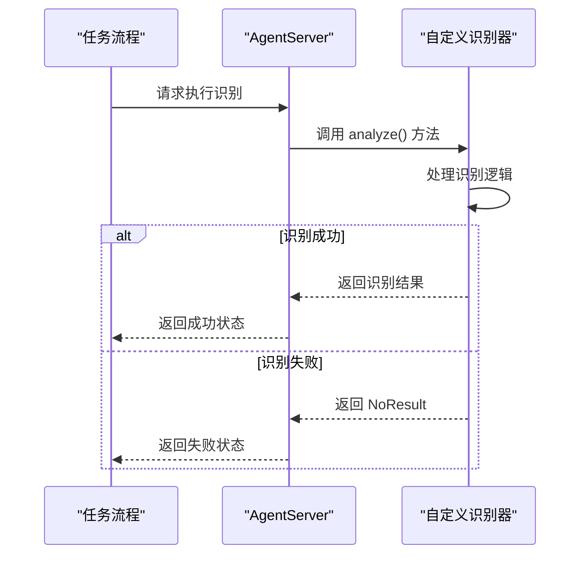
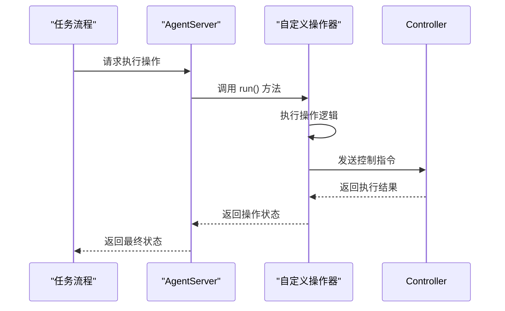
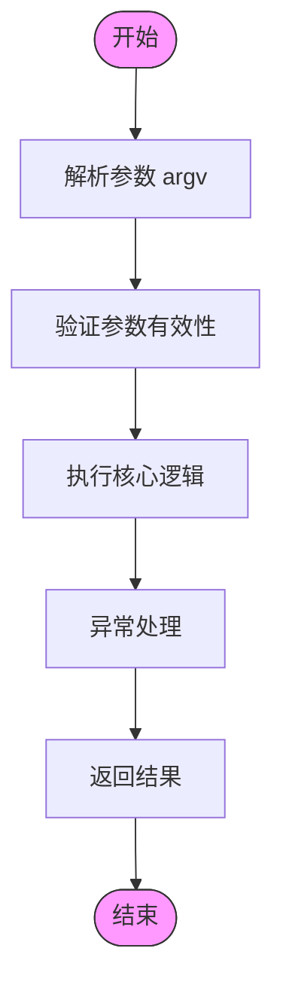

# 扩展机制与自定义开发

<cite>
**本文档引用文件**  
- [pinch_face.py](file://agent/customs/global_func/pinch_face.py)
- [peak_showdown.py](file://agent/customs/special_treat/peak_showdown.py)
- [counter.py](file://agent/customs/global_func/counter.py)
- [logic_enhance.py](file://agent/customs/global_func/logic_enhance.py)
- [process_guard.py](file://agent/customs/global_func/process_guard.py)
- [reco_helper.py](file://agent/customs/maahelper/reco_helper.py)
- [tasker.py](file://agent/customs/maahelper/tasker.py)
- [prompter.py](file://agent/customs/utils/prompter.py)
- [main.py](file://agent/main.py)
- [2.2-集成接口一览.md](file://instructions/maafw-guide/2.2-集成接口一览.md)
- [4.2-标准化接口设计.md](file://instructions/maafw-guide/4.2-标准化接口设计.md)
- [2.3-回调协议.md](file://instructions/maafw-guide/2.3-回调协议.md)
</cite>

## 目录
1. [扩展机制概述](#扩展机制概述)
2. [装饰器模式实现原理](#装饰器模式实现原理)
3. [自定义识别器开发范式](#自定义识别器开发范式)
4. [自定义操作器开发范式](#自定义操作器开发范式)
5. [上下文传递与参数处理](#上下文传递与参数处理)
6. [实际案例分析](#实际案例分析)
7. [调试技巧与常见陷阱](#调试技巧与常见陷阱)

## 扩展机制概述

MaaDuDuL通过基于装饰器模式的扩展机制，实现了灵活的自定义功能开发体系。该机制允许开发者通过简单的装饰器语法注册自定义识别器和操作器，从而扩展MAA框架的核心功能。系统在启动时自动扫描并注册所有通过`@AgentServer.custom_recognition`和`@AgentServer.custom_action`装饰的类，将其集成到任务执行流程中。

**文档来源**  
- [main.py](file://agent/main.py#L1-L48)

## 装饰器模式实现原理

MaaDuDuL的扩展机制基于装饰器模式实现，通过`AgentServer`类提供的`custom_recognition`和`custom_action`装饰器，将自定义功能注册到MAA框架中。这种设计模式实现了关注点分离，使开发者能够专注于业务逻辑的实现，而无需关心底层的注册和调用机制。

装饰器模式的核心优势在于：
- **非侵入性**：无需修改原有代码即可扩展功能
- **可组合性**：多个装饰器可以按需组合使用
- **运行时动态性**：功能注册在运行时完成，支持热插拔



**图示来源**  
- [agent_server.py](file://maa/agent/agent_server.py)
- [custom_recognition.py](file://maa/custom_recognition.py)
- [custom_action.py](file://maa/custom_action.py)

## 自定义识别器开发范式

自定义识别器通过继承`CustomRecognition`基类并实现`analyze`方法来定义。`@AgentServer.custom_recognition`装饰器负责将类注册为可调用的识别功能，其参数指定了在任务流程中引用该功能的名称。

识别器的核心方法`analyze`接收两个参数：
- `context`: MAA上下文对象，提供运行时环境和工具
- `argv`: 自定义识别参数，包含配置信息和输入数据

返回值为`CustomRecognition.AnalyzeResult`类型，包含识别结果和附加信息。



**图示来源**  
- [pinch_face.py](file://agent/customs/global_func/pinch_face.py#L15-L55)
- [peak_showdown.py](file://agent/customs/special_treat/peak_showdown.py#L51-L96)

## 自定义操作器开发范式

自定义操作器通过继承`CustomAction`基类并实现`run`方法来定义。`@AgentServer.custom_action`装饰器将类注册为可调用的操作功能，其参数指定了在任务流程中引用该功能的名称。

操作器的核心方法`run`接收两个参数：
- `context`: MAA上下文对象，提供运行时环境和控制接口
- `argv`: 运行参数，包含配置信息和上下文数据

返回值为布尔类型，指示操作是否成功执行。



**图示来源**  
- [counter.py](file://agent/customs/global_func/counter.py#L21-L42)

## 上下文传递与参数处理

MaaDuDuL通过`trans_arg`参数实现上下文信息的传递，确保自定义功能能够访问必要的运行时数据。系统提供了`ParamAnalyzer`工具类来解析和处理传入的参数，支持多种参数格式和别名。

### 参数解析机制

`ParamAnalyzer`类封装了参数解析逻辑，支持以下特性：
- **多别名支持**：同一参数可配置多个别名（如`key`和`k`）
- **默认值设置**：为参数提供合理的默认值
- **类型转换**：自动进行数据类型转换和验证

### 回调函数签名规范

自定义功能的回调函数必须遵循严格的签名规范：
- 识别器：`analyze(self, context: Context, argv: CustomRecognition.AnalyzeArg) -> CustomRecognition.AnalyzeResult`
- 操作器：`run(self, context: Context, argv: CustomAction.RunArg) -> bool`



**图示来源**  
- [param_analyzer.py](file://agent/customs/maahelper/argv_analyzer.py)
- [prompter.py](file://agent/customs/utils/prompter.py#L34-L54)

## 实际案例分析

### 捏脸功能实现（pinch_face.py）

`PinchFace`识别器实现了游戏内捏脸功能的自动化。通过识别面部特征，自动执行左右捏脸动作。该实现展示了如何结合OCR识别和点击操作来完成复杂交互。

**代码路径**  
- [pinch_face.py](file://agent/customs/global_func/pinch_face.py#L15-L55)

### 巅峰对决对手选择（peak_showdown.py）

`PickOpponent`识别器在巅峰对决中选择最优对手。通过解析战斗力文本，选择战斗力最低的对手，展示了文本解析和数值比较的实现方法。

**代码路径**  
- [peak_showdown.py](file://agent/customs/special_treat/peak_showdown.py#L51-L96)

### 计数器管理（counter.py）

`InitCounter`操作器实现了计数器的初始化功能。通过参数配置，可以创建或重置计数器，设置初始值和最大值，展示了状态管理的实现模式。

**代码路径**  
- [counter.py](file://agent/customs/global_func/counter.py#L21-L42)

## 调试技巧与常见陷阱

### 调试技巧

1. **日志输出**：使用`Prompter.log`和`Prompter.error`进行结构化日志输出
2. **异常处理**：在关键操作周围添加try-catch块，确保异常不会导致服务崩溃
3. **状态检查**：利用`context.tasker.stopping`检查任务停止状态，实现优雅退出

### 常见陷阱规避

1. **线程安全**：回调函数可能在不同线程中被调用，需要注意共享资源的访问控制
2. **性能考虑**：避免在回调函数中执行耗时操作，防止阻塞框架执行流程
3. **参数验证**：始终验证输入参数的有效性，防止因无效参数导致的意外行为

```mermaid
graph TB
A[开发自定义功能] --> B{选择类型}
B --> |识别功能| C[继承CustomRecognition]
B --> |操作功能| D[继承CustomAction]
C --> E[实现analyze方法]
D --> F[实现run方法]
E --> G[添加@AgentServer装饰器]
F --> G
G --> H[测试与调试]
H --> I[部署使用]
```

**图示来源**  
- [4.2-标准化接口设计.md](file://instructions/maafw-guide/4.2-标准化接口设计.md#L12-L46)
- [2.3-回调协议.md](file://instructions/maafw-guide/2.3-回调协议.md#L359-L365)