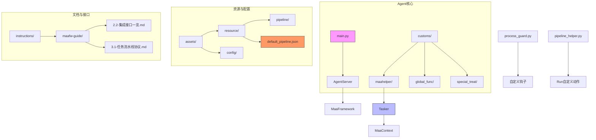
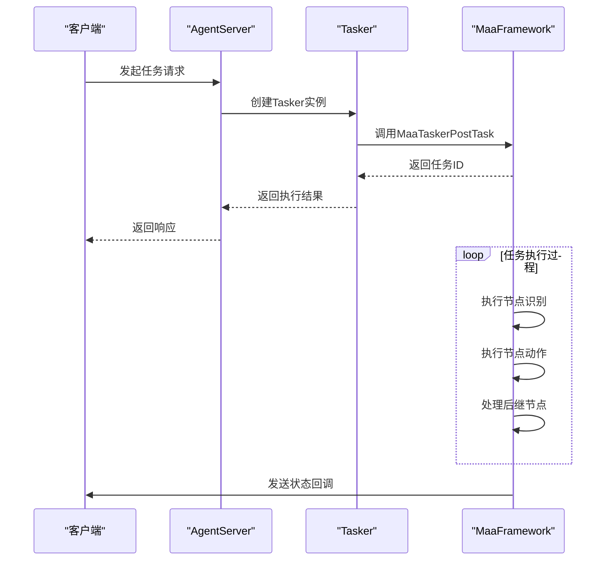
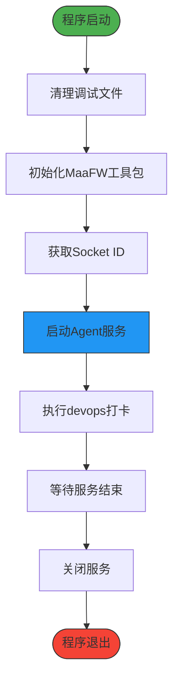
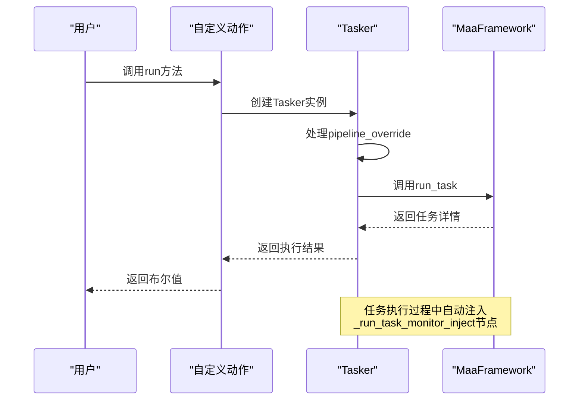
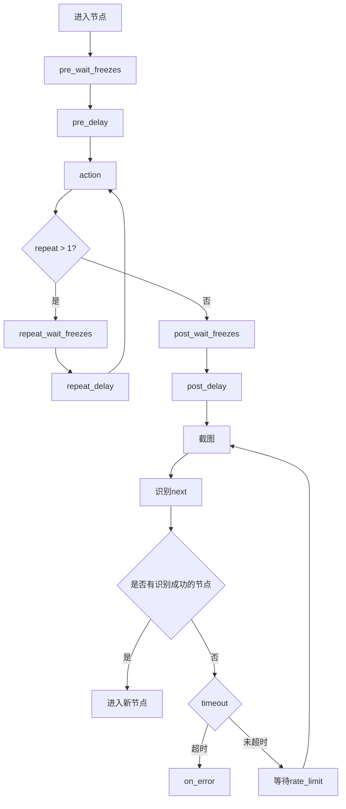
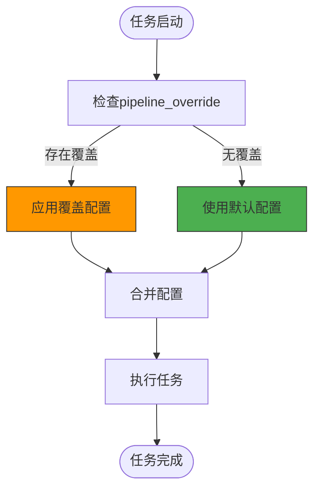
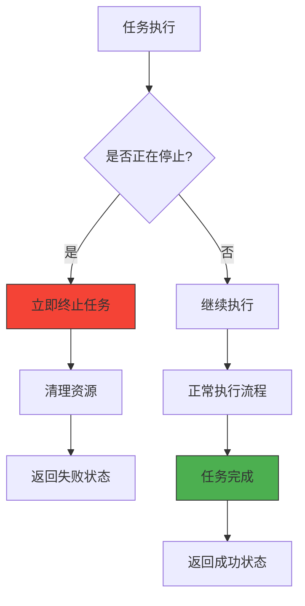
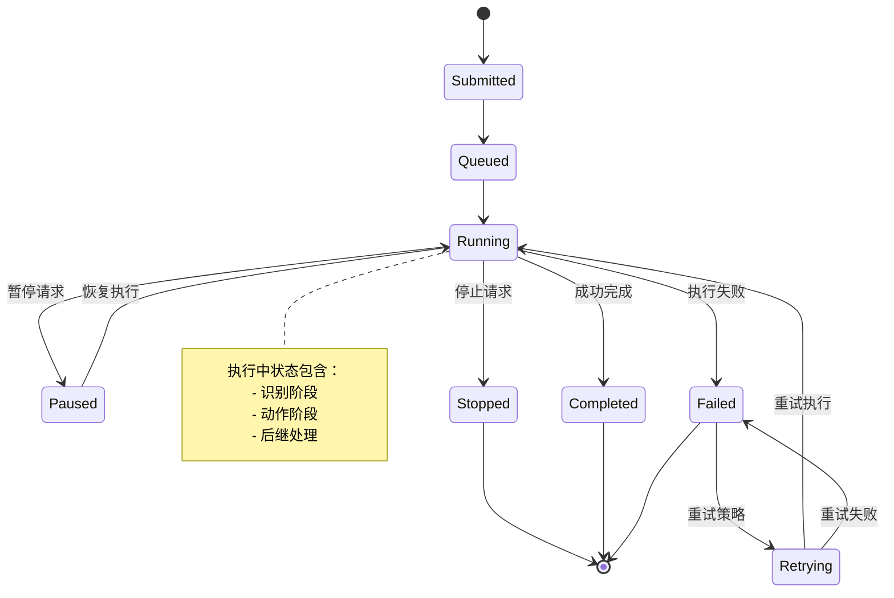
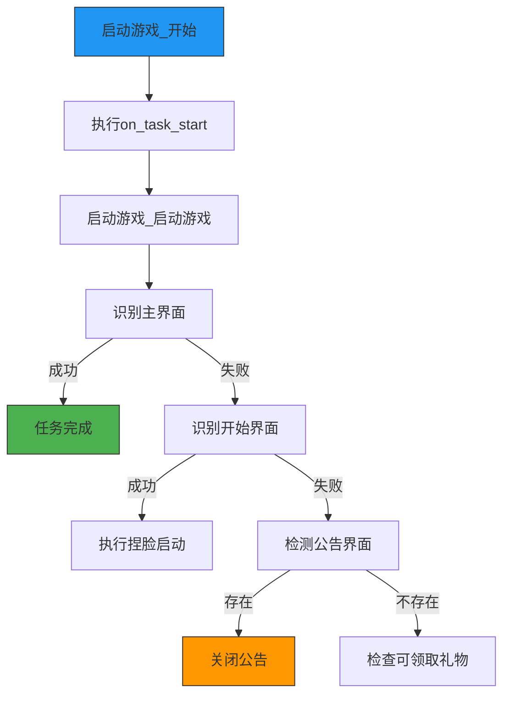

# 任务调度机制

<cite>
**本文档引用文件**  
- [main.py](file://agent/main.py)
- [tasker.py](file://agent/customs/maahelper/tasker.py)
- [process_guard.py](file://agent/customs/global_func/process_guard.py)
- [pipeline_helper.py](file://agent/customs/global_func/pipeline_helper.py)
- [default_pipeline.json](file://assets/resource/base/default_pipeline.json)
- [hooks.json](file://assets/resource/base/pipeline/其他/hooks.json)
- [回到主界面.json](file://assets/resource/base/pipeline/通用/回到主界面.json)
- [启动游戏.json](file://assets/resource/base/pipeline/日常任务/启动游戏.json)
- [maa_pi_config.json](file://assets/config/maa_pi_config.json)
- [2.2-集成接口一览.md](file://instructions/maafw-guide/2.2-集成接口一览.md)
- [3.1-任务流水线协议.md](file://instructions/maafw-guide/3.1-任务流水线协议.md)
- [3.3-ProjectInterfaceV2协议.md](file://instructions/maafw-guide/3.3-ProjectInterfaceV2协议.md)
</cite>

## 目录
1. [项目结构](#项目结构)
2. [核心调度机制](#核心调度机制)
3. [初始化流程分析](#初始化流程分析)
4. [任务提交与执行](#任务提交与执行)
5. [Pipeline配置结构](#pipeline配置结构)
6. [任务覆盖机制](#任务覆盖机制)
7. [异常处理与恢复](#异常处理与恢复)
8. [任务生命周期管理](#任务生命周期管理)
9. [实战案例分析](#实战案例分析)

## 项目结构

MaaDuDuL的任务调度系统采用模块化设计，主要由以下几个核心组件构成：



**图示来源**  
- [main.py](file://agent/main.py)
- [tasker.py](file://agent/customs/maahelper/tasker.py)
- [default_pipeline.json](file://assets/resource/base/default_pipeline.json)

**本节来源**  
- [main.py](file://agent/main.py)
- [project_structure](file://project_structure)

## 核心调度机制

MaaDuDuL基于MaaFramework构建了完整的异步任务调度系统，通过`MaaTaskerPostTask`接口实现任务的异步提交和执行。系统采用事件驱动架构，将任务分解为识别（recognition）、动作（action）和后继节点（next）三元组，形成可扩展的任务流水线。

任务调度的核心流程如下：
1. 任务通过`post_task`接口注入执行队列
2. 系统根据入口节点启动任务执行
3. 按照Pipeline配置顺序执行各节点
4. 每个节点包含识别、动作和后继处理三个阶段
5. 通过回调机制监控任务执行状态



**图示来源**  
- [2.2-集成接口一览.md](file://instructions/maafw-guide/2.2-集成接口一览.md)
- [tasker.py](file://agent/customs/maahelper/tasker.py)

**本节来源**  
- [2.2-集成接口一览.md](file://instructions/maafw-guide/2.2-集成接口一览.md)
- [3.1-任务流水线协议.md](file://instructions/maafw-guide/3.1-任务流水线协议.md)

## 初始化流程分析

AgentServer的初始化流程是任务调度系统的起点，通过`start_up()`方法完成环境准备和服务启动。该流程确保了任务执行所需的各项资源和配置正确加载。

```python
# agent/main.py 中的初始化流程
def main():
    # 清理调试文件
    clear()
    # 初始化 MaaFW 工具包
    Toolkit.init_option("./")
    # 获取 socket ID 并启动服务
    socket_id = sys.argv[-1]
    AgentServer.start_up(socket_id)
    # devops
    punch_in()
    # 等待服务结束
    AgentServer.join()
    AgentServer.shut_down()
```

初始化流程的关键步骤包括：
1. **环境清理**：执行`clear()`函数清理调试文件
2. **工具包初始化**：调用`Toolkit.init_option()`初始化MaaFramework工具包
3. **服务启动**：通过`AgentServer.start_up(socket_id)`启动代理服务
4. **运行监控**：使用`AgentServer.join()`等待服务结束
5. **资源释放**：最后调用`AgentServer.shut_down()`关闭服务



**图示来源**  
- [main.py](file://agent/main.py#L25-L37)

**本节来源**  
- [main.py](file://agent/main.py#L25-L37)

## 任务提交与执行

任务提交是通过`MaaTaskerPostTask`接口实现的异步操作，该接口立即返回任务ID，允许调用方通过`MaaTaskerStatus`和`MaaTaskerWait`查询任务状态。任务执行的核心是`Tasker.run()`方法，它封装了MaaFramework的任务执行逻辑。

```python
# tasker.py 中的任务执行方法
def run(self, entry: str, pipeline_override: Dict = {}):
    """运行指定的任务节点。"""
    # 构造默认 next_override
    node_list = self.context.tasker.resource.node_list
    for node_name in node_list:
        # 获取节点数据和 override 状态
        node_data = self.context.tasker.resource.get_node_data(node_name)
        exist_node_override = node_name in pipeline_override
        
        # 处理 next 字段注入
        current_next = []
        if exist_node_override and "next" in pipeline_override[node_name]:
            current_next = pipeline_override[node_name]["next"]
        elif node_data and "next" in node_data:
            current_next = node_data["next"]
            
        # 标准化 next 为列表
        if isinstance(current_next, str):
            current_next = [current_next] if current_next else []
        elif not isinstance(current_next, list):
            current_next = []
            
        # 如果有 next 且未注入过监测器，则注入
        if current_next and current_next[0] != "_run_task_monitor_inject":
            new_next = ["_run_task_monitor_inject"] + current_next
            if exist_node_override:
                pipeline_override[node_name]["next"] = new_next
            else:
                pipeline_override[node_name] = {"next": new_next}
                
    return self.context.run_task(entry, pipeline_override)
```

任务提交的关键特性：
- **异步执行**：立即返回任务ID，不阻塞主线程
- **状态查询**：通过任务ID查询执行状态
- **结果获取**：使用`MaaTaskerGetTaskDetail`获取任务详情
- **超时控制**：支持任务超时设置
- **错误处理**：提供完善的异常处理机制



**图示来源**  
- [tasker.py](file://agent/customs/maahelper/tasker.py#L51-L113)

**本节来源**  
- [tasker.py](file://agent/customs/maahelper/tasker.py#L51-L113)
- [2.2-集成接口一览.md](file://instructions/maafw-guide/2.2-集成接口一览.md#L535-L540)

## Pipeline配置结构

Pipeline配置文件定义了任务的执行流程，采用JSON格式描述，由多个节点（Node）构成。每个节点包含识别、动作和后继节点三元组，形成完整的任务执行路径。

### 基础结构

```json
{
    "NodeA": {
        "recognition": "OCR",
        "action": "Click",
        "next": [
            "NodeB",
            "NodeC"
        ]
    }
}
```

### 节点属性详解

| 属性 | 类型 | 描述 | 默认值 |
|------|------|------|--------|
| recognition | string | 识别算法类型 | DirectHit |
| action | string | 执行的动作 | DoNothing |
| next | string\|list | 后继节点列表 | 空 |
| timeout | uint | 识别超时时间（毫秒） | 20000 |
| pre_delay | uint | 识别到到执行动作前的延迟（毫秒） | 200 |
| post_delay | uint | 执行动作后到识别next的延迟（毫秒） | 200 |
| on_error | string\|list | 识别超时或动作失败后的处理节点 | 空 |

### 执行逻辑



**图示来源**  
- [3.1-任务流水线协议.md](file://instructions/maafw-guide/3.1-任务流水线协议.md#L234-L254)

**本节来源**  
- [3.1-任务流水线协议.md](file://instructions/maafw-guide/3.1-任务流水线协议.md)
- [回到主界面.json](file://assets/resource/base/pipeline/通用/回到主界面.json)

## 任务覆盖机制

任务覆盖机制（pipeline_override）允许在运行时动态修改任务流程，通过传入JSON配置覆盖原有Pipeline的节点行为。这一机制为任务调度提供了极大的灵活性，支持根据实际需求调整执行路径。

### 覆盖实现原理

在`Tasker.run()`方法中，系统会遍历所有节点，检查是否存在覆盖配置：

```python
# 处理 next 字段注入
current_next = []
if exist_node_override and "next" in pipeline_override[node_name]:
    current_next = pipeline_override[node_name]["next"]
elif node_data and "next" in node_data:
    current_next = node_data["next"]
```

### 实际应用示例

```python
# 在activity.py中动态覆盖任务流程
task_detail = Tasker(context).run(
    "进入活动界面_开始",
    {
        "进入活动界面_识别活动": {"expected": title},
        "进入活动界面_未找到指定活动": {"focus": f"> 未找到活动:{title}"},
    },
)
```

### 覆盖优先级

1. **最高优先级**：运行时传入的`pipeline_override`配置
2. **中等优先级**：任务级别的`pipeline_override`（在ProjectInterfaceV2中定义）
3. **最低优先级**：默认的Pipeline配置文件



**图示来源**  
- [tasker.py](file://agent/customs/maahelper/tasker.py#L64-L91)
- [activity.py](file://agent/customs/special_treat/activity.py#L41-L47)

**本节来源**  
- [tasker.py](file://agent/customs/maahelper/tasker.py#L64-L91)
- [activity.py](file://agent/customs/special_treat/activity.py#L41-L47)
- [3.3-ProjectInterfaceV2协议.md](file://instructions/maafw-guide/3.3-ProjectInterfaceV2协议.md#L305-L315)

## 异常处理与恢复

系统实现了完善的异常处理机制，通过自定义识别器和动作来监控任务状态，确保在异常情况下能够正确恢复或终止任务。

### 任务停止检测

```python
# process_guard.py中的停止检测
@AgentServer.custom_recognition("check_stopping")
class CheckStopping(CustomRecognition):
    def analyze(self, context: Context, argv: CustomRecognition.AnalyzeArg) -> CustomRecognition.AnalyzeResult:
        """分析任务停止状态。"""
        return CustomRecognition.AnalyzeResult(
            box=None,
            detail={"stop": context.tasker.stopping}
        )
```

### 运行监测器注入

系统在执行任务时会自动注入`_run_task_monitor_inject`节点，用于实时监控任务状态：

```json
// hooks.json中的监测器定义
{
    "_run_task_monitor_inject": {
        "recognition": "Custom",
        "custom_recognition": "check_stopping",
        "pre_delay": 0,
        "post_delay": 0
    }
}
```

### 异常处理流程



**图示来源**  
- [process_guard.py](file://agent/customs/global_func/process_guard.py#L72-L87)
- [hooks.json](file://assets/resource/base/pipeline/其他/hooks.json)

**本节来源**  
- [process_guard.py](file://agent/customs/global_func/process_guard.py#L72-L87)
- [hooks.json](file://assets/resource/base/pipeline/其他/hooks.json)
- [tasker.py](file://agent/customs/maahelper/tasker.py#L84-L91)

## 任务生命周期管理

任务从提交到完成经历完整的生命周期，系统通过状态转换图清晰地管理每个阶段的状态变化。

### 状态转换图



### 生命周期阶段

| 阶段 | 描述 | 监控方式 |
|------|------|----------|
| 提交 | 任务通过`post_task`接口提交 | 返回任务ID |
| 排队 | 任务等待执行资源 | `MaaTaskerStatus`查询 |
| 执行 | 任务正在运行 | 回调消息监控 |
| 暂停 | 任务被临时中断 | 停止状态检测 |
| 完成 | 任务成功执行完毕 | `Tasker.Task.Succeeded`回调 |
| 失败 | 任务执行失败 | `Tasker.Task.Failed`回调 |
| 停止 | 任务被主动终止 | `MaaTaskerPostStop` |

### 回调协议

系统通过回调函数通知任务执行状态，消息类型包括：

```json
{
    "task_id": 12345,
    "node_id": 67890,
    "name": "NodeA",
    "focus": any
}
```

支持的回调消息类型：
- `Tasker.Task.Starting`：任务开始
- `Tasker.Task.Succeeded`：任务成功
- `Tasker.Task.Failed`：任务失败
- `Node.PipelineNode.Starting`：节点开始
- `Node.PipelineNode.Succeeded`：节点成功
- `Node.PipelineNode.Failed`：节点失败

**图示来源**  
- [2.3-回调协议.md](file://instructions/maafw-guide/2.3-回调协议.md)
- [tasker.py](file://agent/customs/maahelper/tasker.py)

**本节来源**  
- [2.3-回调协议.md](file://instructions/maafw-guide/2.3-回调协议.md)
- [tasker.py](file://agent/customs/maahelper/tasker.py)

## 实战案例分析

通过分析具体的任务配置文件，可以更深入地理解任务调度系统的实际应用。

### 回到主界面任务

```json
// 回到主界面.json
"返回主界面_开始": {
    "action": {
        "param": {
            "custom_action": "on_task_start"
        },
        "type": "Custom"
    },
    "focus": {
        "Node.Recognition.Starting": " > 返回主界面"
    },
    "next": [
        "返回主界面_检测主界面",
        {
            "jump_back": true,
            "name": "返回主界面_导航类返回"
        },
        {
            "jump_back": true,
            "name": "返回主界面_面板类返回"
        }
    ]
}
```

### 启动游戏任务

```json
// 启动游戏.json
"启动游戏_启动游戏": {
    "action": {
        "param": {
            "package": "com.bilibili.trickcalcn"
        },
        "type": "StartApp"
    },
    "focus": {
        "Node.Action.Succeeded": " > 尝试识别关键界面"
    },
    "next": [
        "启动游戏_连续识别主界面",
        "启动游戏_连续识别开始界面",
        {
            "jump_back": true,
            "name": "启动游戏_检测公告界面"
        }
    ],
    "timeout": 60000
}
```

### 任务执行流程



**图示来源**  
- [回到主界面.json](file://assets/resource/base/pipeline/通用/回到主界面.json)
- [启动游戏.json](file://assets/resource/base/pipeline/日常任务/启动游戏.json)

**本节来源**  
- [回到主界面.json](file://assets/resource/base/pipeline/通用/回到主界面.json)
- [启动游戏.json](file://assets/resource/base/pipeline/日常任务/启动游戏.json)
- [pipeline_helper.py](file://agent/customs/global_func/pipeline_helper.py)