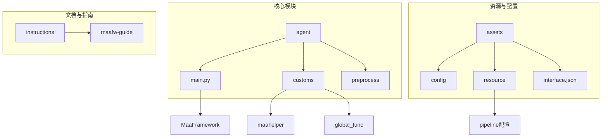
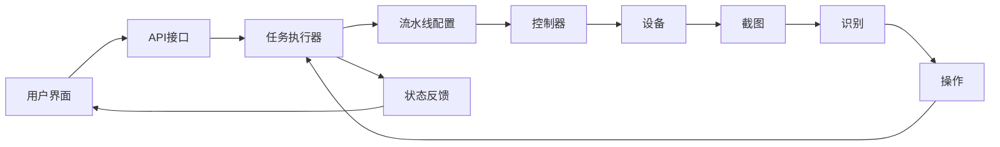
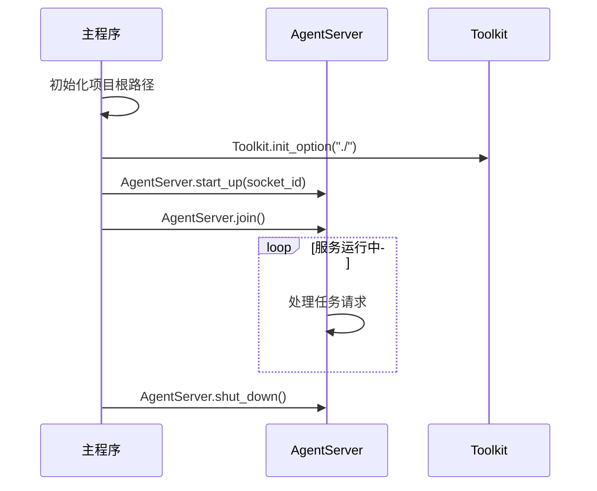
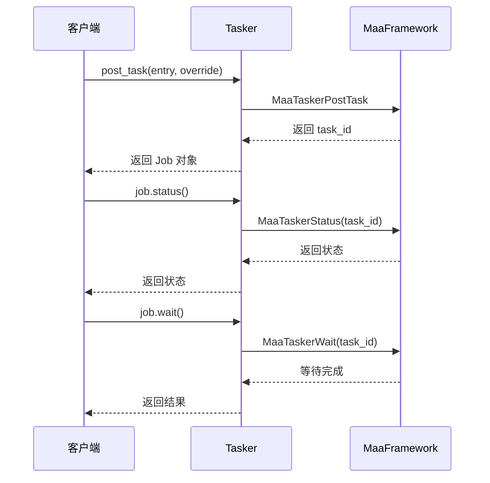
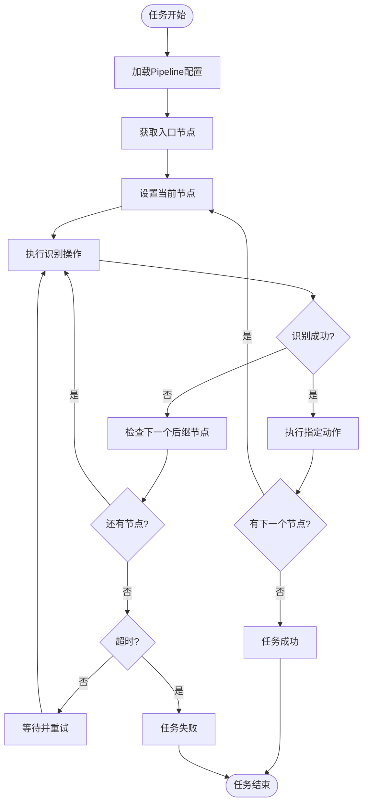
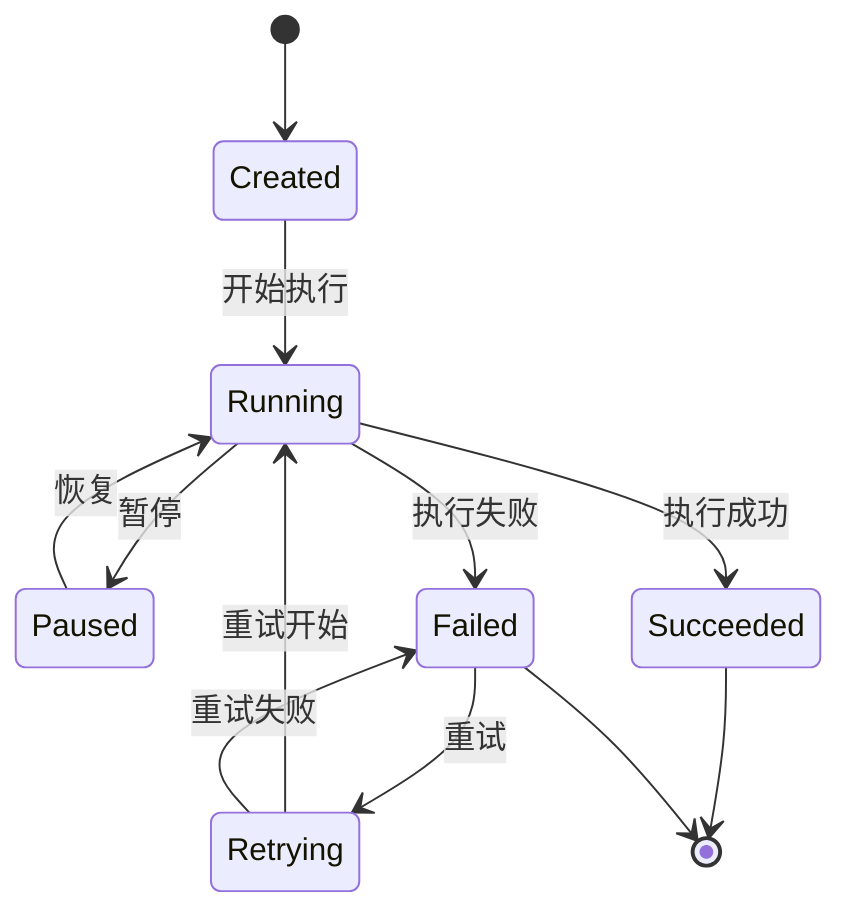
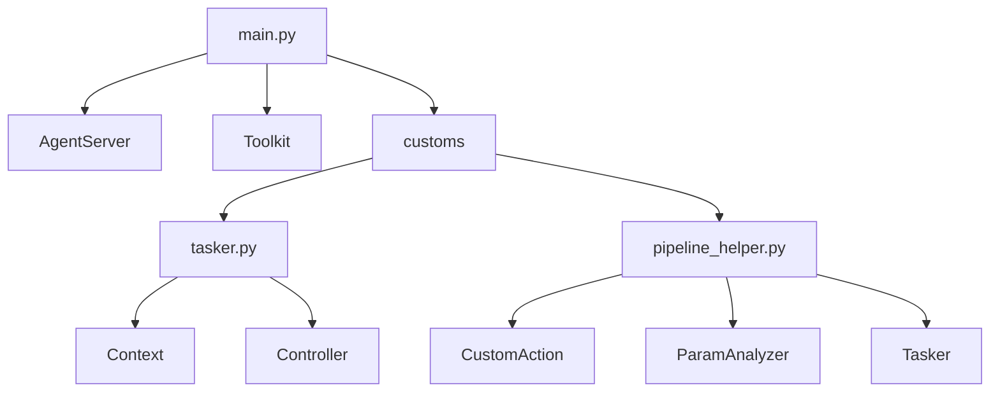

# 控制流与执行机制

<cite>
**本文档引用文件**   
- [main.py](file://agent/main.py)
- [tasker.py](file://agent/customs/maahelper/tasker.py)
- [pipeline_helper.py](file://agent/customs/global_func/pipeline_helper.py)
- [default_pipeline.json](file://assets/resource/base/default_pipeline.json)
- [2.2-集成接口一览.md](file://instructions/maafw-guide/2.2-集成接口一览.md)
- [3.1-任务流水线协议.md](file://instructions/maafw-guide/3.1-任务流水线协议.md)
- [2.3-回调协议.md](file://instructions/maafw-guide/2.3-回调协议.md)
- [setup.py](file://agent/preprocess/setup.py)
</cite>

## 目录
1. [简介](#简介)
2. [项目结构](#项目结构)
3. [核心组件](#核心组件)
4. [架构概述](#架构概述)
5. [详细组件分析](#详细组件分析)
6. [依赖分析](#依赖分析)
7. [性能考虑](#性能考虑)
8. [故障排除指南](#故障排除指南)
9. [结论](#结论)

## 简介
本文档深入解析MaaDuDuL的控制流机制，重点阐述从用户界面指令到设备操作的完整执行链路。文档基于`agent/main.py`中的`AgentServer.start_up()`和`join()`方法，详细说明服务启动、任务调度与线程同步机制。结合`MaaTaskerPostTask`、`MaaControllerPostConnection`等接口，阐述异步任务提交与状态查询模式。分析pipeline配置文件如何驱动任务流程，并通过`MaaContextRunTask`实现任务编排。提供状态机图展示任务从创建、执行到完成的生命周期，并包含连接失败重试、操作超时处理等错误处理机制的实战案例。

## 项目结构
MaaDuDuL项目的结构清晰，主要分为agent、assets、instructions等核心目录。agent目录包含主入口和自定义功能模块，assets目录存放资源配置和默认流水线配置，instructions目录提供详细的集成文档和协议说明。

**图示来源**
- [main.py](file://agent/main.py#L1-L48)
- [tasker.py](file://agent/customs/maahelper/tasker.py#L1-L177)
- [default_pipeline.json](file://assets/resource/base/default_pipeline.json#L1-L7)

**本节来源**
- [main.py](file://agent/main.py#L1-L48)
- [project_structure](file://#L1-L200)

## 核心组件
系统的核心组件包括AgentServer、Tasker、Controller和Pipeline配置系统。AgentServer负责服务的启动和生命周期管理，Tasker封装了任务执行的高级接口，Controller处理设备控制操作，Pipeline配置系统定义了任务的执行流程。

**本节来源**
- [main.py](file://agent/main.py#L17-L47)
- [tasker.py](file://agent/customs/maahelper/tasker.py#L16-L177)

## 架构概述
MaaDuDuL的控制流架构采用分层设计，从UI指令到设备操作的执行链路清晰。系统通过异步任务机制实现高效的任务调度，利用线程同步确保服务的稳定运行。

**图示来源**
- [main.py](file://agent/main.py#L31-L36)
- [tasker.py](file://agent/customs/maahelper/tasker.py#L51-L113)
- [2.2-集成接口一览.md](file://instructions/maafw-guide/2.2-集成接口一览.md#L535-L540)

## 详细组件分析

### AgentServer服务启动与同步机制分析
AgentServer是MaaDuDuL的核心服务组件，负责整个系统的启动、运行和关闭。其`start_up()`方法初始化服务，`join()`方法实现线程同步，确保服务持续运行直到被显式关闭。

**图示来源**
- [main.py](file://agent/main.py#L31-L36)

**本节来源**
- [main.py](file://agent/main.py#L17-L47)

### 异步任务提交与状态查询模式分析
系统采用异步任务模式，通过`MaaTaskerPostTask`接口提交任务，立即返回任务ID，后续通过`MaaTaskerStatus`和`MaaTaskerWait`查询任务状态，实现非阻塞的任务执行。

**图示来源**
- [2.2-集成接口一览.md](file://instructions/maafw-guide/2.2-集成接口一览.md#L535-L540)
- [tasker.py](file://agent/customs/maahelper/tasker.py#L51-L113)

**本节来源**
- [2.2-集成接口一览.md](file://instructions/maafw-guide/2.2-集成接口一览.md#L535-L540)
- [4.2-标准化接口设计.md](file://instructions/maafw-guide/4.2-标准化接口设计.md#L19-L23)

### Pipeline配置驱动任务流程分析
Pipeline配置文件采用JSON格式定义任务流程，通过`next`字段指定后继节点，`recognition`字段定义识别方式，`action`字段定义执行动作，驱动整个任务的执行流程。

**图示来源**
- [3.1-任务流水线协议.md](file://instructions/maafw-guide/3.1-任务流水线协议.md#L1-L114)
- [default_pipeline.json](file://assets/resource/base/default_pipeline.json#L1-L7)

**本节来源**
- [3.1-任务流水线协议.md](file://instructions/maafw-guide/3.1-任务流水线协议.md#L1-L114)
- [pipeline_helper.py](file://agent/customs/global_func/pipeline_helper.py#L9-L25)

### 任务生命周期状态机
任务从创建到完成经历多个状态，通过状态机清晰地描述了任务的整个生命周期。

**图示来源**
- [2.3-回调协议.md](file://instructions/maafw-guide/2.3-回调协议.md#L97-L124)
- [tasker.py](file://agent/customs/maahelper/tasker.py#L51-L113)

**本节来源**
- [2.3-回调协议.md](file://instructions/maafw-guide/2.3-回调协议.md#L97-L124)
- [tasker.py](file://agent/customs/maahelper/tasker.py#L173-L177)

## 依赖分析
系统依赖关系清晰，各组件之间耦合度适中，通过标准化接口实现组件间的通信。

**图示来源**
- [main.py](file://agent/main.py#L14-L24)
- [tasker.py](file://agent/customs/maahelper/tasker.py#L7-L10)
- [pipeline_helper.py](file://agent/customs/global_func/pipeline_helper.py#L1-L6)

**本节来源**
- [main.py](file://agent/main.py#L14-L24)
- [tasker.py](file://agent/customs/maahelper/tasker.py#L7-L10)
- [pipeline_helper.py](file://agent/customs/global_func/pipeline_helper.py#L1-L6)

## 性能考虑
系统在设计时充分考虑了性能因素，通过异步任务、线程同步和资源优化等手段确保高效运行。

- **异步任务处理**：所有任务操作均采用异步模式，避免阻塞主线程
- **线程安全**：回调函数设计考虑线程安全，避免并发问题
- **资源复用**：截图等资源操作结果可被后续识别任务复用
- **连接优化**：控制器连接采用长连接，减少重复连接开销
- **批量操作**：支持批量任务提交，减少接口调用次数

## 故障排除指南
系统提供了完善的错误处理机制，帮助开发者快速定位和解决问题。

**本节来源**
- [2.3-回调协议.md](file://instructions/maafw-guide/2.3-回调协议.md#L362-L364)
- [main.py](file://agent/main.py#L39-L41)

### 常见问题与解决方案
1. **服务启动失败**
   - 检查Python依赖是否完整
   - 确认`interface.json`版本号正确
   - 查看`pip_config.json`配置是否正确

2. **任务执行超时**
   - 检查设备连接状态
   - 调整`timeout`参数值
   - 优化识别算法和阈值

3. **识别失败**
   - 检查截图质量
   - 调整识别区域和参数
   - 验证OCR模型是否正确加载

4. **操作未生效**
   - 确认设备权限已授予
   - 检查坐标是否正确
   - 验证操作类型是否支持

### 错误处理实战案例
- **连接失败重试**：系统在检测到连接失败后，会自动进行多次重试，间隔时间逐渐增加
- **操作超时处理**：每个操作都有默认超时时间，超时后会自动进入错误处理流程
- **异常捕获**：所有关键操作都包含异常捕获，确保系统稳定性

## 结论
MaaDuDuL的控制流机制设计精巧，通过清晰的分层架构和异步任务模式，实现了从UI指令到设备操作的高效执行链路。系统通过AgentServer管理服务生命周期，利用Tasker封装任务执行逻辑，结合Pipeline配置文件驱动任务流程，形成了完整的自动化执行体系。异步任务提交与状态查询模式确保了系统的响应性和可扩展性，而完善的错误处理机制则保证了系统的稳定性和可靠性。整体架构设计合理，组件职责明确，为自动化任务执行提供了强大的支持。