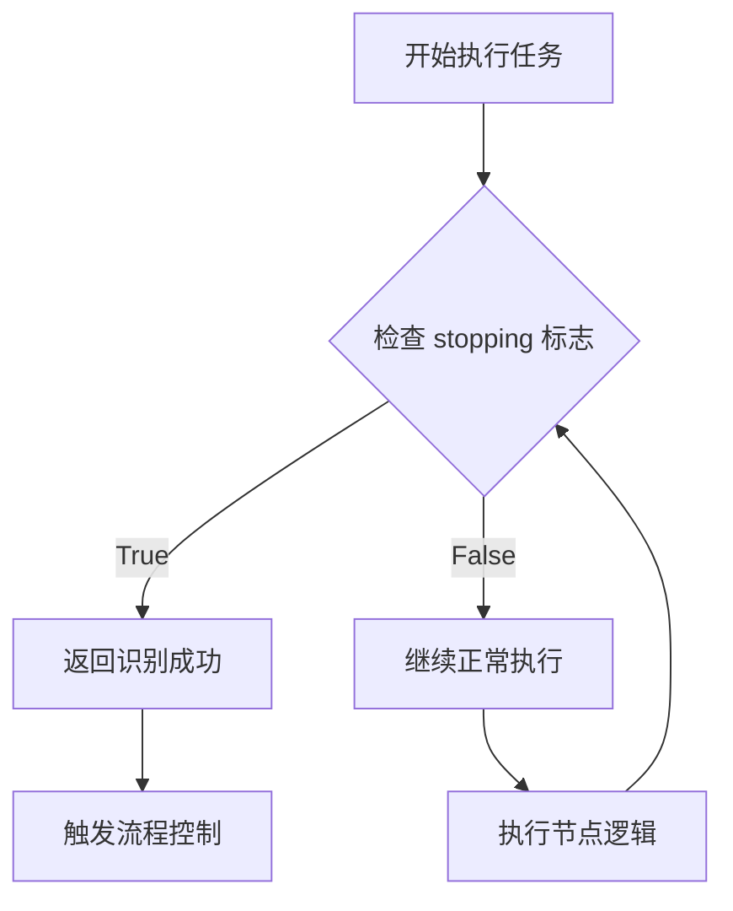
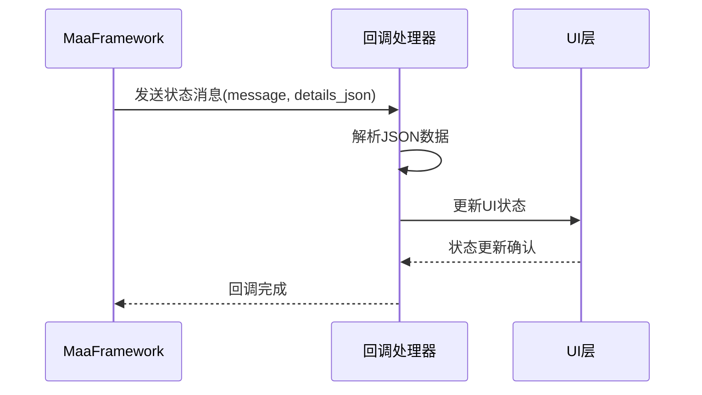
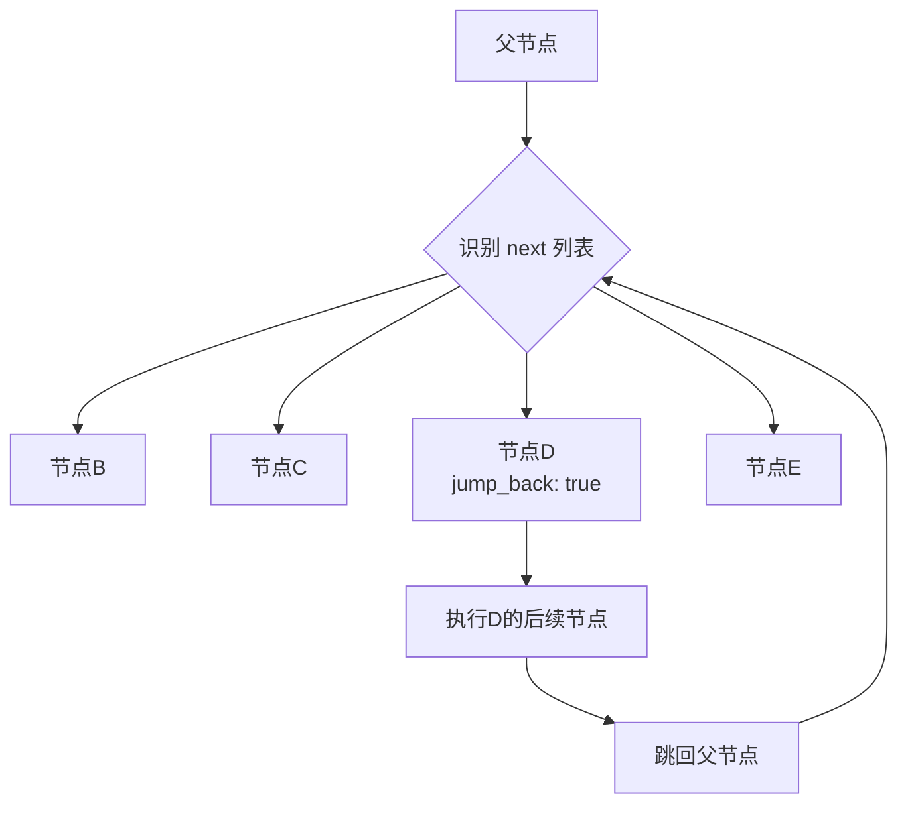

# 状态管理与监控

<cite>
**本文档引用的文件**  
- [tasker.py](file://agent/customs/maahelper/tasker.py)
- [process_guard.py](file://agent/customs/global_func/process_guard.py)
- [local_storage.py](file://agent/customs/utils/local_storage.py)
- [prompter.py](file://agent/customs/utils/prompter.py)
- [hooks.json](file://assets/resource/base/pipeline/其他/hooks.json)
- [maa_option.json](file://ci/config/maa_option.json)
- [2.2-集成接口一览.md](file://instructions/maafw-guide/2.2-集成接口一览.md)
- [2.3-回调协议.md](file://instructions/maafw-guide/2.3-回调协议.md)
- [3.1-任务流水线协议.md](file://instructions/maafw-guide/3.1-任务流水线协议.md)
- [3.3-ProjectInterfaceV2协议.md](file://instructions/maafw-guide/3.3-ProjectInterfaceV2协议.md)
</cite>

## 目录
1. [引言](#引言)
2. [任务上下文状态管理](#任务上下文状态管理)
3. [停止标志位与任务终止协调](#停止标志位与任务终止协调)
4. [回调机制与UI状态通知](#回调机制与ui状态通知)
5. [状态机在任务跳转与条件分支中的应用](#状态机在任务跳转与条件分支中的应用)
6. [日志记录与执行进度可视化](#日志记录与执行进度可视化)
7. [错误码映射与异常处理](#错误码映射与异常处理)
8. [典型状态问题排查与修复](#典型状态问题排查与修复)
9. [结论](#结论)

## 引言

本系统基于 MaaFramework 构建，通过 MaaContext 对象维护任务执行过程中的完整状态信息。系统采用分层架构，将任务执行、状态监控、流程控制和用户反馈分离，确保了高内聚低耦合的设计原则。核心状态管理机制围绕 MaaContextRunTask 执行模型展开，通过注入监测节点、回调协议和状态机等技术手段，实现了对任务生命周期的全面掌控。系统支持复杂的任务跳转、循环检测和条件分支逻辑，能够应对各种动态变化的执行环境。

## 任务上下文状态管理

任务上下文（MaaContext）是状态管理的核心，通过 `run()` 方法协调任务执行流程。该方法在执行任务前会自动遍历所有节点，检查并注入 `_run_task_monitor_inject` 监测节点到 `next` 和 `on_error` 链中，确保每个任务节点的执行都能被监控。MaaContext 维护当前激活节点、执行历史和运行状态，通过 `context.tasker.resource.node_list` 获取所有节点列表，并利用 `get_node_data()` 方法获取节点配置。执行历史通过 `TaskDetail` 对象记录，包含完整的节点执行序列，可通过 `get_last_node_name()` 方法获取最后执行的节点名称，用于判断任务执行路径和结果。

**Section sources**
- [tasker.py](file://agent/customs/maahelper/tasker.py#L51-L113)

## 停止标志位与任务终止协调

停止标志位（stopping）是任务终止过程中的关键协调机制。通过 `Tasker` 类的 `stopping` 属性访问 `context.tasker.stopping` 标志，该属性为布尔值，指示任务是否正在停止。系统通过自定义识别器 `CheckStopping` 实时检测此标志，当检测到 `context.tasker.stopping` 为真时，返回识别成功结果，触发相应的流程控制。这种设计确保了任务可以在任何执行点安全中断，避免了强制终止可能导致的状态不一致。监测节点 `_run_task_monitor_inject` 被注入到每个节点的执行链中，形成了一道全局的停止检测屏障，保证了停止信号的及时响应。

**Diagram sources**
- [process_guard.py](file://agent/customs/global_func/process_guard.py#L72-L98)
- [hooks.json](file://assets/resource/base/pipeline/其他/hooks.json#L1-L8)

**Section sources**
- [tasker.py](file://agent/customs/maahelper/tasker.py#L43-L49)
- [process_guard.py](file://agent/customs/global_func/process_guard.py#L72-L98)

## 回调机制与UI状态通知

系统通过 MaaFramework 的回调协议实现与 UI 层的状态同步。当任务状态发生变化时，框架会调用注册的回调函数，传递消息类型（message）和详细数据（details_json）。UI 层通过监听如 `Tasker.Task.Starting`、`Node.Recognition.Succeeded` 等消息类型，实时更新界面状态。回调函数需注意线程安全，应尽快返回以避免阻塞框架执行流程，并建议添加异常处理以防止回调异常影响整体运行。通过 `MaaTaskerAddSink` 和 `MaaTaskerAddNodeSink` 接口注册回调，实现了任务级和节点级的精细化状态监控。

**Diagram sources**
- [2.3-回调协议.md](file://instructions/maafw-guide/2.3-回调协议.md#L1-L365)

**Section sources**
- [2.3-回调协议.md](file://instructions/maafw-guide/2.3-回调协议.md#L1-L365)

## 状态机在任务跳转与条件分支中的应用

系统采用基于节点 `next` 和 `on_error` 列表的状态机模型来管理任务跳转和条件分支。`next` 列表定义了正常执行路径，系统按顺序尝试识别列表中的节点，一旦匹配成功即执行相应动作并跳转。`on_error` 列表处理异常情况，提供错误恢复路径。通过 `jump_back` 属性实现循环检测，当带有该属性的节点被识别后，其后续节点链执行完毕会跳回父节点重新开始识别。这种状态机设计支持复杂的流程控制，如异常处理、循环任务和条件分支，通过动态覆盖 `pipeline_override` 可以在运行时修改状态转移逻辑。

**Diagram sources**
- [3.1-任务流水线协议.md](file://instructions/maafw-guide/3.1-任务流水线协议.md#L1159-L1272)

**Section sources**
- [3.1-任务流水线协议.md](file://instructions/maafw-guide/3.1-任务流水线协议.md#L1-L56)

## 日志记录与执行进度可视化

系统通过配置文件 `maa_option.json` 控制日志记录行为，其中 `logging: true` 启用日志功能，`stdout_level: 2` 设置输出级别。日志记录了任务执行的详细过程，包括节点识别、动作执行和状态变更。执行进度可视化通过 `Prompter` 工具类实现，该类提供 `log` 和 `error` 方法，用于格式化输出信息和错误消息。`cprint` 函数添加了时间间隔，使输出更加清晰可读。结合回调机制，可以将关键状态变更实时反映在 UI 上，为用户提供直观的执行进度反馈。

**Section sources**
- [maa_option.json](file://ci/config/maa_option.json#L1-L6)
- [prompter.py](file://agent/customs/utils/prompter.py#L1-L55)

## 错误码映射与异常处理

系统通过 `Prompter.error` 方法实现错误码映射和异常处理。该方法接收错误内容和异常对象，格式化输出错误信息，并返回 `False` 表示操作失败。对于自定义识别器，可返回 `CustomRecognition.AnalyzeResult` 对象，包含识别结果和详细信息。错误处理策略包括：捕获异常并记录详细信息、向用户显示友好的错误提示、返回适当的错误码以供上层逻辑处理。通过标准化的错误处理流程，确保了系统的健壮性和用户体验。

**Section sources**
- [prompter.py](file://agent/customs/utils/prompter.py#L34-L54)

## 典型状态问题排查与修复

### 状态卡死问题
状态卡死通常由循环检测逻辑不当或停止标志未被正确检测引起。排查时应检查 `jump_back` 属性的使用是否合理，确保循环有明确的退出条件。同时验证 `CheckStopping` 识别器是否正常工作，确认 `stopping` 标志能被及时响应。可通过增加日志输出或使用调试工具跟踪节点执行序列来定位问题。

### 状态错乱问题
状态错乱多因并发访问或数据竞争导致。应确保对共享状态的访问是线程安全的，避免在回调函数中进行耗时操作。检查 `pipeline_override` 的覆盖逻辑，确保不会意外修改其他任务的执行路径。使用 `local_storage.py` 进行持久化存储时，要保证读写操作的原子性，防止数据损坏。

**Section sources**
- [process_guard.py](file://agent/customs/global_func/process_guard.py#L72-L98)
- [local_storage.py](file://agent/customs/utils/local_storage.py#L1-L111)

## 结论

本系统构建了一个完整且高效的状态管理体系，通过 MaaContext 统一管理任务执行状态，利用 stopping 标志位实现安全的任务终止协调，并通过回调机制将状态变更实时通知 UI 层。状态机模型灵活支持任务跳转、循环检测和条件分支，配合日志记录和错误处理机制，形成了一个健壮的自动化执行框架。针对状态卡死和错乱等典型问题，提供了有效的排查方法和修复策略，确保了系统的稳定可靠运行。