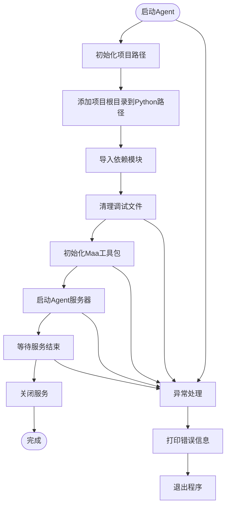
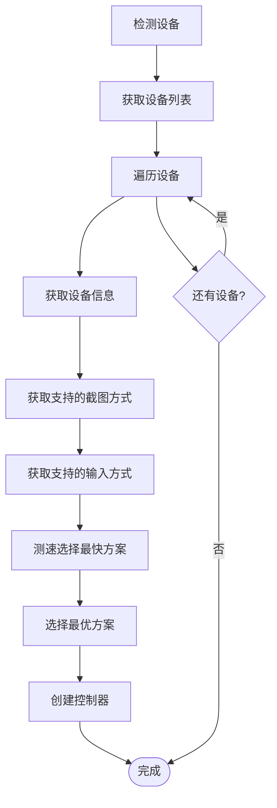
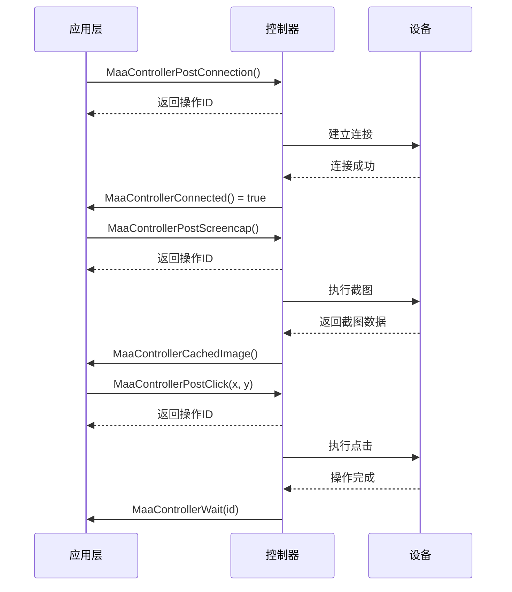
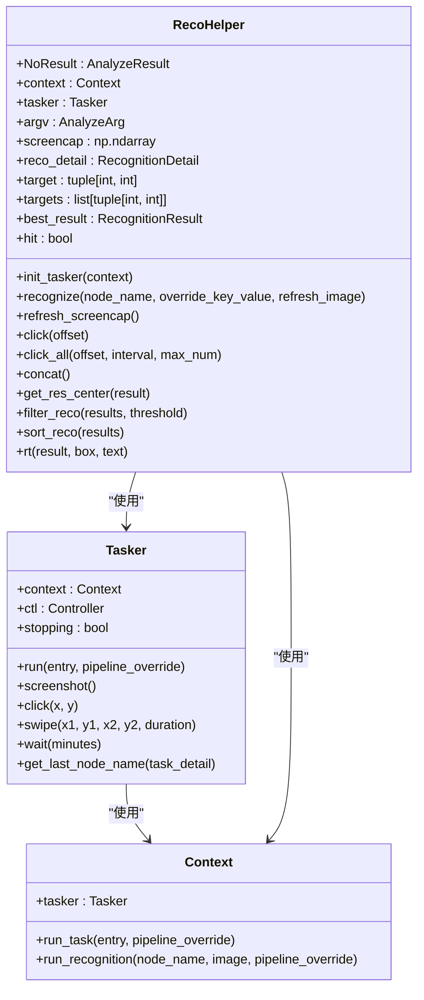
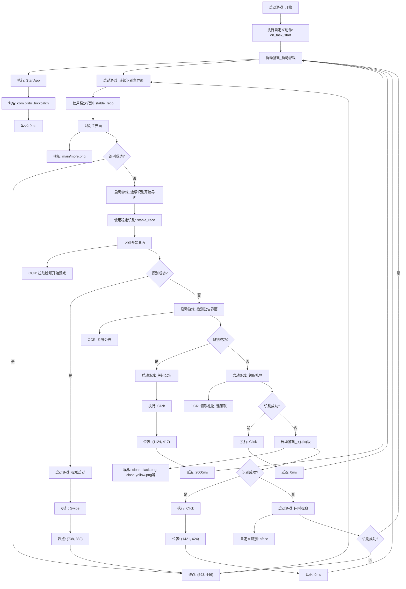
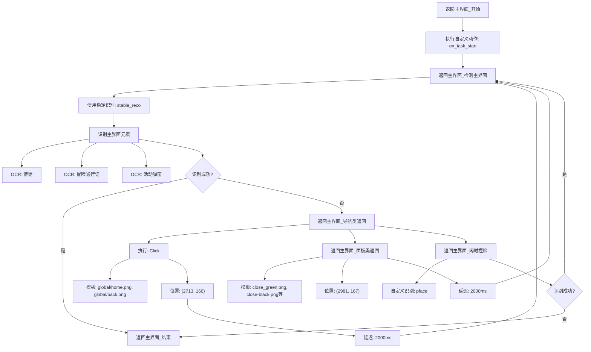
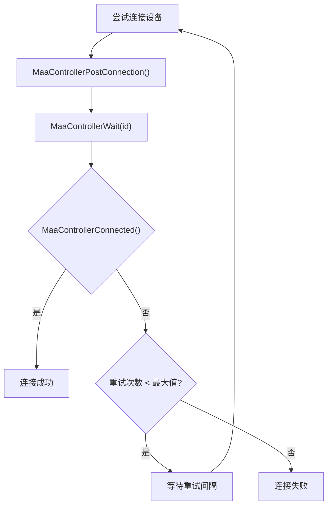

# 设备控制流程

<cite>
**本文档引用文件**  
- [main.py](file://agent/main.py)
- [setup.py](file://agent/preprocess/setup.py)
- [tasker.py](file://agent/customs/maahelper/tasker.py)
- [reco_helper.py](file://agent/customs/maahelper/reco_helper.py)
- [maa_pi_config.json](file://assets/config/maa_pi_config.json)
- [启动游戏.json](file://assets/resource/base/pipeline/日常任务/启动游戏.json)
- [回到主界面.json](file://assets/resource/base/pipeline/通用/回到主界面.json)
- [2.2-集成接口一览.md](file://instructions/maafw-guide/2.2-集成接口一览.md)
- [2.4-控制方式说明.md](file://instructions/maafw-guide/2.4-控制方式说明.md)
- [3.3-ProjectInterfaceV2协议.md](file://instructions/maafw-guide/3.3-ProjectInterfaceV2协议.md)
</cite>

## 目录
1. [项目结构](#项目结构)
2. [控制器初始化与连接管理](#控制器初始化与连接管理)
3. [设备连接方式与自动检测机制](#设备连接方式与自动检测机制)
4. [图像采集、OCR识别与模拟输入的时序协调](#图像采集ocr识别与模拟输入的时序协调)
5. [高层任务到底层操作的转换机制](#高层任务到底层操作的转换机制)
6. [典型操作控制流路径示例](#典型操作控制流路径示例)
7. [容错机制](#容错机制)
8. [性能优化建议](#性能优化建议)

## 项目结构

本项目采用模块化设计，主要结构如下：

- `agent/`：核心代理逻辑，包含主入口、预处理、自定义功能等
- `assets/`：资源文件，包括配置、任务流水线、OCR模型等
- `instructions/`：MaaFramework集成文档
- `launcher/`：启动器
- `tools/`：工具脚本

关键组件包括：
- `agent/main.py`：Agent主入口，负责初始化和启动服务
- `agent/preprocess/setup.py`：依赖环境自动安装模块
- `assets/resource/base/pipeline/`：任务流水线配置文件
- `agent/customs/maahelper/`：任务执行与识别辅助模块

**文档来源**
- [main.py](file://agent/main.py)
- [setup.py](file://agent/preprocess/setup.py)
- [启动游戏.json](file://assets/resource/base/pipeline/日常任务/启动游戏.json)
- [回到主界面.json](file://assets/resource/base/pipeline/通用/回到主界面.json)

## 控制器初始化与连接管理

系统通过MaaFramework的控制器接口实现设备连接管理。`agent/main.py`作为主入口文件，负责初始化Maa工具包并启动Agent服务。



**图示来源**
- [main.py](file://agent/main.py#L1-L48)

**章节来源**
- [main.py](file://agent/main.py#L1-L48)

## 设备连接方式与自动检测机制

系统支持多种设备连接方式，主要通过MaaFramework的控制器接口实现。根据`instructions/maafw-guide/2.4-控制方式说明.md`文档，连接方式包括：

### ADB连接
- **创建接口**：`MaaAdbControllerCreate`
- **参数**：
  - `adb_path`：ADB路径
  - `address`：连接地址（如`127.0.0.1:5555`）
  - `screencap_methods`：截图方式
  - `input_methods`：输入方式
  - `config`：额外配置
  - `agent_path`：MaaAgentBinary路径

### 连接方式自动检测
根据ProjectInterface V2协议，ADB控制器的截图和输入方式由MaaFramework自动检测和选择最优方案，无需手动配置。



**图示来源**
- [2.2-集成接口一览.md](file://instructions/maafw-guide/2.2-集成接口一览.md#L199-L892)
- [2.4-控制方式说明.md](file://instructions/maafw-guide/2.4-控制方式说明.md#L1-L27)
- [3.3-ProjectInterfaceV2协议.md](file://instructions/maafw-guide/3.3-ProjectInterfaceV2协议.md#L25-L425)

**章节来源**
- [2.2-集成接口一览.md](file://instructions/maafw-guide/2.2-集成接口一览.md#L199-L892)
- [2.4-控制方式说明.md](file://instructions/maafw-guide/2.4-控制方式说明.md#L1-L27)
- [3.3-ProjectInterfaceV2协议.md](file://instructions/maafw-guide/3.3-ProjectInterfaceV2协议.md#L25-L425)

## 图像采集、OCR识别与模拟输入的时序协调

系统通过MaaFramework的异步操作机制实现图像采集、OCR识别与模拟输入的协调。

### MaaControllerPostConnection接口
`MaaControllerPostConnection`是异步连接设备的核心接口，立即返回操作ID，通过`MaaControllerStatus`和`MaaControllerWait`查询状态。

### 操作时序流程


**图示来源**
- [2.2-集成接口一览.md](file://instructions/maafw-guide/2.2-集成接口一览.md#L311-L447)
- [reco_helper.py](file://agent/customs/maahelper/reco_helper.py#L1-L256)

**章节来源**
- [2.2-集成接口一览.md](file://instructions/maafw-guide/2.2-集成接口一览.md#L311-L447)
- [reco_helper.py](file://agent/customs/maahelper/reco_helper.py#L1-L256)

## 高层任务到底层操作的转换机制

系统通过任务流水线（pipeline）将高层任务指令转化为底层设备操作。

### 任务执行器架构


**图示来源**
- [tasker.py](file://agent/customs/maahelper/tasker.py#L1-L177)
- [reco_helper.py](file://agent/customs/maahelper/reco_helper.py#L1-L256)

**章节来源**
- [tasker.py](file://agent/customs/maahelper/tasker.py#L1-L177)
- [reco_helper.py](file://agent/customs/maahelper/reco_helper.py#L1-L256)

## 典型操作控制流路径示例

### 启动游戏操作流程
基于`启动游戏.json`配置文件，展示"启动游戏"操作的控制流路径。



**图示来源**
- [启动游戏.json](file://assets/resource/base/pipeline/日常任务/启动游戏.json#L1-L362)

**章节来源**
- [启动游戏.json](file://assets/resource/base/pipeline/日常任务/启动游戏.json#L1-L362)

### 返回主界面操作流程
基于`回到主界面.json`配置文件，展示"返回主界面"操作的控制流路径。



**图示来源**
- [回到主界面.json](file://assets/resource/base/pipeline/通用/回到主界面.json#L1-L202)

**章节来源**
- [回到主界面.json](file://assets/resource/base/pipeline/通用/回到主界面.json#L1-L202)

## 容错机制

系统实现了完善的容错机制，确保在连接失败或设备断开时能够自动恢复。

### 连接失败重试机制


### 设备断开自动重连
系统通过定期检测连接状态实现自动重连：

1. **状态检测**：定期调用`MaaControllerConnected()`检查连接状态
2. **断开检测**：当检测到连接断开时，触发重连流程
3. **重连执行**：重新执行`MaaControllerPostConnection()`进行连接
4. **状态恢复**：连接成功后恢复任务执行

**章节来源**
- [2.2-集成接口一览.md](file://instructions/maafw-guide/2.2-集成接口一览.md#L439-L447)
- [启动游戏.json](file://assets/resource/base/pipeline/日常任务/启动游戏.json#L1-L362)

## 性能优化建议

### 截图压缩
通过设置截图缩放参数优化性能：

- `ScreenshotTargetLongSide`：设置截图缩放长边到指定长度
- `ScreenshotTargetShortSide`：设置截图缩放短边到指定长度
- `ScreenshotUseRawSize`：设置截图不缩放

### 指令批处理
将多个操作合并为批处理，减少通信开销：

```python
# 示例：批处理点击操作
def batch_click(targets):
    for target in targets:
        controller.post_click(target[0], target[1])
    # 等待所有操作完成
    for op_id in op_ids:
        controller.wait(op_id)
```

### 异步操作优化
充分利用MaaFramework的异步操作特性：

- 使用`MaaControllerPost*`系列接口进行异步操作
- 通过`MaaControllerStatus`和`MaaControllerWait`管理操作状态
- 合理设置超时时间，避免长时间等待

### 缓存机制
- 缓存最新截图，避免重复截图
- 使用`MaaControllerCachedImage()`获取缓存截图
- 在短时间内多次识别时优先使用缓存

**章节来源**
- [2.2-集成接口一览.md](file://instructions/maafw-guide/2.2-集成接口一览.md#L299-L310)
- [reco_helper.py](file://agent/customs/maahelper/reco_helper.py#L117-L118)
- [tasker.py](file://agent/customs/maahelper/tasker.py#L123-L124)