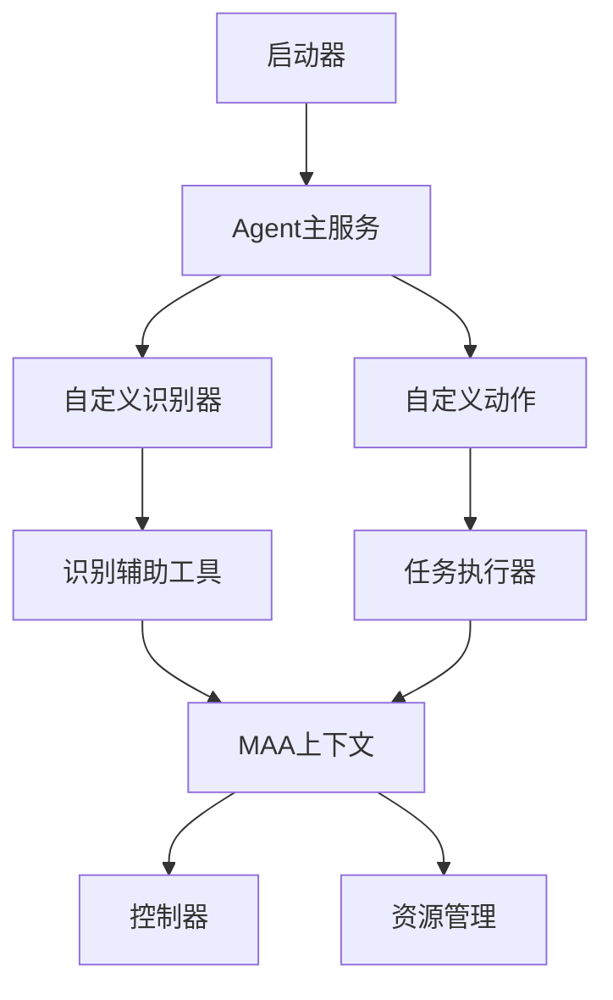
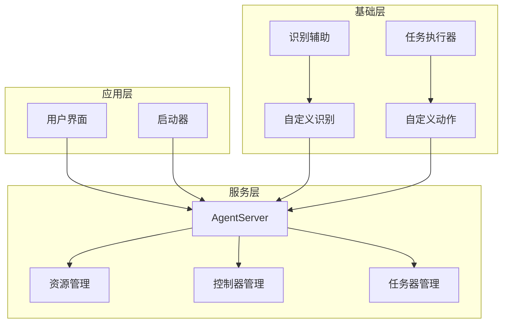
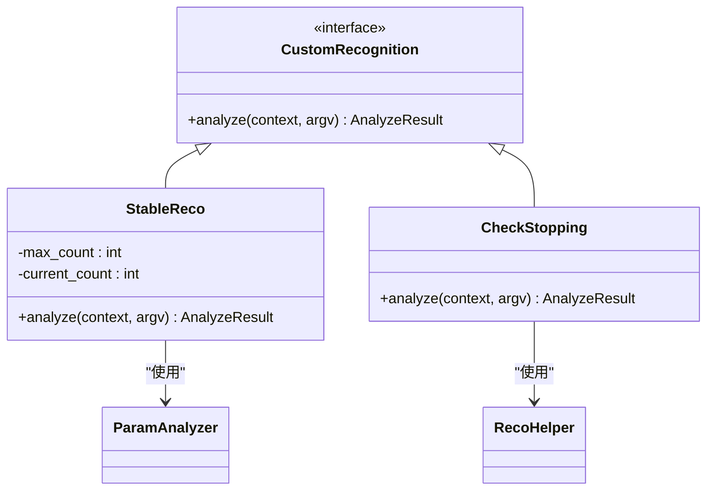
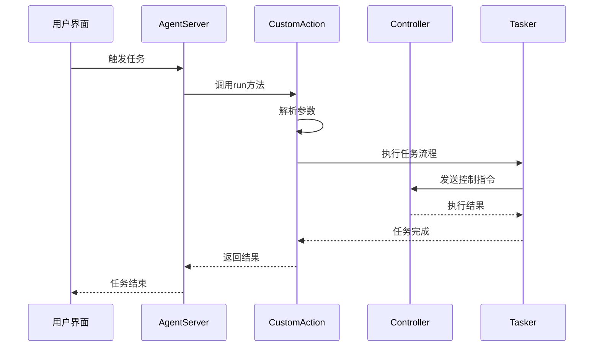
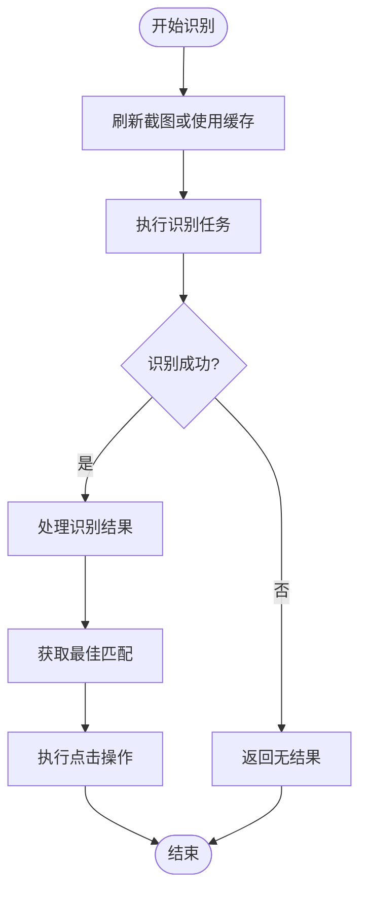
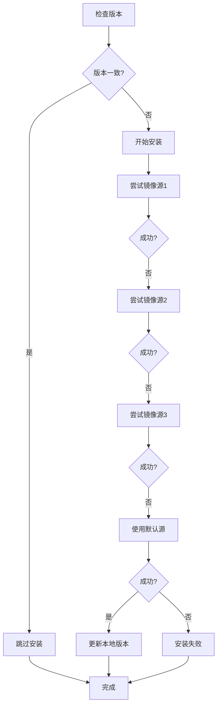

# 核心架构设计

<cite>
**本文档引用的文件**
- [main.py](file://agent/main.py)
- [process_guard.py](file://agent/customs/global_func/process_guard.py)
- [logic_enhance.py](file://agent/customs/global_func/logic_enhance.py)
- [reco_helper.py](file://agent/customs/maahelper/reco_helper.py)
- [tasker.py](file://agent/customs/maahelper/tasker.py)
- [prompter.py](file://agent/customs/utils/prompter.py)
- [interface.json](file://assets/interface.json)
</cite>

## 目录
1. [项目结构](#项目结构)
2. [核心组件](#核心组件)
3. [架构概述](#架构概述)
4. [详细组件分析](#详细组件分析)
5. [依赖分析](#依赖分析)
6. [性能考虑](#性能考虑)
7. [故障排除指南](#故障排除指南)
8. [结论](#结论)

## 项目结构

MaaDuDuL项目采用分层架构设计，基于MaaFramework构建。项目主要分为agent、assets、launcher等核心目录。agent目录包含主入口main.py和自定义功能模块customs，其中customs进一步划分为global_func（全局功能）、special_treat（特殊处理）、maahelper（Maa辅助工具）和utils（通用工具）四个子模块。assets目录存放资源文件和配置，包括OCR模型、任务流水线配置和接口定义。launcher目录提供启动器，负责调用核心agent服务。

**图示来源**
- [main.py](file://agent/main.py#L1-L48)
- [interface.json](file://assets/interface.json#L1-L800)

**本节来源**
- [main.py](file://agent/main.py#L1-L48)
- [interface.json](file://assets/interface.json#L1-L100)

## 核心组件

MaaDuDuL的核心组件围绕MaaFramework的AgentServer构建，主要包括资源管理、控制器和任务器三大核心模块。系统通过main.py中的main函数初始化环境，调用AgentServer.start_up启动服务，完成资源加载、控制器初始化和任务器准备。自定义功能通过装饰器模式注册到AgentServer，实现功能扩展。系统采用模块化解耦设计，通过依赖注入方式将上下文对象传递给各组件，确保组件间的松耦合。

**本节来源**
- [main.py](file://agent/main.py#L17-L48)
- [process_guard.py](file://agent/customs/global_func/process_guard.py#L33-L67)

## 架构概述

MaaDuDuL采用基于MaaFramework的分层架构设计，分为应用层、服务层和基础层。应用层包含UI界面和启动器，负责用户交互；服务层以AgentServer为核心，管理资源、控制器和任务器；基础层提供自定义识别和动作功能。系统通过MaaAgentServerAPI.h提供的接口实现服务启动和功能扩展，采用装饰器模式注册自定义逻辑，实现高内聚低耦合的架构设计。

**图示来源**
- [main.py](file://agent/main.py#L29-L32)
- [logic_enhance.py](file://agent/customs/global_func/logic_enhance.py#L18-L36)

## 详细组件分析

### AgentServer初始化分析

AgentServer的初始化流程始于main.py中的main函数。首先通过Toolkit.init_option初始化MaaFramework工具包，然后调用AgentServer.start_up方法启动服务。该方法接收socket_id参数，建立与MFAA的通信通道。初始化过程中，系统自动加载assets目录下的资源文件，包括OCR模型和任务流水线配置，并根据interface.json中的controller配置初始化相应的控制器（如Adb或PlayCover）。

**本节来源**
- [main.py](file://agent/main.py#L28-L32)
- [interface.json](file://assets/interface.json#L14-L27)

#### 自定义识别器分析

**图示来源**
- [logic_enhance.py](file://agent/customs/global_func/logic_enhance.py#L18-L36)
- [process_guard.py](file://agent/customs/global_func/process_guard.py#L72-L99)

#### 自定义动作分析

**图示来源**
- [process_guard.py](file://agent/customs/global_func/process_guard.py#L33-L67)
- [tasker.py](file://agent/customs/maahelper/tasker.py#L51-L113)

#### 识别辅助工具分析

**图示来源**
- [reco_helper.py](file://agent/customs/maahelper/reco_helper.py#L62-L94)
- [tasker.py](file://agent/customs/maahelper/tasker.py#L125-L138)

**本节来源**
- [reco_helper.py](file://agent/customs/maahelper/reco_helper.py#L1-L256)
- [tasker.py](file://agent/customs/maahelper/tasker.py#L1-L177)

## 依赖分析

MaaDuDuL项目通过setup.py实现依赖环境的自动安装和管理。系统读取interface.json中的版本号，与本地pip_config.json中的版本号进行比对，当版本不一致时自动执行依赖安装。依赖管理采用多镜像源策略，优先使用国内镜像源（如清华、中科大、阿里云），失败后自动切换到PyPI官方源。项目依赖通过requirements.txt文件集中管理，确保环境的一致性和可复现性。

**图示来源**
- [setup.py](file://agent/preprocess/setup.py#L204-L230)
- [interface.json](file://assets/interface.json#L7)

**本节来源**
- [setup.py](file://agent/preprocess/setup.py#L1-L230)
- [main.py](file://agent/main.py#L46-L47)

## 性能考虑

系统在性能方面进行了多项优化。首先，通过截图缓存机制减少重复截图操作，提高识别效率。其次，采用异步任务执行模式，将控制指令的发送与等待分离，提高执行效率。再者，通过批量操作优化，如批量点击和批量识别，减少指令交互次数。最后，系统实现了智能等待机制，根据任务类型动态调整等待时间，避免不必要的延迟。

## 故障排除指南

当系统出现异常时，首先检查interface.json配置是否正确，特别是controller和resource配置。其次，确认依赖环境是否完整，可通过重新运行依赖安装脚本解决。对于识别失败问题，检查相关资源文件是否存在，如OCR模型和图像模板。对于任务执行异常，查看日志输出，重点关注错误堆栈信息。系统提供了详细的错误提示机制，通过Prompter.error统一处理异常，便于问题定位。

**本节来源**
- [prompter.py](file://agent/customs/utils/prompter.py#L34-L54)
- [main.py](file://agent/main.py#L39-L41)

## 结论

MaaDuDuL通过基于MaaFramework的分层架构设计，实现了高内聚低耦合的系统结构。AgentServer的初始化流程清晰，资源、控制器和任务器的创建与绑定机制完善。系统通过装饰器模式实现了灵活的自定义逻辑注册机制，结合MaaAgentServerAPI.h提供的接口，实现了服务的动态扩展。组件间的交互通过清晰的时序流程实现，从UI触发到任务执行完成形成完整的闭环。架构的可维护性设计优秀，通过模块解耦和依赖注入实现了良好的代码组织，为后续功能扩展和维护提供了坚实基础。