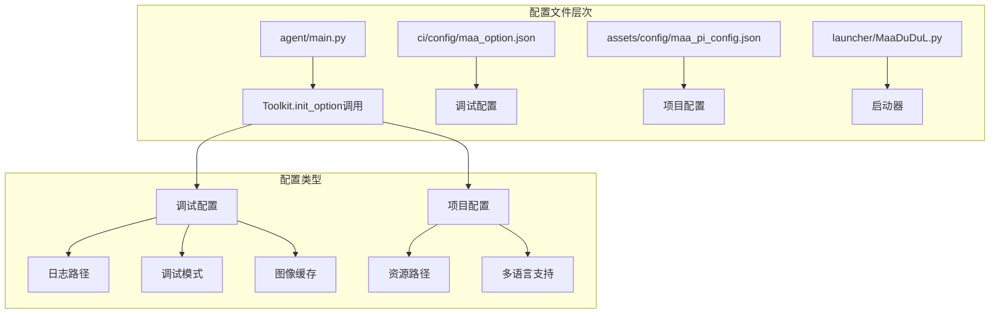
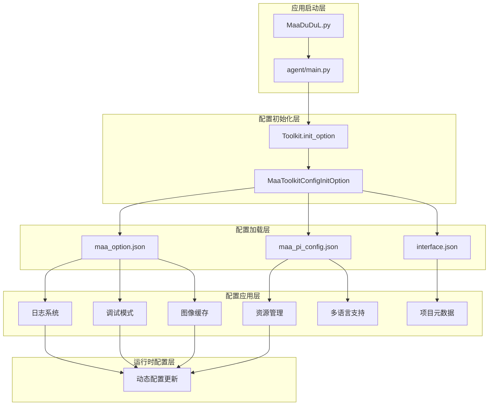
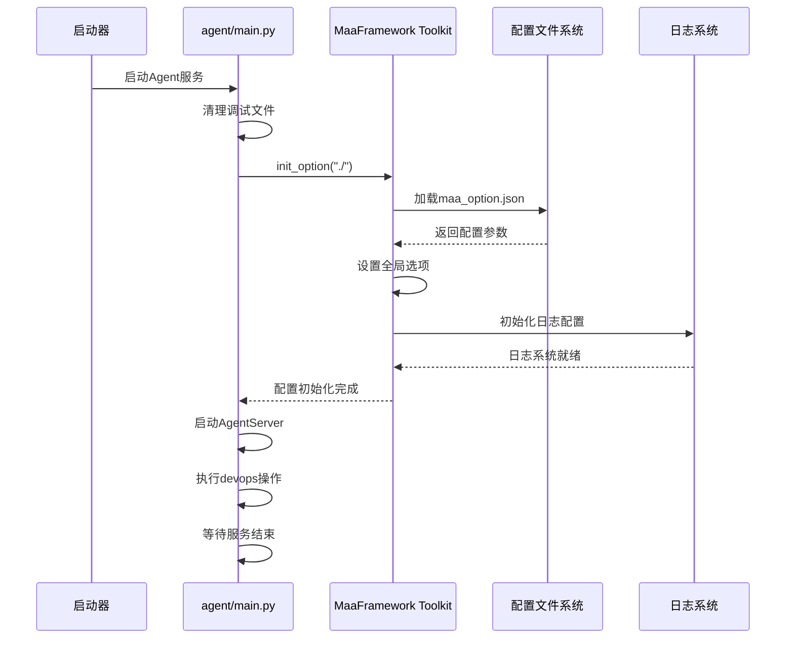
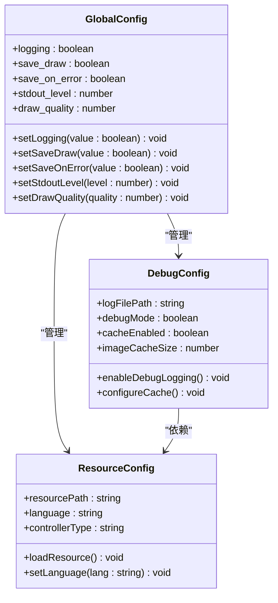
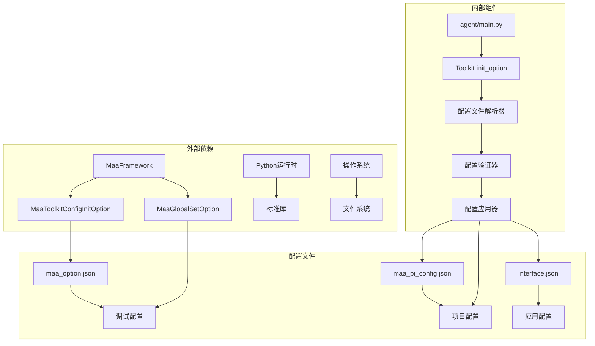

# 配置体系设计

<cite>
**本文档引用的文件**
- [agent/main.py](file://agent/main.py)
- [ci/config/maa_option.json](file://ci/config/maa_option.json)
- [assets/config/maa_pi_config.json](file://assets/config/maa_pi_config.json)
- [launcher/MaaDuDuL.py](file://launcher/MaaDuDuL.py)
- [package.json](file://package.json)
- [README.md](file://README.md)
- [instructions/maafw-guide/1.1-快速开始.md](file://instructions/maafw-guide/1.1-快速开始.md)
- [instructions/maafw-guide/2.2-集成接口一览.md](file://instructions/maafw-guide/2.2-集成接口一览.md)
- [instructions/maafw-guide/3.3-ProjectInterfaceV2协议.md](file://instructions/maafw-guide/3.3-ProjectInterfaceV2协议.md)
</cite>

## 目录
1. [简介](#简介)
2. [项目结构](#项目结构)
3. [核心组件](#核心组件)
4. [架构概览](#架构概览)
5. [详细组件分析](#详细组件分析)
6. [依赖关系分析](#依赖关系分析)
7. [性能考虑](#性能考虑)
8. [故障排除指南](#故障排除指南)
9. [结论](#结论)

## 简介

MaaDuDuL配置体系基于MaaFramework构建，采用多层次、模块化的配置管理机制。该体系通过MaaToolkitConfigInitOption接口初始化全局配置，支持用户路径自定义，并提供灵活的配置扩展能力。本文档深入解析配置加载流程，涵盖从应用启动到配置生效的完整时序，以及未来新增配置项的兼容性处理策略。

## 项目结构

MaaDuDuL项目采用清晰的分层架构，配置相关文件分布在多个目录中：

**图表来源**
- [agent/main.py](file://agent/main.py#L25-L32)
- [ci/config/maa_option.json](file://ci/config/maa_option.json#L1-L6)
- [assets/config/maa_pi_config.json](file://assets/config/maa_pi_config.json#L1-L3)

**章节来源**
- [agent/main.py](file://agent/main.py#L1-L48)
- [ci/config/maa_option.json](file://ci/config/maa_option.json#L1-L6)
- [assets/config/maa_pi_config.json](file://assets/config/maa_pi_config.json#L1-L3)

## 核心组件

### 配置初始化组件

MaaDuDuL的核心配置初始化流程围绕agent/main.py中的Toolkit.init_option()函数展开，该函数负责：

- **全局配置初始化**：通过MaaToolkitConfigInitOption接口设置全局运行参数
- **用户路径自定义**：支持用户指定自定义的工作目录和资源路径
- **调试配置加载**：自动加载并应用调试相关的配置选项

### 配置文件组件

系统包含多种类型的配置文件，每种都有特定的作用域和用途：

| 配置文件 | 作用域 | 主要功能 | 默认值 |
|---------|--------|----------|--------|
| maa_option.json | 调试/开发 | 日志、图像缓存、控制台输出级别 | logging=true, save_draw=false |
| maa_pi_config.json | 项目级 | 资源路径、多语言配置 | resource="B服" |
| interface.json | 应用级 | 项目元数据、控制器配置 | 多语言支持、版本信息 |

**章节来源**
- [agent/main.py](file://agent/main.py#L25-L32)
- [ci/config/maa_option.json](file://ci/config/maa_option.json#L1-L6)
- [assets/config/maa_pi_config.json](file://assets/config/maa_pi_config.json#L1-L3)

## 架构概览

MaaDuDuL的配置体系采用分层架构设计，确保配置的灵活性和可扩展性：

**图表来源**
- [launcher/MaaDuDuL.py](file://launcher/MaaDuDuL.py#L1-L22)
- [agent/main.py](file://agent/main.py#L25-L32)
- [ci/config/maa_option.json](file://ci/config/maa_option.json#L1-L6)
- [assets/config/maa_pi_config.json](file://assets/config/maa_pi_config.json#L1-L3)

## 详细组件分析

### Toolkit.init_option()调用流程

Toolkit.init_option()是配置体系的核心入口，负责协调整个配置初始化过程：

**图表来源**
- [agent/main.py](file://agent/main.py#L25-L36)
- [ci/config/maa_option.json](file://ci/config/maa_option.json#L1-L6)

#### 配置加载时序详解

1. **启动阶段**：应用启动后首先清理之前的调试文件
2. **初始化阶段**：调用Toolkit.init_option()进行全局配置初始化
3. **配置加载阶段**：系统自动扫描并加载配置文件
4. **应用阶段**：将配置参数应用到相应的系统组件
5. **服务启动阶段**：配置生效后启动Agent服务

### 全局配置管理

MaaFramework通过MaaGlobalSetOption接口提供全局配置管理能力：

**图表来源**
- [ci/config/maa_option.json](file://ci/config/maa_option.json#L1-L6)
- [assets/config/maa_pi_config.json](file://assets/config/maa_pi_config.json#L1-L3)

### 配置项详细说明

#### 调试配置项

| 配置项 | 数据类型 | 默认值 | 作用描述 | 使用场景 |
|--------|----------|--------|----------|----------|
| logging | boolean | true | 启用/禁用日志记录 | 开发调试、问题排查 |
| save_draw | boolean | false | 保存图像识别可视化结果 | 图像识别调试、算法优化 |
| save_on_error | boolean | false | 任务失败时保存截图 | 错误分析、问题定位 |
| stdout_level | number | 2 | 控制台日志输出级别 | 日志级别控制、性能监控 |
| draw_quality | number | 85 | 可视化图像质量(0-100) | 图像质量与存储平衡 |

#### 项目配置项

| 配置项 | 数据类型 | 默认值 | 作用描述 | 支持范围 |
|--------|----------|--------|----------|----------|
| resource | string | "B服" | 资源包标识符 | 多服务器支持 |
| languages | object | 内置多语言 | 多语言支持配置 | 中文、英文等 |
| controller | array | 系统默认 | 控制器类型配置 | ADB、Win32、PlayCover |

**章节来源**
- [ci/config/maa_option.json](file://ci/config/maa_option.json#L1-L6)
- [assets/config/maa_pi_config.json](file://assets/config/maa_pi_config.json#L1-L3)
- [instructions/maafw-guide/1.1-快速开始.md](file://instructions/maafw-guide/1.1-快速开始.md#L193-L201)

## 依赖关系分析

配置体系的依赖关系呈现清晰的层次结构：

**图表来源**
- [agent/main.py](file://agent/main.py#L20-L21)
- [ci/config/maa_option.json](file://ci/config/maa_option.json#L1-L6)
- [assets/config/maa_pi_config.json](file://assets/config/maa_pi_config.json#L1-L3)

### 配置加载优先级

配置系统采用明确的加载优先级机制：

1. **命令行参数**：最高优先级，直接覆盖所有其他配置
2. **用户配置文件**：次高优先级，用户自定义的配置
3. **系统默认配置**：默认配置，提供基本功能
4. **环境变量**：最低优先级，系统环境相关的配置

**章节来源**
- [agent/main.py](file://agent/main.py#L25-L32)
- [package.json](file://package.json#L1-L14)

## 性能考虑

配置体系在设计时充分考虑了性能影响：

### 配置加载性能

- **延迟加载**：非关键配置采用延迟加载策略
- **缓存机制**：频繁访问的配置项进行内存缓存
- **异步处理**：大型配置文件的解析采用异步处理

### 内存使用优化

- **增量配置**：只加载当前需要的配置部分
- **配置压缩**：对配置数据进行压缩存储
- **垃圾回收**：及时释放不再使用的配置对象

### 磁盘I/O优化

- **批量读取**：配置文件采用批量读取策略
- **预读机制**：预测用户可能需要的配置提前加载
- **写入优化**：配置修改采用异步写入机制

## 故障排除指南

### 常见配置问题

#### 配置文件加载失败

**症状**：应用启动时报配置文件不存在或格式错误

**解决方案**：
1. 检查配置文件路径是否正确
2. 验证JSON格式的合法性
3. 确认文件权限设置正确
4. 检查磁盘空间是否充足

#### 配置项冲突

**症状**：配置项之间存在冲突导致功能异常

**解决方案**：
1. 检查配置项之间的依赖关系
2. 验证配置项的兼容性
3. 按照配置优先级调整设置
4. 查阅相关文档了解配置约束

#### 性能问题

**症状**：应用响应缓慢或内存占用过高

**解决方案**：
1. 检查配置项的性能影响
2. 优化配置文件结构
3. 调整缓存策略
4. 监控资源配置使用情况

**章节来源**
- [instructions/maafw-guide/1.1-快速开始.md](file://instructions/maafw-guide/1.1-快速开始.md#L184-L201)

## 结论

MaaDuDuL的配置体系通过MaaFramework的强大功能，实现了高度模块化和可扩展的配置管理机制。该体系不仅满足了当前的功能需求，还为未来的功能扩展预留了充足的空间。

### 设计优势

1. **模块化设计**：清晰的配置层次结构便于维护和扩展
2. **灵活配置**：支持多种配置来源和优先级机制
3. **性能优化**：采用多种优化策略确保配置系统的高效运行
4. **兼容性强**：良好的向后兼容性保证了升级的平滑过渡

### 未来发展方向

1. **配置热重载**：支持运行时配置的动态更新
2. **配置模板**：提供配置模板功能简化配置过程
3. **配置审计**：增强配置变更的追踪和审计能力
4. **云端同步**：支持配置的云端备份和同步

通过持续的优化和完善，MaaDuDuL的配置体系将成为MaaFramework生态中配置管理的最佳实践案例。