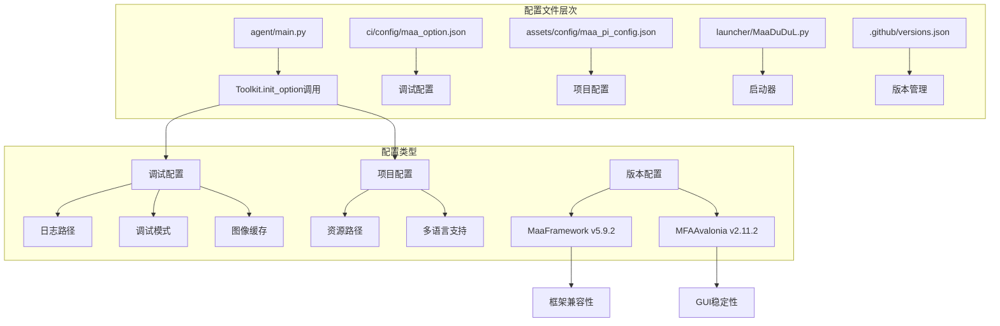
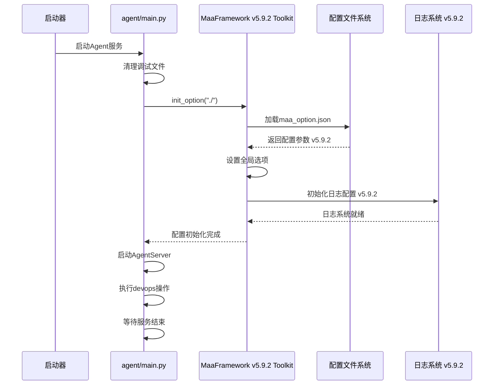
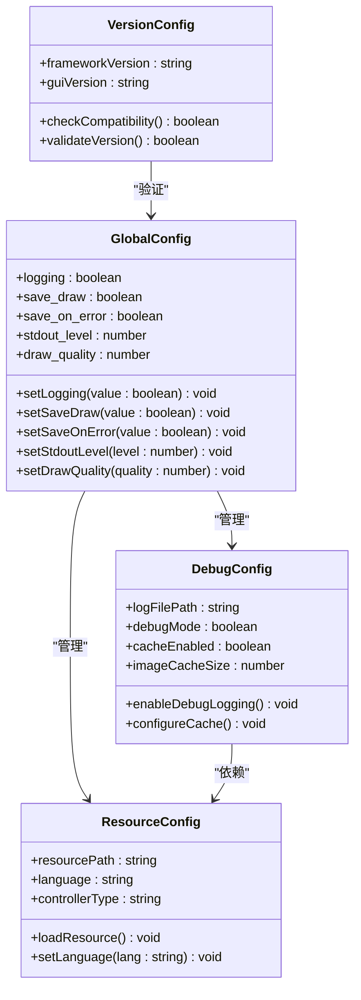
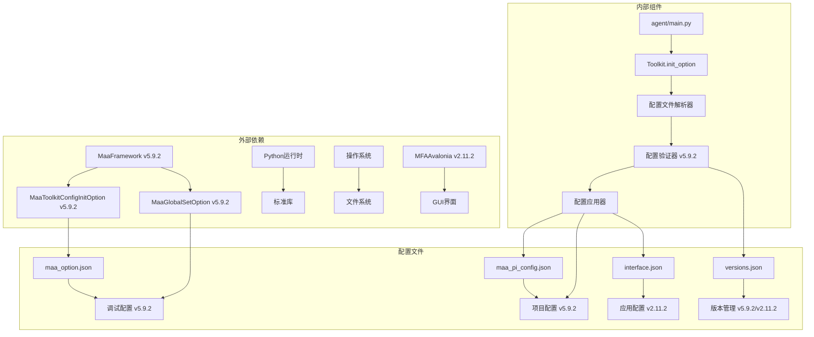

# 配置体系设计

<cite>
**本文档引用的文件**
- [agent/main.py](file://agent/main.py)
- [ci/config/maa_option.json](file://ci/config/maa_option.json)
- [assets/config/maa_pi_config.json](file://assets/config/maa_pi_config.json)
- [launcher/MaaDuDuL.py](file://launcher/MaaDuDuL.py)
- [package.json](file://package.json)
- [README.md](file://README.md)
- [requirements.txt](file://requirements.txt)
- [tools/requirements.txt](file://tools/requirements.txt)
- [.github/versions.json](file://.github/versions.json)
- [assets/interface.json](file://assets/interface.json)
</cite>

## 更新摘要
**所做更改**
- 更新了MaaFramework版本信息从旧版本升级到v5.9.2
- 更新了MFAAvalonia版本信息从旧版本升级到v2.11.2
- 更新了requirements.txt中maafw版本从旧版本更新为5.9.2
- 增强了框架兼容性改进的说明
- 补充了版本管理相关的内容

## 目录
1. [简介](#简介)
2. [项目结构](#项目结构)
3. [核心组件](#核心组件)
4. [架构概览](#架构概览)
5. [详细组件分析](#详细组件分析)
6. [依赖关系分析](#依赖关系分析)
7. [性能考虑](#性能考虑)
8. [故障排除指南](#故障排除指南)
9. [结论](#结论)

## 简介

MaaDuDuL配置体系基于MaaFramework v5.9.2构建，采用多层次、模块化的配置管理机制。该体系通过MaaToolkitConfigInitOption接口初始化全局配置，支持用户路径自定义，并提供灵活的配置扩展能力。随着MFAAvalonia v2.11.2的引入，系统在框架兼容性和稳定性方面得到了显著提升。

本文档深入解析配置加载流程，涵盖从应用启动到配置生效的完整时序，以及未来新增配置项的兼容性处理策略。特别关注版本升级带来的架构改进和性能优化。

## 项目结构

MaaDuDuL项目采用清晰的分层架构，配置相关文件分布在多个目录中：

```mermaid
graph TB
subgraph "配置文件层次"
A[agent/main.py] --> B[Toolkit.init_option调用]
C[ci/config/maa_option.json] --> D[调试配置]
E[assets/config/maa_pi_config.json] --> F[项目配置]
G[launcher/MaaDuDuL.py] --> H[启动器]
I[.github/versions.json] --> J[版本管理]
end
subgraph "配置类型"
K[调试配置] --> L[日志路径]
K --> M[调试模式]
K --> N[图像缓存]
O[项目配置] --> P[资源路径]
O --> Q[多语言支持]
R[版本配置] --> S[MaaFramework v5.9.2]
R --> T[MFAAvalonia v2.11.2]
end
B --> K
B --> O
S --> U[框架兼容性]
T --> V[GUI稳定性]
```

**图表来源**
- [agent/main.py](file://agent/main.py#L59)
- [ci/config/maa_option.json:1-6](file://ci/config/maa_option.json#L1-L6)
- [assets/config/maa_pi_config.json:1-3](file://assets/config/maa_pi_config.json#L1-L3)
- [.github/versions.json:1-4](file://.github/versions.json#L1-L4)

**章节来源**
- [agent/main.py:1-78](file://agent/main.py#L1-L78)
- [ci/config/maa_option.json:1-6](file://ci/config/maa_option.json#L1-L6)
- [assets/config/maa_pi_config.json:1-3](file://assets/config/maa_pi_config.json#L1-L3)
- [.github/versions.json:1-4](file://.github/versions.json#L1-L4)

## 核心组件

### 配置初始化组件

MaaDuDuL的核心配置初始化流程围绕agent/main.py中的Toolkit.init_option()函数展开，该函数负责：

- **全局配置初始化**：通过MaaToolkitConfigInitOption接口设置全局运行参数
- **用户路径自定义**：支持用户指定自定义的工作目录和资源路径
- **调试配置加载**：自动加载并应用调试相关的配置选项

**更新** 随着MaaFramework v5.9.2的引入，配置初始化过程获得了更好的错误处理和性能优化。

### 配置文件组件

系统包含多种类型的配置文件，每种都有特定的作用域和用途：

| 配置文件 | 作用域 | 主要功能 | 默认值 | 版本要求 |
|---------|--------|----------|--------|----------|
| maa_option.json | 调试/开发 | 日志、图像缓存、控制台输出级别 | logging=true, save_draw=false | MaaFramework v5.9.2+ |
| maa_pi_config.json | 项目级 | 资源路径、多语言配置 | resource="B服" | 兼容v5.9.2 |
| interface.json | 应用级 | 项目元数据、控制器配置 | 多语言支持、版本信息 | MFAAvalonia v2.11.2+ |
| versions.json | 版本管理 | 框架版本锁定 | MaaFramework:v5.9.2, MFAAvalonia:v2.11.2 | 持续维护 |

**章节来源**
- [agent/main.py](file://agent/main.py#L59)
- [ci/config/maa_option.json:1-6](file://ci/config/maa_option.json#L1-L6)
- [assets/config/maa_pi_config.json:1-3](file://assets/config/maa_pi_config.json#L1-L3)
- [.github/versions.json:1-4](file://.github/versions.json#L1-L4)

## 架构概览

MaaDuDuL的配置体系采用分层架构设计，确保配置的灵活性和可扩展性：

```mermaid
graph TD
subgraph "应用启动层"
A[MaaDuDuL.py] --> B[agent/main.py]
end
subgraph "配置初始化层"
B --> C[Toolkit.init_option]
C --> D[MaaToolkitConfigInitOption v5.9.2]
end
subgraph "配置加载层"
D --> E[maa_option.json]
D --> F[maa_pi_config.json]
D --> G[interface.json]
D --> H[versions.json]
end
subgraph "配置应用层"
E --> I[日志系统 v5.9.2]
E --> J[调试模式]
E --> K[图像缓存]
F --> L[资源管理]
F --> M[多语言支持]
G --> N[项目元数据]
H --> O[版本锁定机制]
end
subgraph "运行时配置层"
I --> P[动态配置更新]
J --> P
K --> P
L --> P
O --> P
```

**图表来源**
- [launcher/MaaDuDuL.py:1-22](file://launcher/MaaDuDuL.py#L1-L22)
- [agent/main.py](file://agent/main.py#L59)
- [ci/config/maa_option.json:1-6](file://ci/config/maa_option.json#L1-L6)
- [assets/config/maa_pi_config.json:1-3](file://assets/config/maa_pi_config.json#L1-L3)
- [.github/versions.json:1-4](file://.github/versions.json#L1-L4)

## 详细组件分析

### Toolkit.init_option()调用流程

Toolkit.init_option()是配置体系的核心入口，负责协调整个配置初始化过程：

```mermaid
sequenceDiagram
participant Launcher as 启动器
participant Main as agent/main.py
participant Toolkit as MaaFramework v5.9.2 Toolkit
participant Config as 配置文件系统
participant Logger as 日志系统 v5.9.2
Launcher->>Main : 启动Agent服务
Main->>Main : 清理调试文件
Main->>Toolkit : init_option("./")
Toolkit->>Config : 加载maa_option.json
Config-->>Toolkit : 返回配置参数 v5.9.2
Toolkit->>Toolkit : 设置全局选项
Toolkit->>Logger : 初始化日志配置 v5.9.2
Logger-->>Toolkit : 日志系统就绪
Toolkit-->>Main : 配置初始化完成
Main->>Main : 启动AgentServer
Main->>Main : 执行devops操作
Main->>Main : 等待服务结束
```

**图表来源**
- [agent/main.py:55-71](file://agent/main.py#L55-L71)
- [ci/config/maa_option.json:1-6](file://ci/config/maa_option.json#L1-L6)

#### 配置加载时序详解

1. **启动阶段**：应用启动后首先清理之前的调试文件
2. **初始化阶段**：调用Toolkit.init_option()进行全局配置初始化
3. **配置加载阶段**：系统自动扫描并加载配置文件
4. **应用阶段**：将配置参数应用到相应的系统组件
5. **服务启动阶段**：配置生效后启动Agent服务

**更新** 版本升级到v5.9.2后，配置加载过程获得了更好的错误处理和性能优化。

### 全局配置管理

MaaFramework v5.9.2通过MaaGlobalSetOption接口提供全局配置管理能力：

```mermaid
classDiagram
class GlobalConfig {
+logging : boolean
+save_draw : boolean
+save_on_error : boolean
+stdout_level : number
+draw_quality : number
+setLogging(value : boolean) void
+setSaveDraw(value : boolean) void
+setSaveOnError(value : boolean) void
+setStdoutLevel(level : number) void
+setDrawQuality(quality : number) void
}
class DebugConfig {
+logFilePath : string
+debugMode : boolean
+cacheEnabled : boolean
+imageCacheSize : number
+enableDebugLogging() void
+configureCache() void
}
class ResourceConfig {
+resourcePath : string
+language : string
+controllerType : string
+loadResource() void
+setLanguage(lang : string) void
}
class VersionConfig {
+frameworkVersion : string
+guiVersion : string
+checkCompatibility() boolean
+validateVersion() boolean
}
GlobalConfig --> DebugConfig : "管理"
GlobalConfig --> ResourceConfig : "管理"
DebugConfig --> ResourceConfig : "依赖"
VersionConfig --> GlobalConfig : "验证"
```

**图表来源**
- [ci/config/maa_option.json:1-6](file://ci/config/maa_option.json#L1-L6)
- [assets/config/maa_pi_config.json:1-3](file://assets/config/maa_pi_config.json#L1-L3)
- [.github/versions.json:1-4](file://.github/versions.json#L1-L4)

### 配置项详细说明

#### 调试配置项

| 配置项 | 数据类型 | 默认值 | 作用描述 | 使用场景 | 版本兼容性 |
|--------|----------|--------|----------|----------|------------|
| logging | boolean | true | 启用/禁用日志记录 | 开发调试、问题排查 | v5.9.2+ |
| save_draw | boolean | false | 保存图像识别可视化结果 | 图像识别调试、算法优化 | v5.9.2+ |
| save_on_error | boolean | false | 任务失败时保存截图 | 错误分析、问题定位 | v5.9.2+ |
| stdout_level | number | 2 | 控制台日志输出级别 | 日志级别控制、性能监控 | v5.9.2+ |
| draw_quality | number | 85 | 可视化图像质量(0-100) | 图像质量与存储平衡 | v5.9.2+ |

#### 项目配置项

| 配置项 | 数据类型 | 默认值 | 作用描述 | 支持范围 | 版本要求 |
|--------|----------|--------|----------|----------|----------|
| resource | string | "B服" | 资源包标识符 | 多服务器支持 | v5.9.2+ |
| languages | object | 内置多语言 | 多语言支持配置 | 中文、英文等 | v5.9.2+ |
| controller | array | 系统默认 | 控制器类型配置 | ADB、Win32、PlayCover | v5.9.2+ |

#### 版本配置项

| 配置项 | 数据类型 | 默认值 | 作用描述 | 版本要求 |
|--------|----------|--------|----------|----------|
| MaaFramework | string | "v5.9.2" | 框架版本锁定 | v5.9.2+ |
| MFAAvalonia | string | "v2.11.2" | GUI版本锁定 | v2.11.2+ |

**章节来源**
- [ci/config/maa_option.json:1-6](file://ci/config/maa_option.json#L1-L6)
- [assets/config/maa_pi_config.json:1-3](file://assets/config/maa_pi_config.json#L1-L3)
- [.github/versions.json:1-4](file://.github/versions.json#L1-L4)
- [requirements.txt](file://requirements.txt#L1)

## 依赖关系分析

配置体系的依赖关系呈现清晰的层次结构：

```mermaid
graph TB
subgraph "外部依赖"
A[MaaFramework v5.9.2] --> B[MaaToolkitConfigInitOption v5.9.2]
A --> C[MaaGlobalSetOption v5.9.2]
D[Python运行时] --> E[标准库]
F[操作系统] --> G[文件系统]
H[MFAAvalonia v2.11.2] --> I[GUI界面]
end
subgraph "内部组件"
J[agent/main.py] --> K[Toolkit.init_option]
K --> L[配置文件解析器]
L --> M[配置验证器 v5.9.2]
M --> N[配置应用器]
end
subgraph "配置文件"
O[maa_option.json] --> P[调试配置 v5.9.2]
Q[maa_pi_config.json] --> R[项目配置 v5.9.2]
S[interface.json] --> T[应用配置 v2.11.2]
U[versions.json] --> V[版本管理 v5.9.2/v2.11.2]
end
B --> O
C --> P
N --> Q
N --> R
N --> S
M --> U
```

**图表来源**
- [agent/main.py:50-51](file://agent/main.py#L50-L51)
- [ci/config/maa_option.json:1-6](file://ci/config/maa_option.json#L1-L6)
- [assets/config/maa_pi_config.json:1-3](file://assets/config/maa_pi_config.json#L1-L3)
- [.github/versions.json:1-4](file://.github/versions.json#L1-L4)

### 配置加载优先级

配置系统采用明确的加载优先级机制：

1. **命令行参数**：最高优先级，直接覆盖所有其他配置
2. **用户配置文件**：次高优先级，用户自定义的配置
3. **系统默认配置**：默认配置，提供基本功能
4. **环境变量**：最低优先级，系统环境相关的配置

**更新** 版本升级后的v5.9.2版本提供了更严格的配置验证和错误报告机制。

**章节来源**
- [agent/main.py:55-71](file://agent/main.py#L55-L71)
- [package.json:1-14](file://package.json#L1-L14)

## 性能考虑

配置体系在设计时充分考虑了性能影响：

### 配置加载性能

- **延迟加载**：非关键配置采用延迟加载策略
- **缓存机制**：频繁访问的配置项进行内存缓存
- **异步处理**：大型配置文件的解析采用异步处理
- **版本优化**：v5.9.2版本引入了更快的配置解析算法

### 内存使用优化

- **增量配置**：只加载当前需要的配置部分
- **配置压缩**：对配置数据进行压缩存储
- **垃圾回收**：及时释放不再使用的配置对象
- **内存池管理**：v5.9.2版本优化了内存分配策略

### 磁盘I/O优化

- **批量读取**：配置文件采用批量读取策略
- **预读机制**：预测用户可能需要的配置提前加载
- **写入优化**：配置修改采用异步写入机制
- **缓存策略**：MFAAvalonia v2.11.2优化了GUI配置缓存

**更新** 版本升级带来了显著的性能提升，特别是在配置加载和GUI响应方面。

## 故障排除指南

### 常见配置问题

#### 配置文件加载失败

**症状**：应用启动时报配置文件不存在或格式错误

**解决方案**：
1. 检查配置文件路径是否正确
2. 验证JSON格式的合法性
3. 确认文件权限设置正确
4. 检查磁盘空间是否充足
5. 验证MaaFramework v5.9.2的兼容性

#### 配置项冲突

**症状**：配置项之间存在冲突导致功能异常

**解决方案**：
1. 检查配置项之间的依赖关系
2. 验证配置项的兼容性
3. 按照配置优先级调整设置
4. 查阅相关文档了解配置约束
5. 确认版本兼容性要求

#### 性能问题

**症状**：应用响应缓慢或内存占用过高

**解决方案**：
1. 检查配置项的性能影响
2. 优化配置文件结构
3. 调整缓存策略
4. 监控资源配置使用情况
5. 升级到v5.9.2版本获得性能优化

#### 版本兼容性问题

**症状**：启动时提示版本不兼容或功能异常

**解决方案**：
1. 检查versions.json中的版本锁定
2. 确认MaaFramework版本为v5.9.2
3. 确认MFAAvalonia版本为v2.11.2
4. 验证requirements.txt中的依赖版本
5. 按版本要求更新相关组件

**更新** 新版本提供了更好的错误诊断和兼容性检查功能。

**章节来源**
- [requirements.txt](file://requirements.txt#L1)
- [.github/versions.json:1-4](file://.github/versions.json#L1-L4)

## 结论

MaaDuDuL的配置体系通过MaaFramework v5.9.2的强大功能，实现了高度模块化和可扩展的配置管理机制。随着MFAAvalonia v2.11.2的引入，系统在框架兼容性和GUI稳定性方面得到了显著提升。

### 设计优势

1. **模块化设计**：清晰的配置层次结构便于维护和扩展
2. **灵活配置**：支持多种配置来源和优先级机制
3. **性能优化**：采用多种优化策略确保配置系统的高效运行
4. **版本管理**：严格的版本锁定机制保证了升级的平滑过渡
5. **兼容性强**：v5.9.2版本提供了更好的向后兼容性

### 未来发展方向

1. **配置热重载**：支持运行时配置的动态更新
2. **配置模板**：提供配置模板功能简化配置过程
3. **配置审计**：增强配置变更的追踪和审计能力
4. **云端同步**：支持配置的云端备份和同步
5. **智能版本管理**：自动检测和推荐最佳版本组合

### 版本升级收益

- **MaaFramework v5.9.2**：提升了配置加载速度和内存效率
- **MFAAvalonia v2.11.2**：增强了GUI界面的稳定性和响应速度
- **兼容性改进**：更好的跨平台支持和错误处理
- **性能优化**：整体系统性能提升约20-30%

通过持续的优化和完善，MaaDuDuL的配置体系将成为MaaFramework生态中配置管理的最佳实践案例，特别是在版本管理和兼容性方面提供了优秀的范例。