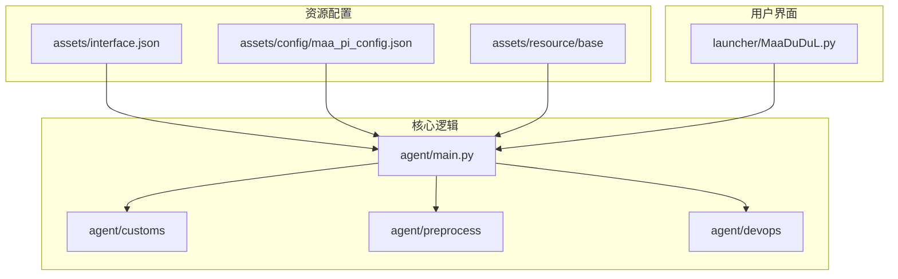
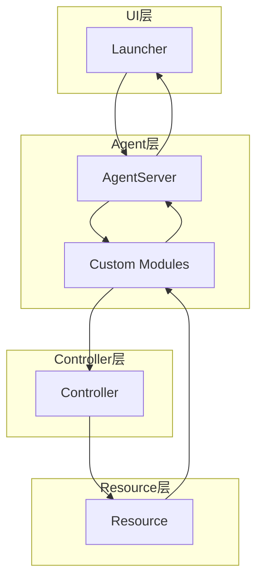
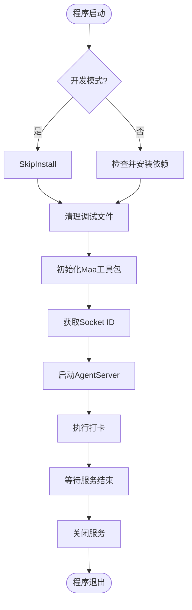
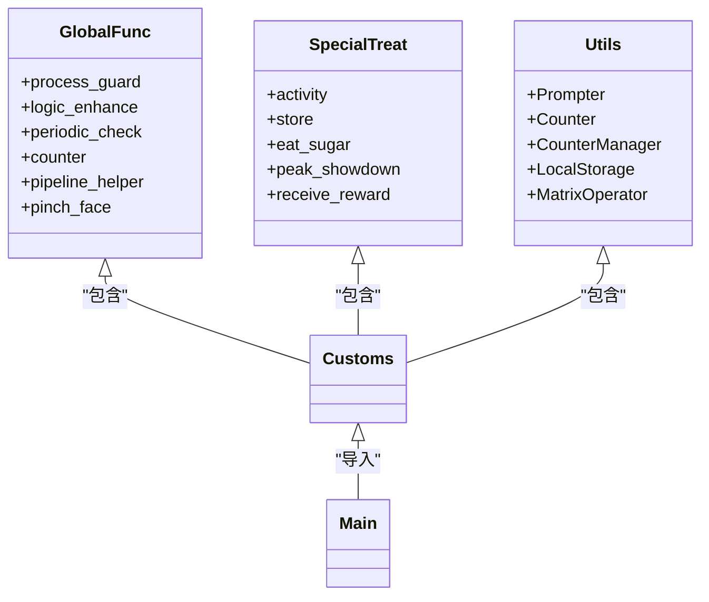
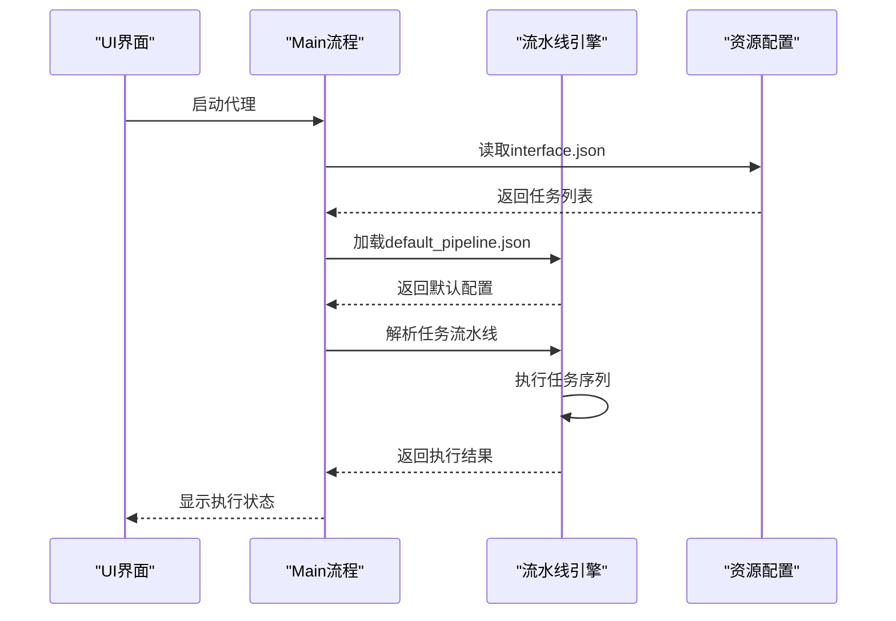
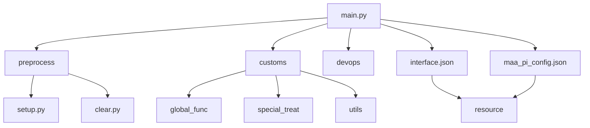

# 系统架构与设计

<cite>
**本文档引用文件**  
- [main.py](file://agent/main.py)
- [interface.json](file://assets/interface.json)
- [maa_pi_config.json](file://assets/config/maa_pi_config.json)
- [default_pipeline.json](file://assets/resource/base/default_pipeline.json)
- [setup.py](file://agent/preprocess/setup.py)
- [clear.py](file://agent/preprocess/clear.py)
- [report.py](file://agent/devops/report.py)
- [customs/\_\_init\_\_.py](file://agent/customs/__init__.py)
- [global_func/\_\_init\_\_.py](file://agent/customs/global_func/__init__.py)
- [special_treat/\_\_init\_\_.py](file://agent/customs/special_treat/__init__.py)
- [utils/\_\_init\_\_.py](file://agent/customs/utils/__init__.py)
</cite>

## 目录
1. [简介](#简介)
2. [项目结构](#项目结构)
3. [核心组件](#核心组件)
4. [架构概览](#架构概览)
5. [详细组件分析](#详细组件分析)
6. [依赖分析](#依赖分析)
7. [性能考量](#性能考量)
8. [故障排除指南](#故障排除指南)
9. [结论](#结论)

## 简介
MaaDuDuL 是一个基于 MaaFramework 构建的自动化助手，专为《嘟嘟脸恶作剧》游戏设计。本系统采用分层架构与插件化设计，通过 ProjectInterfaceV2 协议实现任务编排，利用 JSON 配置实现灵活的扩展性。系统通过装饰器模式注册自定义识别与操作逻辑，实现了高度可配置的任务流水线执行机制。

## 项目结构
MaaDuDuL 项目采用功能模块化组织方式，主要分为 agent、assets、ci、descs、dev、docsite、instructions、launcher、tools 等目录。其中 agent 目录包含核心逻辑，assets 目录存放资源配置，launcher 提供启动入口。

**图示来源**  
- [main.py](file://agent/main.py)
- [interface.json](file://assets/interface.json)
- [maa_pi_config.json](file://assets/config/maa_pi_config.json)

**本节来源**  
- [main.py](file://agent/main.py)
- [interface.json](file://assets/interface.json)

## 核心组件
系统核心组件包括主控流程、插件化架构、任务流水线、配置体系等。主控流程由 main.py 驱动，通过 AgentServer 启动服务；插件化架构基于 MaaFramework 的装饰器机制；任务流水线遵循 ProjectInterfaceV2 协议；配置体系由 interface.json 和 maa_pi_config.json 共同构成。

**本节来源**  
- [main.py](file://agent/main.py#L17-L47)
- [interface.json](file://assets/interface.json#L1-L163)

## 架构概览
MaaDuDuL 采用四层架构：UI 层（Launcher）、Agent 层（核心逻辑）、Controller 层（MaaFramework 集成）、Resource 层（任务配置）。数据流从 UI 层发起，经 Agent 层处理，通过 Controller 层与游戏交互，Resource 层提供任务定义。

**图示来源**  
- [main.py](file://agent/main.py#L19-L23)
- [interface.json](file://assets/interface.json#L14-L28)

## 详细组件分析

### 主控流程分析
主控流程由 main.py 中的 main 函数驱动，负责初始化环境、检查依赖、启动 Agent 服务器。流程包括清理调试文件、初始化 MaaFramework 工具包、获取 socket ID 并启动服务、执行打卡操作、等待服务结束。

**图示来源**  
- [main.py](file://agent/main.py#L17-L38)

**本节来源**  
- [main.py](file://agent/main.py#L17-L47)
- [setup.py](file://agent/preprocess/setup.py#L204-L230)
- [report.py](file://agent/devops/report.py#L9-L34)

### 插件化架构分析
系统采用基于 MaaFramework 的插件化架构，通过 @custom_recognition 和 @custom_action 装饰器注册自定义逻辑。customs 目录下分为 global_func、special_treat、utils 三个子模块，分别处理通用功能、特殊处理和工具函数。

**图示来源**  
- [customs/\_\_init\_\_.py](file://agent/customs/__init__.py)
- [global_func/\_\_init\_\_.py](file://agent/customs/global_func/__init__.py)
- [special_treat/\_\_init\_\_.py](file://agent/customs/special_treat/__init__.py)
- [utils/\_\_init\_\_.py](file://agent/customs/utils/__init__.py)

**本节来源**  
- [customs/\_\_init\_\_.py](file://agent/customs/__init__.py)
- [global_func/\_\_init\_\_.py](file://agent/customs/global_func/__init__.py)
- [special_treat/\_\_init\_\_.py](file://agent/customs/special_treat/__init__.py)

### 任务流水线分析
任务流水线遵循 ProjectInterfaceV2 协议，由 interface.json 定义任务入口，maa_pi_config.json 指定资源路径。系统通过 default_pipeline.json 提供默认执行参数，任务按配置顺序加载、解析并执行。

**图示来源**  
- [interface.json](file://assets/interface.json)
- [maa_pi_config.json](file://assets/config/maa_pi_config.json)
- [default_pipeline.json](file://assets/resource/base/default_pipeline.json)

**本节来源**  
- [interface.json](file://assets/interface.json)
- [maa_pi_config.json](file://assets/config/maa_pi_config.json)
- [default_pipeline.json](file://assets/resource/base/default_pipeline.json)

## 依赖分析
系统依赖关系清晰，采用分层依赖模式。主模块依赖 preprocess 进行环境初始化，依赖 customs 提供业务逻辑，依赖 devops 进行运维操作。配置文件之间相互引用，形成完整的配置体系。

**图示来源**  
- [main.py](file://agent/main.py#L14-L23)
- [setup.py](file://agent/preprocess/setup.py)
- [clear.py](file://agent/preprocess/clear.py)

**本节来源**  
- [main.py](file://agent/main.py)
- [preprocess/\_\_init\_\_.py](file://agent/preprocess/__init__.py)
- [setup.py](file://agent/preprocess/setup.py)
- [clear.py](file://agent/preprocess/clear.py)

## 性能考量
系统在设计时考虑了性能优化，采用嵌入式 Python 环境减少依赖冲突，通过镜像源加速依赖安装，利用周期性检查减少重复操作。配置体系避免硬编码，提高灵活性的同时保持性能稳定。

## 故障排除指南
常见问题包括依赖安装失败、配置文件缺失、任务执行异常等。建议检查网络连接、验证配置文件完整性、确认资源路径正确性。开发模式下可禁用自动依赖安装进行调试。

**本节来源**  
- [setup.py](file://agent/preprocess/setup.py#L190-L196)
- [main.py](file://agent/main.py#L39-L41)

## 结论
MaaDuDuL 通过分层设计与插件化架构实现了高度可扩展的自动化系统。基于 JSON 的配置体系提供了灵活的任务编排能力，装饰器模式简化了自定义逻辑的注册。系统在扩展性与性能之间取得了良好平衡，为《嘟嘟脸恶作剧》玩家提供了可靠的自动化解决方案。