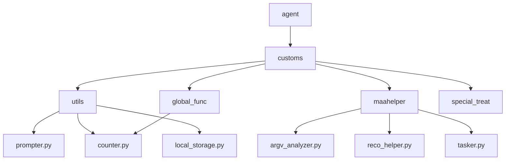
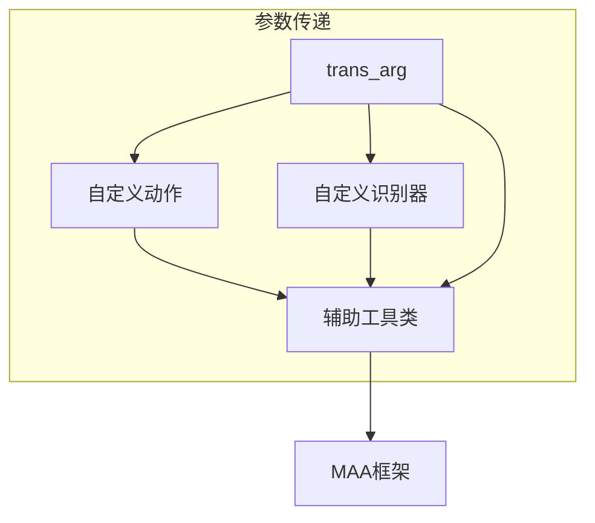
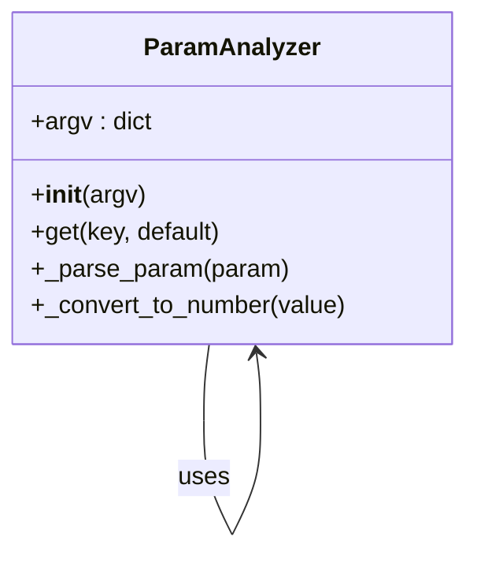
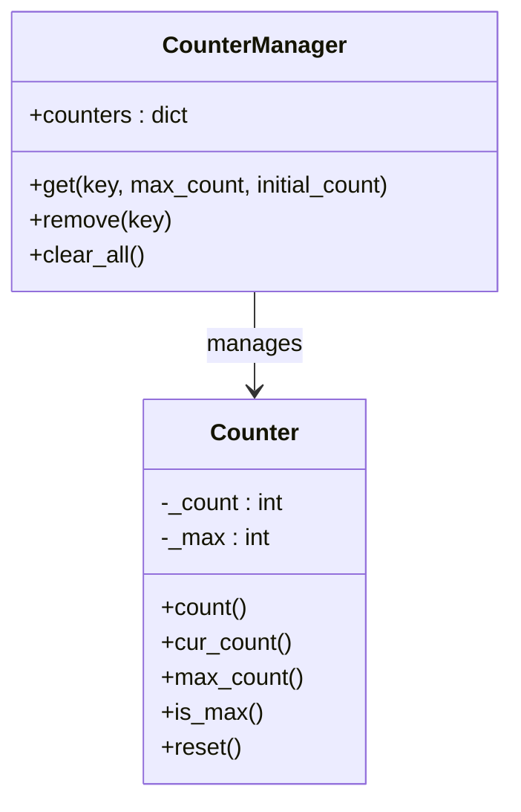
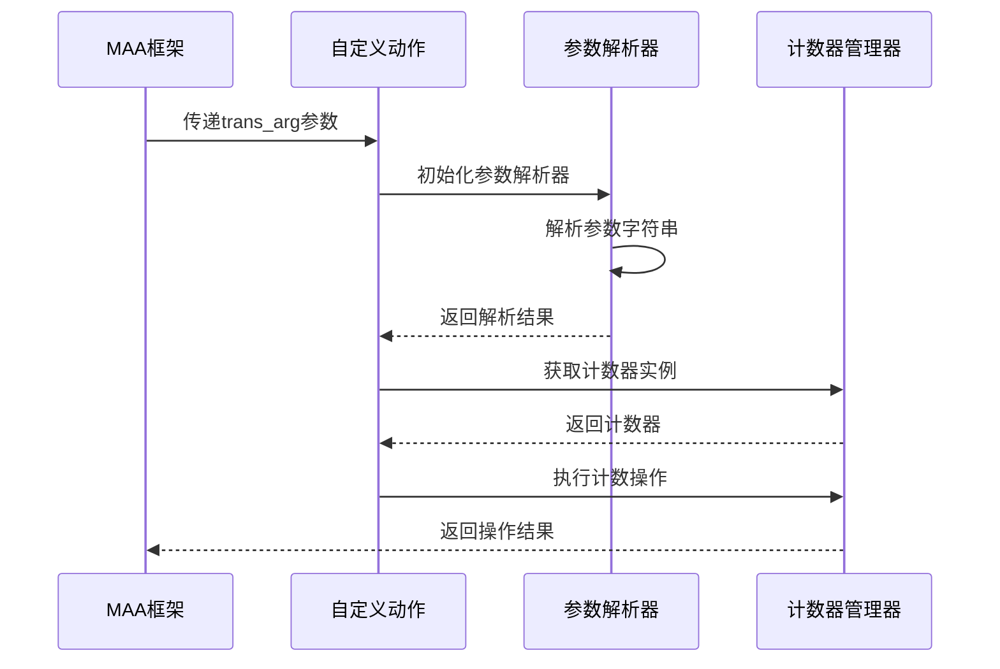
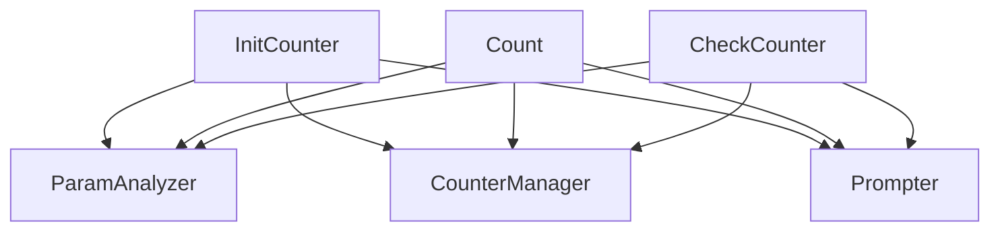

# 上下文参数传递机制

<cite>
**本文档引用的文件**  
- [prompter.py](file://agent/customs/utils/prompter.py)
- [counter.py](file://agent/customs/global_func/counter.py)
- [counter.py](file://agent/customs/utils/counter.py)
- [argv_analyzer.py](file://agent/customs/maahelper/argv_analyzer.py)
- [reco_helper.py](file://agent/customs/maahelper/reco_helper.py)
- [tasker.py](file://agent/customs/maahelper/tasker.py)
- [local_storage.py](file://agent/customs/utils/local_storage.py)
</cite>

## 目录
1. [引言](#引言)
2. [项目结构](#项目结构)
3. [核心组件](#核心组件)
4. [架构概述](#架构概述)
5. [详细组件分析](#详细组件分析)
6. [依赖分析](#依赖分析)
7. [性能考虑](#性能考虑)
8. [故障排除指南](#故障排除指南)
9. [结论](#结论)

## 引言
本文档深入分析了 `trans_arg` 参数在自定义识别器和操作器中的上下文传递机制。通过研究 `agent/customs/utils/prompter.py` 和 `counter.py` 中的实际用例，详细说明了如何利用 `trans_arg` 在不同组件间安全传递配置参数、状态信息和共享数据。文档还解释了参数序列化和反序列化的处理过程，以及在多线程环境下的数据一致性保障机制。

## 项目结构
本项目采用模块化设计，主要分为 agent、assets、ci、descs、dev、docsite、instructions、launcher、tools 等目录。核心功能集中在 agent 目录下，其中 customs 子目录包含了自定义功能的实现，包括全局功能、MAA 辅助工具、特殊处理和工具类。

**图源**  
- [prompter.py](file://agent/customs/utils/prompter.py)
- [counter.py](file://agent/customs/global_func/counter.py)
- [counter.py](file://agent/customs/utils/counter.py)
- [argv_analyzer.py](file://agent/customs/maahelper/argv_analyzer.py)

## 核心组件
系统的核心组件包括参数解析器、计数器管理器、识别辅助工具和任务执行器。这些组件通过上下文对象和参数传递机制协同工作，实现了复杂的状态管理和数据共享功能。

**组件源**  
- [argv_analyzer.py](file://agent/customs/maahelper/argv_analyzer.py#L17-L159)
- [counter.py](file://agent/customs/utils/counter.py#L1-L141)
- [reco_helper.py](file://agent/customs/maahelper/reco_helper.py#L17-L256)
- [tasker.py](file://agent/customs/maahelper/tasker.py#L16-L177)

## 架构概述
系统采用分层架构设计，上层为自定义动作和识别器，中层为辅助工具类，底层为 MAA 框架接口。参数传递机制贯穿整个架构，确保了数据在各层之间的安全流动。

**图源**  
- [prompter.py](file://agent/customs/utils/prompter.py#L16-L54)
- [counter.py](file://agent/customs/global_func/counter.py#L21-L118)
- [argv_analyzer.py](file://agent/customs/maahelper/argv_analyzer.py#L30-L46)

## 详细组件分析

### 参数解析机制
参数解析器负责将字符串形式的参数转换为结构化的字典对象，支持 JSON 和查询字符串两种格式。

#### 参数解析器类图

**图源**  
- [argv_analyzer.py](file://agent/customs/maahelper/argv_analyzer.py#L17-L159)

**组件源**  
- [argv_analyzer.py](file://agent/customs/maahelper/argv_analyzer.py#L17-L159)

### 计数器管理机制
计数器系统提供了初始化、计数和状态检查等功能，通过全局管理器实现跨组件的状态共享。

#### 计数器类图

**图源**  
- [counter.py](file://agent/customs/utils/counter.py#L1-L141)
- [counter.py](file://agent/customs/global_func/counter.py#L21-L118)

**组件源**  
- [counter.py](file://agent/customs/utils/counter.py#L1-L141)
- [counter.py](file://agent/customs/global_func/counter.py#L21-L118)

### 上下文传递流程
上下文参数在自定义动作和识别器之间的传递流程如下：

#### 上下文传递序列图

**图源**  
- [counter.py](file://agent/customs/global_func/counter.py#L28-L48)
- [argv_analyzer.py](file://agent/customs/maahelper/argv_analyzer.py#L30-L46)

**组件源**  
- [counter.py](file://agent/customs/global_func/counter.py#L28-L48)
- [argv_analyzer.py](file://agent/customs/maahelper/argv_analyzer.py#L30-L46)

## 依赖分析
系统各组件之间的依赖关系清晰，通过接口隔离和依赖注入实现了低耦合、高内聚的设计目标。

**图源**  
- [counter.py](file://agent/customs/global_func/counter.py#L14-L16)
- [counter.py](file://agent/customs/utils/counter.py#L75-L141)

**组件源**  
- [counter.py](file://agent/customs/global_func/counter.py#L14-L16)
- [counter.py](file://agent/customs/utils/counter.py#L75-L141)

## 性能考虑
在设计上下文参数传递机制时，需要考虑以下性能因素：
- 参数解析的开销
- 对象创建和销毁的频率
- 内存使用效率
- 多线程环境下的同步开销

最佳实践包括：
- 复用参数解析器实例
- 使用轻量级数据结构
- 避免不必要的对象创建
- 合理使用缓存机制

## 故障排除指南
常见问题及解决方案：

1. **参数解析失败**：检查参数格式是否符合 JSON 或查询字符串规范
2. **计数器状态不一致**：确保在多线程环境下正确同步访问
3. **上下文传递中断**：验证参数传递链路的完整性
4. **内存泄漏**：定期清理不再使用的计数器实例

**组件源**  
- [prompter.py](file://agent/customs/utils/prompter.py#L34-L54)
- [counter.py](file://agent/customs/global_func/counter.py#L48-L49)
- [counter.py](file://agent/customs/global_func/counter.py#L78-L79)
- [counter.py](file://agent/customs/global_func/counter.py#L116-L117)

## 结论
`trans_arg` 参数传递机制是本系统实现跨组件数据共享和状态同步的核心。通过精心设计的参数解析、计数器管理和上下文传递流程，系统能够在保证数据一致性的同时，提供灵活的配置和状态管理能力。这种设计模式不仅适用于当前的计数器功能，也为其他需要跨组件共享状态的场景提供了可复用的解决方案。