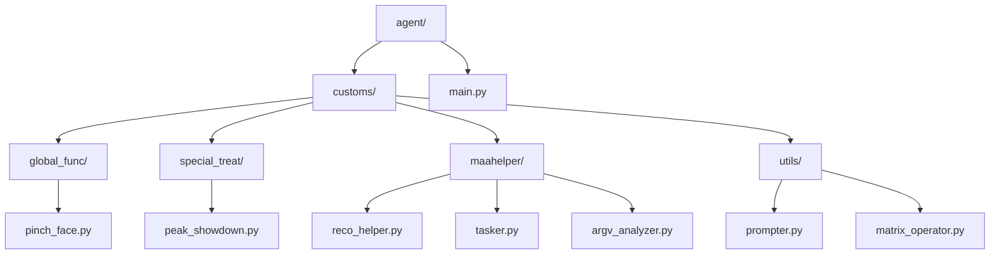
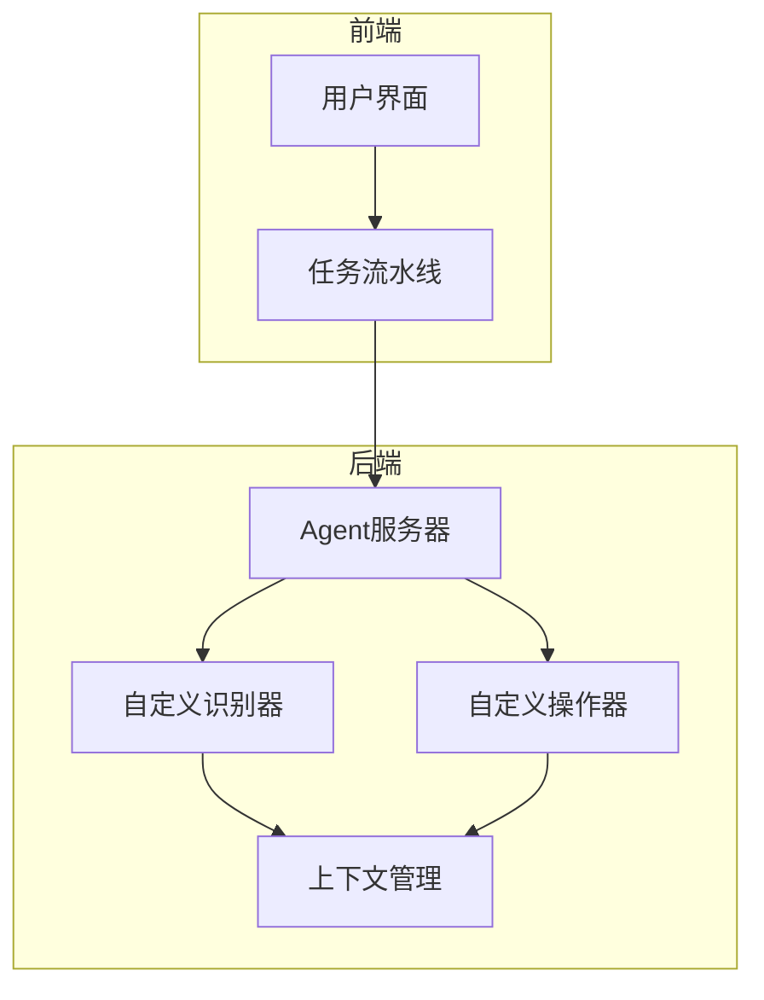
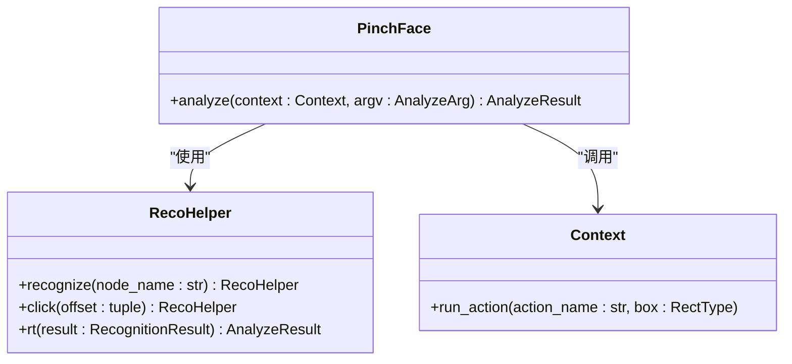
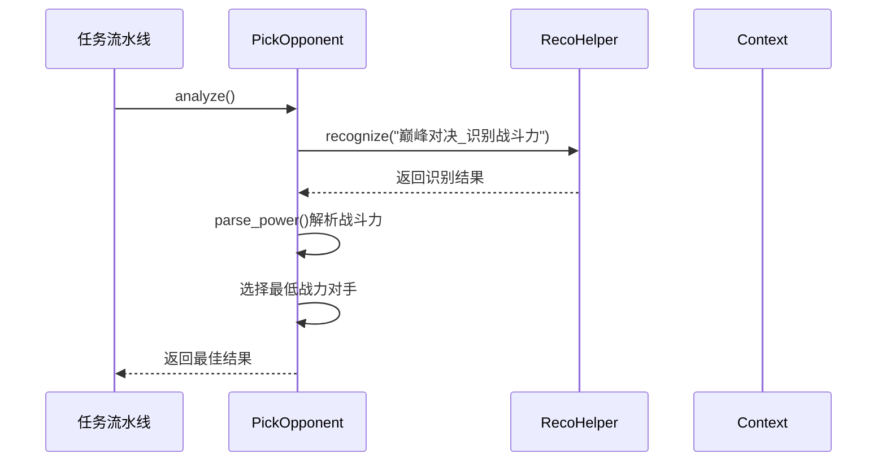
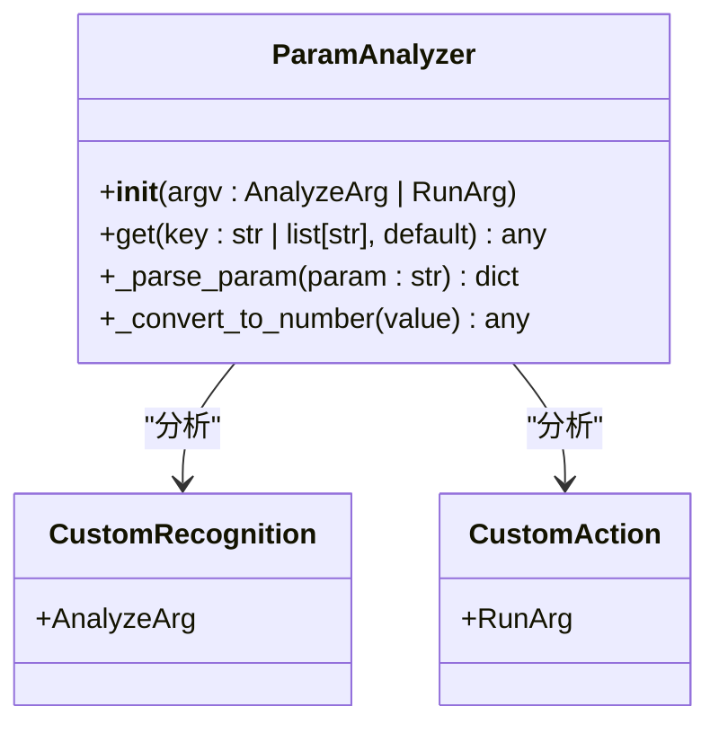
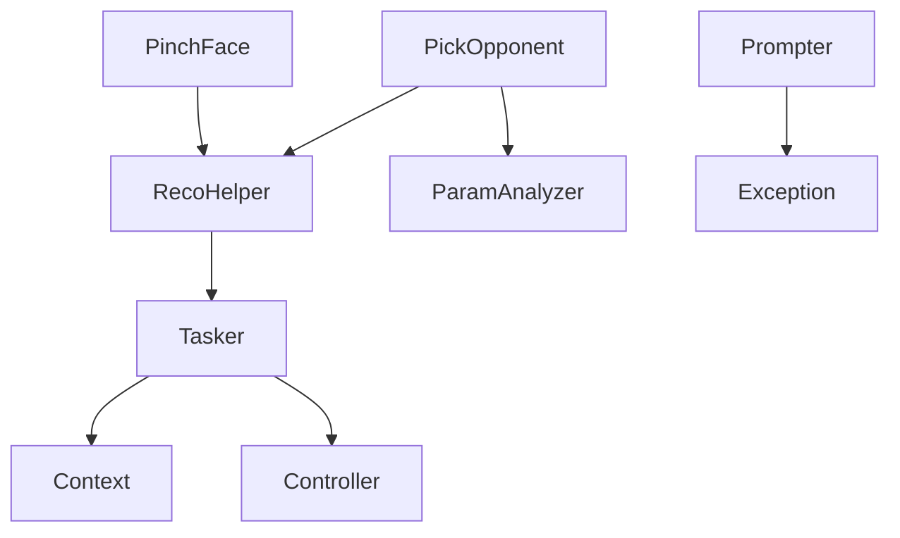

# 自定义扩展机制

<cite>
**本文档引用文件**  
- [main.py](file://agent/main.py)
- [pinch_face.py](file://agent/customs/global_func/pinch_face.py)
- [peak_showdown.py](file://agent/customs/special_treat/peak_showdown.py)
- [reco_helper.py](file://agent/customs/maahelper/reco_helper.py)
- [tasker.py](file://agent/customs/maahelper/tasker.py)
- [prompter.py](file://agent/customs/utils/prompter.py)
- [argv_analyzer.py](file://agent/customs/maahelper/argv_analyzer.py)
- [matrix_operator.py](file://agent/customs/utils/matrix_operator.py)
- [捏脸.json](file://assets/resource/base/pipeline/通用/捏脸.json)
- [回到主界面.json](file://assets/resource/base/pipeline/通用/回到主界面.json)
</cite>

## 目录
1. [简介](#简介)
2. [项目结构](#项目结构)
3. [核心组件](#核心组件)
4. [架构概述](#架构概述)
5. [详细组件分析](#详细组件分析)
6. [依赖分析](#依赖分析)
7. [性能考虑](#性能考虑)
8. [故障排除指南](#故障排除指南)
9. [结论](#结论)

## 简介
本文档全面阐述了MaaDuDuL系统的自定义扩展能力，重点介绍基于`MaaAgentServerRegisterCustomRecognition`和`MaaAgentServerRegisterCustomAction`接口开发自定义识别器和操作器的方法。通过分析`agent/customs`目录下的具体实现（如`pinch_face.py`中的捏脸功能、`peak_showdown.py`中的巅峰对决逻辑），展示了扩展开发的标准模式和最佳实践。文档还解释了`trans_arg`参数在上下文传递中的作用机制，提供了错误处理指南和性能优化建议。

## 项目结构
本项目采用模块化设计，主要功能集中在`agent`目录下，特别是`agent/customs`子目录，包含了所有自定义扩展的实现。系统通过`main.py`启动，初始化环境并启动Agent服务器。

**图示来源**  
- [main.py](file://agent/main.py#L1-L48)
- [project_structure](file://project_structure)

**本节来源**  
- [main.py](file://agent/main.py#L1-L48)
- [project_structure](file://project_structure)

## 核心组件
系统的核心组件包括自定义识别器、辅助工具类和上下文管理。自定义识别器通过`@AgentServer.custom_recognition`装饰器注册，实现特定的识别逻辑。辅助工具类如`RecoHelper`和`Tasker`封装了常用的操作，提高了代码的复用性和可维护性。

**本节来源**  
- [pinch_face.py](file://agent/customs/global_func/pinch_face.py#L1-L55)
- [reco_helper.py](file://agent/customs/maahelper/reco_helper.py#L1-L256)
- [tasker.py](file://agent/customs/maahelper/tasker.py#L1-L177)

## 架构概述
系统架构基于MaaFramework，通过Agent服务器注册自定义识别器和操作器。当任务流程中遇到自定义节点时，框架会调用相应的实现。上下文对象（Context）贯穿整个执行过程，提供了运行时环境和资源访问。

**图示来源**  
- [main.py](file://agent/main.py#L17-L38)
- [pinch_face.py](file://agent/customs/global_func/pinch_face.py#L15-L22)
- [peak_showdown.py](file://agent/customs/special_treat/peak_showdown.py#L51-L58)

## 详细组件分析

### 捏脸功能分析
捏脸功能通过`PinchFace`类实现，该类注册为名为"pface"的自定义识别器。它利用OCR技术识别面部特征，并根据识别结果执行相应的捏脸动作。

**图示来源**  
- [pinch_face.py](file://agent/customs/global_func/pinch_face.py#L15-L55)
- [reco_helper.py](file://agent/customs/maahelper/reco_helper.py#L17-L256)

**本节来源**  
- [pinch_face.py](file://agent/customs/global_func/pinch_face.py#L1-L55)
- [reco_helper.py](file://agent/customs/maahelper/reco_helper.py#L1-L256)

### 巅峰对决逻辑分析
巅峰对决逻辑通过`PickOpponent`类实现，该类注册为名为"pick_opponent"的自定义识别器。它能够解析战斗力文本，并根据策略选择对手。

**图示来源**  
- [peak_showdown.py](file://agent/customs/special_treat/peak_showdown.py#L51-L96)
- [reco_helper.py](file://agent/customs/maahelper/reco_helper.py#L62-L94)

**本节来源**  
- [peak_showdown.py](file://agent/customs/special_treat/peak_showdown.py#L1-L96)
- [reco_helper.py](file://agent/customs/maahelper/reco_helper.py#L1-L256)

### 上下文传递机制
`trans_arg`参数在上下文传递中起着关键作用。通过`ParamAnalyzer`类，可以解析传递的参数，实现灵活的配置和策略选择。

**图示来源**  
- [argv_analyzer.py](file://agent/customs/maahelper/argv_analyzer.py#L17-L159)
- [pinch_face.py](file://agent/customs/global_func/pinch_face.py#L23-L55)

**本节来源**  
- [argv_analyzer.py](file://agent/customs/maahelper/argv_analyzer.py#L1-L159)
- [pinch_face.py](file://agent/customs/global_func/pinch_face.py#L1-L55)

## 依赖分析
系统依赖关系清晰，各组件职责分明。核心依赖包括MaaFramework提供的基础类和自定义的辅助工具类。

**图示来源**  
- [pinch_face.py](file://agent/customs/global_func/pinch_face.py#L7-L12)
- [peak_showdown.py](file://agent/customs/special_treat/peak_showdown.py#L6-L11)
- [reco_helper.py](file://agent/customs/maahelper/reco_helper.py#L6-L14)

**本节来源**  
- [pinch_face.py](file://agent/customs/global_func/pinch_face.py#L1-L55)
- [peak_showdown.py](file://agent/customs/special_treat/peak_showdown.py#L1-L96)
- [reco_helper.py](file://agent/customs/maahelper/reco_helper.py#L1-L256)

## 性能考虑
在开发自定义扩展时，应注意以下性能优化建议：
- 合理设置图像匹配阈值，平衡识别准确性和速度
- 控制操作间隔，避免过于频繁的操作导致系统负载过高
- 复用截图缓存，减少不必要的截图操作
- 优化识别算法，减少计算复杂度

**本节来源**  
- [reco_helper.py](file://agent/customs/maahelper/reco_helper.py#L111-L118)
- [tasker.py](file://agent/customs/maahelper/tasker.py#L115-L123)

## 故障排除指南
当自定义扩展出现问题时，可参考以下指南进行排查：
- 检查参数解析是否正确，特别是`trans_arg`的格式
- 确认识别区域（ROI）设置是否合理
- 验证操作坐标是否准确
- 查看日志输出，定位异常发生的位置
- 使用`Prompter.error`方法提供详细的错误信息

**本节来源**  
- [prompter.py](file://agent/customs/utils/prompter.py#L16-L55)
- [pinch_face.py](file://agent/customs/global_func/pinch_face.py#L53-L54)
- [peak_showdown.py](file://agent/customs/special_treat/peak_showdown.py#L94-L95)

## 结论
MaaDuDuL系统提供了强大的自定义扩展能力，通过`MaaAgentServerRegisterCustomRecognition`和`MaaAgentServerRegisterCustomAction`接口，开发者可以灵活地实现各种复杂的识别和操作逻辑。结合`agent/customs`目录下的具体实现，展示了标准的开发模式和最佳实践。合理利用`trans_arg`参数和上下文传递机制，可以构建出高效、可靠的自动化解决方案。