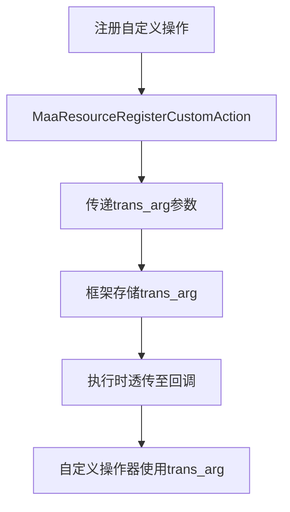
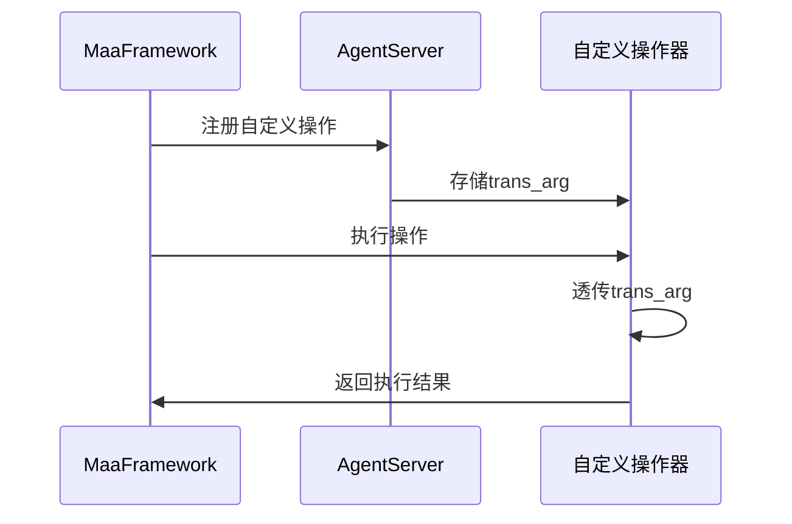
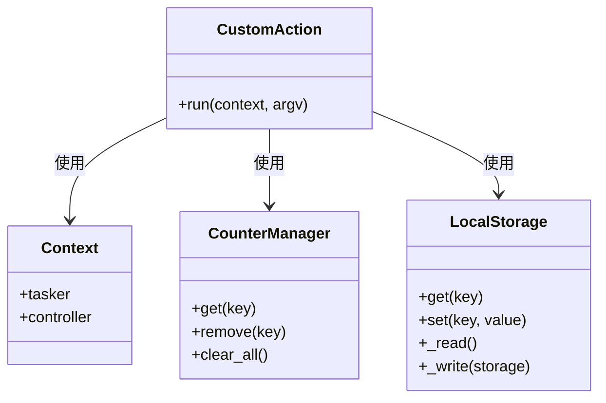

# trans_arg参数传递机制

<cite>
**本文档引用文件**   
- [main.py](file://agent/main.py)
- [pipeline_helper.py](file://agent/customs/global_func/pipeline_helper.py)
- [periodic_check.py](file://agent/customs/global_func/periodic_check.py)
- [prompter.py](file://agent/customs/utils/prompter.py)
- [tasker.py](file://agent/customs/maahelper/tasker.py)
- [argv_analyzer.py](file://agent/customs/maahelper/argv_analyzer.py)
- [counter.py](file://agent/customs/utils/counter.py)
- [local_storage.py](file://agent/customs/utils/local_storage.py)
- [2.2-集成接口一览.md](file://instructions/maafw-guide/2.2-集成接口一览.md)
- [2.3-回调协议.md](file://instructions/maafw-guide/2.3-回调协议.md)
- [3.1-任务流水线协议.md](file://instructions/maafw-guide/3.1-任务流水线协议.md)
- [4.2-标准化接口设计.md](file://instructions/maafw-guide/4.2-标准化接口设计.md)
</cite>

## 目录
1. [引言](#引言)
2. [trans_arg参数注册机制](#trans_arg参数注册机制)
3. [自定义操作器实现与参数传递](#自定义操作器实现与参数传递)
4. [数据共享与上下文管理](#数据共享与上下文管理)
5. [生命周期与线程安全性](#生命周期与线程安全性)
6. [最佳实践与注意事项](#最佳实践与注意事项)
7. [结论](#结论)

## 引言
在MaaDuDuL项目中，`trans_arg`参数是实现自定义操作器与主逻辑之间数据共享的核心机制。该参数允许开发者在注册自定义操作时传递配置对象、状态管理器或上下文信息，并在操作执行时透传至回调函数。这种设计模式不仅增强了代码的灵活性和可扩展性，还为复杂自动化任务的实现提供了坚实的基础。本文将深入分析`trans_arg`参数的传递与使用机制，结合实际代码示例，全面阐述其在自定义操作器中的应用。

## trans_arg参数注册机制
`trans_arg`参数在MaaFramework的接口设计中扮演着关键角色，主要用于在注册自定义操作和识别器时传递用户自定义的上下文数据。根据MaaFramework的集成接口规范，`MaaResourceRegisterCustomAction`和`MaaResourceRegisterCustomRecognition`接口均包含`trans_arg`参数，用于在注册时绑定用户自定义的数据。

在MaaDuDuL项目中，这一机制通过`AgentServer.custom_action`装饰器实现。当开发者定义一个自定义操作类时，使用该装饰器注册操作名称，框架会自动处理`trans_arg`的绑定和传递。例如，在`pipeline_helper.py`文件中，`Run`类通过`@AgentServer.custom_action("run")`装饰器注册为名为"run"的自定义操作。

**Diagram sources**
- [2.2-集成接口一览.md](file://instructions/maafw-guide/2.2-集成接口一览.md#L110-L115)
- [pipeline_helper.py](file://agent/customs/global_func/pipeline_helper.py#L9-L10)

**Section sources**
- [2.2-集成接口一览.md](file://instructions/maafw-guide/2.2-集成接口一览.md#L110-L115)
- [pipeline_helper.py](file://agent/customs/global_func/pipeline_helper.py#L9-L10)

## 自定义操作器实现与参数传递
在MaaDuDuL项目中，自定义操作器的实现遵循MaaFramework的标准化接口设计。每个自定义操作器都是一个继承自`CustomAction`的类，并实现`run`方法。`run`方法接收两个参数：`context`和`argv`，其中`argv`包含了通过`trans_arg`传递的上下文数据。

以`periodic_check.py`文件中的`Record`类为例，该类实现了周期性检查的记录功能。在`run`方法中，首先通过`ParamAnalyzer(argv)`解析参数，然后从解析结果中获取`key`参数，最后调用`Inspector.record(key)`方法记录检查时间。这里的`argv`参数实际上就是通过`trans_arg`传递的上下文数据。

**Diagram sources**
- [periodic_check.py](file://agent/customs/global_func/periodic_check.py#L269-L285)
- [argv_analyzer.py](file://agent/customs/maahelper/argv_analyzer.py#L30-L46)

**Section sources**
- [periodic_check.py](file://agent/customs/global_func/periodic_check.py#L269-L285)
- [argv_analyzer.py](file://agent/customs/maahelper/argv_analyzer.py#L30-L46)

## 数据共享与上下文管理
`trans_arg`参数的真正价值在于其支持复杂的数据共享和上下文管理。在MaaDuDuL项目中，开发者可以利用`trans_arg`传递各种类型的对象，包括配置对象、状态管理器和上下文信息，从而实现操作器与主逻辑之间的紧密协作。

例如，在`counter.py`文件中，`CounterManager`类被用作计数器的管理器，支持多个命名的计数器实例。通过`trans_arg`，可以将`CounterManager`实例传递给自定义操作器，使其能够访问和操作全局计数器。同样，在`local_storage.py`文件中，`LocalStorage`类提供了基于JSON文件的键值存储功能，可用于持久化配置和状态数据。

**Diagram sources**
- [counter.py](file://agent/customs/utils/counter.py#L75-L141)
- [local_storage.py](file://agent/customs/utils/local_storage.py#L10-L111)
- [tasker.py](file://agent/customs/maahelper/tasker.py#L16-L177)

**Section sources**
- [counter.py](file://agent/customs/utils/counter.py#L75-L141)
- [local_storage.py](file://agent/customs/utils/local_storage.py#L10-L111)

## 生命周期与线程安全性
`trans_arg`参数的生命周期管理是确保系统稳定性的关键。在MaaDuDuL项目中，`trans_arg`的生命周期与自定义操作器的注册和执行过程紧密相关。当操作器被注册时，`trans_arg`被存储在框架的内部数据结构中；当操作器被执行时，`trans_arg`被透传至回调函数；当操作器被注销时，相关的`trans_arg`引用被清除。

关于线程安全性，MaaFramework的设计确保了`trans_arg`在多线程环境下的安全使用。框架通过引用管理机制防止垃圾回收，同时在回调封装中处理线程同步问题。然而，开发者仍需注意，如果`trans_arg`指向的对象本身不是线程安全的，需要在操作器实现中添加适当的同步机制。

**Diagram sources**
- [4.2-标准化接口设计.md](file://instructions/maafw-guide/4.2-标准化接口设计.md#L39-L41)
- [2.3-回调协议.md](file://instructions/maafw-guide/2.3-回调协议.md#L8-L9)

**Section sources**
- [4.2-标准化接口设计.md](file://instructions/maafw-guide/4.2-标准化接口设计.md#L39-L41)
- [2.3-回调协议.md](file://instructions/maafw-guide/2.3-回调协议.md#L8-L9)

## 最佳实践与注意事项
在使用`trans_arg`参数时，应遵循以下最佳实践：

1. **避免内存泄漏**：确保在操作器注销时正确清理`trans_arg`引用的对象，特别是当这些对象持有大量资源时。
2. **线程安全**：如果`trans_arg`指向的对象可能被多个线程访问，应使用适当的同步机制，如锁或原子操作。
3. **数据序列化**：对于需要跨进程传递的`trans_arg`，应确保其可序列化，以便在分布式环境中使用。
4. **错误处理**：在操作器实现中添加适当的错误处理机制，以应对`trans_arg`为空或无效的情况。

此外，应避免在`trans_arg`中传递大型数据结构，以减少内存开销和提高性能。对于需要持久化存储的数据，建议使用`LocalStorage`等专门的存储机制。

**Section sources**
- [prompter.py](file://agent/customs/utils/prompter.py#L34-L54)
- [4.2-标准化接口设计.md](file://instructions/maafw-guide/4.2-标准化接口设计.md#L30-L32)

## 结论
`trans_arg`参数是MaaDuDuL项目中实现自定义操作器与主逻辑数据共享的核心机制。通过在注册时绑定和在执行时透传，`trans_arg`为开发者提供了灵活的数据传递方式，支持配置对象、状态管理器和上下文信息的共享。结合MaaFramework的标准化接口设计和引用管理机制，`trans_arg`不仅增强了代码的可扩展性和可维护性，还为复杂自动化任务的实现提供了坚实的基础。遵循最佳实践，合理管理`trans_arg`的生命周期和线程安全性，可以有效避免内存泄漏和数据竞争，确保系统的稳定运行。