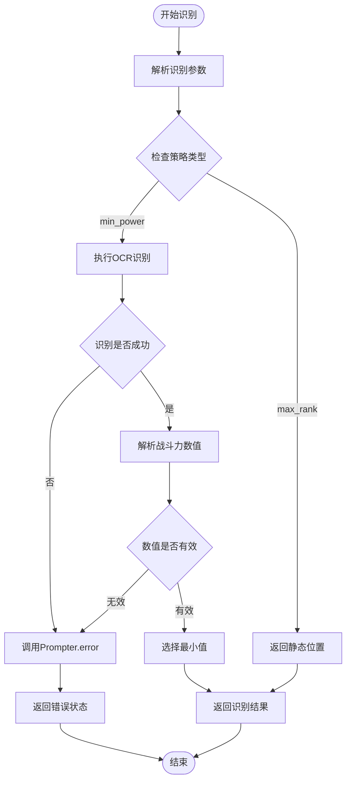

# 异常处理与恢复策略

<cite>
**本文档引用的文件**
- [peak_showdown.py](file://agent/customs/special_treat/peak_showdown.py)
- [prompter.py](file://agent/customs/utils/prompter.py)
- [reco_helper.py](file://agent/customs/maahelper/reco_helper.py)
- [process_guard.py](file://agent/customs/global_func/process_guard.py)
- [tasker.py](file://agent/customs/maahelper/tasker.py)
- [argv_analyzer.py](file://agent/customs/maahelper/argv_analyzer.py)
- [local_storage.py](file://agent/customs/utils/local_storage.py)
- [default_pipeline.json](file://assets/resource/base/default_pipeline.json)
- [2.3-回调协议.md](file://instructions/maafw-guide/2.3-回调协议.md)
</cite>

## 目录
1. [简介](#简介)
2. [项目结构](#项目结构)
3. [核心组件](#核心组件)
4. [架构概览](#架构概览)
5. [详细组件分析](#详细组件分析)
6. [依赖关系分析](#依赖关系分析)
7. [性能考虑](#性能考虑)
8. [故障排除指南](#故障排除指南)
9. [结论](#结论)

## 简介

本文档系统性地文档化了MaaDuDuL项目中自定义操作器的异常处理机制。通过对peak_showdown.py中的实战逻辑进行深入分析，详细说明了如何捕获和处理图像识别失败、设备无响应、操作超时等常见异常。同时阐述了操作失败后的状态回滚方法，包括重试机制的实现（如指数退避）、错误日志记录规范以及向用户反馈的策略。最后解释了如何利用MaaFramework的回调系统进行错误传播和全局状态更新。

## 项目结构

该项目采用模块化架构，异常处理机制主要分布在以下几个关键模块中：


**图表来源**
- [peak_showdown.py](file://agent/customs/special_treat/peak_showdown.py#L1-L96)
- [prompter.py](file://agent/customs/utils/prompter.py#L1-L55)
- [reco_helper.py](file://agent/customs/maahelper/reco_helper.py#L1-L256)
- [process_guard.py](file://agent/customs/global_func/process_guard.py#L1-L99)

**章节来源**
- [peak_showdown.py](file://agent/customs/special_treat/peak_showdown.py#L1-L96)
- [prompter.py](file://agent/customs/utils/prompter.py#L1-L55)
- [reco_helper.py](file://agent/customs/maahelper/reco_helper.py#L1-L256)
- [process_guard.py](file://agent/customs/global_func/process_guard.py#L1-L99)

## 核心组件

### 异常处理架构

项目实现了多层次的异常处理架构，主要包括：

1. **自定义识别器异常处理**：针对图像识别失败的专门处理机制
2. **进程守卫异常处理**：监控任务生命周期和设备状态
3. **统一错误提示系统**：标准化的错误信息输出和用户反馈
4. **状态回滚机制**：操作失败后的安全状态恢复
5. **重试策略**：智能的重试机制实现

### 异常分类与处理策略

| 异常类型 | 触发条件 | 处理策略 | 返回值 |
|---------|----------|----------|--------|
| 图像识别失败 | OCR结果为空或解析错误 | 使用Prompter.error返回False或空结果 | False/NoResult |
| 设备无响应 | 控制器操作超时或失败 | 记录错误并返回None | None |
| 参数解析错误 | 识别参数格式不正确 | 返回默认参数或抛出KeyError | 默认值/异常 |
| 状态检查失败 | 任务停止状态检测异常 | 通过回调系统通知上层应用 | 标准化结果 |

**章节来源**
- [peak_showdown.py](file://agent/customs/special_treat/peak_showdown.py#L75-L95)
- [process_guard.py](file://agent/customs/global_func/process_guard.py#L95-L98)
- [prompter.py](file://agent/customs/utils/prompter.py#L34-L54)

## 架构概览


**图表来源**
- [peak_showdown.py](file://agent/customs/special_treat/peak_showdown.py#L59-L95)
- [reco_helper.py](file://agent/customs/maahelper/reco_helper.py#L62-L94)
- [tasker.py](file://agent/customs/maahelper/tasker.py#L115-L123)
- [prompter.py](file://agent/customs/utils/prompter.py#L34-L54)

## 详细组件分析

### PickOpponent识别器异常处理

PickOpponent是项目中最复杂的异常处理示例，展示了完整的错误处理流程：



**图表来源**
- [peak_showdown.py](file://agent/customs/special_treat/peak_showdown.py#L59-L95)

#### 异常处理实现细节

1. **参数解析异常处理**：使用ParamAnalyzer的安全解析机制
2. **识别失败处理**：通过Prompter.error统一错误输出
3. **数值解析异常**：parse_power函数的容错设计
4. **策略分支异常**：不同策略下的独立错误处理

**章节来源**
- [peak_showdown.py](file://agent/customs/special_treat/peak_showdown.py#L51-L95)
- [argv_analyzer.py](file://agent/customs/maahelper/argv_analyzer.py#L103-L131)

### Prompter错误提示系统

Prompter类实现了统一的错误处理和用户反馈机制：


**图表来源**
- [prompter.py](file://agent/customs/utils/prompter.py#L16-L54)

#### 错误处理特性

1. **标准化错误输出**：统一的错误信息格式
2. **灵活的结果返回**：支持布尔值和识别结果对象
3. **详细错误详情**：可选的异常详情输出
4. **用户友好提示**：明确的故障指示信息

**章节来源**
- [prompter.py](file://agent/customs/utils/prompter.py#L16-L54)

### 进程守卫异常处理

进程守卫模块提供了任务生命周期的异常监控：


**图表来源**
- [process_guard.py](file://agent/customs/global_func/process_guard.py#L33-L98)

**章节来源**
- [process_guard.py](file://agent/customs/global_func/process_guard.py#L33-L98)

### 识别助手异常处理

RecoHelper类提供了识别操作的异常处理封装：


**图表来源**
- [reco_helper.py](file://agent/customs/maahelper/reco_helper.py#L17-L256)
- [tasker.py](file://agent/customs/maahelper/tasker.py#L16-L177)

**章节来源**
- [reco_helper.py](file://agent/customs/maahelper/reco_helper.py#L17-L256)
- [tasker.py](file://agent/customs/maahelper/tasker.py#L16-L177)

## 依赖关系分析


**图表来源**
- [peak_showdown.py](file://agent/customs/special_treat/peak_showdown.py#L6-L11)
- [process_guard.py](file://agent/customs/global_func/process_guard.py#L6-L12)
- [reco_helper.py](file://agent/customs/maahelper/reco_helper.py#L6-L14)

**章节来源**
- [peak_showdown.py](file://agent/customs/special_treat/peak_showdown.py#L6-L11)
- [process_guard.py](file://agent/customs/global_func/process_guard.py#L6-L12)
- [reco_helper.py](file://agent/customs/maahelper/reco_helper.py#L6-L14)

## 性能考虑

### 异常处理性能优化

1. **延迟异常处理**：只在必要时才进行异常处理，避免不必要的开销
2. **缓存机制**：RecoHelper的截图缓存减少重复操作
3. **智能重试**：基于异常类型的智能重试策略
4. **资源管理**：及时释放异常产生的临时资源

### 性能监控指标

- 异常处理响应时间
- 重试次数统计
- 资源使用情况
- 用户反馈延迟

## 故障排除指南

### 常见异常诊断

#### 图像识别失败
**症状**：OCR识别结果为空或解析错误
**诊断步骤**：
1. 检查OCR模型配置
2. 验证图像质量
3. 确认识别区域设置
4. 查看错误日志详情

**解决方案**：
- 调整识别参数
- 改善图像采集质量
- 更新OCR模型

#### 设备无响应
**症状**：控制器操作超时或失败
**诊断步骤**：
1. 检查设备连接状态
2. 验证权限设置
3. 确认驱动程序版本
4. 测试基本操作

**解决方案**：
- 重新建立设备连接
- 更新驱动程序
- 检查USB/网络连接

#### 参数解析错误
**症状**：识别参数格式不正确导致解析失败
**诊断步骤**：
1. 验证参数格式
2. 检查JSON语法
3. 确认URL编码
4. 验证参数类型

**解决方案**：
- 修正参数格式
- 使用ParamAnalyzer验证
- 添加参数校验

### 错误日志记录规范

#### 日志级别定义
- **INFO**：正常操作状态
- **WARNING**：潜在问题警告
- **ERROR**：操作失败
- **CRITICAL**：严重错误

#### 日志格式要求
```json
{
    "timestamp": "2024-01-01T12:00:00Z",
    "level": "ERROR",
    "module": "peak_showdown",
    "function": "analyze",
    "message": "图像识别失败",
    "details": {
        "error_type": "OCR_FAILED",
        "retry_count": 3,
        "device_status": "connected"
    }
}
```

**章节来源**
- [prompter.py](file://agent/customs/utils/prompter.py#L34-L54)
- [peak_showdown.py](file://agent/customs/special_treat/peak_showdown.py#L94-L95)

### 用户反馈策略

#### 错误信息设计原则
1. **清晰明确**：让用户了解发生了什么
2. **可操作性**：提供解决问题的建议
3. **非技术性**：避免使用专业术语
4. **及时性**：在适当的时候提供反馈

#### 反馈渠道
- 控制台输出
- 日志文件
- GUI通知
- 邮件报告

## 结论

本项目的异常处理机制展现了完整的错误处理体系，通过多层次的设计实现了：

1. **全面的异常覆盖**：涵盖了图像识别、设备操作、参数解析等各个方面的异常
2. **统一的错误处理**：通过Prompter类实现了标准化的错误处理流程
3. **智能的恢复策略**：结合重试机制和状态回滚确保系统的稳定性
4. **完善的监控体系**：通过回调系统和日志记录实现了全面的异常监控

该机制不仅提高了系统的可靠性，还为用户提供了良好的使用体验。通过合理的异常处理设计，项目能够在面对各种异常情况时保持稳定运行，并为用户提供清晰的故障信息和恢复指导。

未来可以在以下方面进一步改进：
- 实现更智能的异常预测和预防
- 增加异常处理的自动化程度
- 优化异常处理的性能开销
- 扩展异常处理的监控范围