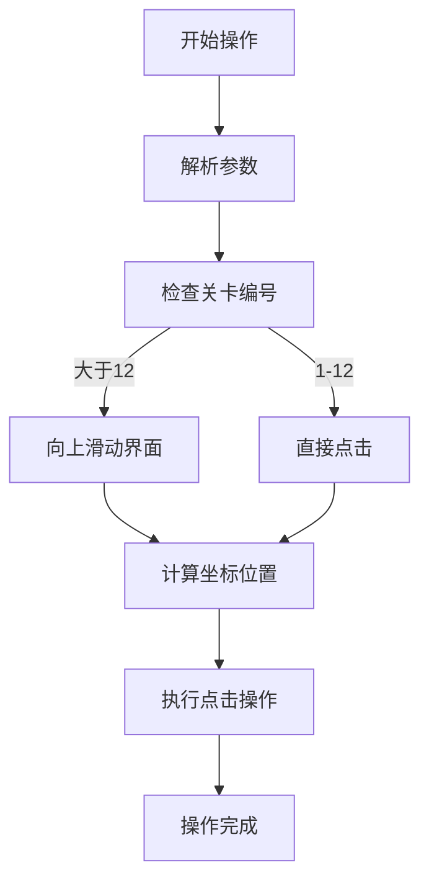
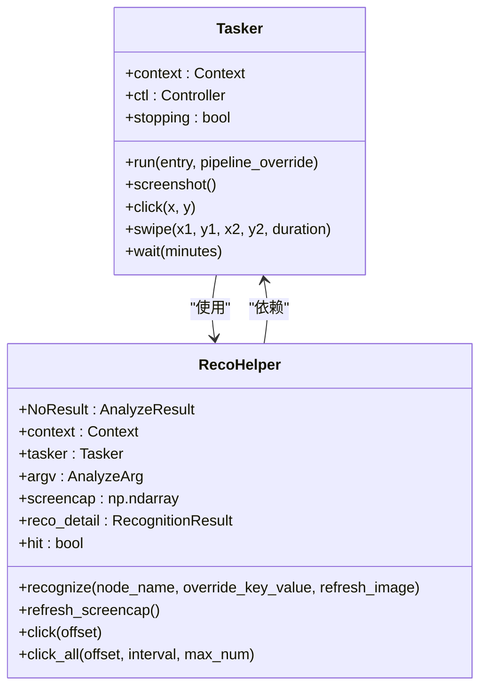
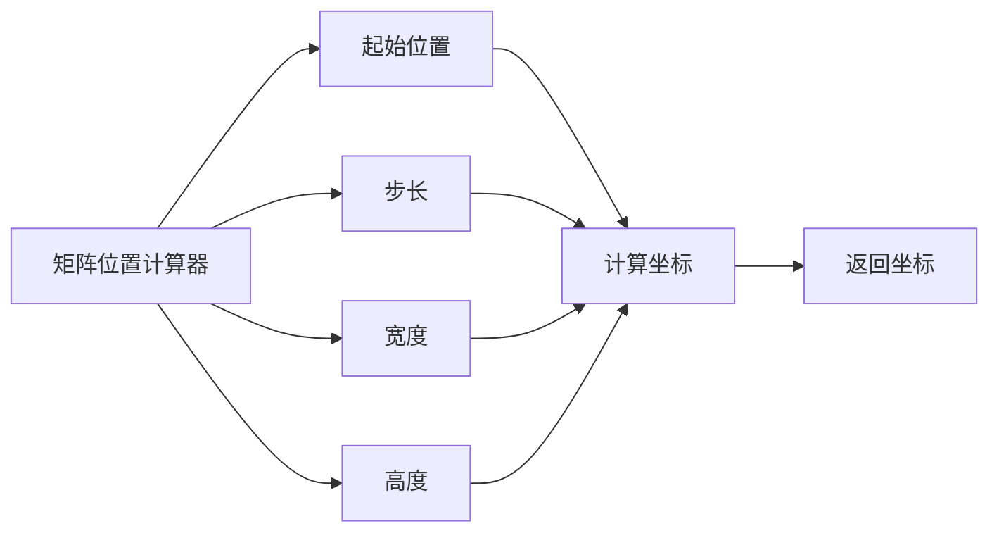
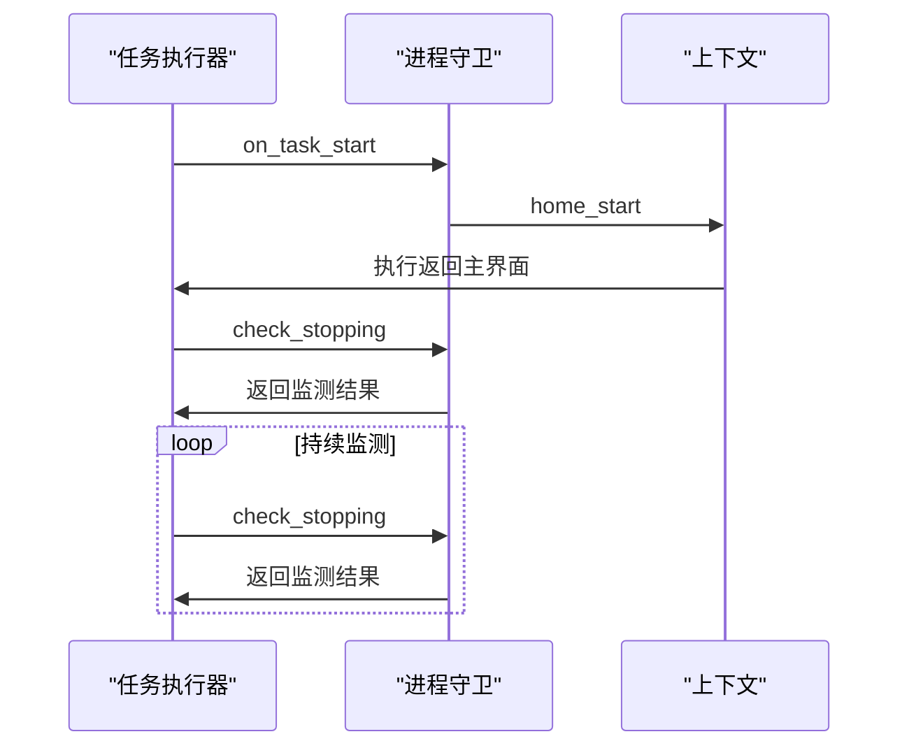
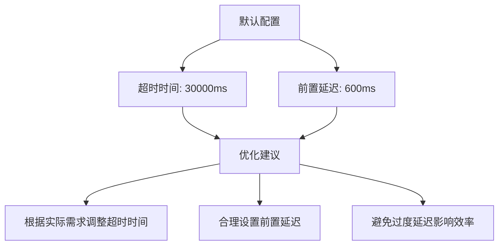

# 性能优化与最佳实践

<cite>
**本文档引用文件**  
- [eat_sugar.py](file://agent/customs/special_treat/eat_sugar.py)
- [process_guard.py](file://agent/customs/global_func/process_guard.py)
- [tasker.py](file://agent/customs/maahelper/tasker.py)
- [reco_helper.py](file://agent/customs/maahelper/reco_helper.py)
- [matrix_operator.py](file://agent/customs/utils/matrix_operator.py)
- [prompter.py](file://agent/customs/utils/prompter.py)
- [default_pipeline.json](file://assets/resource/base/default_pipeline.json)
- [hooks.json](file://assets/resource/base/pipeline/其他/hooks.json)
</cite>

## 目录
1. [引言](#引言)
2. [操作间隔控制策略](#操作间隔控制策略)
3. [资源占用管理](#资源占用管理)
4. [执行效率提升技术](#执行效率提升技术)
5. [长时间运行任务稳定性保障](#长时间运行任务稳定性保障)
6. [性能监控与调优建议](#性能监控与调优建议)
7. [结论](#结论)

## 引言
本文档旨在为自定义操作器提供全面的性能优化指南，重点探讨操作间隔控制、资源占用管理和执行效率提升策略。通过分析 `eat_sugar.py` 和 `process_guard.py` 等核心模块的实现机制，阐述如何合理设置操作延迟以避免游戏反作弊机制触发，并确保长时间运行任务的稳定性。文档将详细介绍减少不必要的截图请求、优化识别区域、批量操作合并等关键技术手段，并提供实用的性能监控和调优建议。

## 操作间隔控制策略

在自动化操作中，合理的操作间隔控制是避免触发游戏反作弊机制的关键。通过对 `eat_sugar.py` 模块的分析，我们可以看到其采用了精确的坐标计算和操作调度机制。

**图示来源**  
- [eat_sugar.py](file://agent/customs/special_treat/eat_sugar.py#L65-L206)

在 `eat_sugar.py` 中，`SelectCloneLevel` 类根据关卡编号自动判断是否需要滑动界面，并精确计算点击坐标。这种基于条件判断的操作调度机制有效避免了不必要的操作，减少了与游戏服务器的交互频率。

**节来源**  
- [eat_sugar.py](file://agent/customs/special_treat/eat_sugar.py#L65-L206)

## 资源占用管理

资源占用管理是确保自动化系统稳定运行的重要环节。通过对 `tasker.py` 和 `reco_helper.py` 模块的分析，我们可以看到系统采用了多种优化策略来降低资源消耗。

**图示来源**  
- [tasker.py](file://agent/customs/maahelper/tasker.py#L16-L177)
- [reco_helper.py](file://agent/customs/maahelper/reco_helper.py#L17-L256)

`Tasker` 类封装了 MaaFramework 的任务执行相关操作，提供了便捷的任务执行接口。通过 `run` 方法，系统能够自动为所有节点注入运行监测器，确保任务执行过程可被监控。同时，`RecoHelper` 类提供了识别结果处理、点击操作等辅助功能的封装，有效降低了重复代码的资源开销。

**节来源**  
- [tasker.py](file://agent/customs/maahelper/tasker.py#L16-L177)
- [reco_helper.py](file://agent/customs/maahelper/reco_helper.py#L17-L256)

## 执行效率提升技术

执行效率的提升是性能优化的核心目标。通过对 `matrix_operator.py` 和 `prompter.py` 模块的分析，我们可以看到系统采用了多种技术手段来提高执行效率。

**图示来源**  
- [matrix_operator.py](file://agent/customs/utils/matrix_operator.py#L1-L58)

`MatrixOperator` 类通过指定起始位置和步长，可以快速获取矩阵中任意元素的坐标。这种预计算机制避免了每次操作时的重复计算，显著提高了执行效率。

同时，`Prompter` 类通过 `cprint` 方法实现了带间隔的输出控制，避免了频繁的日志输出对系统性能造成影响。

**节来源**  
- [matrix_operator.py](file://agent/customs/utils/matrix_operator.py#L1-L58)
- [prompter.py](file://agent/customs/utils/prompter.py#L1-L55)

## 长时间运行任务稳定性保障

长时间运行任务的稳定性保障是自动化系统的关键要求。通过对 `process_guard.py` 模块的分析，我们可以看到系统采用了多种机制来确保任务的稳定运行。

**图示来源**  
- [process_guard.py](file://agent/customs/global_func/process_guard.py#L1-L99)

`process_guard.py` 模块提供了任务生命周期监控和进程状态检测功能。`OnTaskStart` 类在任务开始时触发，用于执行初始化操作或记录任务启动事件。`CheckStopping` 类实时检测任务是否处于即将停止的状态，用于流程控制和资源清理。

此外，系统通过 `hooks.json` 配置文件中的 `_run_task_monitor_inject` 节点，实现了对任务执行过程的持续监测。这种双重保障机制确保了长时间运行任务的稳定性。

**节来源**  
- [process_guard.py](file://agent/customs/global_func/process_guard.py#L1-L99)
- [hooks.json](file://assets/resource/base/pipeline/其他/hooks.json#L1-L9)

## 性能监控与调优建议

性能监控与调优是确保系统持续优化的重要环节。通过对 `default_pipeline.json` 配置文件的分析，我们可以看到系统提供了多种性能调优参数。

**图示来源**  
- [default_pipeline.json](file://assets/resource/base/default_pipeline.json#L1-L7)

基于对系统架构和实现机制的分析，我们提出以下性能调优建议：

1. **合理设置操作间隔**：根据游戏服务器的响应时间和反作弊机制特点，合理设置操作间隔，避免过于频繁的操作触发反作弊机制。

2. **优化识别区域**：通过精确计算和预定义识别区域，减少不必要的全屏识别，提高识别效率。

3. **批量操作合并**：将多个连续的操作合并为批量操作，减少与游戏服务器的交互次数。

4. **动态调整超时时间**：根据实际网络环境和游戏响应速度，动态调整超时时间，避免因超时导致的任务失败。

5. **定期清理缓存**：定期清理截图缓存和临时文件，避免资源占用过高影响系统性能。

**节来源**  
- [default_pipeline.json](file://assets/resource/base/default_pipeline.json#L1-L7)

## 结论
通过对 `eat_sugar.py` 和 `process_guard.py` 等核心模块的深入分析，我们总结出了一套完整的自定义操作器性能优化方案。该方案涵盖了操作间隔控制、资源占用管理、执行效率提升和长时间运行任务稳定性保障等多个方面。通过合理设置操作延迟、优化识别区域、合并批量操作等技术手段，可以有效避免游戏反作弊机制的触发，同时确保系统的稳定运行。建议在实际应用中根据具体需求和环境特点，灵活调整优化策略，以达到最佳的性能表现。