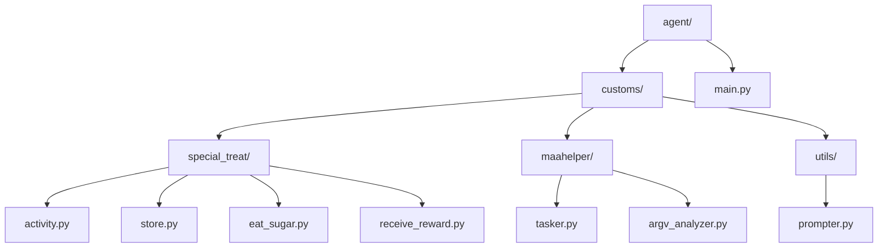
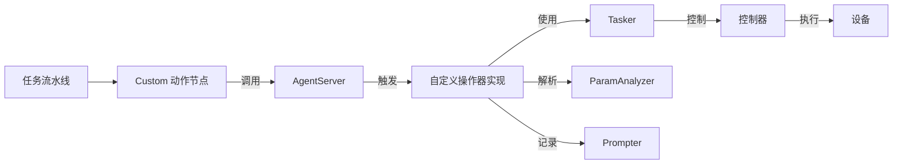
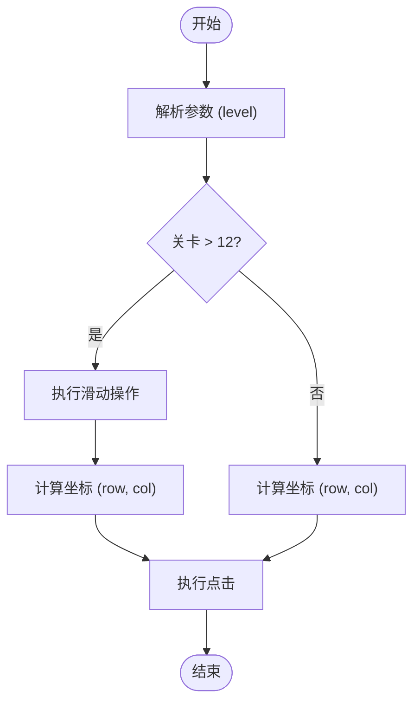
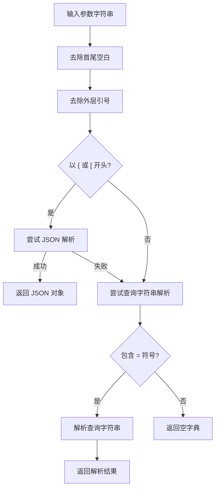
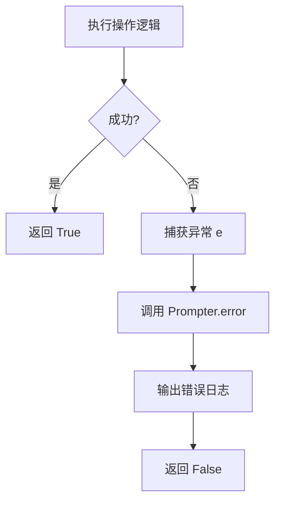
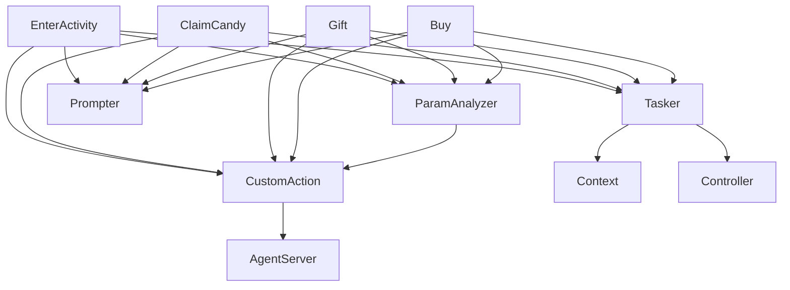

# 自定义操作器开发

<cite>
**本文档引用文件**  
- [activity.py](file://agent/customs/special_treat/activity.py)
- [store.py](file://agent/customs/special_treat/store.py)
- [tasker.py](file://agent/customs/maahelper/tasker.py)
- [argv_analyzer.py](file://agent/customs/maahelper/argv_analyzer.py)
- [prompter.py](file://agent/customs/utils/prompter.py)
- [process_guard.py](file://agent/customs/global_func/process_guard.py)
- [eat_sugar.py](file://agent/customs/special_treat/eat_sugar.py)
- [receive_reward.py](file://agent/customs/special_treat/receive_reward.py)
- [main.py](file://agent/main.py)
</cite>

## 目录
1. [引言](#引言)
2. [项目结构](#项目结构)
3. [核心组件](#核心组件)
4. [架构概述](#架构概述)
5. [详细组件分析](#详细组件分析)
6. [依赖分析](#依赖分析)
7. [性能考虑](#性能考虑)
8. [故障排除指南](#故障排除指南)
9. [结论](#结论)

## 引言
本文档全面阐述了基于 `MaaAgentServerRegisterCustomAction` 接口的自定义操作器开发方法。通过分析 `agent/customs/special_treat` 目录下的 `activity.py` 和 `store.py` 文件，详细说明了如何实现点击、滑动、输入文本等操作逻辑。文档深入解析了 `trans_arg` 参数在操作上下文中的传递机制，展示了如何在操作器中获取和使用外部传递的配置参数。同时，提供了异常处理指南、性能优化建议，并结合实际代码示例说明了操作器的注册流程、执行顺序控制和协同工作机制。

## 项目结构
项目采用模块化设计，将自定义功能按业务领域划分在 `agent/customs` 目录下。`special_treat` 模块专门处理特定活动和商店相关的自定义操作。

**图示来源**  
- [activity.py](file://agent/customs/special_treat/activity.py)
- [store.py](file://agent/customs/special_treat/store.py)
- [tasker.py](file://agent/customs/maahelper/tasker.py)
- [argv_analyzer.py](file://agent/customs/maahelper/argv_analyzer.py)
- [prompter.py](file://agent/customs/utils/prompter.py)
- [main.py](file://agent/main.py)

**本节来源**  
- [agent/customs/special_treat](file://agent/customs/special_treat)
- [agent/customs/maahelper](file://agent/customs/maahelper)
- [agent/customs/utils](file://agent/customs/utils)

## 核心组件
核心组件包括自定义操作器类（如 `EnterActivity`, `ClaimCandy`, `Gift`, `Buy`），它们通过 `@AgentServer.custom_action` 装饰器注册。这些组件依赖于 `Tasker` 类执行底层操作，使用 `ParamAnalyzer` 解析外部参数，并通过 `Prompter` 进行日志记录和错误处理。

**本节来源**  
- [activity.py](file://agent/customs/special_treat/activity.py#L17-L102)
- [store.py](file://agent/customs/special_treat/store.py#L14-L96)
- [tasker.py](file://agent/customs/maahelper/tasker.py#L16-L177)
- [argv_analyzer.py](file://agent/customs/maahelper/argv_analyzer.py#L17-L159)
- [prompter.py](file://agent/customs/utils/prompter.py#L16-L55)

## 架构概述
系统架构基于 MaaFramework 的自定义动作机制。自定义操作器作为插件注册到 `AgentServer`，当任务流程中调用 `Custom` 动作时，框架会触发相应的 `run` 方法。操作器通过 `Context` 对象与框架交互，利用 `Tasker` 执行具体的 UI 操作。

**图示来源**  
- [activity.py](file://agent/customs/special_treat/activity.py)
- [store.py](file://agent/customs/special_treat/store.py)
- [tasker.py](file://agent/customs/maahelper/tasker.py)
- [argv_analyzer.py](file://agent/customs/maahelper/argv_analyzer.py)
- [prompter.py](file://agent/customs/utils/prompter.py)

## 详细组件分析
### 操作逻辑实现
自定义操作器通过继承 `CustomAction` 并实现 `run` 方法来定义具体行为。`run` 方法接收 `Context` 和 `RunArg` 参数，返回布尔值表示操作成功与否。

#### 点击与滑动操作
通过 `Tasker` 类提供的 `click` 和 `swipe` 方法实现。例如，在 `eat_sugar.py` 中的 `SelectCloneLevel` 类，根据关卡编号计算坐标并执行点击。

**图示来源**  
- [eat_sugar.py](file://agent/customs/special_treat/eat_sugar.py#L65-L117)

**本节来源**  
- [eat_sugar.py](file://agent/customs/special_treat/eat_sugar.py)

#### 输入文本操作
通过 `Tasker` 的 `run` 方法结合 `pipeline_override` 参数，在 Pipeline 节点中设置 `input_text` 字段来实现文本输入。例如，`QuickFight` 操作器可以指定速战次数。

**本节来源**  
- [eat_sugar.py](file://agent/customs/special_treat/eat_sugar.py#L21-L63)

### 参数传递机制
`trans_arg` 参数（在代码中为 `argv.custom_action_param`）是外部配置传递给操作器的关键。`ParamAnalyzer` 类负责解析此参数，支持 JSON 和查询字符串格式。

#### 参数解析流程

**图示来源**  
- [argv_analyzer.py](file://agent/customs/maahelper/argv_analyzer.py#L48-L101)

**本节来源**  
- [argv_analyzer.py](file://agent/customs/maahelper/argv_analyzer.py)

### 异常处理与恢复
所有 `run` 方法都使用 `try-except` 块捕获异常，并通过 `Prompter.error` 方法进行统一的错误处理和日志记录。

#### 异常处理流程

**本节来源**  
- [activity.py](file://agent/customs/special_treat/activity.py#L35-L54)
- [store.py](file://agent/customs/special_treat/store.py#L32-L49)
- [prompter.py](file://agent/customs/utils/prompter.py#L34-L54)

### 性能优化建议
- **合理设置操作间隔**：避免过于频繁的操作，防止被系统限制。
- **复用 Pipeline**：通过 `Tasker.run` 调用预定义的 Pipeline，减少重复代码。
- **减少不必要的操作**：仅在必要时执行滑动等耗时操作。

**本节来源**  
- [tasker.py](file://agent/customs/maahelper/tasker.py#L158-L170)
- [assets/resource/base/default_pipeline.json](file://assets/resource/base/default_pipeline.json)

## 依赖分析
自定义操作器依赖于 MaaFramework 的核心模块和项目内部的辅助模块。

**图示来源**  
- [activity.py](file://agent/customs/special_treat/activity.py)
- [store.py](file://agent/customs/special_treat/store.py)
- [tasker.py](file://agent/customs/maahelper/tasker.py)
- [argv_analyzer.py](file://agent/customs/maahelper/argv_analyzer.py)
- [prompter.py](file://agent/customs/utils/prompter.py)

**本节来源**  
- [activity.py](file://agent/customs/special_treat/activity.py)
- [store.py](file://agent/customs/special_treat/store.py)
- [tasker.py](file://agent/customs/maahelper/tasker.py)
- [argv_analyzer.py](file://agent/customs/maahelper/argv_analyzer.py)
- [prompter.py](file://agent/customs/utils/prompter.py)

## 性能考虑
- **避免阻塞**：长时间操作应考虑异步执行。
- **资源管理**：及时释放不再使用的资源。
- **日志级别**：生产环境中使用适当的日志级别，避免过多日志影响性能。

**本节来源**  
- [tasker.py](file://agent/customs/maahelper/tasker.py#L158-L170)
- [prompter.py](file://agent/customs/utils/prompter.py#L9-L13)

## 故障排除指南
- **操作失败**：检查日志输出，确认参数是否正确传递。
- **坐标偏移**：确认设备分辨率与代码中坐标是否匹配。
- **识别失败**：检查 Pipeline 配置和图像资源。

**本节来源**  
- [prompter.py](file://agent/customs/utils/prompter.py#L34-L54)
- [process_guard.py](file://agent/customs/global_func/process_guard.py#L72-L99)

## 结论
本文档详细介绍了基于 `MaaAgentServerRegisterCustomAction` 接口的自定义操作器开发方法。通过分析 `activity.py` 和 `store.py` 等文件，展示了如何实现各种操作逻辑、处理参数传递、进行异常处理和性能优化。开发者可以遵循此模式创建新的自定义操作器，以满足特定的自动化需求。