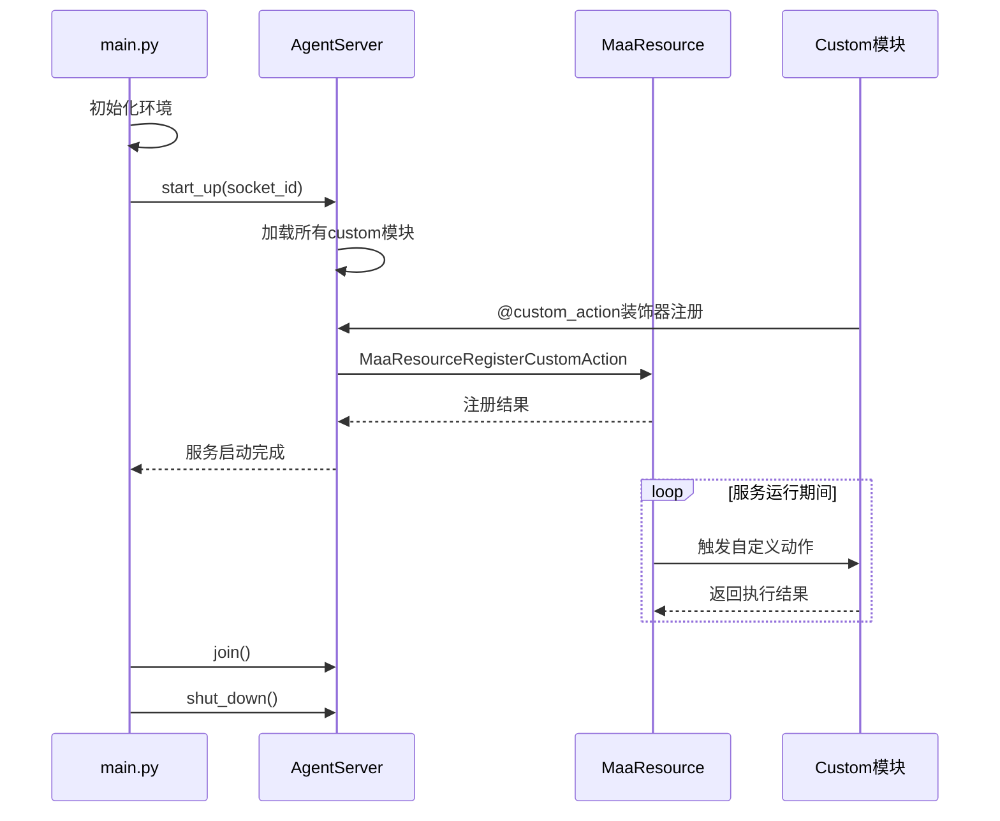
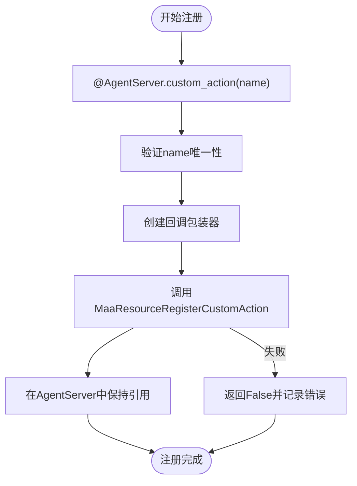
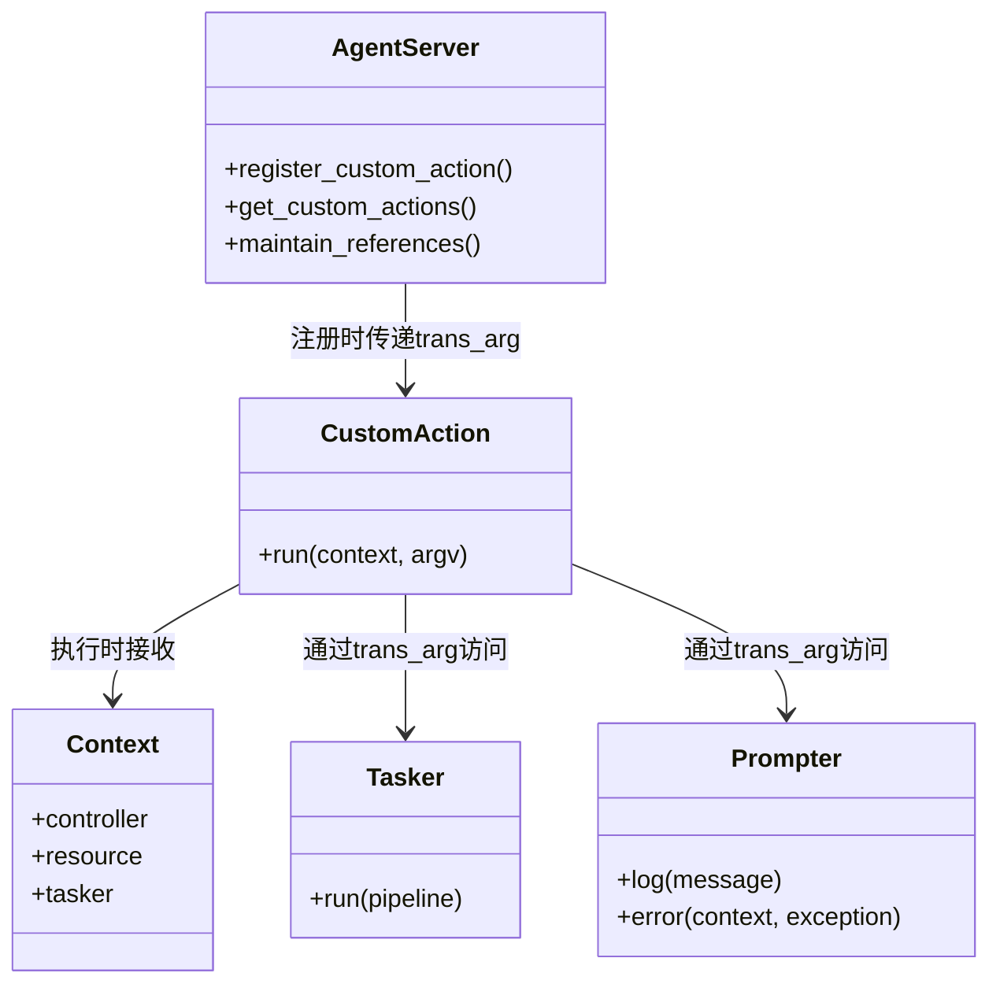
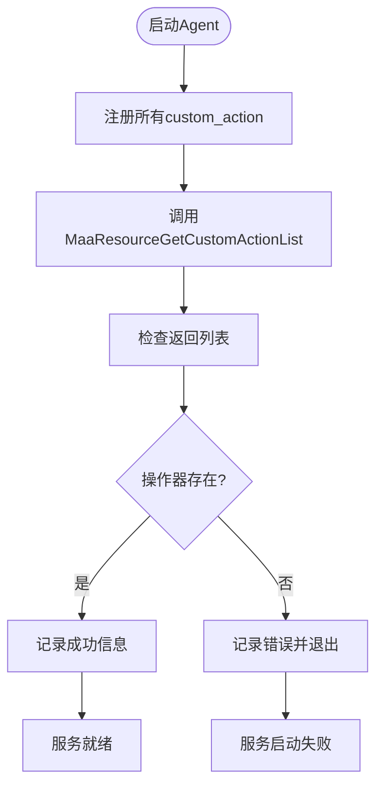

# 自定义操作器注册机制

<cite>
**本文档引用文件**  
- [main.py](file://agent/main.py)
- [MaaResource.h](file://deps/include/MaaFramework/Instance/MaaResource.h)
- [MaaDef.h](file://deps/include/MaaFramework/MaaDef.h)
- [activity.py](file://agent/customs/special_treat/activity.py)
- [counter.py](file://agent/customs/global_func/counter.py)
- [store.py](file://agent/customs/special_treat/store.py)
- [receive_reward.py](file://agent/customs/special_treat/receive_reward.py)
- [2.2-集成接口一览.md](file://instructions/maafw-guide/2.2-集成接口一览.md)
- [4.2-标准化接口设计.md](file://instructions/maafw-guide/4.2-标准化接口设计.md)
- [2.3-回调协议.md](file://instructions/maafw-guide/2.3-回调协议.md)
</cite>

## 目录
1. [简介](#简介)
2. [注册流程与生命周期](#注册流程与生命周期)
3. [MaaResourceRegisterCustomAction接口详解](#maaresourceregistercustomaction接口详解)
4. [name参数规范](#name参数规范)
5. [action回调函数签名](#action回调函数签名)
6. [trans_arg跨组件通信作用](#trans_arg跨组件通信作用)
7. [注册结果验证](#注册结果验证)
8. [错误处理指南](#错误处理指南)
9. [总结](#总结)

## 简介
MaaFramework 提供了强大的自定义操作器机制，允许开发者通过 `MaaResourceRegisterCustomAction` 接口注册自定义动作逻辑。该机制结合 Python Agent 的装饰器模式，实现了低代码配置与高灵活性逻辑处理的无缝集成。自定义操作器在自动化流程中扮演关键角色，可用于实现复杂业务逻辑、动态决策和跨组件交互。

## 注册流程与生命周期
自定义操作器的注册发生在 Agent 服务启动阶段，其生命周期与 `AgentServer` 实例绑定。注册流程遵循以下时序：



**图示来源**  
- [main.py](file://agent/main.py#L17-L38)
- [MaaResource.h](file://deps/include/MaaFramework/Instance/MaaResource.h#L40-L44)

**本节来源**  
- [main.py](file://agent/main.py#L17-L38)
- [2.2-集成接口一览.md](file://instructions/maafw-guide/2.2-集成接口一览.md#L110-L117)

## MaaResourceRegisterCustomAction接口详解
`MaaResourceRegisterCustomAction` 是注册自定义操作器的核心 C API，定义于 `MaaResource.h` 头文件中：

```c
MaaBool MaaResourceRegisterCustomAction(
    MaaResource* res, 
    const char* name, 
    MaaCustomActionCallback action, 
    void* trans_arg
);
```

该接口接收四个参数：
- `res`：资源实例指针
- `name`：自定义操作器名称（唯一标识）
- `action`：回调函数指针
- `trans_arg`：透传参数指针

在 Python Agent 层，该接口被封装为 `@AgentServer.custom_action` 装饰器，开发者无需直接调用底层 C API。当使用装饰器时，AgentServer 会自动完成注册流程。



**图示来源**  
- [MaaResource.h](file://deps/include/MaaFramework/Instance/MaaResource.h#L40-L44)
- [4.2-标准化接口设计.md](file://instructions/maafw-guide/4.2-标准化接口设计.md#L27-L32)

**本节来源**  
- [MaaResource.h](file://deps/include/MaaFramework/Instance/MaaResource.h#L40-L44)
- [2.2-集成接口一览.md](file://instructions/maafw-guide/2.2-集成接口一览.md#L110-L117)

## name参数规范
`name` 参数作为自定义操作器的唯一标识符，必须遵循严格的命名规范：

### 命名要求
- **唯一性**：在同一资源实例中，所有自定义操作器的 `name` 必须唯一
- **字符限制**：仅允许使用字母、数字、下划线和连字符
- **大小写敏感**：`MyAction` 与 `myaction` 被视为不同名称
- **长度限制**：建议不超过 64 个字符

### 命名示例
```python
# 正确示例
@AgentServer.custom_action("enter_activity")
@AgentServer.custom_action("claim_candy")
@AgentServer.custom_action("init_counter_v2")

# 错误示例（违反唯一性）
@AgentServer.custom_action("enter_activity")  # 重复注册
class EnterActivityV2(CustomAction): ...
```

### 冲突处理
当尝试注册已存在的 `name` 时，`MaaResourceRegisterCustomAction` 将返回 `MaaBool(False)`。建议在开发阶段使用清晰的命名空间划分，如：
- `activity.enter`
- `store.buy_gift`
- `counter.init`

**本节来源**  
- [2.2-集成接口一览.md](file://instructions/maafw-guide/2.2-集成接口一览.md#L112-L113)
- [activity.py](file://agent/customs/special_treat/activity.py#L17)
- [counter.py](file://agent/customs/global_func/counter.py#L21)

## action回调函数签名
自定义操作器的回调函数必须符合 `MaaCustomActionCallback` 函数指针定义：

```c
typedef MaaBool(MAA_CALL* MaaCustomActionCallback)(
    MaaContext* context,
    MaaTaskId task_id,
    const char* node_name,
    const char* custom_action_name,
    const char* custom_action_param,
    MaaRecoId reco_id,
    const MaaRect* box,
    void* trans_arg);
```

在 Python 层，该签名被封装为 `CustomAction` 类的 `run` 方法：

```python
def run(self, context: Context, argv: CustomAction.RunArg) -> bool:
    # 实现自定义逻辑
    pass
```

其中 `argv` 参数包含：
- `task_id`：当前任务ID
- `node_name`：当前节点名称
- `custom_action_name`：操作器名称
- `custom_action_param`：自定义参数
- `reco_id`：识别ID
- `box`：识别区域
- `trans_arg`：透传参数

**本节来源**  
- [MaaDef.h](file://deps/include/MaaFramework/MaaDef.h#L411-L419)
- [activity.py](file://agent/customs/special_treat/activity.py#L24-L34)

## trans_arg跨组件通信作用
`trans_arg` 参数在自定义操作器机制中扮演着关键的跨组件通信角色：

### 主要功能
1. **状态传递**：在回调函数间传递上下文状态
2. **依赖注入**：向自定义操作器注入服务实例
3. **配置传递**：传递运行时配置参数
4. **生命周期管理**：保持对象引用，防止被垃圾回收

### 实现机制
在 Python Agent 中，`trans_arg` 通常指向 `AgentServer` 实例本身，使得自定义操作器能够访问：
- 全局配置
- 工具类实例（如 `Tasker`, `Prompter`）
- 共享状态管理器（如 `CounterManager`）
- 日志系统



**图示来源**  
- [4.2-标准化接口设计.md](file://instructions/maafw-guide/4.2-标准化接口设计.md#L27-L40)
- [counter.py](file://agent/customs/global_func/counter.py#L14-L15)

**本节来源**  
- [MaaDef.h](file://deps/include/MaaFramework/MaaDef.h#L419)
- [4.2-标准化接口设计.md](file://instructions/maafw-guide/4.2-标准化接口设计.md#L9)
- [counter.py](file://agent/customs/global_func/counter.py#L14-L15)

## 注册结果验证
为确保自定义操作器正确注册，可使用 `MaaResourceGetCustomActionList` 接口验证注册结果：

### 验证方法
```python
# 获取已注册的自定义操作器列表
action_list = []
MaaResourceGetCustomActionList(resource, action_list)

# 检查特定操作器是否存在
if "enter_activity" in action_list:
    print("enter_activity 注册成功")
```

### 验证时机
1. **启动后验证**：在 `AgentServer.start_up` 后立即验证
2. **运行时验证**：在关键任务执行前验证依赖的操作器
3. **调试模式**：在开发环境中输出完整的注册列表

### 完整验证流程


**本节来源**  
- [MaaResource.h](file://deps/include/MaaFramework/Instance/MaaResource.h#L78)
- [2.2-集成接口一览.md](file://instructions/maafw-guide/2.2-集成接口一览.md#L211-L215)

## 错误处理指南
自定义操作器注册过程中可能出现多种异常情况，需建立完善的错误处理机制：

### 常见异常类型
| 异常类型 | 原因 | 诊断方法 |
|--------|-----|--------|
| 重复注册 | 同名操作器已存在 | 检查 `MaaResourceRegisterCustomAction` 返回值 |
| 无效函数指针 | 回调函数不符合签名 | 验证装饰器使用是否正确 |
| 生命周期错误 | 在服务启动后尝试注册 | 确保注册发生在 `start_up` 之前 |
| 内存泄漏 | 未正确管理 `trans_arg` 引用 | 检查引用计数和垃圾回收 |

### 诊断步骤
1. **检查返回值**：`MaaResourceRegisterCustomAction` 返回 `MaaBool(False)` 表示失败
2. **查看日志**：检查框架日志中的错误信息
3. **验证列表**：使用 `MaaResourceGetCustomActionList` 确认注册状态
4. **调试断点**：在注册代码处设置断点，跟踪执行流程

### 最佳实践
- 在开发模式下启用调试日志
- 使用唯一的命名空间避免冲突
- 在 `try-catch` 块中执行注册逻辑
- 启动时验证所有关键操作器的注册状态

**本节来源**  
- [MaaResource.h](file://deps/include/MaaFramework/Instance/MaaResource.h#L42-L44)
- [2.3-回调协议.md](file://instructions/maafw-guide/2.3-回调协议.md#L360-L364)
- [main.py](file://agent/main.py#L39-L41)

## 总结
MaaFramework 的自定义操作器注册机制通过 `MaaResourceRegisterCustomAction` 接口提供了强大的扩展能力。开发者应遵循命名规范，正确实现回调函数签名，并合理利用 `trans_arg` 进行跨组件通信。注册时机至关重要，必须在 `AgentServer.start_up` 之前完成所有注册操作。通过 `MaaResourceGetCustomActionList` 接口可以验证注册结果，确保系统正常运行。完善的错误处理机制是保证系统稳定性的关键。