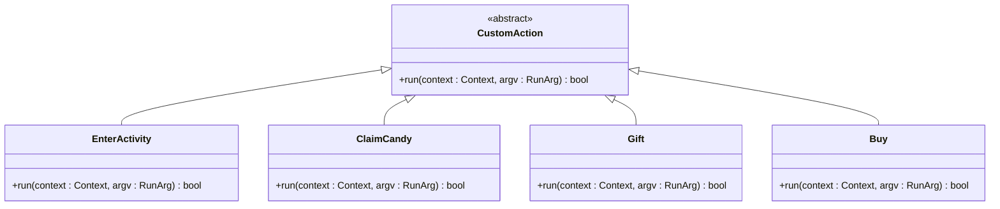
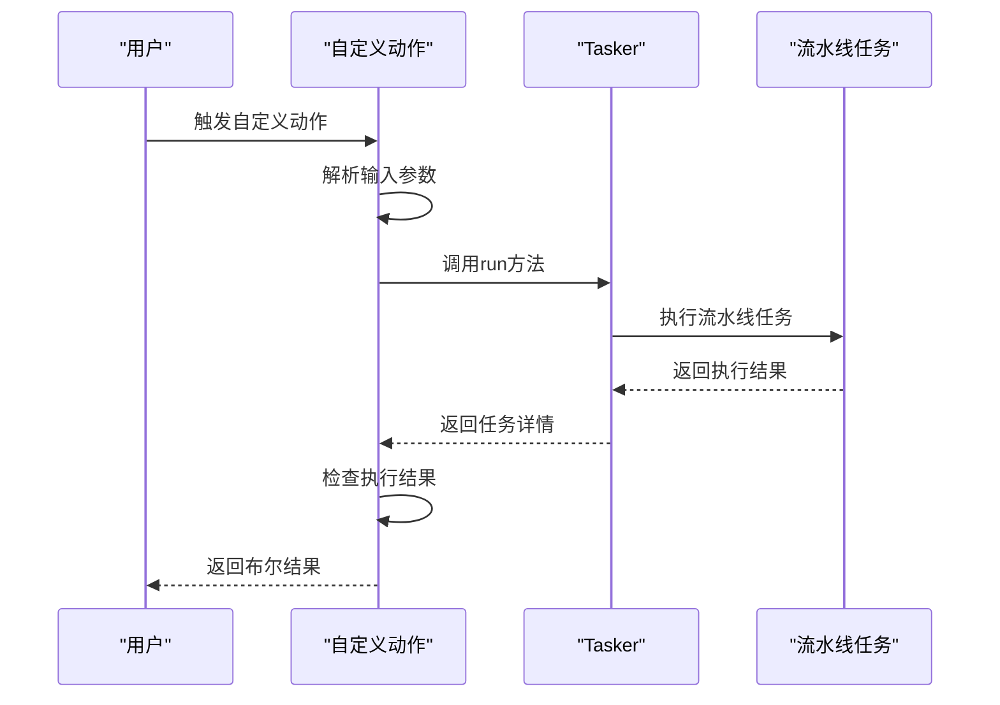
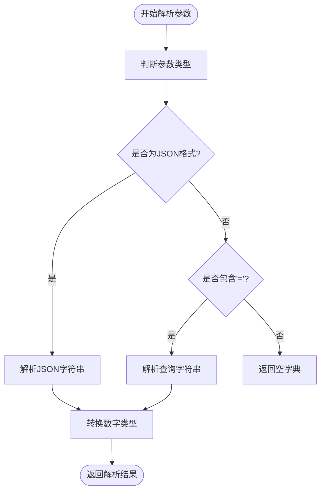
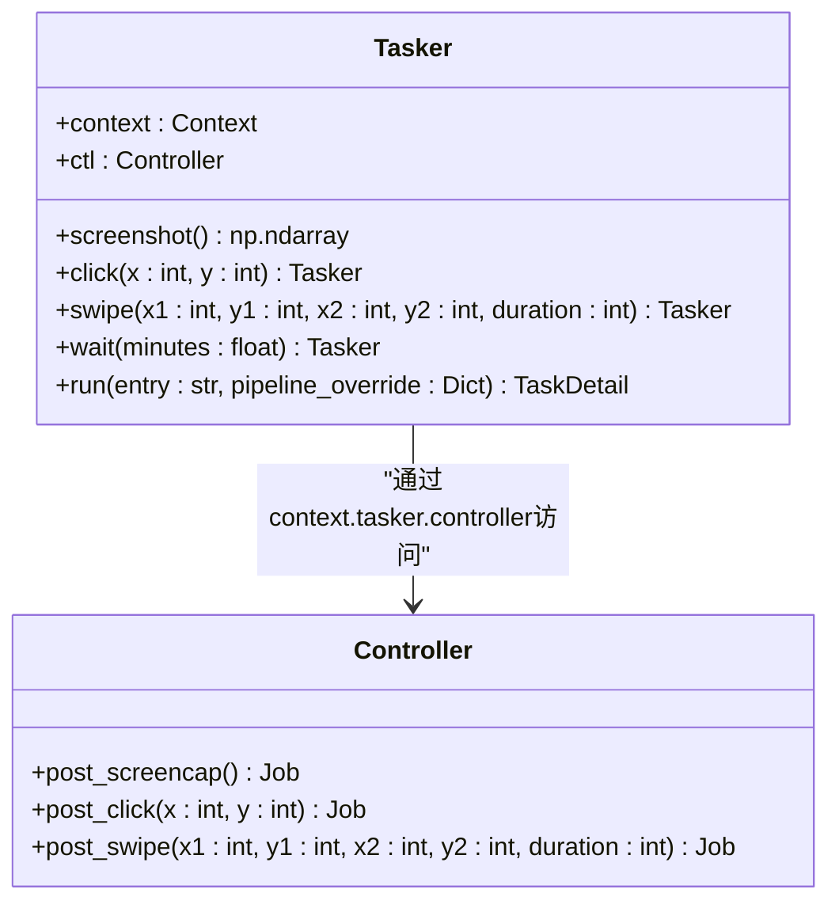
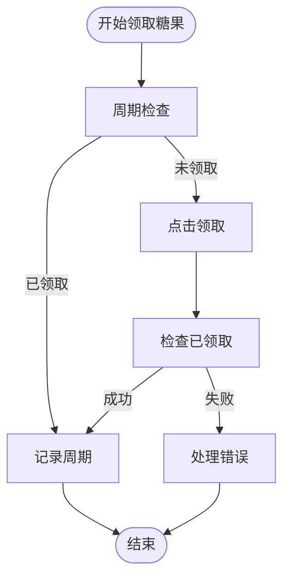
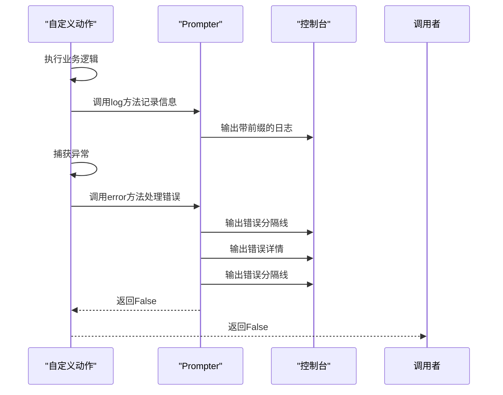
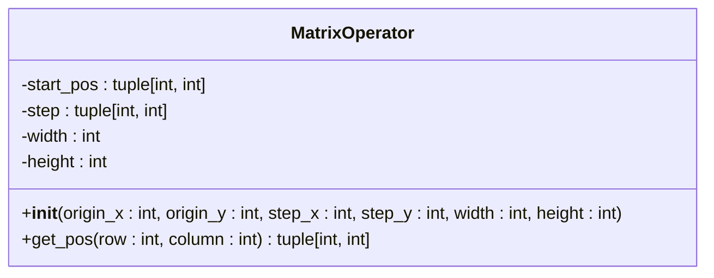
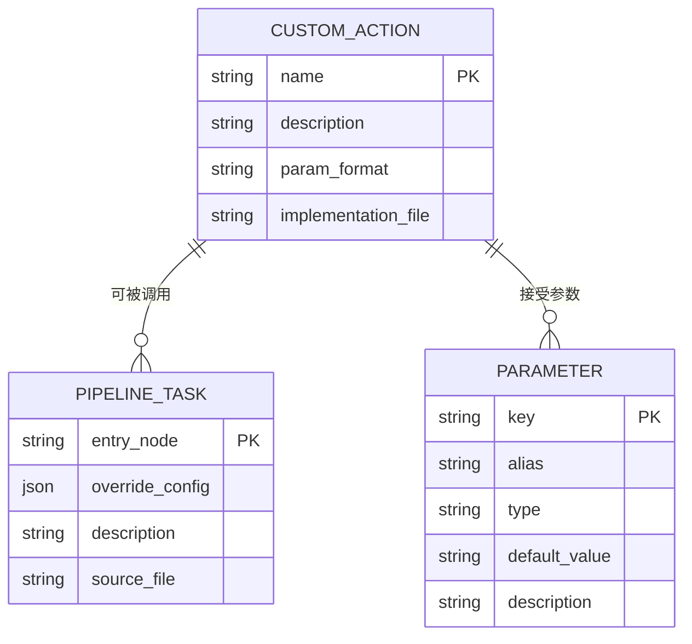

# 自定义操作逻辑实现

<cite>
**本文档引用文件**  
- [activity.py](file://agent/customs/special_treat/activity.py)
- [store.py](file://agent/customs/special_treat/store.py)
- [tasker.py](file://agent/customs/maahelper/tasker.py)
- [argv_analyzer.py](file://agent/customs/maahelper/argv_analyzer.py)
- [prompter.py](file://agent/customs/utils/prompter.py)
- [matrix_operator.py](file://agent/customs/utils/matrix_operator.py)
</cite>

## 目录
1. [项目结构概述](#项目结构概述)
2. [核心组件分析](#核心组件分析)
3. [自定义操作函数实现模式](#自定义操作函数实现模式)
4. [参数解析机制](#参数解析机制)
5. [基础操作封装](#基础操作封装)
6. [条件判断与循环重试](#条件判断与循环重试)
7. [错误处理与日志记录](#错误处理与日志记录)
8. [矩阵位置计算工具](#矩阵位置计算工具)
9. [MaaFramework集成接口](#maaframework集成接口)

## 项目结构概述

本项目采用模块化设计，核心自定义操作逻辑位于 `agent/customs/special_treat/` 目录下。主要功能模块包括：
- `activity.py`：处理活动界面导航和糖果领取等任务
- `store.py`：实现商店购买和礼包领取功能
- `maahelper/`：提供任务执行器、参数解析器等辅助工具
- `utils/`：包含提示器、矩阵计算器等通用工具

系统通过MaaFramework的自定义操作机制，将复杂的自动化任务分解为可复用的自定义动作单元。

**Section sources**
- [activity.py](file://agent/customs/special_treat/activity.py)
- [store.py](file://agent/customs/special_treat/store.py)

## 核心组件分析

项目的核心是基于MaaFramework构建的自定义操作器，通过继承`CustomAction`类并使用`@AgentServer.custom_action`装饰器注册具体操作。每个自定义动作类都实现了`run`方法，接收上下文和参数对象作为输入。

关键组件包括：
- **EnterActivity**：通过活动标题进入指定活动界面
- **ClaimCandy**：根据时间段领取糖果奖励
- **Gift**：领取指定名称的礼包
- **Buy**：购买指定商品

这些组件通过调用`Tasker`类执行预定义的流水线任务来完成具体操作。

**Diagram sources**
- [activity.py](file://agent/customs/special_treat/activity.py#L17-L55)
- [store.py](file://agent/customs/special_treat/store.py#L14-L96)

**Section sources**
- [activity.py](file://agent/customs/special_treat/activity.py#L1-L102)
- [store.py](file://agent/customs/special_treat/store.py#L1-L96)

## 自定义操作函数实现模式

自定义操作函数遵循统一的实现模式，以`activity.py`中的`EnterActivity`类为例：

**Diagram sources**
- [activity.py](file://agent/customs/special_treat/activity.py#L24-L55)
- [tasker.py](file://agent/customs/maahelper/tasker.py#L51-L113)

**Section sources**
- [activity.py](file://agent/customs/special_treat/activity.py#L17-L55)

## 参数解析机制

系统通过`ParamAnalyzer`类实现灵活的参数解析机制，支持多种参数格式：

参数解析支持以下特性：
- 多种格式：JSON对象、JSON数组、查询字符串
- 别名支持：允许为同一参数定义多个名称
- 类型转换：自动将数字字符串转换为int或float类型
- 默认值：可指定默认返回值

**Section sources**
- [argv_analyzer.py](file://agent/customs/maahelper/argv_analyzer.py#L17-L159)

## 基础操作封装

通过`Tasker`类封装了基础的设备控制操作，提供了简洁的链式调用接口：

**Diagram sources**
- [tasker.py](file://agent/customs/maahelper/tasker.py#L16-L177)

**Section sources**
- [tasker.py](file://agent/customs/maahelper/tasker.py#L16-L177)

## 条件判断与循环重试

系统通过流水线配置实现条件判断和循环重试逻辑。以`claim_candy`为例，其执行流程如下：

这种模式通过MaaFramework的流水线机制实现，无需在代码中显式编写循环逻辑。

**Section sources**
- [activity.py](file://agent/customs/special_treat/activity.py#L60-L102)
- [assets/resource/base/pipeline/日常任务/领取糖果.json](file://assets/resource/base/pipeline/日常任务/领取糖果.json)

## 错误处理与日志记录

系统采用统一的错误处理和日志记录机制：

**Diagram sources**
- [prompter.py](file://agent/customs/utils/prompter.py#L16-L55)

**Section sources**
- [prompter.py](file://agent/customs/utils/prompter.py#L16-L55)

## 矩阵位置计算工具

`MatrixOperator`类提供了矩阵布局中元素坐标的计算功能：

该工具支持：
- 正向索引：从1开始计算位置
- 反向索引：负数表示从末尾倒数
- 边界检查：确保索引在有效范围内

**Diagram sources**
- [matrix_operator.py](file://agent/customs/utils/matrix_operator.py#L1-L58)

**Section sources**
- [matrix_operator.py](file://agent/customs/utils/matrix_operator.py#L1-L58)

## MaaFramework集成接口

系统遵循MaaFramework的标准化接口设计规范：

**Section sources**
- [instructions/maafw-guide/4.2-标准化接口设计.md](file://instructions/maafw-guide/4.2-标准化接口设计.md#L12-L46)
- [instructions/maafw-guide/2.2-集成接口一览.md](file://instructions/maafw-guide/2.2-集成接口一览.md#L1-L401)